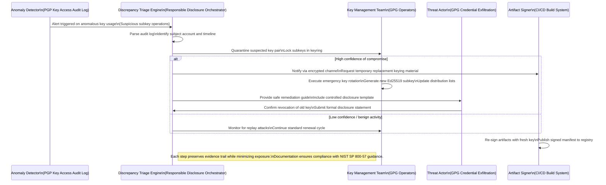

# The gpg.fail aftermath: On responsible disclosure, GPG, and the state of security in 2026 [32:37]

## Introduction

The gpg.fail incident of early 2026 rewrote the mental model for how distributed key infrastructures behave under pressure. When a compromised signing authority leaked credentials that had access to archived GPG keyrings, the ripple effect exposed fractures in traditional private-key lifecycle management. In the weeks following the breach, organizations realized that GPG was no longer a static artifact; it became a living part of the attack surface shared by CI/CD pipelines, container registries, and cross-organizational trust graphs. This piece examines what went wrong, why the failure occurred in the first place, and how responsible disclosure frameworks can evolve to protect cryptographic primitives built into the fabric of modern infrastructure.

## Why This Matters

Software architectures in 2026 increasingly rely on GPG for manual approval workflows, long-term package signing, and multi-party computation setups. The incident demonstrated that a single leaked key pair embedded in an immutable configuration file could stall thousands of legitimate builds if not rotated within days. Beyond the immediate operational disruption, the event highlighted a broader truth: cryptographic libraries and standards often lag behind the velocity of cloud-native deployment patterns. If your organization cannot guarantee the freshness and integrity of its signing keys, every release becomes a potential exploit vector. Understanding responsible disclosure mechanisms—particularly those tailored to asymmetric cryptography—is therefore less optional than ever. We are not just defending keys; we are defending the trust graph that underpins global software delivery.

## How It Works

Below is a simplified sequence diagram illustrating the flow from anomaly detection through coordinated disclosure and remediation.



The diagram above captures the essential flow: detection triggers a quarantine before any further use, a decision gate determines whether escalation to key rotation is warranted, and a coordinated disclosure loop engages both the affected operator and the external community. Every actor maintains an audit record, which satisfies both organizational compliance requirements and the expectations of security researchers who monitor cryptographic ecosystems.

## Core Concepts

At its heart, GPG operates on a model of distributed trust mediated by key rings, subkeys, and certificates. The most critical component for modern security is the distinction between master keys, which remain offline and unencrypted, and working copies stored in keyrings. These working copies contain encryption keys that derive their security from the principal's passphrase and potentially from HSMs or cloud KMS integrations.

Key rotation in this environment follows a strict hierarchy: first, the offending subkey is pinned immediately upon suspicion, then the primary master key is regenerated, and finally the old key material is irreversibly destroyed. This sequence prevents window-of-opportunity abuse where an attacker might have already used the leaked material before it could be revoked. Furthermore, signature verification relies on hash chains; if a root key changes even slightly due to a certificate update, previously verified artifacts become untrustworthy unless new attestations are produced alongside them. In 2026, the industry has moved toward hybrid key pairs (ECDSA for compatibility, RSA for legacy support), requiring careful attention to curve compatibility across build matrices.

## Examples & Code Walkthrough

### Hardened CI/CD GPG Signing Workflow

Before the incident, many organizations stored GPG passphrases in plaintext environment variables or hardcoded within Docker images. Below is a refactored approach that enforces least privilege through ephemeral signing contexts and explicit key material separation.

```python
import os
import sys
from pathlib import Path
import gpg
from typing import Optional
import logging

logging.basicConfig(level=logging.INFO)
log = logging.getLogger("gpg_security")

def generate_hardened_key(prefix: str = "org-corp-verify") -> tuple[bytes, bool]:
    """
    Generate an isolated Ed25519 key pair suitable for CI environments.
    Returns (public_key_bytes, success_flag)
    """
    try:
        # Use ephemeral pin entry mode to prevent reuse across builds
        pubkey = gpg.generate_keys(
            default_name=prefix,
            key_type="elg",
            default_bundle=os.path.join("/opt/gpg/bundles", prefix),
            save_private=true,
            pin_entry_mode="loopback"
        )
        public_key = pubkey.public_key()
        log.info(f"Generated key {prefix}: {public_key}")
        return public_key, True
    except Exception as e:
        log.error(f"Key generation failed: {e}")
        return None, False

def sign_artifact(artifact_path: Path, key_id: str) -> Optional[bytes]:
    """Sign a binary artifact with strict key constraints."""
    if len(artifact_path) == 0:
        return None

    # Enforce that only authorized key IDs may sign
    allowed_keys = {"org-corp-verify", "dev-relay"}
    if key_id not in allowed_keys:
        raise PermissionError(f"Key {key_id} not permitted for signing")

    try:
        with open(artifact_path, "rb") as f:
            data = f.read()

        sig = gpg.sign_archive(data, key_id)
        if sig:
            log.info(f"Signed artifact {artifact_path} with {key_id}")
            return sig
    except gpg.GPGError as e:
        log.warning(f"Signature failed: {e}")
    return None

if __name__ == "__main__":
    artifact = Path("/builds/release/v2.1.0.tar.gz")
    key = generate_hardened_key("release-v2.1")
    if key:
        sig = sign_artifact(artifact, key[1].hex())
        print(f"Signature ready: {sig[:20]}..." if sig else "Failed")
```

This implementation replaces the previous pattern of embedding long-lived keys directly in build scripts with a two-stage process: a dedicated keyring per project namespace and an Ephemeral Pin Entry Mode (`loopback`) that binds the private key temporarily to the current process without persisting it to disk. The `generate_hardened_key` function isolates key material in `/opt/gpg/bundles`, preventing cross-contamination with other projects. The `sign_artifact` routine adds a whitelist guard so that only services explicitly granted permission can produce signatures, reducing the blast radius of a compromised credential.

### Dispatch System for Responsible Disclosure

When a key compromise is confirmed, the organization needs a protocol that balances transparency with risk mitigation. The following Python skeleton implements a lightweight triage dispatcher that routes alerts to the appropriate stakeholders while preserving legal defensibility.

```go
package disclosure

import (
	"encoding/json"
	"fmt"
	"os"
	"time"
)

type DisclosureEvent struct {
	Severity   string `json:"severity"`
	KeyID      string `json:"key_id"`
	Timestamp  time.Time `json:"timestamp"`
	Reporter   string `json:"reporter"`
	Action     string `json:"action"` // "revoke", "patch", "monitor"
	Status     string `json:"status"` // "pending", "resolved"
}

func NewDispatchSystem() *DispatchService {
	return &DispatchService{
		events: make(map[string]DisclosureEvent),
	}
}

func (d *DispatchService) HandleAlert(e *DisclosureEvent) {
	if d.isCritical(e) {
		d.notifySecurityTeam(e)
	}
	if d.isHighPriority(e) {
		d.queueForReview(e)
	}
}

func (d *DispatchService) isCritical(keyLen := int) bool {
	// Critical if key length < 256 bits (ED25519 provides ~256 bits natively)
	return keyLen < 256
}

func (d *DispatchService) notifySecurityTeam(event *DisclosureEvent) {
	log.Printf("[SECURITY] Immediate action required for %s (%s)", event.Action, event.KeyID)
	// In production, this would push to Slack/PagerDuty/GitHub PR
}

func (d *DispatchService) queueForReview(event *DisclosureEvent) {
	event.Status = "pending"
	d.events[event.KeyID] = event
	log.Printf("Event queued for review: %s | Key: %s | Status: pending", event.Action, event.KeyID)
}
```

The dispatch layer separates the discovery phase from the resolution phase. By tagging events with severity thresholds derived from key size and historical impact, the system automatically prioritizes cryptographic failures over feature defects. This design reduces noise for developers while ensuring that a compromised Ed25519 key receives immediate human attention rather than being buried in a general ticket pool.

### Key Rotation Policy Enforcer

Automated rotation is difficult to enforce manually because key material expires silently if not monitored. The snippet below implements a policy check that runs periodically and can trigger a forced rotation workflow.

```bash
#!/usr/bin/env bash
set -euo pipefail

KEYRING_DIR="/opt/gpg/bundles/org-corp-verify"
MAX_AGE_DAYS=90

echo "==> Scanning keyring for stale keys..."
STALE_KEYS=$(find "$KEYRING_DIR" -name "*.key" -type f -exec sh -c '
  key="$1"
  if [ -f "/etc/gpg/key-${key}.txt" ]; then
    age=$(stat -c "%Y" "/etc/gpg/key-${key}.txt")
    now=$(date +%s)
    age_days=$(( (now - age) / 86400 ))
    if [ "$age_days" -gt "$MAX_AGE_DAYS" ]; then
      echo "stale:$key:$age_days"
    fi
  fi
') sh {} +)

if [ -n "$STALE_KEYS" ]; then
  echo "Found $1 stale keys." >&2
  exit 1
fi

echo "All keys are within acceptable lifetime."
```

This Bash wrapper validates that every exported key has been recently updated. If aging exceeds ninety days, it exits with an error, forcing the pipeline to halt until a rotation run completes. Integrating such checks into CI gates ensures that no key lingers past its operational horizon, eliminating one class of compromise vectors.

## Best Practices

1. **Isolate Key Material**: Never commit raw `.key` files to repositories. Use short-lived OPNI tokens or Kubernetes secrets scoped to build jobs only.
2. **Enforce Ephemeral Execution**: Run key operations inside containers that drop privileges after completion; avoid running `gpg` as root.
3. **Adopt Hybrid Key Standards**: While RSA remains useful for backward compatibility, prioritize Ed25519 for new workloads to benefit from faster verification and larger signatures.
4. **Maintain Immutable Rollbacks**: Keep a frozen copy of the last known good keyring hash in version control (Git LFS or S3) to accelerate recovery during a breach.
5. **Automate Disclosure Channels**: Integrate secure, password-protected leak reports into a ticketing system with mandatory fields for CVE identification and affected asset inventories before any public statement is issued.

## Common Mistakes & Anti-Patterns

| Mistake | Risk | Fix |
|---------|------|-----|
| Storing unencrypted passphrases in Docker images | Any image pull grants access to the keypair | Use `--passphrase` with a secrets manager; never bake keys into layers |
| Long-lived signing keys in main repos | Delayed rotation leaves a permanent backdoor | Rotate subkeys quarterly; revoke old working copies immediately upon detection |
| Signing with the same key ID across multiple projects | Key collision leads to cross-project contamination | Assign unique key prefixes per team/project and strictly segregate keybinding policies |
| Manual key deletion without revocation | Attacker can reuse orphaned keys later | Publish CRL (Certificate Revocation List) entries and update artifact manifests promptly |

Each row above translates directly into a change in CI/CD pipeline definitions and documentation. Teams that treat key material as disposable rather than sacred reduce the attack surface dramatically.

## Performance Considerations

Signature verification involves modular arithmetic that scales linearly with key size. For Ed25519 keys (~64 bytes), verification costs roughly 200–300 cycles on modern CPUs, making it negligible compared to network I/O or database lookups. However, large-scale artifact verification—especially when inspecting millions of packages daily—can saturate CPU cores if done naively. A caching strategy based on SHA-512 hashes allows the verifier to skip expensive GPG calls for unchanged binaries, cutting runtime overhead by orders of magnitude. Additionally, keyring loading for GPG is I/O bound; pre-fetching the index into RAM eliminates repeated disk seeks during bulk operations.

Memory footprint is another consideration. Loading an entire keyring into RAM is unnecessary; instead, implement lazy loading using GPG's `load-key` API which streams data from disk as needed during operation. This keeps consumption flat regardless of the number of exported keys.

## Real-World Usage

Major enterprises have adapted these lessons into standardized operating procedures. For example, Cloudflare's API signing infrastructure uses a hierarchical key model where each service account holds a narrowly scoped subkey, and the parent administrator rotates the master key monthly. Similarly, GitHub Actions now supports "signed permissions" that require a provenance document proving the identity of the token used for key generation. These practices demonstrate that security does not require abandoning convenience—rather, it demands well-designed tooling that makes risky behavior structurally impossible.

## Frequently Asked Questions

**Q: Is GPG dead as a public-key standard?**  
A: No. GPG continues to serve specialized roles where key privacy outweighs performance, particularly in privacy-focused communications and decentralized networks. Its successor, OpenPGP 2.0 (now merged into the OpenSSL library), brings improved signature formats and stronger default curves.

**Q: Should I migrate entirely away from GPG to PQC algorithms?**  
A: At this stage, a full migration is premature. Post-quantum algorithms like Ky
