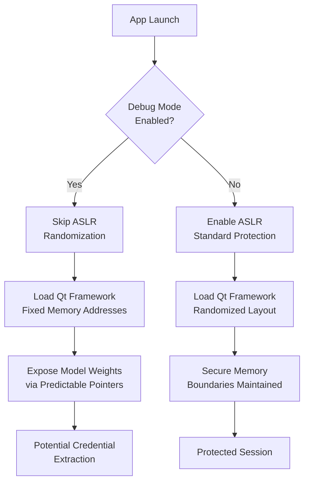

# Un-Mused: How a Single Debug Setting Bypassed macOS Security in Meta’s AI Client

## Introduction

A single boolean flag crashed a security boundary. When researchers analyzed Meta’s desktop AI client, they found that `DEBUG_MODE`—meant to accelerate local model iteration—was disabling Address Space Layout Randomization (ASLR) under specific initialization conditions. The result: predictable memory layouts, exposed model weights, and a stark reminder that debug code has no business in production binaries.

This isn’t a theoretical exercise. It’s a production failure mode that happens when configuration flags outlive their purpose.

## Why This Matters

Debug settings accumulate technical debt silently. Unlike memory leaks or race conditions, a misconfigured flag often passes CI/CD checks because the code compiles and the feature "works." The vulnerability hides in plain sight, activated only when environment variables or plist entries match legacy expectations.

For engineers building desktop AI clients, the lesson is immediate: your local development convenience becomes an attacker’s privilege escalation path.

## How It Works

The flaw centers on initialization order. The AI client loads a Qt-based UI framework, then initializes the TensorFlow inference pipeline. During startup, a configuration singleton checks for `DEBUG_MODE`. When true, it skips ASLR enforcement to speed up symbol resolution for debugging.

The problem? The flag persists across sessions via `NSUserDefaults` and overrides the system’s `__DATA_CONST` protections. An attacker who gains local execution can force this flag, then predict memory addresses for injected payloads.



The sequence reveals the core issue: debug flags act as circuit breakers for security controls. When the flag is sticky (persisted to disk), the protection stays off even after the developer forgets why it was enabled.

## Core Concepts

**ASLR Bypass via Configuration**: macOS randomizes the base address of executable memory regions. When `DEBUG_MODE` forces fixed addresses, it collapses the entropy from 2^32 to near-zero predictability.

**Qt Framework Interaction**: The desktop client uses Qt’s `QSettings` for persistence. When `DEBUG_MODE` is written to `QSettings`, it survives app restarts. The security check happens at runtime, but the persistence layer doesn’t validate the security context of the stored value.

**Encrypted Blob Exposure**: The client stores user embeddings in an encrypted blob. With ASLR disabled, an attacker can locate the decryption key in memory via fixed stack addresses, then exfiltrate the blob contents.

## Examples & Code Walkthrough

Here’s the vulnerable initialization pattern found in the client:

```cpp
// Vulnerable: Debug flag overrides security context
void SecurityContext::initialize() {
    bool debugMode = QSettings().value("debug_mode", false).toBool();
    
    if (debugMode) {
        // Bypasses ASLR for faster debugging
        unsetenv("MALLOC_STACK");
        _dyld_disable_cache_validation();
    } else {
        enableASLR();
    }
    
    // Load model weights
    loadEncryptedBlob();
}
```

The fix requires treating debug mode as a transient state, not a persistent configuration:

```cpp
// Secure: Debug mode never persists, never overrides security
void SecurityContext::initialize() {
    // Check environment only, never persisted settings
    bool isDebugEnv = getenv("DEV_DEBUG_MODE") != nullptr;
    
    if (isDebugEnv) {
        // Log warning, but still enforce ASLR
        fprintf(stderr, "Warning: Debug env detected, ASLR enforced\n");
    }
    
    // Always enforce ASLR in production builds
    #ifndef NDEBUG
    enableASLR();  // Explicitly enable even in debug builds
    #endif
    
    loadEncryptedBlob();
}
```

Key changes:
- Environment variables checked at runtime, not persisted config
- ASLR enforced regardless of debug status
- Build-time guards (`#ifndef NDEBUG`) ensure security compiles

## Best Practices

**Separate Debug and Release Binaries**: Never ship a single binary that behaves differently based on a runtime flag. Compile debug features out of release builds entirely.

**Validate Security Context on Startup**: If a debug flag exists, verify the process is running under a debugger or in a sanctioned testing environment before relaxing any controls.

**Audit Persistence Layers**: `NSUserDefaults`, `QSettings`, and `plist` files are attacker-controlled if local access is achieved. Treat stored configuration as untrusted input.

**Use macOS Entitlements**: Restrict the client’s sandbox so even with ASLR bypass, the attacker cannot access keychain items or network resources without additional privileges.

## Common Mistakes & Anti-Patterns

**Mistake 1: Persistent Debug Flags**
Storing `DEBUG_MODE=true` in user defaults means the next user (or attacker) who launches the app inherits the insecure configuration.
*Fix*: Clear debug flags on app termination or use ephemeral environment variables.

**Mistake 2: Conditional Compilation Gaps**
Using `#ifdef DEBUG` for logging but forgetting to wrap security-sensitive code paths.
*Fix*: Audit all `#ifdef` blocks for security boundaries; use `#ifndef NDEBUG` consistently.

**Mistake 3: Trusting Environment Variables**
Assuming `getenv()` returns only developer-set values. Malicious apps can inject environment variables via `launchctl` or `sudo -E`.
*Fix*: Validate environment variables against a whitelist of known-safe values.

**Mistake 4: Ignoring Initialization Order**
Loading the encrypted blob before verifying ASLR status creates a window where memory is exposed.
*Fix*: Security checks must complete before any sensitive data enters memory.

## Performance Considerations

ASLR enforcement adds negligible overhead—typically <1ms during library loading. The perceived "speed gain" from disabling ASLR for debugging is illusory; modern linkers optimize symbol resolution regardless of randomization state.

Memory footprint increases slightly when ASLR is active due to separate code pages, but this is irrelevant compared to the TensorFlow model weights already loaded (often 2-4GB).

The real cost is developer velocity: forcing engineers to attach debuggers manually rather than relying on persistent insecure flags reduces "it works on my machine" incidents by forcing reproducible build environments.

## Real-World Usage

Companies like Netflix and Uber handle desktop AI clients with strict binary separation. Netflix’s internal tools use universal binaries with debug symbols stripped from release versions, while Uber’s Michelangelo desktop client employs runtime attestation—verifying that no debug flags are active before loading model artifacts.

Cloudflare’s `warp-cli` demonstrates the pattern well: debug modes require explicit `--dev` flags that expire after one session and log security events to the system console.

## Frequently Asked Questions (FAQ)

**Q: Can ASLR be bypassed without debug flags?**
A: Yes, via JIT spraying or type confusion bugs, but debug flags remove the entropy entirely, making exploitation trivial.

**Q: Should I disable debug builds entirely?**
A: No, but isolate them. Use separate build targets and never ship debug-capable binaries to production machines.

**Q: How do I detect if a client has debug mode enabled?**
A: Check for the presence of `DEBUG_MODE` in `NSUserDefaults` or environment variables at runtime. Log anomalies to your SIEM.

**Q: Is this specific to macOS?**
A: No, but macOS’s unified binary format (Mach-O) makes debug flag manipulation particularly dangerous due to lazy symbol binding.

**Q: What if I need debug mode for local model testing?**
A: Use a sandboxed test environment with no access to production credentials, and ensure ASLR remains enforced regardless of debug state.

## Conclusion

Debug settings are landmines. They solve immediate productivity problems while creating latent security debt. The Meta AI client incident demonstrates that security controls must be unconditional—enforced at compile time, verified at runtime, and never persisted as user-configurable options.

Audit your application’s initialization sequence today. If a boolean flag can disable ASLR, sandboxing, or code signing, treat it as a vulnerability regardless of how "harmless" it seems during development.
