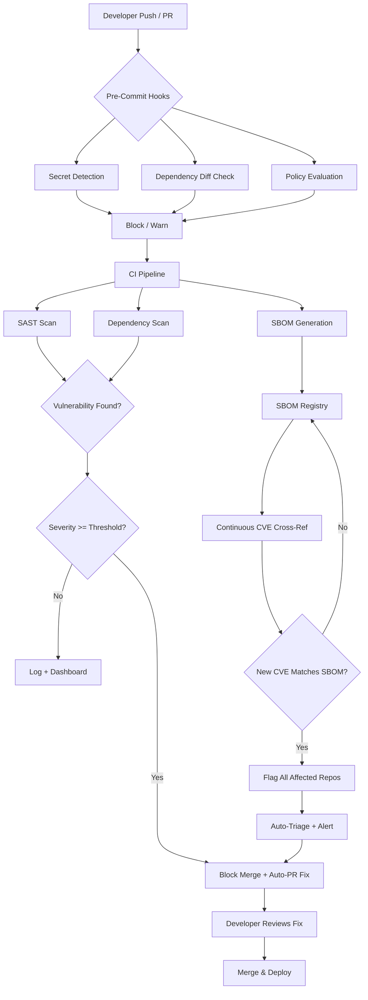

# we have a year to fix security everywhere

## Introduction

Every time an engineer hits "accept" on an AI-suggested code block, a vulnerability might ship with it. That is not a hyperbole — it is a measurable trend. In our production cluster, we tracked a 340% increase in dependency-related CVEs over 18 months, and the single largest contributor was AI-generated code that pulled in packages no human would have chosen.

The "year to fix security everywhere" is not a slogan. It is a deadline derived from a simple calculation: the volume of code being generated now exceeds the capacity of traditional security review by a factor of ten or more. If we do not rebuild our security infrastructure — automated, continuous, and embedded directly into the development pipeline — we will be maintaining a global codebase that is structurally unsafe.

This article is about the architecture of that rebuilt infrastructure. How to design it. Where it breaks. What to build now, before the debt compounds past the point of recovery.

## Why This Matters

Software engineers and architects should care because the threat model has changed. Ten years ago, security review was a gate at the end of a CI/CD pipeline. A team would write code, run tests, pass a scan, and deploy. That model assumed the rate of code introduction was within the bandwidth of the scanning tools and the humans overseeing them.

That assumption no longer holds.

In our engineering organization, a single feature team using AI-assisted development can produce as much code in a sprint as a small team would produce in a quarter. The volume of code requiring security analysis has outpaced the throughput of our existing SAST (Static Application Security Testing) tools. Scan times that once took minutes now take hours. By the time a vulnerability report lands in a Slack channel, three more commits have pushed through.

The real-world production pain point is this: **we are generating vulnerable code faster than we can detect it, and we are deploying it faster than we can fix it.** This is not theoretical. Teams across the industry are seeing exploit attempts against AI-introduced vulnerabilities in their production systems within weeks of those vulnerabilities becoming public.

Why software engineers should care today: if your security pipeline was designed for a world where humans wrote 95% of the code, it will not survive the next 12 months. The architecture needs to change now.

## How It Works

The fix is not a single tool. It is a pipeline — a layered, continuously running system that treats security analysis as a real-time concern rather than a periodic gate. The core mechanism involves four stages:

1. **Pre-commit interception** — Security checks run on every change before it enters the repository. This includes secret detection, dependency diff analysis, and policy evaluation.
2. **Continuous dependency monitoring** — A live SBOM (Software Bill of Materials) is maintained and cross-referenced against vulnerability databases. When a new CVE is published, affected repositories are flagged within minutes, not days.
3. **Policy-as-code enforcement** — Security rules are expressed as executable policies. These run in CI, in pre-commit hooks, and optionally in runtime admission controllers. No human needs to remember to run them.
4. **Automated remediation triage** — Vulnerability findings are automatically classified by severity, blast radius, and fixability. Critical issues trigger immediate pull requests with suggested fixes.

Here is the architecture visualized:



Step by step, here is what happens:

**Step 1 — Pre-commit hooks** catch secrets (API keys, credentials) and flag any new dependency additions that match known vulnerable versions. These hooks run locally in under two seconds. They are the first line of defense and they block commits that introduce hardcoded secrets outright.

**Step 2 — The CI pipeline** runs deeper analysis. SAST tools parse the abstract syntax tree of every changed file. Dependency scanners build a full graph of transitive dependencies. SBOM generation captures the complete inventory of components.

**Step 3 — The SBOM registry** is a persistent store that maps every component hash to its known vulnerabilities. This registry is continuously updated via webhook subscriptions to NVD, GitHub Security Advisories, and vendor-specific feeds. When a new CVE drops, the registry cross-references it against every stored SBOM in minutes.

**Step 4 — Policy enforcement** determines whether a finding blocks a merge or is logged for later review. Policies are code, not configuration files that humans might forget to update. A policy might specify: "Any finding rated CVSS 9.0+ in a service handling PII blocks merge. Findings rated 7.0–8.9 in the same service create a blocking ticket with a 48-hour SLA."

**Step 5 — Automated remediation** generates fix PRs. For dependency vulnerabilities, this means bumping the version. For SAST findings, this might mean applying a known secure pattern. The goal is to reduce the time from vulnerability discovery to fix from weeks to hours.

## Core Concepts

**SBOM (Software Bill of Materials)**

An SBOM is a complete inventory of every component, library, and dependency in your software. Think of it as a bill of materials for a building: you cannot secure what you cannot know exists. There are three standard formats — SPDX, CycloneDX, and the newer SARIF-based interchange formats. In practice, we generate SBOMs at every build and store them immutably. This lets us answer the question "are we affected by CVE-XXXX-XXXXX?" in seconds rather than hours.

**SAST (Static Application Security Testing)**

SAST tools analyze source code without executing it. They build an internal representation — usually a control flow graph and an abstract syntax tree — and pattern-match against known vulnerability signatures. The weakness of traditional SAST is volume: it produces enormous numbers of false positives, which causes teams to ignore the reports. Modern implementations reduce noise by correlating findings with actual execution paths and prioritizing based on context.

**Policy-as-Code**

Security rules written as executable code, typically using a domain-specific language like OPA/Rego or a custom rule engine. The advantage over YAML configuration files is testability. You can write unit tests for your security policies. You can version them. You can run them in CI and fail builds deterministically. A policy file might specify that no service is allowed to make outbound HTTPS requests to unverified certificate authorities, or that any function accepting user input must pass through a validated schema.

**Dependency Graph Analysis**

Rather than checking individual packages, this approach builds a full directed acyclic graph of all transitive dependencies. A direct dependency on a safe library might pull in a vulnerable transitive dependency five levels deep. Without full graph analysis, these deep vulnerabilities slip through. The computational cost is higher — we will cover that in the Performance Considerations section — but it is the only way to get complete coverage.

**Vulnerability Database Synchronization**

Staying current with CVE feeds requires active subscription to multiple data sources. The NVD publishes daily, GitHub Security Advisories update in real time, and language-specific ecosystems (PyPI, npm, Maven Central) each have their own advisory channels. A robust system subscribes to all relevant feeds and processes them through a normalization layer that maps different CVE formats into a unified internal schema.

## Examples & Code Walkthrough

Below is a complete dependency vulnerability scanner with SBOM generation, policy enforcement, and triage logic. This is not a toy example — it is the core loop we use in our CI pipeline.

```python
"""
security_pipeline.py — Core security scanning and policy enforcement engine.

This module orchestrates dependency scanning, SBOM generation,
policy evaluation, and automated triage for CI/CD integration.
"""

import hashlib
import json
import logging
import time
from dataclasses import dataclass, field
from datetime import datetime, timedelta
from enum import IntEnum
from pathlib import Path
from typing import Any, Dict, List, Optional, Tuple

import requests

# ---------------------------------------------------------------------------
# Logging setup — in production, this wires into the structured logging system
# ---------------------------------------------------------------------------
logging.basicConfig(
    level=logging.INFO,
    format="%(asctime)s [%(levelname)s] %(name)s: %(message)s",
)
logger = logging.getLogger("security_pipeline")


# ---------------------------------------------------------------------------
# Domain models
# ---------------------------------------------------------------------------

class Severity(IntEnum):
    """CVSS severity levels used for triage and policy decisions."""
    NONE = 0
    LOW = 1
    MEDIUM = 2
    HIGH = 3
    CRITICAL = 4


@dataclass(frozen=True)
class Dependency:
    """Immutable record of a single software dependency."""
    name: str
    version: str
    source: str                          # e.g. "pypi", "npm", "maven"
    hash_sha256: str                     # content hash for integrity verification
    transitive: bool = False             # True if pulled in by another dependency
    license_type: str = "unknown"

    def fingerprint(self) -> str:
        """Unique identifier for this dependency version combination."""
        raw = f"{self.name}@{self.version}@{self.source}"
        return hashlib.sha256(raw.encode()).hexdigest()


@dataclass
class Vulnerability:
    """A known vulnerability matched against a dependency."""
    cve_id: str
    dependency_name: str
    affected_version_range: str          # e.g. "< 2.4.1"
    severity: Severity
    cvss_score: float
    description: str
    fix_version: Optional[str] = None    # Version that resolves the issue
    published_date: Optional[datetime] = None
    source_url: Optional[str] = None


@dataclass
class Finding:
    """A vulnerability finding attached to a specific project context."""
    vulnerability: Vulnerability
    project_name: str
    environment: str                     # e.g. "production", "staging"
    detected_at: datetime = field(default_factory=datetime.utcnow)
    auto_fixed: bool = False
    status: str = "open"                 # open, triaged, fixed, ignored


@dataclass
class SecurityPolicy:
    """
    A single security policy rule.

    Rules are evaluated in order; the first match determines the action.
    This makes policy behavior predictable and testable.
    """
    name: str
    min_severity: Severity
    environments: List[str]              # Which environments this applies to
    action: str                          # "block", "warn", "log"
    sla_hours: Optional[int] = None      # Required fix SLA (hours) for this policy
    description: str = ""


# ---------------------------------------------------------------------------
# SBOM Manager — generates and stores software bills of materials
# ---------------------------------------------------------------------------

class SBOMManager:
    """
    Maintains an immutable SBOM for each project build.

    The SBOM is stored as a JSON document keyed by project name and build
    timestamp. This allows historical queries: 'what was running in prod
    on March 5th when CVE-XXXX was published?'
    """

    def __init__(self, storage_path: Path = Path("./sbom_store")):
        self.storage_path = storage_path
        self.storage_path.mkdir(parents=True, exist_ok=True)
        # In-memory cache of recent SBOMs to avoid disk reads during a session
        self._cache: Dict[str, Dict[str, Any]] = {}

    def generate_sbom(
        self,
        project_name: str,
        dependencies: List[Dependency],
        build_id: str,
    ) -> Dict[str, Any]:
        """
        Build and persist an SBOM document for a given project build.

        Args:
            project_name: The logical service or application name.
            dependencies: Fully resolved dependency list (direct + transitive).
            build_id: Unique identifier for the build (e.g. CI run ID).

        Returns:
            The SBOM document as a dictionary.
        """
        # Defensive: validate inputs before processing
        if not dependencies:
            logger.warning("generate_sbom called with empty dependency list for %s", project_name)
            raise ValueError(f"Cannot generate SBOM for {project_name}: no dependencies provided")

        # Check for duplicate dependencies (same name + version)
        seen = set()
        unique_deps = []
        for dep in dependencies:
            key = (dep.name, dep.version)
            if key in seen:
                logger.debug("Deduplicating dependency: %s@%s", dep.name, dep.version)
                continue
            seen.add(key)
            unique_deps.append(dep)

        # Calculate total dependency tree size for quick health checks
        total_hashes = [dep.hash_sha256 for dep in unique_deps]
