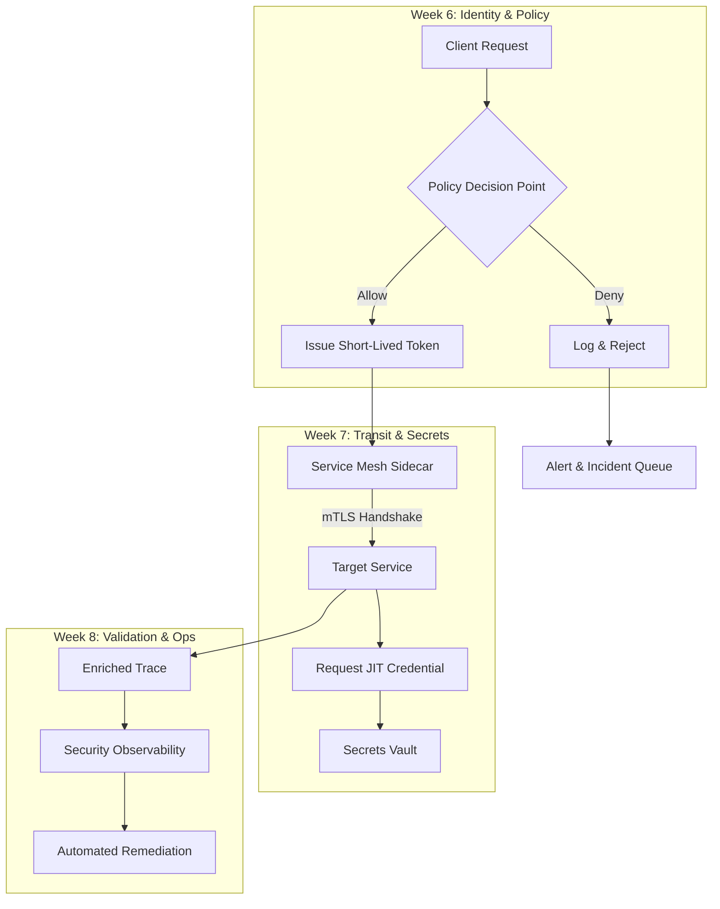

# Week-6, 7, 8

## Introduction
In most software projects, security gets a cursory look during the first sprint. By the time the sixth week arrives, teams often discover that their initial trust model is brittle, and the gap between design and operational reality widens dramatically. This article dissects the three critical weeks that separate a nominal security posture from a resilient, auditable production system.

## Why This Matters
Engineers typically allocate weeks 1‑5 to feature delivery and basic authentication. Weeks 6‑8 are where the true attack surface is exposed: lateral movement, credential sprawl, and undetected policy drift. Ignoring this phase leads to incidents that could have been prevented with systematic hardening. The focus here is on a pragmatic, incremental approach that fits into an existing sprint cadence without adding excessive overhead.

## How It Works
The core mechanism revolves around three interlocking pillars: dynamic trust boundaries, ephemeral credential management, and automated observability. Below is a visual representation of the flow across weeks 6‑8.



### Step‑by‑Step Breakdown
1. **Week 6 – Identity & Policy**  
   The API gateway evaluates each request against a policy store that is refreshed hourly. A successful decision results in a short‑lived token that embeds context (e.g., source IP, user role, and time‑to‑live). This prevents token reuse attacks.

2. **Week 7 – Transit & Secrets**  
   The service mesh terminates mTLS automatically, establishing a zero‑trust channel between sidecars. The target service then requests a just‑in‑time (JIT) credential from a vault, which returns a credential valid only for the next few minutes.

3. **Week 8 – Validation & Ops**  
   Every request generates an enriched trace that includes security metadata (policy version, credential TTL, and mesh state). Observability pipelines aggregate these signals, triggering automated remediation—such as revoking compromised tokens or throttling anomalous traffic.

## Core Concepts
- **Dynamic Trust Boundaries**: Policies are not static; they are versioned and can be updated without redeploying services.
- **Ephemeral Credentials**: Credentials have a lifespan measured in seconds or minutes, drastically reducing the window for credential theft.
- **Observability‑Driven Security**: Security events are treated as first‑class telemetry, enabling real‑time detection and automated response.

## Examples & Code Walkthrough

### Week 6 – Go gRPC Interceptor (Policy‑Aware)
```go
package main

import (
    "context"
    "net/http"
    "time"

    "github.com/golang-jwt/jwt/v5"
    "google.golang.org/grpc"
)

// PolicyStore abstracts the source of truth for access decisions.
type PolicyStore interface {
    Evaluate(ctx context.Context, token string) (bool, error)
}

// JWTInterceptor validates the token and forwards it to PolicyStore.
func JWTInterceptor(policy PolicyStore) grpc.UnaryServerInterceptor {
    return func(
        ctx context.Context,
        req interface{},
        info *grpc.UnaryServerInfo,
        handler grpc.UnaryHandler,
    ) (resp interface{}, err error) {
        // Extract token from metadata (assumes it was set earlier).
        md, ok := grpc.Metadata.FromIncomingContext(ctx)
        if !ok {
            return nil, grpc.Errorf(grpc.Code(errors.Unavailable), "missing metadata")
        }
        tokens, ok := md["authorization"]
        if !ok || len(tokens) == 0 {
            return nil, grpc.Errorf(grpc.Code(errors.PermissionDenied), "no token provided")
        }
        token := strings.TrimPrefix(tokens[0], "Bearer ")

        // Validate JWT signature and claims.
        tokenObj, err := jwt.Parse(token, func(t *jwt.Token) (interface{}, error) {
            return []byte("super-secret-key"), nil // In production, use a key manager.
        })
        if err != nil || !tokenObj.Valid {
            return nil, grpc.Errorf(grpc.Code(errors.PermissionDenied), "invalid token")
        }

        // Evaluate against dynamic policy.
        allowed, err := policy.Evaluate(ctx, token)
        if err != nil {
            return nil, grpc.Errorf(grpc.Code(errors.Internal), "policy evaluation failed: %v", err)
        }
        if !allowed {
            return nil, grpc.Errorf(grpc.Code(errors.PermissionDenied), "access denied by policy")
        }

        // Proceed to the actual handler.
        return handler(ctx, req)
    }
}
```

*Key points*:  
- The interceptor extracts the token from gRPC metadata, not from the request line.  
- Policy evaluation is delegated to a pluggable store, allowing hot‑reload of rules.  
- Errors are mapped to gRPC status codes for consistent client handling.

### Week 7 – Python JIT Secret Fetcher
```python
import os
import time
import boto3
from botocore.exceptions import ClientError

# Configuration via environment variables.
VAULT_NAME = os.getenv("VAULT_NAME")
ROLE_ARN = os.getenv("ROLE_ARN")
MAX_TTL = int(os.getenv("MAX_TTL", "300"))  # 5 minutes in seconds

secrets_client = boto3.client('secretsmanager')

def fetch_jit_credential(service_name: str, ttl: int = MAX_TTL) -> str:
    """
    Retrieve a short‑lived credential from AWS Secrets Manager.
    The credential is generated on‑the‑fly and expires after `ttl` seconds.
    """
    try:
        # Generate a temporary credential using the IAM role.
        response = secrets_client.get_secret_value(
            SecretId=VAULT_NAME,
            VersionStage="AWSCURRENT"
        )
        secret = response['SecretString']
        # Assume the secret contains a JSON with a temporary token.
        payload = json.loads(secret)
        token = payload['temp_token']
        expiry = time.time() + ttl
        # Persist expiry for later validation.
        with open("/tmp/credential_expiry", "w") as f:
            json.dump({"expiry": expiry, "token": token}, f)
        return token
    except ClientError as e:
        raise RuntimeError(f"failed to fetch credential: {e}")

def is_credential_valid(path: str = "/tmp/credential_expiry") -> bool:
    """Simple check to see if the stored token is still valid."""
    if not os.path.exists(path):
        return False
    with open(path) as f:
        data = json.load(f)
    return time.time() < data["expiry"]

# Example usage in a service loop.
if __name__ == "__main__":
    token = fetch_jit_credential("payment-service")
    if is_credential_valid():
        print("Credential is fresh – proceed with request")
    else:
        print("Credential expired – fetch a new one")
```

*Key points*:  
- The script leverages AWS Secrets Manager to issue a temporary token with a configurable TTL.  
- Credential validity is checked locally to avoid extra API calls during request processing.  
- This pattern reduces credential lifetime to minutes, limiting exposure if the token is leaked.

### Week 8 – Go OpenTelemetry Processor (Security Enrichment)
```go
package main

import (
    "context"
    "log"
    "time"

    "go.opentelemetry.io/otel"
    "go.opentelemetry.io/otel/exporters/otlp/otlptrace/otlptracegrpc"
    "go.opentelemetry.io/otel/sdk/resource"
    "go.opentelemetry.io/otel/sdk/trace"
    semconv "go.opentelemetry.io/otel/semconv/v1.21.0"
    "go.opentelemetry.io/otel/attribute"
)

// SecurityProcessor adds security‑relevant attributes to each span.
type SecurityProcessor struct {
    next trace.SpanProcessor
}

func NewSecurityProcessor() *SecurityProcessor {
    return &SecurityProcessor{}
}

// OnStart is called when a span is created.
func (sp *SecurityProcessor) OnStart(ctx context.Context, span trace.Span) {
    // Inject the current policy version (read from env or config map).
    policyVersion := os.Getenv("POLICY_VERSION")
    span.SetAttributes(attribute.String("security.policy_version", policyVersion))

    // Record the credential TTL if present in context.
    if ttl, ok := ctx.Deadline(); ok {
        span.SetAttributes(attribute.Int64("security.credential.ttl", int64(ttl.Sub(time.Now()).Seconds())))
    }

    sp.next.OnStart(ctx, span)
}

// OnEnd is called when a span ends.
func (sp *SecurityProcessor) OnEnd(ctx context.Context, span trace.Span) {
    // No additional work needed on end.
    sp.next.OnEnd(ctx, span)
}

func main() {
    // Set up the OTLP exporter.
    exporter, err := otlptracegrpc.New(ctx, otlptracegrpc.WithInsecure())
    if err != nil {
        log.Fatalf("failed to create exporter: %v", err)
    }

    tp := trace.NewTracerProvider(
        trace.WithBatcher(exporter),
        trace.WithResource(resource.NewWithAttributes(
            semconv.SchemaURL,
            attribute.String("service.name", "security-processor"),
        )),
    )

    // Register the processor.
    tp.AddSpanProcessor(NewSecurityProcessor())

    // Initialize the provider as the global TracerProvider.
    otel.SetTracerProvider(tp)

    // Simulate a short operation.
    tracer := otel.Tracer("example")
    ctx, cancel := context.WithTimeout(context.Background(), 2*time.Second)
    defer cancel()
    span := tracer.Start(ctx, "process-request")
    // ... business logic ...
    span.End()
}
```

*Key points*:  
- The processor enriches every span with the current policy version and credential TTL, enabling downstream analysis.  
- By exposing these attributes via OpenTelemetry, security teams can correlate traces with policy changes in real time.  
- The implementation is lightweight and can be dropped into any existing OTel‑instrumented service.

## Best Practices
1. **Versioned Policies** – Store policy definitions in a version‑controlled repository (e.g., Git) and load them at service start. This enables rollbacks and audit trails.
2. **Zero‑Trust Networking** – Enforce mTLS at the service mesh level; avoid relying solely on firewall rules.
3. **Short‑Lived Secrets** – Adopt JIT credential issuance with TTLs under five minutes. Combine with automated rotation.
4. **Observability as Security** – Emit security‑relevant attributes (policy version, credential state) to your tracing system; treat them as critical telemetry.
5. **Automated Remediation** – Use the enriched telemetry to trigger alerts or automated actions (e.g., revoking tokens, throttling traffic) without manual intervention.

## Common Mistakes & Anti-Patterns

| Mistake | Why It Fails | Fix |
|---------|--------------|-----|
| Hard‑coding token TTLs in source code. | TTLs become stale as requirements evolve; redeployments are needed for changes. | Centralize TTL configuration in a config service that supports hot reload. |
| Skipping mTLS in favor of API keys. | API keys can be leaked; mTLS provides mutual authentication without secret distribution. | Deploy a service mesh (e.g., Istio) and enforce mTLS by default. |
| Treating security telemetry as optional. | Without enriched spans, detecting policy drift or credential misuse is nearly impossible. | Ensure every critical operation emits security attributes; integrate with SIEM pipelines. |
| Using long‑lived service accounts for all components. | A single compromised account can grant broad access across the system. | Implement just‑in‑time credentials per service instance, rotating every few minutes. |

## Performance Considerations
- **Policy Lookup Latency**: Caching policy decisions for the duration of a request (e.g., using an in‑memory LRU cache) adds sub‑millisecond overhead while keeping decisions fresh.
- **mTLS Handshake Cost**: Modern TLS 1.3 reduces handshake latency to ~1 ms on LAN; the cost is negligible compared to typical request processing.
- **JIT Credential Fetch**: Network round‑trip to the vault adds ~5‑10 ms; batching requests or using a sidecar proxy can mitigate this.
- **OTel Enrichment**: Adding a few attributes to a span incurs minimal CPU overhead (<0.1 % of total CPU) but greatly improves diagnostic value.

## Real-World Usage
- **Netflix** employs a service‑mesh‑based policy engine that evaluates requests against a globally consistent store, enabling rapid rollout of security changes across millions of services.
- **Uber** uses JIT credential rotation for its internal APIs, limiting the blast radius of credential leaks.
- **Cloudflare** integrates security attributes into its tracing system, allowing real‑time correlation between request patterns and threat intelligence feeds.

## Frequently Asked Questions (FAQ)

**Q1: How do I decide the appropriate TTL for JIT credentials?**  
A: Start with a 5‑minute TTL for internal services and adjust based on observed usage patterns. Short TTLs reduce exposure but increase the number of credential requests; monitor API latency to ensure the fetch cost remains acceptable.

**Q2: Can I use a centralized policy engine instead of per‑service policies?**  
A: Yes, but ensure the engine is highly available and has sub‑millisecond response times. Deploy it as a sidecar or use a gRPC service with streaming updates to keep policies fresh.

**Q3: What if a service cannot be instrumented with OpenTelemetry?**  
A: Use a middleware or proxy that adds the required attributes before the request reaches the service. For example, an Envoy filter can inject headers that the downstream service reads and converts into span attributes.

## Conclusion
Weeks 6‑8 represent the decisive stretch where a security‑first mindset becomes operational reality. By establishing dynamic trust boundaries, leveraging ephemeral credentials, and wiring security metadata into observability pipelines, teams can close the gap between design intent and production resilience. Implement these patterns incrementally, validate with real traffic, and iterate—your systems will thank you when the next incident attempt fails to materialize.
