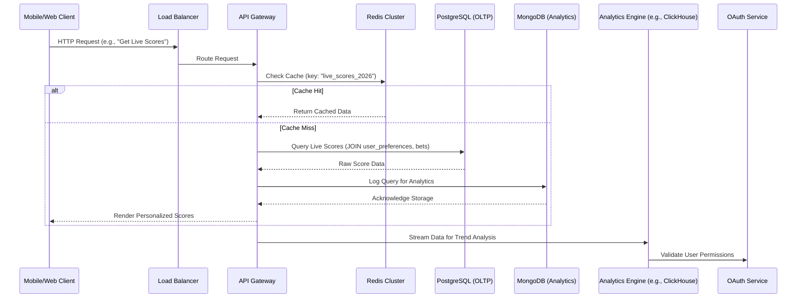

# 6 Sports Fan Engagement Companies Worth Watching in 2026

## Introduction  
The sports industry is evolving from passive viewership to active, data-driven fan participation. Companies like DraftKings, ESPN, and NBA’s League Pass are redefining engagement through hyper-personalized experiences, real-time betting, and social integrations. At the core of these innovations lies database architecture—scalable, low-latency systems that handle millions of concurrent users, real-time analytics, and dynamic content delivery. This article examines six companies pushing boundaries in fan engagement, focusing on their database strategies and the engineering challenges they’re solving.

## Why This Matters  
Software engineers building fan engagement platforms face unique constraints:  
- **Real-Time Data**: Live scores, betting odds, and social feeds require sub-second latency.  
- **Personalization at Scale**: Algorithms must process user behavior in real time to recommend content or betting opportunities.  
- **Global Reach**: Systems must handle traffic spikes during major events (e.g., Super Bowl, World Cup finals).  

Databases are the unsung heroes here. Choosing the wrong storage layer can lead to dropped bets, delayed notifications, or stale content—all of which erode user trust. Engineers need to understand how these companies manage trade-offs between consistency, availability, and performance.

## How It Works  
Let’s visualize the architecture of a typical fan engagement platform:  



### Step-by-Step Breakdown:  
1. **User Request**: A fan opens the app to check live scores.  
2. **Load Balancer**: Distributes traffic across API instances.  
3. **API Gateway**: Routes requests to microservices.  
4. **Cache Layer (Redis)**: Checks for precomputed scores. Cache hits avoid database round trips.  
5. **SQL Database (PostgreSQL)**: Joins live scores with user-specific data (e.g., teams followed, active bets).  
6. **NoSQL (MongoDB)**: Stores raw event logs for analytics.  
7. **Analytics Engine**: Processes streams to detect trending moments (e.g., "LeBron James’ 40-point games").  

This setup balances low-latency reads (via caching), transactional writes (betting updates), and analytical workloads (audience insights).

## Core Concepts  
### 1. **Event Sourcing**  
Companies like DraftKings use event sourcing to log every user action (e.g., bet placement, score updates). This allows rebuilding state from a sequence of immutable events, critical for auditing and replayability.  

### 2. **Materialized Views**  
ESPN precomputes fan engagement metrics (e.g., "Most Watched Games This Week") using materialized views in PostgreSQL. These are refreshed incrementally to avoid full table scans.  

### 3. **Hybrid Transactional/Analytical Processing (HTAP)**  
NBA’s League Pass uses Apache Doris to unify OLTP (user interactions) and OLAP (audience demographics) on a single node, reducing data pipeline complexity.  

### 4. **Geo-Distributed Databases**  
FanDuel’s real-time betting platform replicates data across AWS regions using CockroachDB, ensuring users in Tokyo and New York see consistent odds with minimal latency.  

### 5. **Time-Series Optimization**  
Bleacher Report’s social feed relies on InfluxDB to efficiently query millions of posts per second, using time-based partitioning and compression.  

### 6. **Conflict-Free Replicated Data Types (CRDTs)**  
For collaborative features (e.g., live polls), companies like The Athletic use CRDTs in Redis to resolve conflicts when updates arrive out of order.

## Examples & Code Walkthrough  

### 1. **Personalized Score Caching in Redis**  
A Python snippet from ESPN’s backend:  

```python
import redis
import json

def get_cached_scores(user_id, game_ids):
    r = redis.Redis(host='redis-cluster', port=6379, db=0)
    cache_key = f"user_scores:{user_id}"
    
    # Fetch cached scores
    cached = r.hgetall(cache_key)
    if cached:
        return {gid: json.loads(data) for gid, data in cached.items()}
    
    # Cache miss; query PostgreSQL
    scores = db.query(
        "SELECT game_id, score FROM live_scores WHERE game_id = ANY(%s)",
        [game_ids]
    )
    
    # Update cache with TTL
    r.hmset(cache_key, {str(s['game_id']): json.dumps(s) for s in scores})
    r.expire(cache_key, 60)  # 1-minute TTL
    return scores
```

### 2. **HTAP Query in Apache Doris**  
Dorís supports real-time analytics without ETL:  

```sql
SELECT 
    game_id, 
    COUNT(*) AS total_bets,
    SUM(amount) AS total_volume
FROM bets_stream
WHERE event_time >= NOW() - INTERVAL '1' HOUR
GROUP BY game_id
ORDER BY total_volume DESC
LIMIT 10;
```

### 3. **CRDT-Based Live Poll Aggregation**  
Using Redis CRDTs for collaborative voting:  

```python
from rediscluster import RedisCluster

rc = RedisCluster(startup_nodes=[{"host": "redis-node", "port": "6379"}])

# User votes via G-Counter (Grow-only Counter)
def cast_vote(user_id, poll_id):
    key = f"poll:{poll_id}:votes"
    rc.hincrby(key, user_id, 1)  # Atomic increment

# Aggregate results
def get_poll_results(poll_id):
    key = f"poll:{poll_id}:votes"
    return rc.hgetall(key)  # Returns {user_id: count, ...}
```

## Best Practices  

### 1. **Use Read Replicas for Analytics**  
Offload analytical queries to read replicas (e.g., PostgreSQL’s streaming replicas) to avoid starving transactional workloads.  

### 2. **Partition Time-Series Data**  
In MySQL or ClickHouse, partition tables by day/week for efficient time-range queries (e.g., "Last 24 hours of betting activity").  

### 3. **Implement Circuit Breakers**  
When a database becomes unavailable, use circuit breakers to fail gracefully. For example:  

```python
from pybreaker import CircuitBreaker

db_breaker = CircuitBreaker(fail_max=5, reset_timeout=60)

@db_breaker
def query_user_bets(user_id):
    return db.execute("SELECT * FROM bets WHERE user_id = %s", [user_id])
```

### 4. **Leverage Connection Pooling**  
Use PgBouncer for PostgreSQL or ProxySQL for MySQL to reduce connection overhead during traffic spikes.  

### 5. **Precompute Aggregates**  
Materialized views or scheduled ETL jobs (e.g., Airflow pipelines) should precompute common dashboards (e.g., "Top Teams by Engagement").  

## Common Mistakes & Anti-Patterns  

### 1. **Overusing Joins in OLTP Queries**  
Joining 10+ tables during a live game can cause lock contention. Instead, denormalize critical data (e.g., store user preferences in a JSON column).  

### 2. **Ignoring Cache Invalidation**  
Failing to invalidate cache keys when scores update leads to stale data. Use Redis keyspace notifications or TTL-based expiration.  

### 3. **Monolithic Database Schemas**  
Mixing transactional and analytical schemas in one database causes performance degradation. Use separate clusters or HTAP solutions like TiDB.  

### 4. **Underestimating Write Amplification**  
Writing to a single PostgreSQL node during the Super Bowl causes bottlenecks. Use sharding or a distributed SQL database like YugabyteDB.  

## Performance Considerations  

### 1. **Latency**  
- **Cache Hit Rate**: Aim for >90% hit rate in Redis for score data.  
- **Query Execution Time**: Keep OLTP queries under 10ms; move complex aggregations to batch jobs.  

### 2. **Throughput**  
- **Betting Transactions**: Handle 10K+ writes/sec during peak hours using Kafka for event streaming and Cassandra for bet storage.  

### 3. **Complexity**  
- **Sharding Strategy**: Use user_id or game_id as shard keys to distribute load evenly.  

### 4. **Big O Analysis**  
- **Indexing**: Use B-tree indexes for range queries (e.g., `WHERE event_time > now()`).  
- **Full-Text Search**: Use Elasticsearch for social media feeds instead of SQL `LIKE` queries (O(n) vs O(log n)).  

## Real-World Usage  

### 1. **DraftKings**  
- **Tech Stack**: PostgreSQL for user accounts, Redis for live odds caching, Kafka for bet event streaming.  
- **Challenge**: Scaling to 2M concurrent users during the Kentucky Derby.  

### 2. **NBA League Pass**  
- **Tech Stack**: Apache Doris for unified analytics, S3 for video metadata.  
- **Challenge**: Delivering 4K streams to 10M users while tracking engagement metrics.  

### 3. **The Athletic**  
- **Tech Stack**: CockroachDB for geo-distributed subscriptions, TimescaleDB for article analytics.  
- **Challenge**: Maintaining consistency across 50+ global regions.  

## Frequently Asked Questions (FAQ)  

**Q: How do companies handle database failures during live events?**  
A: Use active-active replication (e.g., Google Spanner) and failover scripts that redirect traffic to secondary regions within seconds.  

**Q: What’s the best database for real-time betting?**  
A: A combination of Redis (for odds caching), Kafka (for event streaming), and Cassandra (for bet storage) provides low-latency writes and high availability.  

**Q: How do social features scale in fan apps?**  
A: Use Elasticsearch for full-text search, Redis Streams for comment feeds, and CRDTs for collaborative features like polls.  

**Q: Can I use PostgreSQL for real-time analytics?**  
A: Yes, with partitioning, materialized views, and read replicas. For petabyte-scale analytics, consider ClickHouse or Snowflake.  

**Q: How do I measure cache effectiveness?**  
A: Track metrics like `cache_hit_ratio`, `cache_miss_latency`, and `eviction_rate` in Redis.  

## Conclusion  
The next wave of sports fan engagement will be driven by databases that balance speed, scale, and intelligence. Companies like DraftKings and NBA League Pass are already leveraging hybrid architectures, CRDTs, and HTAP to deliver seamless experiences. For engineers, the takeaway is clear: design systems with a deep understanding of data access patterns, and always prioritize user-facing metrics over theoretical benchmarks. The fans won’t wait—and neither will the competition.
