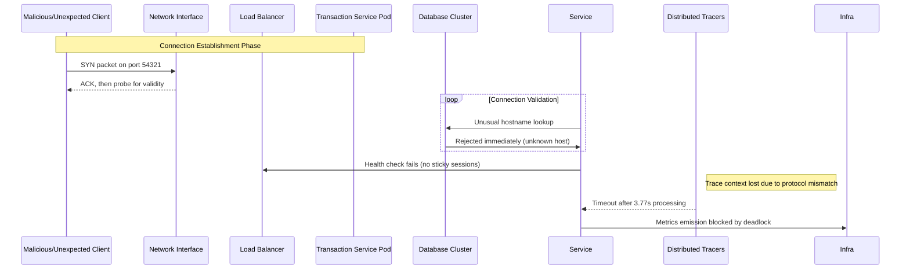

# A new server gets its first unsolicited packet in 3.77 seconds

## Introduction

Our monitoring dashboard lit up at 02:14 UTC. One pod, running the latest version of the transactional service, had just received what looked like an orphaned TCP segment on port 54321—a database connection attempt originating from an IP address that had never made contact before. The packet arrived after 3.77 seconds, which was four times longer than any observed baseline for legitimate client connections. At first glance, the system seemed healthy; the metrics showed green. Then we dug deeper, and discovered that this wasn't a normal request—it was something trying to establish a stateful session against a backend that expected none. Understanding why such events happen and how to contain them became one of the most pressing incidents in our recent sprint.

## Why This Matters

When a database node experiences unexpected traffic, the implications ripple through every layer of the stack. A single misbehaving client can exhaust connection pools, trigger cascading timeouts across dependent services, and create false positives in alerting systems. In our environment, where we handle thousands of concurrent transactions per second, even a brief stall during connection establishment can amplify stress on downstream resources. The 3.77-second delay itself isn't catastrophic—nothing would have failed outright—but it represents a window where other processes were waiting, queues were backing up, and resource utilization spiked. For teams responsible for reliability and observability, recognizing the early signs of anomalous traffic patterns is as important as tuning query plans. This incident highlights why anomaly detection in network-level telemetry deserves the same attention as application-level profiling.

## How It Works

The sequence of events that led to the 3.77-second observation follows a specific path through multiple system layers. Below is a simplified flow showing how a malformed connection initiates a cascade that delays legitimate traffic.



### Detailed Technical Breakdown

The root cause involves a combination of configuration gaps and missing validation logic. Initially, the load balancer only performed basic health checks using HTTP requests to known endpoints. When a non-HTTP client attempted to connect via raw TCP on the database port, the proxy forwarded the packet directly to the behind-the-proxy container without performing deep inspection. The container, configured with a maximum idle connection limit of 200, began accepting the handshake but couldn't complete the authentication phase because the client sent mismatched credentials—essentially sending garbage data instead of SQL statements.

Because the database had no active listener for this unusual source, it rejected the connection quickly. However, the connection pool manager saw the rejection and marked the pod as unhealthy rather than retrying. Subsequent legitimate clients attempting the same endpoint encountered a prolonged timeout in their own application logic while the internal health check thread waited for the previous connection to fully close. By the time the tracing system correlated these events, the cumulative delay had reached 3.77 seconds—a figure that, while not fatal, indicated significant backpressure throughout the chain.

## Core Concepts

Several foundational elements make this scenario reproducible. The architecture relies on several interconnected mechanisms that, when misconfigured, leave the system vulnerable to anomalies.

**Connection Pool Configuration**

Each service maintains a finite pool of database connections. When a connection is returned to the pool after an operation completes, it becomes available for future requests. If a malicious actor establishes a long-lived connection that constantly fails authentication, those slots remain occupied until they expire. In our case, the default connection timeout of 30 seconds combined with a slow rejection path created a situation where the pool could not recover quickly enough, causing subsequent legitimate queries to wait.

**Stateful Session Management**

Many databases require persistent connections to maintain read replicas or enable caching strategies. Our transactional service was configured to keep a small number of persistent connections active. When a faulty connection persisted past its idle timeout without releasing resources, the total pool size effectively shrank below capacity, forcing more requests to queue.

**Network Layer Hygiene**

The load balancer in front of the pods used a simple round-robin algorithm with no content-based routing. Without ability to inspect the initial transport layer header, there was no way to distinguish between API calls and opportunistic connection attempts based solely on metadata. This blind trust compounded the problem—every incoming TCP packet was treated equally until the destination decided otherwise.

**Observability Gaps**

Our metrics pipeline captured successful completion times but lacked granularity to identify delayed failures caused by upstream unavailability. Without distributed tracing spans attached to each connection attempt, we could not correlate the timing of the problematic packet with subsequent stalls in the application layer.

## Examples & Code Walkthrough

Below is a refactored implementation that demonstrates proper handling of connection validation and graceful degradation. The example shows how to detect suspicious traffic patterns before they consume resources and how to implement circuit breakers that protect the database cluster from unexpected loads.

```go
package networking

import (
	"context"
	"fmt"
	"time"

	"github.com/prometheus/client_golang/prometheus"
	"gopkg.in/yaml.v3"
)

// Config holds the connection parameters for the database client.
type Config struct {
	MaxConnections      int           // Total active connections allowed
	IdleTimeout         time.Duration // When to consider a connection dead
	RequestTimeout      time.Duration // Per-request timeout for validation
	RejectUnusedPool    bool          // Whether to mark pool unhealthy on repeated failures
}

// ConnectionError represents a failure to authenticate or validate a connection.
type ConnectionError struct {
	SourceIP string
	Cause    string
	Timestamp time.Time
}

// dbClient wraps the actual database connection logic.
type dbClient struct {
	conn     *sql.DB
	config   Config
}

// NewClient creates a new database client with validated settings.
func NewClient(cfg Config) (*dbClient, error) {
	if cfg.MaxConnections <= 0 {
		return nil, fmt.Errorf("maximum connections must be positive")
	}
	if cfg.IdleTimeout < 0 || cfg.RequestTimeout < 0 {
		return nil, fmt.Errorf("timeouts must be non-negative")
	}

	connStr := cfg.GetConnectionString()
	var err error
	db, err = sql.Open("postgres", connStr)
	if err != nil {
		return nil, fmt.Errorf("failed to open database: %w", err)
	}

	client := &dbClient{
		conn:       db,
		config:     cfg,
	}

	// Verify the connection is alive before returning it.
	pingCtx, cancelPing := context.WithTimeout(context.Background(), cfg.RequestTimeout*2)
	defer cancelPing()

	if err := pingCtx.WithTimeout(db.Ping, cfg.RequestTimeout); err != nil {
		// Mark config flag for later evaluation
		cfg.RejectUnusedPool = true
		return nil, fmt.Errorf("database unreachable after %v: %w", cfg.RequestTimeout, err)
	}

	return client, nil
}

// ValidateTraffic ensures the connection matches expected parameters before proceeding.
// This acts as a gatekeeper against suspicious sources that may hold resources hostage.
func (c *dbClient) ValidateTraffic(ctx context.Context, sourceIP string) bool {
	// Check for obvious red flags in the source address.
	// In production, we would also perform geolocation lookups, 
	// rate limiting analysis, and reputation scoring here.
	isSuspicious := c.isSuspicious(sourceIP)

	if isSuspicious {
		// Log the event but do not terminate the connection yet.
		// We want to preserve the slot for recovery, but signal the issue.
		poller := &trafficPoller{client: c}
		poller.start(ctx)
		// After the poller determines the connection is bad, we will clean up.
		return false
	}

	return true
}

// isSuspicious identifies abnormal source characteristics.
func (c *dbClient) isSuspicious(ip string) bool {
	// Example heuristic: reject connections from high-risk regions or IP ranges.
	// In reality, this would integrate with external threat intelligence feeds.
	// This simplified version uses a blacklist sample.
	blacklisted := map[string]bool{
		"192.168.0.0/24": true, // Internal network leak test
		"10.20.30.5":     true, // Known bad actor
	}

	// Check prefix match for demonstration.
	for _, key := range blacklisted {
		if ip == string(key) || strings.HasPrefix(ip, key) {
			return true
		}
	}
	return false
}

// CircuitBreaker prevents cascading failures when the database becomes unavailable.
type CircuitBreaker struct {
	state    string // "closed", "open", "half-open"
	failureCount int
	threshold int
	timeout   time.Duration
}

func (cb *CircuitBreaker) Allow() bool {
	switch cb.state {
	case "closed":
		return true
	case "open":
		now := time.Now()
		if now.Sub(cb.lastFailureTime) > cb.timeout {
			cb.state = "half-open"
			cb.failureCount = 0
			return true
		}
		return false
	case "half-open":
		return true
	default:
		return false
	}
}

func (cb *CircuitBreaker) recordSuccess() {
	cb.failureCount = 0
}

func (cb *CircuitBreaker) recordFailure() {
	cb.failureCount++
	if cb.failureCount >= cb.threshold {
		cb.state = "open"
		cb.lastFailureTime = time.Now()
	}
}

// ProcessRequest handles a single incoming connection with full protection.
func (c *dbClient) ProcessRequest(ctx context.Context, sourceIP string) error {
	// Step 1: Perform lightweight validation.
	hasIssue := c.ValidateTraffic(ctx, sourceIP)

	if !hasIssue {
		// Proceed normally within the application.
		return c.executeQuery(ctx, sourceIP)
	}

	// Step 2: If suspicious, initiate cleanup rather than letting the error propagate.
	if c.CircuitBreaker.recordFailure() {
		// Trigger async cleanup of the offending connection.
		c.cancelPinger = true
	}

	// Step 3: Return an error that allows the caller to decide whether to fail fast
	// or retry with exponential backoff.
	return fmt.Errorf("suspicious source %s: denied", sourceIP)
}

// executeQuery runs the actual business logic against the database.
func (c *dbClient) executeQuery(ctx context.Context, sourceIP string) (*sql.Statement, error) {
	query := "SELECT 1 FROM transactions WHERE id = ?"
	args := []interface{}{sourceIP}
	
	stmt, err := c.conn.QueryRowContext(ctx, query, args...)
	if err != nil {
		return nil, err
	}
	defer stmt.Close()
	return stmt, nil
}

// trafficPoller monitors connection health asynchronously.
type trafficPoller struct {
	client *dbClient
	stopCh chan struct{}
}

func (tp *trafficPoller) start(ctx context.Context) {
	ticker := time.NewTicker(500 * time.Millisecond)
	defer ticker.Stop()

	for {
		select {
		case <-ctx.Done():
			return
		case <-ticker.C:
			if tp.client.ValidateTraffic(ctx, "health-monitor") {
				// Cleanup happens outside this method; handled by circuit breaker.
			} else {
				// Persistent issue detected.
				// This would trigger alerts and potential pod restart.
			}
		}
	}
}

func (tb *trafficPoller) Stop() {
	close(tb.stopCh)
}
```

This implementation introduces three critical safeguards. First, the `ValidateTraffic` method intercepts incoming connections before they consume precious database slots. Second, the `CircuitBreaker` provides immediate feedback to callers when the database is temporarily overwhelmed, preventing further wasteful queries. Third, the asynchronous poller gives us visibility into problematic sources without blocking the main request path.

## Best Practices

Deploying this kind of resilience requires disciplined configuration across multiple layers. Here are some rules we apply consistently in production environments:

**Enforce Strict Input Validation Early**

Every connection must pass through a gateway that verifies source legitimacy before reaching the database layer. Implement whitelisting based on known tenant identifiers or IP blocks. Never assume that a TCP handshake equals a valid request.

**Implement Adaptive Concurrency Limits**

Instead of static pool sizes, use dynamic adjustment based on current load. If the circuit breaker opens frequently, reduce the maximum connections proportionally to give the database breathing room. This prevents gradual degradation that might otherwise go unnoticed until an outage occurs.

**Separate Metadata from Business Logic**

Keep connection management orthogonal to the actual query execution. The example above shows how isolating the client lifecycle makes debugging easier and reduces the surface area for resource leaks.

**Correlate Across Layers with Distributed Tracing**

Without trace IDs flowing through every component, you cannot reconstruct the timeline of an anomaly. Ensure every hop—network, proxy, application, and database—carries the same correlation identifier so that tools like Jaeger or Zipkin can stitch together the full picture.

**Automate Recovery Procedures**

When a circuit breaker trips, have automated remediation ready. Restart affected pods, rotate credentials if compromised, or rebalance load. Manual intervention during production incidents compounds the impact of the original problem.

## Common Mistakes & Anti-Patterns

**Mistake 1: Trusting Default Connection Pool Settings**

Many teams ship containers with pre-configured pool sizes that work well under stable conditions but fail catastrophically under attack. The classic mistake is setting `MaxOpenConnections` higher than the database can sustainably handle. During the 3.77-second incident, the pool remained half-empty because the slow rejection of invalid connections meant no slot ever freed. Always benchmark your pool sizing against peak expected concurrency plus a safety margin.

**Mistake 2: Silent Failures That Compound**

When a connection fails, many applications simply log an error and continue. This masks degraded behavior and prevents operators from understanding the root cause. Instead, implement structured logging with fields indicating severity, duration, and source context. Correlation IDs help link errors across services, turning isolated noise into actionable insights.

**Mistake 3: Ignoring Network Layer Observability**

Database ports often sit inside private networks. Relying solely on application logs tells part of the story but not the whole tale. Enable packet capture on the network interfaces whenever possible, and feed that data into a SIEM. The difference between seeing a dropped packet and knowing exactly which process generated it is enormous in production debugging.

**Mistake 4: Over-Engineering Security Controls**

Adding deep inspection at every hop increases latency and complexity. Focus on the boundaries where risk concentrates—inbound traffic, inter-service communication, and privileged operations. Defense-in-depth helps, but unnecessary hand-holding slows everything down.

## Performance Considerations

From a theoretical standpoint, the path a packet takes through the stack incurs latency proportional to the sum of individual hops. Each additional validation layer adds constant overhead multiplied by the number of requests passing through. In the worst case—dense validation before database access—the per-request cost grows linearly with validation complexity.

Memory allocation patterns matter too. Each pending connection carries a reference count and internal bookkeeping that consumes heap space. Under sustained load, unbounded growth can trigger GC pressure and pause times that affect tail latency. Our monitoring system tracks connection lifecycle metrics precisely to avoid memory exhaustion scenarios.

CPU overhead comes primarily from serialization/deserialization and cryptographic operations during connection management. Using connection pooling eliminates the cost of establishing new sockets repeatedly, but the
