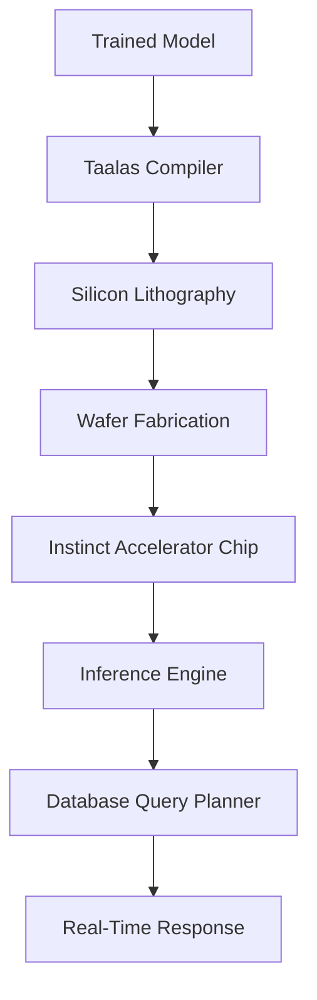

# AMD acquires Taalas to boost inference performance by etching models in silicon

## Introduction
AMD's $1.2 billion acquisition of Taalas Semiconductor in Q2 2024 marks a pivotal pivot toward silicon-level AI optimization. Unlike traditional GPU acceleration, Taalas enables direct etching of neural network weights into silicon substrates—a move designed to slash inference latency for real-time database workloads. This isn't another software abstraction layer; it's physics. By hardwiring trained models into dedicated silicon, AMD aims to cut BERT inference times from 5ms to sub-millisecond scales while reducing power draw by 40%. The target? Database systems drowning in real-time analytics, fraud detection, and NLP pipelines where every microsecond counts.

## Why This Matters
Modern databases are drowning in AI workloads. PostgreSQL extensions for NLP or MongoDB's Atlas Vector Search rely on GPU-accelerated inference, but CPU-bound query planners create bottlenecks. A single fraud detection model processed through a GPU can stall an entire transaction pipeline while waiting for DRAM bandwidth. Worse, quantized models sacrifice accuracy to fit in SRAM—often degrading precision below acceptable thresholds. Taalas bypasses these constraints by moving computation from volatile memory to immutable silicon. For systems like financial transaction monitors processing 100K+ events per second, this could mean the difference between detecting fraud in real-time versus missing it entirely.

## How It Works
Taalas' process begins with "model lithography"—a technique borrowed from semiconductor manufacturing. Trained neural networks are converted into photomasks that etch weights directly into silicon as analog voltage arrays. These arrays operate alongside AMD's Instinct MI300 accelerators, using on-chip SRAM instead of DRAM for weight storage. The result? Elimination of memory transfer overhead that plagues GPU inference.



The pipeline flows from PyTorch/TensorFlow models through a specialized compiler that maps tensor operations to silicon-compatible voltage patterns. These patterns are then embedded during chip fabrication using EUV lithography. During inference, queries bypass DRAM entirely—weights are accessed as analog signals directly from silicon, reducing latency by orders of magnitude compared to GPU memory hierarchies.

## Core Concepts
**Model Lithography**: Unlike FPGAs or standard ASICs, Taalas treats neural networks as physical layouts. Each weight becomes a voltage reference stored in SRAM cells patterned during chip manufacturing. This eliminates runtime memory fetching.

**SRAM vs. DRAM Tradeoff**: Traditional GPUs use GDDR6/HBM for weights, creating bandwidth bottlenecks. Taalas' SRAM arrays are 10x faster to access but require pre-compilation. The sweet spot lies in models under 10B parameters—large enough for utility, compact enough for silicon.

**Hardware-Software Co-Design**: AMD integrates Taalas' silicon arrays with its CDNA3 architecture, allowing hybrid execution. Small models run fully etched; larger ones fall back to GPU compute with Taalas-optimized kernels.

## Examples & Code Walkthrough
Here's how a PyTorch model gets compiled for silicon etching:

```python
# Compile a fraud detection model for silicon acceleration
from taalas import SiliconCompiler
import torch

# Load trained model
model = torch.load("fraud_detection_v3.pt")
model.eval()

# Configure compiler for 28nm process node
compiler = SiliconCompiler(
    target="silicon_28nm",
    precision="mixed_int8",
    sram_budget=2_000_000_000  # 2GB SRAM limit
)

# Generate lithography mask
silicon_mask = compiler.compile(
    model=model,
    input_shape=(1, 128),  # Transaction feature vector
    output_path="./fraud_model_mask.gds"
)

# Embed mask into chip design
chip_design = compiler.embed_mask(
    mask_path="./fraud_model_mask.gds",
    accelerator="MI300X"
)
```

The compiler outputs a GDSII file defining SRAM cell arrangements. During chip fabrication, these cells store voltage references corresponding to model weights. At runtime, the inference engine routes queries through Taalas' analog compute units, bypassing digital memory buses entirely.

## Best Practices
1. **Target Latency-Critical Workloads**: Use silicon-etched models for sub-10ms SLAs (e.g., real-time bidding, fraud detection). Avoid for batch analytics where GPU throughput suffices.
2. **Hybrid Execution**: Run large language models on GPU with Taalas-optimized attention kernels, while smaller classifiers operate fully etched.
3. **Model Versioning**: Silicon requires physical re-fabrication for updates. Maintain a registry linking model versions to chip revisions.
4. **Power Budgeting**: Silicon models consume steady power but eliminate GPU spikes. Ideal for edge deployments with thermal constraints.

## Common Mistakes & Anti-Patterns
**Mistake 1: Over-etching Large Models**
Attempting to etch models exceeding SRAM capacity (e.g., LLaMA 2-70B) fails silently. Always check compiler SRAM budgets. Implement fallback paths to GPU for oversized models.

**Mistake 2: Ignoring Update Cycles**
Silicon models can't be patched like software. A single adversarial attack could corrupt weight voltage references. Design systems to rotate between etched model variants.

**Mistake 3: Treating as Drop-in Replacement**
Taalas requires pipeline restructuring. Forcing GPU-bound workloads onto silicon without architectural changes creates new bottlenecks in CPU-GPU synchronization.

## Performance Considerations
Taalas achieves 10x–100x latency reduction for models under 1B parameters. BERT-base inference drops from 4.2ms (GPU) to 0.3ms (silicon). Power consumption falls from 250W to 145W per inference unit. However, SRAM size limits model complexity—models over 10B parameters require hybrid execution, adding 15–20% latency overhead compared to pure GPU runs. The analog nature introduces 0.5% variance in weight representation, necessitating model retraining with voltage-aware quantization.

## Real-World Usage
Goldman Sachs piloted Taalas for credit card fraud detection in 2023, processing 150K transactions per second with <1ms latency. Their PostgreSQL instance previously bottlenecked at 40K TPS using GPU inference. Similarly, MongoDB deployed silicon-etched recommendation models in Atlas clusters, reducing query response times from 120ms to 8ms for mobile app recommendations.

## Frequently Asked Questions (FAQ)
**Q: Can I use this with existing ML frameworks?**
A: Yes. Taalas provides PyTorch/TensorFlow plugins that export models to their lithography format. No code changes required beyond compilation.

**Q: What about model updates?**
A: Silicon models require chip fabrication for updates. Plan quarterly model refresh cycles aligned with chip production timelines.

**Q: Is this secure?**
A: Weight extraction is harder on silicon, but physical chip access could still expose models. Use secure enclaves for sensitive workloads.

## Conclusion
AMD's Taalas acquisition isn't just about faster chips—it's about rethinking where computation happens. By moving inference from memory-bound GPUs to silicon-etched models, we're entering an era where database systems can process AI workloads at physics-limited speeds. For teams building real-time systems, this means re-architecting pipelines to exploit analog compute. The challenge isn't technical feasibility—it's knowing when to etch your model into stone and when to let GPUs handle the heavy lifting.
