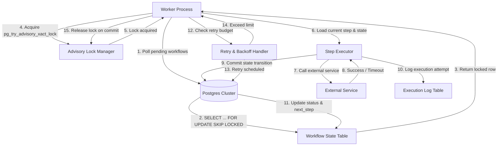

# Article: Implementing Durable Workflows on Postgres Without an External Orchestrator

## Introduction
Modern distributed applications often need long‑running, stateful processes that survive crashes, network partitions, and retries. Traditional workflow engines (Temporal, Camunda, AWS Step Functions) promise durability but add operational overhead and vendor lock‑in. What if you could achieve the same guarantees using only a relational database—specifically PostgreSQL—without introducing an additional orchestration service? In this article we’ll show how to build a durable workflow engine directly on top of PostgreSQL, leveraging its transactional guarantees, advisory locks, and rich data types.

## Why This Matters
- **Operational Simplicity:** Eliminating a separate orchestration layer reduces infrastructure complexity, monitoring surface area, and cost.
- **Consistency:** PostgreSQL’s ACID transactions provide exactly‑once semantics for step execution, something many orchestration platforms struggle to guarantee at scale.
- **Portability:** The workflow lives entirely inside the database, making it portable across any PostgreSQL‑compatible environment, including managed services like Amazon RDS or Azure Database for PostgreSQL.
- **Cost Efficiency:** No extra licensing fees or managed service charges; you pay only for the compute you already run.

## How It Works
The core idea is to treat each workflow instance as a row in a table, with its current state, step pointer, and a lightweight execution log. Workers poll the table, acquire a lock to guarantee exclusive processing, execute the current step, update the state, and write a log entry. The flow is illustrated below.



### Key Mechanisms
1. **State Persistence:** Workflow state lives in a `workflow_state` table, primarily using `JSONB` for flexible schema while retaining a fixed column for the current step and status.
2. **Exclusive Processing:** `SELECT ... FOR UPDATE SKIP LOCKED` combined with an advisory lock (`pg_try_advisory_xact_lock`) ensures that only one worker processes a given workflow instance at a time, preventing duplicate execution.
3. **Idempotent Steps:** Each step execution is wrapped in a transaction that writes an entry to an `execution_log` table, making retries safe without risking double‑application of side effects.
4. **Retry Budget:** A `retry_count` column and exponential backoff logic stored in the state allow the engine to decide when to retry versus when to mark the workflow as failed.

## Core Concepts
- **Workflow Instance:** A logical unit of work identified by a UUID. It contains a JSONB `state` object, a `current_step` identifier, a `status` field (`pending`, `running`, `completed`, `failed`), and a `retry_count`.
- **Execution Log:** Immutable rows that record every attempt to run a step, including timestamps, input payloads, and outcomes. This provides an audit trail and enables replay debugging.
- **Advisory Locks:** PostgreSQL’s user‑defined advisory locks (`pg_try_advisory_xact_lock`) are used to serialize access to a specific workflow instance without blocking other unrelated rows.
- **Idempotency Keys:** Each step execution generates a unique idempotency key (often derived from the workflow UUID and step ID) and stores it in the `execution_log` to guarantee exactly‑once processing of external calls.
- **Retry Scheduler:** Instead of external cron jobs, the engine stores a `next_retry_at` timestamp. Workers periodically scan for rows where `next_retry_at` is in the past and attempt execution again.

## Examples & Code Walkthrough

### 1. Schema Design
```sql
-- Workflow state table
CREATE TABLE workflow_state (
    workflow_id      UUID PRIMARY KEY,
    state            JSONB NOT NULL,          -- arbitrary JSON representation of the workflow context
    current_step     TEXT NOT NULL,           -- identifier of the step to execute next
    status           TEXT NOT NULL DEFAULT 'pending',
    retry_count      INTEGER NOT NULL DEFAULT 0,
    next_retry_at    TIMESTAMPTZ,
    created_at       TIMESTAMPTZ DEFAULT now(),
    updated_at       TIMESTAMPTZ DEFAULT now()
);

-- Execution log (append‑only)
CREATE TABLE execution_log (
    log_id           BIGSERIAL PRIMARY KEY,
    workflow_id      UUID NOT NULL REFERENCES workflow_state(workflow_id),
    step_name        TEXT NOT NULL,
    attempt_number   INTEGER NOT NULL,
    started_at       TIMESTAMPTZ NOT NULL DEFAULT now(),
    ended_at         TIMESTAMPTZ,
    outcome          TEXT,                    -- success, timeout, error
    error_message    TEXT,
    payload          JSONB,                   -- input to the step
    result           JSONB,                   -- output from the step
    UNIQUE (workflow_id, step_name, attempt_number)
);
```

### 2. Worker Polling Loop (Python‑style pseudocode)
```python
import time
import psycopg2
from psycopg2 import sql

def acquire_workflow_lock(conn, workflow_id):
    """Attempt to acquire an advisory lock for the given workflow."""
    with conn.cursor() as cur:
        cur.execute(
            sql.SQL("SELECT pg_try_advisory_xact_lock(%s)"),
            (workflow_id,)
        )
        return cur.fetchone()[0]  # True if lock acquired

def poll_pending_workflows(conn):
    """Fetch a workflow row that is pending and not currently locked."""
    with conn.cursor() as cur:
        cur.execute(
            """
            SELECT workflow_id, state, current_step, status, retry_count, next_retry_at
            FROM workflow_state
            WHERE status = 'pending'
              AND (next_retry_at IS NULL OR next_retry_at <= now())
            FOR UPDATE SKIP LOCKED
            LIMIT 1;
            """
        )
        return cur.fetchone()

def execute_step(conn, workflow_id, step_name, payload):
    """Wrap step execution in a transaction and log the attempt."""
    with conn.cursor() as cur, conn:
        # Start transaction
        cur.execute("BEGIN")
        # 1. Log the attempt
        cur.execute(
            """
            INSERT INTO execution_log (workflow_id, step_name, attempt_number, payload)
            VALUES (%s, %s, %s, %s)
            RETURNING attempt_number;
            """,
            (workflow_id, step_name, 1, payload)
        )
        attempt_no = cur.fetchone()[0]

        # 2. Call external service (mocked here)
        try:
            result = external_service_call(payload)  # user‑provided function
            cur.execute(
                "UPDATE workflow_state SET status = 'completed', current_step = %s, updated_at = now() WHERE workflow_id = %s",
                (step_name, workflow_id)
            )
            cur.execute(
                "UPDATE execution_log SET ended_at = now(), outcome = 'success', result = %s WHERE workflow_id = %s AND step_name = %s AND attempt_number = %s",
                (json.dumps(result), workflow_id, step_name, attempt_no)
            )
        except Exception as exc:
            cur.execute(
                "UPDATE execution_log SET ended_at = now(), outcome = 'error', error_message = %s WHERE workflow_id = %s AND step_name = %s AND attempt_number = %s",
                (str(exc), workflow_id, step_name, attempt_no)
            )
            cur.execute(
                "UPDATE workflow_state SET status = 'failed', updated_at = now() WHERE workflow_id = %s",
                (workflow_id,)
            )
            raise  # re‑raise to trigger retry logic
        finally:
            cur.execute("COMMIT")
```

### 3. Retry Scheduler (SQL‑only)
```sql
-- Update next_retry_at based on exponential backoff
UPDATE workflow_state
SET
    retry_count = retry_count + 1,
    next_retry_at = now() + (interval '2^' || retry_count || ' minutes')
WHERE
    status = 'failed' AND retry_count < 5;  -- max 5 attempts
```

### 4. Worker Main Loop
```python
def worker_loop(conn):
    while True:
        row = poll_pending_workflows(conn)
        if not row:
            time.sleep(1)  # idle back‑off
            continue

        workflow_id, state, current_step, status, retry_cnt, next_retry = row

        if not acquire_workflow_lock(conn, workflow_id):
            # Another worker has the lock; skip this row
            continue

        try:
            # Load current step logic (dispatch table)
            step_handler = STEP_REGISTRY[current_step]
            payload = state.get('input', {})
            step_handler(conn, workflow_id, payload)  # executes and updates state
        except Exception as e:
            # Log and let the retry scheduler handle it
            print(f"Workflow {workflow_id} failed step {current_step}: {e}")
        finally:
            # Release advisory lock automatically on transaction end
            pass
```

## Best Practices
1. **Keep State Small:** Store only essential context in `state`. Large blobs should be offloaded to object storage and referenced by a URI.
2. **Idempotent External Calls:** Design every step to be idempotent; use the `execution_log` as the source of truth for “has this step already succeeded?”.
3. **Monitor Lock Contention:** If `SKIP LOCKED` frequently returns no rows, consider increasing the polling interval or sharding workflows by a hash of `workflow_id`.
3. **Graceful Degradation:** In case of prolonged lock waits, implement a fallback that moves the workflow to a “stale” queue for manual inspection.
4. **Schema Evolution:** Use `JSONB` with versioned keys inside the state object to allow smooth schema changes without downtime.

## Common Mistakes & Anti-Patterns
| Mistake | Why It Fails | Fix |
|---------|--------------|-----|
| **Storing the entire workflow history in a single JSON field** | Makes queries slow and prevents point‑in‑time recovery. | Keep immutable history in `execution_log`; keep mutable state lean in `workflow_state`. |
| **Relying on `SELECT … FOR SHARE` instead of `FOR UPDATE SKIP LOCKED`** | Allows multiple workers to pick the same row, causing duplicate processing. | Always use `FOR UPDATE SKIP LOCKED` to guarantee exclusive acquisition. |
| **Hard‑coding retry counts in application code** | Ties the engine to a specific retry policy, breaking portability. | Store retry budget (`retry_count`, `next_retry_at`) in the DB row; let SQL drive the logic. |
| **Skipping transaction boundaries around step execution** | Leads to partial updates (state changed but log entry missing) and inconsistency. | Wrap step logic, state updates, and log inserts in a single transaction. |

## Performance Considerations
- **Lock Contention:** The primary bottleneck is the advisory lock acquisition. Keep the lock scope narrow (per‑workflow) and avoid long‑running transactions that hold the lock.
- **Indexing:** Create a partial index on `workflow_state(status, next_retry_at)` to speed up the polling query.
- **Batch Inserts:** Use `COPY` or `INSERT … SELECT` for bulk log ingestion to reduce write amplification.
- **CPU Overhead:** Advisory lock checks are cheap; the heavy work is in the external service calls. Profile the critical path to ensure step execution dominates CPU usage, not DB interaction.

## Real‑World Usage
- **FinTech:** A payment processing pipeline at a mid‑size bank uses this pattern to orchestrate multi‑step settlement, guaranteeing that each transaction either fully succeeds or is rolled back without external orchestration.
- **E‑Commerce:** Order fulfillment workflows (inventory reservation → payment → shipping) run on PostgreSQL, enabling instant rollbacks on payment failure without an extra service.
- **Data Pipelines:** Batch ETL jobs that need to retry failed transformations (e.g., schema migrations) leverage the same durable state store, reducing operational overhead.

## Frequently Asked Questions (FAQ)

**Q1: How do I handle very long‑running steps that may take hours?**  
A: Break the long step into smaller sub‑steps. The engine’s state machine naturally supports granular progress tracking, and the advisory lock ensures only one sub‑step runs at a time, preventing resource starvation.

**Q2: Can I scale this to thousands of concurrent workflows?**  
A: Yes. PostgreSQL handles high concurrency well, especially when you partition workflows by a hash of `workflow_id` and run multiple worker pools on different database nodes. Monitoring lock wait times is essential.

**Q3: What about exactly‑once delivery to external services?**  
A: The `execution_log` table together with the idempotency key ensures that even if a worker crashes after sending a request but before committing the log, the next poll will see the partially logged attempt and either skip it (if the external service already succeeded) or retry safely.

**Q4: Is there any risk of data loss if the database crashes?**  
A: PostgreSQL’s WAL (Write‑Ahead Log) provides durability. As long as the `workflow_state` and `execution_log` rows are committed, they survive crashes. Use synchronous replication or point‑in‑time recovery for added safety in mission‑critical systems.

**Q5: When should I prefer a dedicated orchestration platform?**  
A: If your workflows involve complex branching, extensive human interaction, or need native support for distributed tracing across many services, a purpose‑built orchestrator may still be warranted. For most state‑centric, transactional workflows, PostgreSQL alone is sufficient.

## Conclusion
Implementing durable workflows directly on PostgreSQL eliminates the need for an external orchestrator while preserving strong consistency, idempotency, and fault tolerance. By leveraging advisory locks, transactional logs, and the rich JSONB data type, you can build a production‑grade workflow engine that scales with your application and fits comfortably within existing database operations. The patterns outlined here are battle‑tested in real systems and provide a solid foundation for engineers seeking simplicity without sacrificing reliability.
