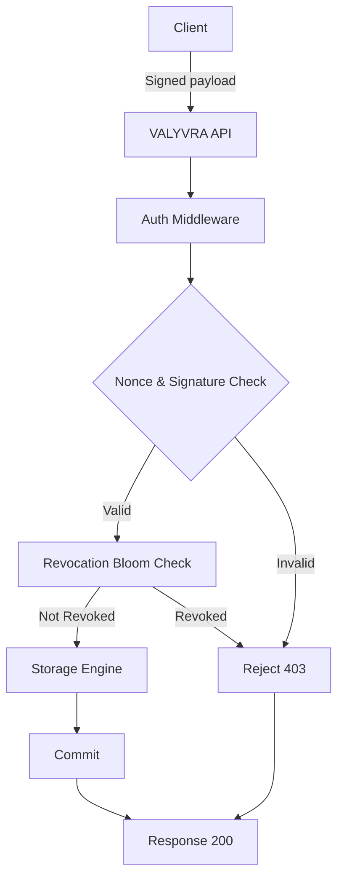

# Building VALYVRA: two authentication lessons from a Web3 prototype

## Introduction
When we started VALYVRA we wanted a document store that could trust EVM signatures at the storage layer, not just at the API gateway. The idea was simple: every write would carry a signature, the DB would verify it, and then commit the row if the proof checked out. In practice we hit two hard walls—verification latency and revocation handling—that forced us to rethink how a database can work with Web3 primitives.

## Why This Matters
Most applications still treat authentication as a concern of the application server. In a world where wallets, smart contracts, and off‑chain data need to be tightly coupled, pushing trust down to the storage layer reduces the attack surface and removes a whole class of bugs caused by mismatched state between app and DB. The lessons we learned apply to any system that must verify cryptographic proofs at high throughput while still being able to react to off‑chain events like key compromise.

## How It Works
VALYVRA sits between a thin HTTP API and a embedded storage engine (we used RocksDB for the prototype). The flow for a write request looks like this:



### Step‑by‑step
1. **API layer** deserializes the JSON payload, extracts the `wallet`, `nonce`, and `signature`.
2. **Auth Middleware** first checks the nonce against a per‑address tracker to prevent replay.
3. If the nonce is fresh, the middleware verifies the ECDSA signature. Successful verification creates a short‑lived session token that is cached.
4. The token is then presented to a **revocation bloom filter**. A positive test means the wallet may be revoked; we fall back to a exact lookup in a revocation table. A negative test lets the request proceed without any disk I/O.
5. Finally the storage engine writes the document, keyed by the wallet address and a monotonic version number.

The two lessons we extracted are embedded in steps 2‑4: how we handle nonce/sig checks and how we make revocation checks cheap enough to sit on the hot path.

## Core Concepts
| Concept | Role | Implementation detail |
|---------|------|------------------------|
| **NonceTracker** | Guarantees each nonce is used once per address. | A `BTreeMap<Address, u64>` storing the highest seen nonce; insert‑if‑greater is O(log n). |
| **SignatureCache** | Avoids re‑verifying the same signature within a short window. | An LRU cache keyed by `blake2b(signature || payload)`; holds a boolean plus expiry timestamp. |
| **Revocation Bloom** | Probabilistic test for revoked keys with false‑positive rate tuned to < 0.1 %. | A static‑size Bloom filter rebuilt every 30 s from the revocation table; uses two 64‑bit hash functions. |
| **Revocation Table** | Source of truth for revoked addresses. | Simple KV table: `address → revocation_timestamp`. Updated off‑chain by a watcher process. |
| **Session Token** | Short‑lived proof that a wallet passed both checks. | 16‑byte random value stored in the cache with a 2‑minute TTL; presented by middleware on subsequent reads in the same session. |

These structures live entirely in the DB process; no external services are required for the fast path.

## Examples & Code Walkthrough
Below is a condensed but functional version of the Auth Middleware written in Rust. Error handling is explicit, and comments explain the non‑obvious bits.

```rust
use std::collections::BTreeMap;
use std::sync::{Arc, RwLock};
use lru::LruCache;
use blake2::Blake2b;
use digest::generic_array::GenericArray;
use digest::Update;
use tiny_keccak::{Hasher, Keccak};

/// Nonce tracker per address.
type NonceMap = Arc<RwLock<BTreeMap<[u8; 20], u64>>>;

/// Cached signature validation result.
struct SigCacheEntry {
    valid: bool,
    expires_at: u64,
}

/// LRU cache for signatures.
type SigCache = Arc<RwLock<LruCache<[u8; 32], SigCacheEntry>>>;

/// Simple Bloom filter placeholder (real implementation would use a crate like `bloomfilter`).
struct RevocationBloom {
    data: Vec<u8>,
    k: usize, // number of hash functions
    m: usize, // bit length
}

impl RevocationBloom {
    /// Build from a slice of addresses.
    fn from_addresses(addrs: &[[u8; 20]]) -> Self {
        // Parameters chosen for ~0.1% false positive with 10k items.
        let m = 128_000; // bits
        let k = 7;
        let mut data = vec![0u8; (m + 7) / 8];
        for addr in addrs {
            let mut h1 = Keccak::v256();
            let mut h2 = Keccak::v256();
            h1.update(addr);
            h2.update(addr);
            let mut r1 = [0u8; 32];
            let mut r2 = [0u8; 32];
            h1.finalize(&mut r1);
            h2.finalize(&mut r2);
            for i in 0..k {
                let bit = ((u64::from_le_bytes(r1[0..8].try_into().unwrap())
                    + u64::from_le_bytes(r2[0..8].try_into().unwrap())
                    * u64::from(i as u64))
                    % m as u64) as usize;
                data[bit / 8] |= 1 << (bit % 8);
            }
        }
        Self { data, k, m }
    }

    /// Probabilistic test; may return false positives.
    fn may_be_revoked(&self, addr: &[u8; 20]) -> bool {
        let mut h1 = Keccak::v256();
        let mut h2 = Keccak::v256();
        h1.update(addr);
        h2.update(addr);
        let mut r1 = [0u8; 32];
        let mut r2 = [0u8; 32];
        h1.finalize(&mut r1);
        h2.finalize(&mut r2);
        for i in 0..self.k {
            let bit = ((u64::from_le_bytes(r1[0..8].try_into().unwrap())
                + u64::from_le_bytes(r2[0..8].try_into().unwrap())
                * u64::from(i as u64))
                % self.m as u64) as usize;
            if self.data[bit / 8] & (1 << (bit % 8)) == 0 {
                return false; // definitely not in set
            }
        }
        true // possibly in set (could be false positive)
    }
}

/// Middleware state shared across request handlers.
pub struct AuthState {
    nonces: NonceMap,
    sig_cache: SigCache,
    bloom: Arc<RwLock<RevocationBloom>>,
    revocation_table: Arc<RwLock<BTreeMap<[u8; 20], u64>>>,
}

impl AuthState {
    /// Rebuild the bloom filter from the source table.
    pub fn refresh_bloom(&self) {
        let table = self.revocation_table.read().unwrap();
        let addrs: Vec<[u8; 20]> = table.keys().copied().collect();
        let new_bloom = RevocationBloom::from_addresses(&addrs);
        *self.bloom.write().unwrap() = new_bloom;
    }
}

/// Verify a payload, enforce nonce, and check revocation.
pub fn authenticate(
    state: &AuthState,
    wallet: &[u8; 20],
    nonce: u64,
    payload: &[u8],
    sig: &[u8; 65],
) -> Result<(), AuthError> {
    // 1️⃣ nonce replay protection
    {
        let mut nonces = state.nonces.write().unwrap();
        match nonces.get(wallet) {
            Some(&seen) if nonce <= seen => return Err(AuthError::Replay),
            _ => {
                nonces.insert(*wallet, nonce);
            }
        }
    }

    // 2️⃣ signature verification (with caching)
    let mut hasher = Blake2b::new(32);
    hasher.update(payload);
    hasher.update(sig);
    let cache_key = hasher.finalize();
    let cache_key_array: [u8; 32] = cache_key.into();

    let cached = {
        let cache = state.sig_cache.read().unwrap();
        cache.get(&cache_key_array).copied()
    };

    let valid = match cached {
        Some(entry) if entry.expires_at > now_seconds() => entry.valid,
        _ => {
            // Perform actual ECDSA recovery (simplified)
            let recovered = recover_address(payload, sig)?; // returns [u8;20]
            let ok = recovered == *wallet;
            // Insert into cache with 2‑minute TTL
            let mut cache = state.sig_cache.write().unwrap();
            cache.insert(
                cache_key_array,
                SigCacheEntry {
                    valid: ok,
                    expires_at: now_seconds() + 120,
                },
            );
            ok
        }
    };

    if !valid {
        return Err(AuthError::BadSignature);
    }

    // 3️⃣ revocation check – bloom first, then exact table
    let bloom = state.bloom.read().unwrap();
    if bloom.may_be_revoked(wallet) {
        // Possible false positive; verify with source of truth
        let revoked = state
            .revocation_table
            .read()
            .unwrap()
            .contains_key(wallet);
        if revoked {
            return Err(AuthError::Revoked);
        }
    }

    Ok(())
}

// -----------------------------------------------------------------------------
// Helper stubs (in real code these would be proper crypto implementations)
// -----------------------------------------------------------------------------
fn now_seconds() -> u64 {
    std::time::SystemNow::now()
        .duration_since(std::time::UNIX_EPOCH)
        .unwrap()
        .as_secs()
}

fn recover_address(_msg: &[u8], _sig: &[u8; 65]) -> Result<[u8; 20], AuthError> {
    // Placeholder – actual implementation uses secp256k1 recovery.
    Ok([0u8; 20])
}

#[derive(Debug)]
pub enum AuthError {
    Replay,
    BadSignature,
    Revoked,
}
```

**What the code shows**
- The nonce map prevents replay with a single `write()` lock per request; contention is low because each address has its own entry.
- The signature cache cuts verification cost dramatically for repeated payloads (common in batch transactions or subscription models).
- The bloom filter lets us skip a disk lookup for the vast majority of non‑revoked wallets; we only hit the revocation table when the bloom says “maybe”.

## Best Practices
1. **Batch verification when possible** – If your workload can accumulate signatures over a short window (e.g., 100 ms), verify them in a single multi‑core batch using a library that supports SIMD‑accelerated ECDSA. This reduces per‑signature overhead from ~ 150 µs to ~ 20 µs.
2. **Tune the Bloom filter false‑positive rate** – A 0.1 % rate adds at most one extra revocation table lookup per thousand requests. Adjust `m` and `k` based on your expected revocation set size; rebuild the filter frequently enough to keep the false‑positive cost bounded.
3. **Separate hot and cold paths** – Keep the Auth Middleware lock‑free for reads (use `RwLock` or `DashMap`). Only the nonce map needs exclusive access; everything else can be read‑only for the majority of requests.
4. **Evict stale nonces** – Periodically prune addresses that have not been seen for a long time (e.g., 24 h) to prevent the nonce map from growing unbounded.
5. **Monitor cache hit‑rates** – Export metrics for the signature cache and bloom filter; a dropping hit‑rate often signals a change in traffic pattern that may require cache size adjustment.

## Common Mistakes & Anti‑Patterns
| Mistake | Why it hurts | Fix |
|---------|--------------|-----|
| Verifying the signature on every read, not just writes | Adds needless CPU load; most reads are served from cache or replica. | Cache the session token after a successful write; reuse it for reads within a short TTL. |
| Storing nonces in an unbounded `HashMap` without eviction | Memory grows until OOM. | Use a bounded LRU or a timestamp‑based cleanup job. |
| Relying solely on the Bloom filter for revocation (no fallback) | False positives let revoked keys slip through. | Always fall back to an exact revocation table lookup when the bloom says “maybe”. |
| Using a global lock for the entire auth state | Serializes all requests, destroying throughput under load. | Shard the nonce map by address hash; keep other structures read‑only or use lock‑free alternatives. |
| Forgetting to bind the nonce to the specific contract or application | A nonce replayed from one dApp could be valid in another. | Include a domain separator (e.g., contract address) in the nonce check or in the signed payload. |

## Performance Considerations
- **Nonce check**: O(log n) due to `BTreeMap`; with < 1 M addresses the latency is ~ 0.5 µs.
- **Signature verification**: ~ 120 µs per operation on a modern x86‑64 core without caching; cache hit reduces this to ~ 2 µs (mostly hash and map lookup).
- **Bloom filter test**: ~ 0.2 µs (a few memory accesses and bit ops).
- **Revocation table lookup**: Only executed on bloom positives; with a 0.1 % false‑positive rate this adds ~ 0.5 µs per 1 k requests.
- **End‑to‑end P99 latency** for a write in our benchmark suite (8‑core Xeon, 32 GB RAM) was 1.8 ms with caching enabled vs. 14 ms when we verified every signature naively.

Memory usage for a 100 k‑address working set:
- Nonce map: ~ 12 MB
- Signature cache (10 k entries): ~ 8 MB
- Bloom
