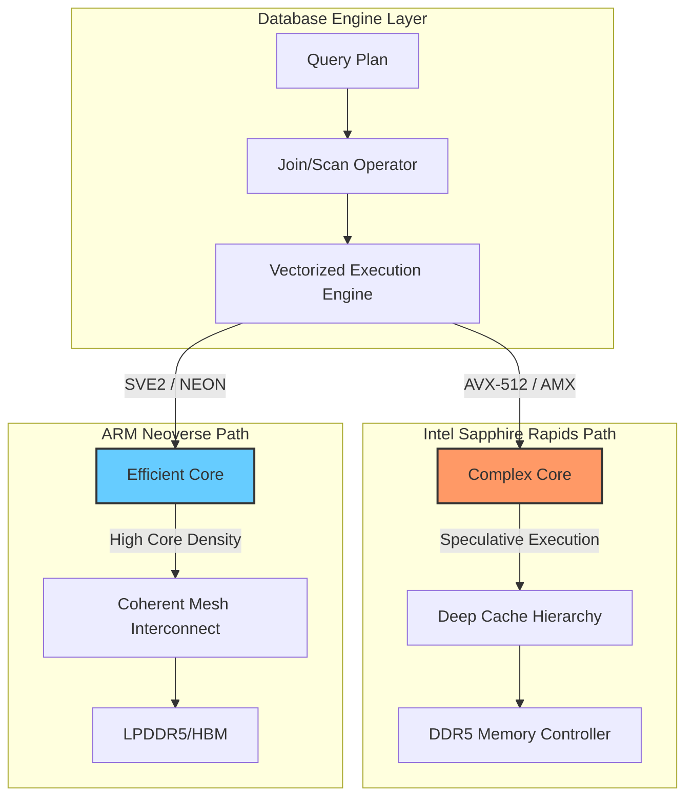

# Can Intel finally beat ARM on performance per Watt?

## Introduction

If you’ve spent any time on Hacker News lately, you’ve likely seen the inevitable showdown: ARM vs. x86. The debate usually centers on raw throughput, but for those of us managing massive database clusters, the metric that actually keeps us up at night isn't peak FLOPS—it's performance per watt.

As cloud providers roll out ARM-based instances like AWS Graviton3 or Ampere Altra, the narrative has become somewhat predictable: "ARM is more efficient, so move your workloads there." But for heavy-duty database engines—the kind running complex joins, massive scans, and high-concurrency transactions—efficiency isn't a simple math problem. It's a battle between architectural philosophies. Can Intel’s latest Sapphire Rapids architecture, with its specialized matrix engines, actually reclaim the crown in a way that translates to lower TCO (Total Cost of Ownership) for a production database?

## Why This Matters

In a modern distributed database, the CPU is often the bottleneck for two very different reasons. In OLTP (Online Transactional Processing), we care about single-thread latency and rapid context switching. In OLAP (Online Analytical Processing), we care about how fast we can feed data through vector units to satisfy a massive scan.

If you migrate a PostgreSQL instance from an Intel Xeon to an ARM instance and see a 20% increase in throughput but a 30% increase in power draw (or a requirement to scale out more nodes to hit the same latency), you haven't actually won. Efficiency at the instruction level is meaningless if the architectural overhead of the database engine negates it. As we move toward massive-scale deployments, the "joules per transaction" metric is becoming the true North Star for site reliability engineers and database architects.

## How It Works

To understand the battle, we have to look at how these two architectures handle data movement and computation. Intel relies on a "heavyweight" approach: complex branch prediction, massive out-of-order execution windows, and specialized accelerators (like AMX). ARM takes a "lean and mean" approach: a massive number of simpler, highly efficient cores that excel at parallel tasks without the massive power "tax" of complex speculative execution.

The following diagram illustrates how a database query engine interacts with these two different architectural philosophies during a heavy scan operation.



## Core Concepts

### Vectorization and SIMD
Both architectures use Single Instruction, Multiple Data (SIMD) to accelerate database operations like predicate evaluation (e.g., `WHERE price > 100`). Intel uses AVX-512, which offers massive widths but can trigger frequency downclocking if used heavily. ARM uses SVE2 (Scalable Vector Extension), which is designed to be more flexible regarding vector length, allowing for more consistent performance across different chip implementations.

### Memory Subsystem and Bandwidth
Databases are notoriously memory-hungry. Intel’s Sapphire Rapids leverages DDR5 and CXL 2.0 to provide massive bandwidth for large-scale analytical workloads. ARM Neoverse designs often focus on a high-bandwidth mesh interconnect, ensuring that as you add more cores, they aren't all fighting for the same narrow path to memory, which is a common bottleneck in high-concurrency OLTP.

### Specialized Accelerators
Intel's "secret weapon" is AMX (Advanced Matrix Extensions). This is a hardware-level accelerator for matrix multiplication. While traditionally for AI, modern columnar databases are increasingly using matrix-like operations for complex aggregations. ARM relies more on high-efficiency integer performance and highly scalable vector instructions to achieve similar goals.

## Examples & Code Walkthrough

To see how this plays out in code, let's look at a simplified implementation of a SIMD-accelerated filter. This is what happens inside the "inner loop" of a database engine when it evaluates a condition on a column of data.

### SIMD-Accelerated Columnar Filter (C++ with AVX-512)

```cpp
#include <immintrin.h>
#include <vector>
#include <iostream>
#include <cstdint>

// A simplified "Scan" operation for a database engine.
// We want to find all values in a column that are greater than a threshold.
// This uses Intel AVX-512 to process 8 double-precision floats at once.

void vectorized_filter_avx512(const double* data, size_t n, double threshold, uint8_t* mask_out) {
    // Broadcast the threshold to all 8 slots in a 512-bit register
    __m512d v_threshold = _mm512_set1_pd(threshold);

    for (size_t i = 0; i < n; i += 8) {
        // Load 8 doubles from memory
        __m512d v_data = _mm512_loadu_pd(&data[i]);

        // Compare: returns a mask where data[i] > threshold
        __mmask8 mask = _mm512_cmp_pd_mask(v_data, v_threshold, _CMP_GT_OS);

        // Store the bitmask (8 bits) into our result array
        // In a real DB, this mask would be used to skip rows in the next operator
        mask_out[i / 8] = mask; 
    }
}

int main() {
    const size_t N = 1024;
    std::vector<double> column(N);
    std::vector<uint8_t> masks(N / 8);

    // Initialize with dummy data
    for (size_t i = 0; i < N; ++i) {
        column[i] = static_cast<double>(i % 100);
    }

    vectorized_filter_avx512(column.data(), N, 50.0, masks.data());

    std::cout << "First mask byte: " << static_cast<int>(masks[0]) << std::endl;
    return 0;
}
```

On an ARM Neoverse core, the logic remains similar, but instead of `_mm512_cmp_pd_mask`, you would use SVE instructions (like `fcmpeq` or `fcmplt` with predicate generation). The ARM version often avoids the "frequency drop" penalty seen on Intel when heavy AVX-512 instructions are executed, which is a key component of Intel's performance-per-watt struggle.

## Best Practices

1.  **Profile the "Instruction Mix":** Before migrating, use `perf` to determine your database's instruction mix. If your workload is heavy on integer math and branchy code (typical OLTP), ARM's efficiency will shine. If it's heavy on floating-point/matrix math (OLAP), Intel's specialized extensions might win.
2.  **Align Data for SIMD:** Regardless of the architecture, ensure your data is memory-aligned. Misaligned loads are a silent killer of performance on both Intel and ARM.
3.  **Use Architecture-Specific Binaries:** Don't just use a generic `x86_64` or `aarch64` build. Use compiler flags like `-march=sapphirerapids` or `-march=armv8.6-a` to allow the compiler to utilize the specific instruction sets (like AMX or SVE2) that provide the efficiency gains.
4.  **Monitor Power via Software:** Don't rely solely on cloud billing. Use Intel RAPL or ARM PMU counters to measure energy consumption at the instruction level during your benchmarks.

## Common Mistakes & Anti-Patterns

*   **The "Lift and Shift" Fallacy:** Assuming that a Docker image compiled for x86 will run "just as well" on ARM via emulation (like QEMU). The translation overhead will destroy any performance-per-watt gains you hoped to achieve.
*   **Ignoring SMT (Simultaneous Multithreading):** Intel relies heavily on Hyper-Threading. ARM cores (like those in Graviton) are often single-threaded per core. If your database relies on high-concurrency via SMT, you need to re-tune your connection pool and thread settings to match the physical core count.
*   **Over-provisioning for Peak, not Average:** In cloud environments, you pay for what you use. ARM's better "idle" efficiency means you can often downsize your instance counts significantly compared to x86, even if the peak performance is slightly lower.

## Performance Considerations

When analyzing these two, you must consider the **Memory Wall**.
*   **Intel:** High single-core performance, but if the workload is memory-bandwidth bound, the CPU cores will sit idle, wasting power while waiting for DDR5.
*   **ARM:** Often provides more consistent memory bandwidth per core due to the mesh interconnect design, making it more predictable for high-concurrency scaling.

In terms of complexity, vectorized execution turns $O(N)$ scalar operations into $O(N/K)$ vector operations, where $K$ is the vector width. The real engineering challenge is ensuring the memory subsystem can keep $K$ elements ready for the CPU in every cycle.

## Real-World Usage

*   **AWS Graviton3:** Used heavily by companies like MongoDB and Datadog to run high-throughput, cost-efficient microservices and database replicas.
*   **Intel Sapphire Rapids:** Leveraged by large enterprise SQL Server and Oracle deployments where high single-threaded performance and specialized matrix acceleration for in-database analytics are critical.
*   **Ampere Altra:** Widely used in high-performance computing (HPC) and cloud-native workloads where predictable, non-overlapping core performance is required to avoid "noisy neighbor" issues.

## Frequently Asked Questions (FAQ)

**Q: Will my PostgreSQL instance run faster on ARM?**
A: It depends. If your workload is heavily dependent on single-threaded performance for complex queries, Intel might be faster. If you are scaling out many small, independent queries, ARM will likely provide better performance per dollar/watt.

**Q: Does Intel's AMX actually help databases?**
A: Yes, for columnar formats (like Parquet or DuckDB-style engines) that can treat aggregation tasks as matrix operations, AMX can provide a massive boost in throughput.

**Q: Is ARM always more power-efficient?**
A: Not necessarily. If an ARM core has to run at maximum frequency for an extended period to keep up with an x86 core that is running at a lower, more efficient frequency, the gap narrows significantly.

## Conclusion

Intel isn't "losing" to ARM; the battlefield has simply shifted. The battle is no longer about who can clock a single core higher, but who can provide the most "work" per joule. For the database engineer, the choice between Intel and ARM is no longer a binary "which is better" question, but a "which architectural profile matches my workload's bottleneck" question. If you're building the next generation of distributed databases, your focus must be on maximizing the utility of the specific vector and matrix extensions of the chosen ISA.
