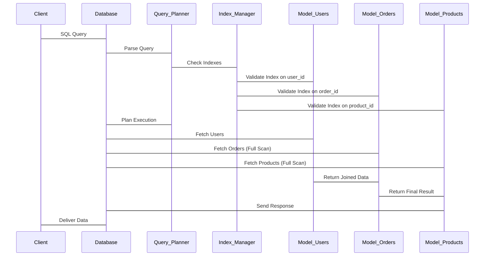

# Degraded performance for multiple models  

## Introduction  
We’ve all seen it—applications that work fine with a single model but start choking when multiple models come into play. Maybe it’s a user profile system coupled with a recommendation engine, or an e-commerce backend handling orders, inventory, and customer data. Suddenly, response times balloon, latency spikes, and the system feels like it’s running on a dial-up connection. This isn’t just a theoretical problem. In production, degraded performance across multiple models can manifest as failed transactions, unhappy users, or even cascading failures in dependent services. Understanding why and how to fix it isn’t optional—it’s critical.  

## Why This Matters  
Software engineers care about this because real-world systems are rarely monolithic. Databases often serve interconnected models, and performance issues in one can ripple through others. For example, a slow query in a user authentication model might delay a payment processing model, causing timeouts for customers. The cost of downtime or slow performance isn’t just technical—it’s financial and reputational. Engineers need tools and patterns to diagnose and resolve these bottlenecks before they escalate. Ignoring them isn’t an option when systems scale.  

## How It Works  
Let’s break down what happens under the hood. Imagine a database serving three models: `users`, `orders`, and `products`. A client requests data that requires joining `users` with `orders` and `products`. The database engine must parse, optimize, and execute this query. But here’s the catch: if the query planner misjudges the data distribution or lacks proper indexes, it might resort to full-table scans or inefficient joins. This cascades into degraded performance.  



In this diagram, the problem often starts with the `Index_Manager`. If indexes for `Model_Orders` or `Model_Products` are missing or fragmented, the query planner defaults to brute-force methods. The result? A query that takes seconds instead of milliseconds.  

## Core Concepts  
Three ideas underpin degraded performance in multi-model scenarios:  
1. **Query Complexity**: Joins, subqueries, or nested models increase computational overhead.  
2. **Indexing Gaps**: Missing or poorly maintained indexes force inefficient data retrieval.  
3. **Lock Contention**: Concurrent writes to multiple models can lock resources, slowing reads.  

For instance, if `Model_Orders` grows rapidly but lacks an index on `user_id`, every order query might scan the entire table. Pair that with a read-heavy `Model_Products` and the database becomes a bottleneck.  

## Examples & Code Walkthrough  
Here’s a Python snippet using SQLAlchemy that illustrates a common pitfall:  

```python
from sqlalchemy.orm import Session

def get_user_orders_with_products(user_id: int, db: Session):
    user = db.query(User).filter(User.id == user_id).first()
    orders = db.query(Order).filter(Order.user_id == user_id).all()
    products = db.query(Product).filter(Product.order_id.in_([order.id for order in orders])).all()
    return {order.id: [p for p in products if p.order_id == order.id] for order in orders}
```  

This code fetches orders and products in separate queries, then combines them in Python. The issue? The `products` query uses a list comprehension to filter by `order_id`, which is inefficient. The database can’t leverage indexes here, leading to a full table scan. A better approach would be a single joined query:  

```sql
SELECT o.id, p.name
FROM orders o
JOIN products p ON o.id = p.order_id
WHERE o.user_id = :user_id
```  

This leverages the database’s ability to optimize joins and indexes.  

## Best Practices  
1. **Index Strategically**: Only index columns used in filters, joins, or ordering. Over-indexing wastes storage and write performance.  
2. **Batch Operations**: Avoid N+1 queries. Fetch related data in batches or use eager loading.  
3. **Monitor Query Plans**: Use tools like `EXPLAIN` to understand how the database executes queries.  
4. **Denormalize When Necessary**: For high-read scenarios, consider duplicating data across models to reduce joins.  

## Common Mistakes & Anti-Patterns  
1. **Ignoring Indexes**: Assuming the database will “figure it out” often leads to full scans.  
2. **Overlooking Locks**: Writing to multiple models concurrently can lock tables, starving reads.  
3. **Assuming Uniform Load**: Some models might be hotter than others. Not accounting for this can misallocate resources.  

## Performance Considerations  
- **Memory**: Joining large models can spike RAM usage.  
- **CPU**: Complex queries with multiple joins or subqueries increase CPU load.  
- **Network**: If models are on separate databases, network latency compounds.  
- **Scalability**: Vertical scaling (more CPU/RAM) might help, but horizontal scaling (sharding) is often better for multi-model systems.  

## Real-World Usage  
A notable example is Amazon’s DynamoDB, which handles multiple models (e.g., products, users) under one service. They optimize by:  
- Using compound indexes for frequent join-like operations.  
- Implementing caching layers (e.g., Redis) for frequently accessed data.  
- Partitioning data by region to minimize cross-region queries.  

## Frequently Asked Questions (FAQ)  
**Q: How do I detect degraded performance in multiple models?**  
A: Use database monitoring tools (e.g., Prometheus, New Relic) to track query latency, index usage, and lock wait times.  

**Q: Should I scale the database vertically or horizontally?**  
A: Horizontal scaling (sharding or read replicas) is often more effective for multi-model systems, as it distributes the load.  

**Q: Can caching help?**  
A: Yes, but be cautious. Caching inconsistent data across models can lead to stale reads. Use time-based or versioned caching.  

**Q: How do I optimize joins between models?**  
A: Ensure indexes exist on join columns and avoid Cartesian products. Test with `EXPLAIN` to confirm the database uses indexes.  

**Q: What if performance degrades after adding a new model?**  
A: Audit existing queries for unintended side effects. The new model might introduce locks or index contention.  

## Conclusion  
Degraded performance in multi-model databases isn’t inevitable. It’s a symptom of poor query design, indexing, or resource allocation. By understanding the interplay between models and proactively optimizing queries, indexes, and resource usage, engineers can build resilient systems. The key is to treat multiple models not as isolated entities but as a cohesive whole—where every change in one model can ripple through others. Stay vigilant, test rigorously, and always profile before deploying.
