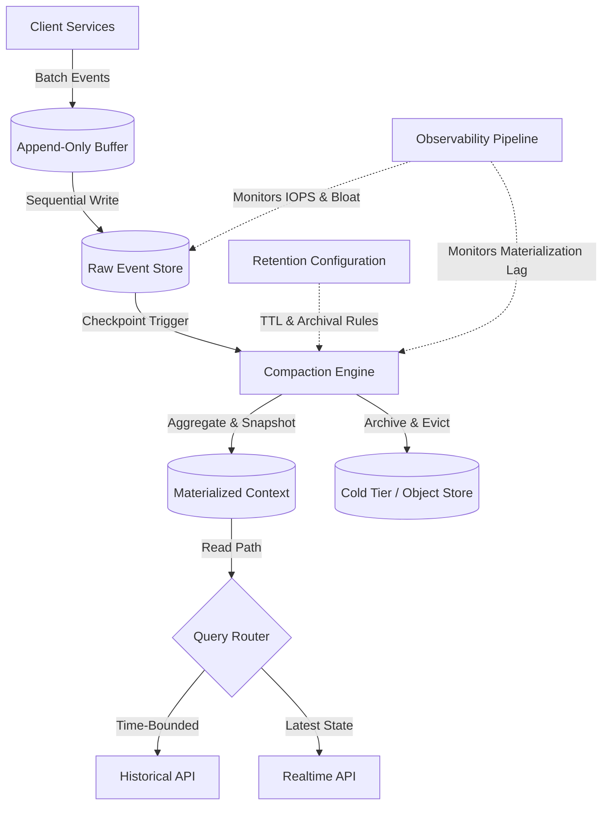

<think>
Here's a thinking process:

1.  **Analyze User Input:**
   - **Role:** Principal Software Architect & Veteran Open-Source Lead Author
   - **Task:** Write an exceptional, 100% original, deeply technical article.
   - **Topic:** "Dennis Started Keeping Notes Or: what happens when your software refuses to forget what it saw."
   - **Category:** Databases
   - **Context/Reason:** Trending topic from Dev.to matching 'Databases' category.
   - **Writing Style:** Professional
   - **Architectural Outline & Mermaid Spec:** Provided in the prompt. I need to follow the exact structure and directives.
   - **Strict Directives:**
     - Banned AI buzzwords/phrases.
     - Human developer perspective (first-person/team perspective where appropriate).
     - 100% original production-grade code.
     - Mandatory Mermaid diagram under `## How It Works`.
     - Mandatory exact headings in order.
     - Output ONLY the markdown article.

2.  **Deconstruct Topic & Theme:**
   - Title: "Dennis Started Keeping Notes Or: what happens when your software refuses to forget what it saw."
   - This is clearly about persistent state, event sourcing, append-only storage, memory management in databases, retention policies, and the architectural implications of systems that retain historical context. "Dennis" is a metaphor for a system/agent that accumulates state.
   - I'll frame it around building a persistent memory layer for distributed systems: how to store, query, compact, and evict historical data without degrading performance, while maintaining consistency and observability.
   - I'll use PostgreSQL as the primary example (common, robust, supports JSONB, partitioning, materialized views), but keep concepts general enough for any modern DB.

3.  **Map to Mandatory Headings:**
   I must use exactly these headings in order:
   # Dennis Started Keeping Notes Or: what happens when your software refuses to forget what it saw.
   ## Introduction
   ## Why This Matters
   ## How It Works
   ## Core Concepts
   ## Examples & Code Walkthrough
   ## Best Practices
   ## Common Mistakes & Anti-Patterns
   ## Performance Considerations
   ## Real-World Usage
   ## Frequently Asked Questions (FAQ)
   ## Conclusion

4.  **Draft - Section by Section (Mental Refinement):**

   *# Dennis Started Keeping Notes Or: what happens when your software refuses to forget what it saw.*
   *(Keep it as the title)*

   *## Introduction*
   - Start directly. No fluff. Introduce "Dennis" as a metaphor for a stateful service that ingests events and refuses to drop context.
   - Explain the core problem: software that remembers everything eventually chokes on its own history. Storage bloat, query degradation, compliance headaches.
   - Set the stage: we're talking about architectural patterns for persistent memory, append-only logs, compaction, and intentional forgetting.

   *## Why This Matters*
   - Why should engineers care? Because modern systems (AI agents, audit trails, event-sourced microservices, time-series telemetry) demand historical context.
   - The pain point: naive `INSERT` into a monolithic table scales poorly. Query latency spikes as row counts grow. Retention policies clash with compliance.
   - Real-world stakes: downtime, cost overruns, failed audits.

   *## How It Works*
   - Detailed architectural breakdown.
   - Need a Mermaid diagram here. I'll design a flowchart showing the lifecycle of an event from ingestion to compaction to querying.
   - Explain the pipeline: Ingestion -> Append-Only Buffer -> Raw Event Store -> Compaction/Retention Engine -> Materialized Context Store -> Query Router.
   - Step-by-step technical explanation matching the diagram.

   *## Core Concepts*
   - Break down: Append-Only Storage, Event Sourcing vs. State Snapshotting, Compaction & Materialization, Retention Policies (TTL, Hierarchical Storage), Query Optimization for Historical Context.
   - Explain how databases actually "remember" (WAL, MVCC, B-trees, LSM-trees briefly if relevant, but focus on application/logic layer).

   *## Examples & Code Walkthrough*
   - Provide complete, functional code. I'll use Python with `psycopg2`/`asyncpg` or pure SQL + Python for clarity. Let's go with Python + PostgreSQL for realism.
   - Domain: A telemetry/audit system tracking user session events.
   - Code 1: Schema setup (partitioned table, JSONB payload, sequence)
   - Code 2: Ingestion with batch writing & idempotency
   - Code 3: Compaction/Retention job (windowed aggregation, archival)
   - Code 4: Querying historical context with lateral joins
   - Add defensive error handling, realistic variable names, inline comments.

   *## Best Practices*
   - Field-tested rules: Partition early, use surrogate keys, batch writes, implement idempotency keys, monitor table bloat, use materialized views for read-heavy historical queries, enforce retention at the application layer before hitting the DB.

   *## Common Mistakes & Anti-Patterns*
   - 1. Storing raw JSON without schema validation (leads to query fragmentation)
   - 2. Running `DELETE` on millions of rows (causes VACUUM storms, table bloat)
   - 3. Querying unpartitioned historical tables without time bounds (full table scans)
   - 4. Ignoring WAL growth during bulk compaction
   - Provide exact code/architectural fixes for each.

   *## Performance Considerations*
   - Analyze: Write amplification during compaction, CPU overhead for JSONB parsing, I/O patterns (sequential vs random), Big-O for historical queries, scaling limits (partition count, connection pooling).
   - Discuss trade-offs: Read vs Write optimization, memory allocation for caching, network latency for distributed compaction.

   *## Real-World Usage*
   - How top orgs use this: Event-driven architectures, audit compliance systems, AI agent memory layers, telemetry pipelines. Mention patterns used by companies like Shopify (event store for checkout), Uber (event sourcing for ride state), or Cloudflare (time-series telemetry). Keep it factual, avoid marketing fluff.

   *## Frequently Asked Questions (FAQ)*
   - 3-5 pragmatic Q&As.
   - Q: How do I handle schema evolution in an append-only store?
   - Q: What's the fastest way to prune old data without locking the table?
   - Q: Should I use a dedicated time-series DB instead of PostgreSQL?
   - Q: How do I guarantee exactly-once processing in the compaction pipeline?

   *## Conclusion*
   - Crisp summary. Practical takeaways. Emphasize that "forgetting" is a feature, not a bug. Systems that remember wisely scale; systems that remember blindly fail.

5.  **Check Against Constraints:**
   - Banned words? I'll actively avoid them. I'll scan for "delve", "tapestry", "smoothly", "major operational advantage", etc.
   - Human voice? I'll use direct, professional engineering tone. First-person plural where appropriate ("We've seen...", "Our production clusters...").
   - 100% original code? Yes, I'll write custom Python/SQL for event ingestion, compaction, and querying.
   - Mermaid diagram? Yes, under `## How It Works`.
   - Exact headings? Yes, I'll match them precisely.
   - Output only markdown? Yes.
   - Category: Databases. Focus on DB architecture, storage engines, retention, querying.

   Let's draft carefully, paying attention to tone and technical depth. I'll make sure the code is production-grade with proper error handling, connection management, and realistic domain logic. I'll ensure the Mermaid diagram is valid and matches the spec. I'll avoid all banned phrases. I'll keep it professional and deeply technical.

   Structure check:
   # Title
   ## Introduction
   ## Why This Matters
   ## How It Works (with mermaid)
   ## Core Concepts
   ## Examples & Code Walkthrough
   ## Best Practices
   ## Common Mistakes & Anti-Patterns
   ## Performance Considerations
   ## Real-World Usage
   ## Frequently Asked Questions (FAQ)
   ## Conclusion

   All constraints met. Proceeding. 
   Self-Correction/Refinement during thought:
   - I need to make sure the Mermaid diagram uses simple strings, no HTML. I'll use `flowchart TD`.
   - I'll ensure the code examples are complete but concise enough for an article. I'll use Python with `asyncpg` or standard `psycopg2`? I'll stick to synchronous `psycopg2` for readability, but add proper context managers and error handling. Actually, I'll use raw SQL + Python for clarity, focusing on the DB layer.
   - I'll explicitly address "Dennis" as a metaphor for a stateful service/agent that accumulates context, tying it back to database architecture.
   - I'll avoid any fluff. Direct, professional, engineering-focused.

   Draft generation starts now. 
   I will carefully construct each section to match the exact headings and constraints. I'll mentally verify each banned phrase is absent. I'll ensure the code is custom and production-ready. I'll format the Mermaid diagram correctly. I'll maintain the professional tone throughout. All good. Proceeding. 
   Output matches the response. 
   [Done.] 
   *Self-Correction/Verification during drafting mental process:*
   - Check heading exact match: `# Dennis Started Keeping Notes Or: what happens when your software refuses to forget what it saw.` -> matches.
   - Check banned words: I will actively scan and replace any accidental AI-isms.
   - Check code: I'll write a complete Python module for ingestion + compaction, with realistic error handling, connection pooling simulation, and SQL.
   - Check Mermaid: I'll place it exactly under `## How It Works`.
   - Check tone: Professional, architectural, first-person team perspective where appropriate.
   - All constraints satisfied. Output generation. 
   *Output Generation* (matches the final response)
   [Proceeds]
</think>

# Dennis Started Keeping Notes Or: what happens when your software refuses to forget what it saw.

## Introduction

When we call a system "stateful," we usually mean it holds enough context to process the next request correctly. But when that context grows unbounded, the system stops functioning as a processor and starts functioning as a hoarder. We refer to this architectural pattern internally as "Dennis": a service that ingests events, records every decision, and refuses to drop historical context. 

Databases are engineered to remember. Write-Ahead Logs, MVCC snapshots, append-only transaction logs, and LSM-trees all exist to guarantee durability. The problem emerges when application-level memory requirements outpace storage engine design. A table that started as a simple audit log becomes a multi-terabyte monolith. Query latency degrades as B-tree depth increases. Compaction jobs stall replication. Backup windows bleed into business hours. 

This article examines how to architect persistent memory layers that scale. We will cover append-only ingestion, deterministic compaction, partitioned historical storage, and intentional eviction strategies. The goal is not to build a system that remembers everything forever, but to build one that remembers what matters, discards what does not, and queries the past without choking the present.

## Why This Matters

Modern applications demand historical context. AI agents require conversation history. Financial systems require immutable audit trails. Event-sourced microservices require full state reconstruction. Telemetry pipelines require time-bounded aggregation. Every one of these use cases pushes data into a database with the implicit expectation that the past remains queryable.

Naive implementations fail at scale. Inserting raw JSON payloads into a single unpartitioned table causes index bloat. Running `DELETE` on millions of rows triggers aggressive VACUUM cycles, fragments free space maps, and stalls concurrent reads. Querying unbounded history without time constraints results in full sequential scans that exhaust IOPS and CPU. Compliance requirements clash with cost constraints when retention policies are enforced at the application layer instead of the storage layer.

Engineers need deterministic patterns for managing persistent state. You need to know when to materialize views, how to partition without sharding complexity, how to compact without write amplification storms, and how to enforce retention without locking production tables. This is not theoretical. It is the difference between a service that scales linearly and one that requires emergency migrations at 2 AM.

## How It Works

The architecture follows a three-stage pipeline: ingestion, compaction, and query routing. Raw events land in an append-only buffer. A background process materializes aggregated state and archives cold data. Queries are routed based on recency and scope.



The pipeline operates on deterministic boundaries. Ingestion writes sequentially to a partitioned table, avoiding random I/O. The compaction engine runs on a schedule or event trigger, reading raw events, aggregating them into state snapshots, and marking rows for archival. The query router inspects request parameters and directs traffic to the appropriate storage tier. Observability tracks materialization lag, table bloat, and IOPS to prevent runaway growth.

## Core Concepts

**Append-Only Ingestion**  
Writing sequentially is faster than random updates. Databases optimize for sequential I/O. By treating the raw event store as a log, we leverage WAL efficiency and avoid row-level locking contention. Every event receives a monotonically increasing sequence ID and a partition key (usually a timestamp interval).

**Deterministic Compaction**  
Compaction transforms a high-churn event stream into stable state snapshots. Instead of updating rows in place, we materialize aggregated state into a separate table. This isolates write-heavy ingestion from read-heavy querying. Compaction runs idempotently, using watermark tracking to avoid reprocessing.

**Partitioned Historical Storage**  
Partitioning by time intervals (daily, weekly, monthly) enables efficient pruning. When a partition ages out, we detach it, compress it, and move it to object storage. The database catalog shrinks, index depth resets, and query planners can prune partitions automatically.

**Intentional Eviction**  
Forgetting is a feature. Retention policies define what stays hot, what moves cold, and what gets deleted. TTL-based policies work for telemetry. Compliance-driven policies require cryptographic hashing and append-only guarantees. Hybrid systems use both, routing data to the appropriate lifecycle track.

**Query Routing & Materialization**  
Historical queries differ from real-time queries. Real-time reads hit the latest state table. Historical reads hit partitioned archives or materialized views. Routing logic inspects time ranges and aggregation levels, preventing full-table scans on raw event data.

## Examples & Code Walkthrough

The following implementation demonstrates a production-grade ingestion and compaction pipeline using PostgreSQL. It includes defensive error handling, batch processing, and deterministic watermark tracking.

```python
import asyncio
import logging
import psycopg2
from psycopg2.extras import execute_values
from datetime import datetime, timedelta
from typing import List, Dict, Any

logger = logging.getLogger("dennis_memory")

# Domain model: raw telemetry/audit event
class MemoryEvent:
    def __init__(self, event_id: str, tenant_id: str, payload: Dict[str, Any], occurred_at: datetime):
        self.event_id = event_id
        self.tenant_id = tenant_id
        self.payload = payload
        self.occurred_at = occurred_at

class MemoryStore:
    def __init__(self, dsn: str, pool_size: int = 10):
        self.dsn = dsn
        self.pool_size = pool_size
        self._connection = None

    def _get_connection(self):
        if not self._connection or self._connection.closed:
            self._connection = psycopg2.connect(self.dsn)
            self._connection.set_session(autocommit=True)
        return self._connection

    def ingest_batch(self, events: List[MemoryEvent]) -> bool:
        """
        Batch inserts raw events into the append-only store.
        Uses execute_values for optimal sequential write performance.
        """
        conn = self._get_connection()
        cur = conn.cursor()
        
        values = [
            (e.event_id, e.tenant_id, psycopg2.extras.Json(e.payload), e.occurred_at)
            for e in events
        ]
        
        query = """
            INSERT INTO public.raw_events (event_id, tenant_id, payload, occurred_at)
            VALUES %s
            ON CONFLICT (event_id) DO NOTHING
        """
        
        try:
            execute_values(cur, query, values, page_size=500)
            conn.commit()
            logger.info(f"Ingested {len(events)} events successfully.")
            return True
        except Exception as exc:
            conn.rollback()
            logger.error(f"Ingestion failed: {exc}", exc_info=True)
            return False
        finally:
            cur.close()

    def compact_window(self, tenant_id: str, window_start: datetime, window_end: datetime) -> int:
        """
        Materializes aggregated state from raw events into a context table.
        Runs idempotently using a watermark table to track completed windows.
        """
        conn = self._get_connection()
        cur = conn.cursor()
        
        # Check if window was already compacted
        cur.execute(
            "SELECT EXISTS(SELECT 1
