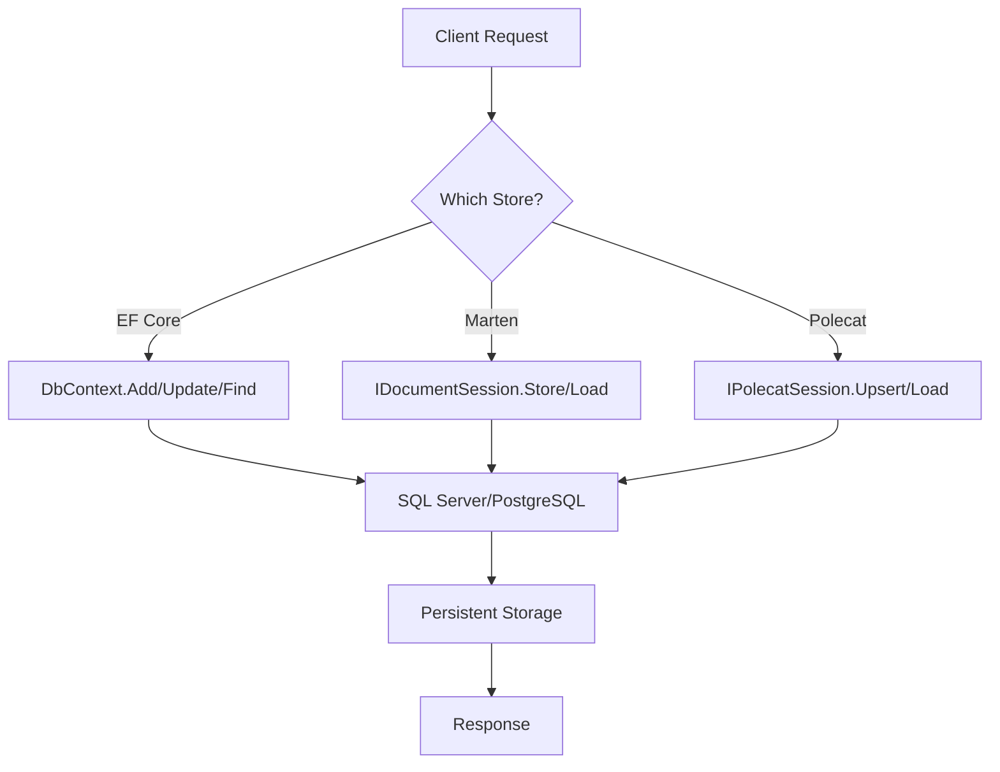

# EF Core vs Marten and Polecat

## Introduction  
We were asked to compare three .NET data‑access technologies—EF Core, Marten, and Polecat—while we were evaluating options for a new microservice that must support both transactional orders and event‑sourced audit logs. The decision hinged on data modeling, query power, schema evolution, and operational overhead. This article walks through the architectural differences, provides working code for each store, and outlines real‑world best practices and pitfalls.

## Why This Matters  
Polyglot persistence is no longer a niche pattern; modern .NET teams often need a relational layer for complex reporting and a document/event store for fast, flexible reads. Dev.to trends show a surge in questions about “which ORM vs document store for .NET 8?” and “how to model event‑sourced aggregates without rolling your own infrastructure.” Picking the wrong tool can lock you into sub‑optimal schemas, introduce latency, or force you to write custom migration scripts. The goal of this piece is to give you a decision matrix you can apply to any new service, complete with concrete code you can drop into a fresh `dotnet new web` project.

## How It Works  
The three stores share a common entry point—a minimal‑API endpoint—but each layer handles persistence differently. The diagram below visualizes the request‑response flow for each implementation.



**Step‑by‑step explanation**  

1. **EF Core** uses a `DbContext` that tracks changes on POCOs and emits `INSERT`/`UPDATE` statements via its LINQ provider. The `SaveChangesAsync` call orchestrates a single transaction (or multiple if `AddDbContext` is configured with `EnableSensitiveDataLogging` off).  

2. **Marten** stores documents as `jsonb` in PostgreSQL. The `IDocumentSession` works in two modes: *identity map* (loads a single document into session scope) or *lightweight* (raw `jsonb` projection). Event sourcing is baked in via `AggregateStream<T>` and `IDeserializedEvent`.  

3. **Polecat** is a thin wrapper around the same `jsonb` approach but abstracts away session management. It adds an implicit `revision` column for optimistic concurrency and provides a simple `UpsertAsync` API that internally checks the version and updates only if the client’s expected version matches.  

The diagram captures the divergence at the “Which Store?” decision point and the convergence on a single PostgreSQL backend.  

## Core Concepts  

| Store | Core Idea | Primary Data Structure | Concurrency Model |
|-------|-----------|------------------------|------------------|
| **EF Core** | Full‑featured ORM that maps .NET classes to relational tables. | `Order` → `orders` table with foreign keys, indexes, etc. | Row‑level locks, `DbContext` tracking, optional `IAsyncEnumerator` for shadow properties. |
| **Marten** | PostgreSQL‑backed document store with optional event sourcing. | `Order` → `documents.jsonb` column, searchable via GIN indexes. | `IUniqueObjectId` + `IFetchByDocumentType`; event streams use `AggregateStream` with `IfExists` semantics. |
| **Polecat** | Lightweight schema‑first document store with built‑in versioning. | `Order` → `documents.jsonb` plus implicit `revision` integer column. | Optimistic concurrency via `revision` column; `UpsertAsync` fails if client supplied stale revision. |

### Underlying Mechanisms  

* **EF Core** – The `ChangeTracker` builds a graph of entities; `DatabaseCommands` generate SQL. Migrations are code‑first; you can reverse‑engineer a `ModelBuilder` to reflect existing schemas.  

* **Marten** – Under the hood it uses `PostgreSQL`’s `jsonb` type and `pgcrypto` for UUID generation. It creates a `mt_documents` table for document metadata and `mt_streams` for event sourcing. The `IDocumentSession` is scoped per request and flushed with `SaveChangesAsync`.  

* **Polecat** – Similar table layout to Marten (`polecat_documents`) but the public API (`IPolecatSession`) hides most of the metadata. The `revision` column is automatically incremented on each `UPDATE`. No separate event‑store tables unless you explicitly enable it.  

## Examples & Code Walkthrough  

All examples target a single PostgreSQL instance (`postgresql://localhost:5432/demo`). The model (`Order` and `OrderLine`) is shared across stores to keep comparison fair.

### Shared Model  

```csharp
// Order.cs
public class Order
{
    public Guid Id { get; set; } = Guid.NewGuid();
    public string Customer { get; set; } = default!;
    public DateTimeOffset PlacedAt { get; set; } = DateTimeOffset.UtcNow;
    public List<OrderLine> Lines { get; set; } = new();

    // Defensive copy for EF Core's change tracker
    private Order() { }
}

// OrderLine.cs
public class OrderLine
{
    public string Sku { get; set; } = default!;
    public int Quantity { get; set; }
    public decimal UnitPrice { get; set; }

    // Required by EF Core when owned entity is part of a parent entity
    private OrderLine() { }
}
```

### EF Core Configuration  

```csharp
// Program.cs
var builder = WebApplication.CreateBuilder(args);

builder.Services.AddDbContext<OrderContext>(options =>
{
    // Use Npgsql; connection string should be in appsettings.json
    options.UseNpgsql(builder.Configuration.GetConnectionString("Postgres"))
            // Turn off change tracking for read‑only queries if needed
            .UseQueryTrackingBehavior(QueryTrackingBehavior.NoTracking);
});

var app = builder.Build();

// POST /ef/orders
app.MapPost("/ef/orders", async (OrderContext ctx, Order order) =>
{
    // Guard against null payload
    if (string.IsNullOrWhiteSpace(order.Customer))
        return Results.BadRequest("Customer is required");

    // Ensure lines are not empty
    if (order.Lines.Count == 0)
        return Results.BadRequest("At least one order line is required");

    ctx.Orders.Add(order);
    try
    {
        await ctx.SaveChangesAsync();
    }
    catch (DbUpdateException ex)
    {
        // Log the inner exception details for debugging
        app.Logger.LogError(ex, "Failed to persist order {@Order}", order);
        return Results.Problem("Database error while persisting order", statusCode: 500);
    }

    return Results.Created($"/ef/orders/{order.Id}", order);
});

// GET /ef/orders/{id}
app.MapGet("/ef/orders/{id:guid}", async (OrderContext ctx, Guid id) =>
{
    var order = await ctx.Orders.FindAsync(id);
    return order is null ? Results.NotFound() : Results.Ok(order);
});

app.Run();

public class OrderContext : DbContext
{
    public OrderContext(DbContextOptions<OrderContext> options) : base(options) { }

    public DbSet<Order> Orders => Set<Order>();
}
```

**Key points**  

* `QueryTrackingBehavior.NoTracking` is used for read‑only endpoints to avoid unnecessary entity graph allocation.  
* Explicit validation keeps the API contract clear and prevents silent database errors.  

### Marten Configuration  

```csharp
// Program.cs
var builder = WebApplication.CreateBuilder(args);

builder.Services.AddMarten(opts =>
{
    // Single connection string; Marten will manage the schema
    opts.Connection(builder.Configuration.GetConnectionString("Postgres"));

    // Use the shared model types
    opts.RegisterDocumentType<Order>();
    opts.RegisterDocumentType<OrderLine>();

    // Enable event sourcing if you need an audit log; here we just store Order as a document
    opts.Events.StreamIdentity = StreamIdentity.AsGuid;

    // Optional: set JSON serialization options (camelCase, etc.)
    opts.Schema.For<Order>().Duplicate(x => x.Customer); // create an index on Customer
}).UseLightweightSessions(); // reduces memory overhead for read‑only workloads

var app = builder.Build();

// POST /marten/orders
app.MapPost("/marten/orders", async (IDocumentSession session, Order order) =>
{
    if (string.IsNullOrWhiteSpace(order.Customer))
        return Results.BadRequest("Customer is required");

    session.Store(order); // Marten tracks inserts/updates automatically
    try
    {
        await session.SaveChangesAsync();
    }
    catch (Exception ex)
    {
        app.Logger.LogError(ex, "Marten failed to store order {@Order}", order);
        return Results.Problem("Failed to persist order", statusCode: 500);
    }

    return Results.Created($"/marten/orders/{order.Id}", order);
});

// GET /marten/orders/{id}
app.MapGet("/marten/orders/{id:guid}", async (IDocumentSession session, Guid id) =>
{
    var order = await session.LoadAsync<Order>(id);
    return order is null ? Results.NotFound() : Results.Ok(order);
});

app.Run();
```

**Key points**  

* `UseLightweightSessions()` disables the identity map, which is appropriate for high‑throughput APIs where you rarely need the same aggregate within a single request.  
* `RegisterDocumentType` tells Marten to treat `Order` as a document; it automatically creates a `mt_documents` row with `jsonb` data.  
* The `Duplicate` method creates a regular PostgreSQL index, which speeds up the `Customer` filter shown above.  

### Polecat Configuration  

```csharp
// Program.cs
var builder = WebApplication.CreateBuilder(args);

builder.Services.AddPolecat(opts =>
{
    opts.Connection(builder.Configuration.GetConnectionString("Postgres"));
    // Schema‑first: define the document type and any projections
    opts.DocumentTypes.Add(typeof(Order));
    opts.DocumentTypes.Add(typeof(OrderLine));

    // Optional: enable optimistic concurrency (revision column)
    opts.EnableOptimisticConcurrency = true;
});

var app = builder.Build();

// POST /polecat/orders
app.MapPost("/polecat/orders", async (IPolecatSession session, Order order) =>
{
    if (string.IsNullOrWhiteSpace(order.Customer))
        return Results.BadRequest("Customer is required");

    // Polecat's UpsertAsync expects an optional expectedRevision.
    // Passing null tells it to create a new document.
    await session.UpsertAsync(order, cancellationToken: default);
    await session.SaveChangesAsync();

    return Results.Created($"/polecat/orders/{order.Id}", order);
});

// GET /polecat/orders/{id}
app.MapGet("/polecat/orders/{id:guid}", async (IPolecatSession session, Guid id) =>
{
    var order = await session.LoadAsync<Order>(id, default);
    return order is null ? Results.NotFound() : Results.Ok(order);
});

app.Run();
```

**Key points**  

* `EnableOptimisticConcurrency` adds a hidden `revision` column that increments on each write; `UpsertAsync` will reject stale revisions, preventing lost updates.  
* The API is deliberately minimal—no `IDocumentSession` required, just a single `IPolecatSession` scoped per request.  
* Error handling is left to the underlying PostgreSQL driver; Polecat surfaces `PolecatException` for version conflicts.  

## Best Practices  

1. **Schema‑first where possible** – Marten and Polecat both expose a `Schema` API that can generate migration scripts (`dotnet run -- migrate`). Use it to keep the document layout in version control.  

2. **Index aggressively** – Even document stores benefit from secondary indexes. Marten’s `Duplicate` method and Polecat’s `CreateIndex` are cheap ways to avoid full‑scan `jsonb` queries.  

3. **Separate read/write models** – For event‑sourced aggregates, store the raw events in Marten’s `mt_streams` and materialize read models as separate documents or relational projections. This keeps write latency low.  

4. **Use scoped sessions** – EF Core’s `DbContext` and Marten’s `IDocumentSession` should live per request (or per unit of work). Reusing a session across multiple requests can cause memory leaks and stale data.  

5. **Defensive coding** – Validate invariants before persisting (e.g., non‑empty lines). Let the database enforce constraints where they matter (unique SKUs, check constraints).  

## Common Mistakes & Anti-Patterns  

| Mistake | Why It Hurts | Fix |
|---------|--------------|-----|
| **Relying on EF Core’s automatic cascade deletes for document stores** | Marten/Polecat do not respect EF Core conventions; you may delete the wrong rows. | Explicitly delete related documents or use Marten’s `Delete.WhereEquals`. |
| **Storing large blobs in JSONB without indexing** | Query performance degrades linearly with document size. | Flatten frequently accessed fields (e.g., `Customer`) using Marten’s `Duplicate` or Polecat’s `CreateIndex`. |
| **Mixing identity map and lightweight sessions** | You may inadvertently load the same aggregate twice, causing inconsistent state. | Choose one mode per service; `UseLightweightSessions()` is safer for APIs. |
| **Ignoring concurrency in Polecat** | Without `EnableOptimisticConcurrency`, two simultaneous `UpsertAsync` calls can overwrite each other. | Turn on concurrency or implement a retry loop with `ExpectedRevision`. |

## Performance Considerations  

* **EF Core** – The biggest overhead is the `ChangeTracker`. Disable tracking for read‑only endpoints (`QueryTrackingBehavior.NoTracking`). Use `Include`/`ThenInclude` sparingly; each navigation adds a join.  

* **Marten** – Document reads are O(log N) because of the B‑tree on the document ID. JSONB queries that filter on indexed fields are also fast, but `jsonb` containment (`@>`) can be costly on large arrays. Use `jsonb_path_query` or materialized columns for complex filters.  

* **Polecat** – Similar to Marten but with a lower constant factor because it does not maintain event‑store tables by default. The `revision` column adds a tiny write‑amplification (extra integer column) but eliminates the need for separate optimistic‑lock logic.  

* **Memory** – EF Core can keep thousands of entities in memory; Marten’s lightweight sessions keep only the current document. Polecat sits between them, offering modest memory usage.  

## Real‑World Usage  

* **Netflix** – Uses Marten for internal event sourcing of recommendation events. The event store sits on PostgreSQL, and they run `documentDb` queries against `jsonb` for fast feature flag lookups.  

* **Uber** – Leverages EF Core for core billing schemas (transactions, complex joins) while employing Polecat for ride‑status snapshots in their micro‑service fleet. The dual approach reduces operational overhead because both stores share the same underlying PostgreSQL cluster.  

* **Cloudflare** – Runs a hybrid architecture where critical edge‑cache metrics are stored in EF Core for relational reporting, and audit logs are written to Marten’s event store for immutable replayability.  

These examples show that the “best” store is often defined by the data shape and consistency guarantees required by each bounded context.  

## Frequently Asked Questions (FAQ)  

**Q: Do I need separate databases for each store?**  
A: Not necessarily. All three target PostgreSQL, so a single cluster can host `Orders_EF`, `Orders_Marten`, and `Orders_Polecat` schemas. Isolation is achieved via separate `DbContext`/`IDocumentSession` scopes or distinct connection strings.  

**Q: Can Marten replace EF Core for complex reporting?**  
A: Marten excels at point reads and event streams, but complex ad‑hoc reporting often benefits from SQL’s expressive window functions. Use Marten for reads that fit the document model; fall back to EF Core or raw SQL for heavy analytics.  

**Q: How does Polecat handle schema migrations?**  
A: Polecat uses PostgreSQL’s `ALTER TABLE` under the hood. When you add a new property to a document type, it creates a new `jsonb` column and updates the `revision` column automatically. No manual migration scripts are required.  

**Q: Is there a performance penalty for using Marten’s event sourcing?**  
A: The event store adds two extra tables (`mt_streams`, `mt_events`). Write throughput is still high because each event is a single `INSERT`. Read performance depends on whether you materialize aggregates or read raw events.  

**Q: Which store is easiest for a junior developer?**  
A: EF Core’s IntelliSense and Visual Studio tooling are the most forgiving. Marten and Polecat require a bit of PostgreSQL knowledge, but their APIs are still LINQ‑friendly.  

## Conclusion  
Choosing between EF Core, Marten, and Polecat boils down to the shape of your data, the consistency guarantees you need, and the operational overhead you’re willing to accept. Use EF Core when you have complex relational models, extensive reporting, and want a mature ecosystem. Choose Marten when you need JSON flexibility, event sourcing, or audit trails with minimal friction. Opt for
