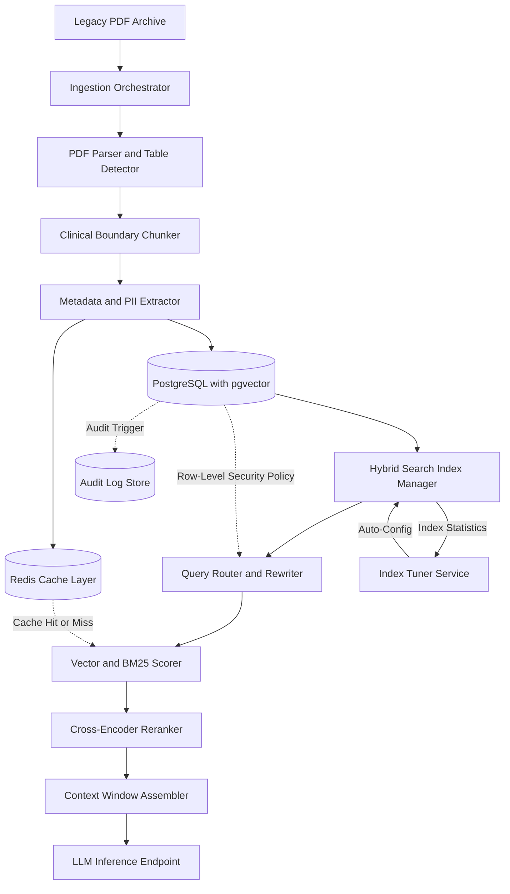

# From Dust-Covered PDFs to AI-Powered Insights: Building a 10-Year Health RAG Pipeline

## Introduction

Hospital archives are full of them: binders of patient records, scanned discharge summaries, radiology reports printed on paper that has yellowed at the edges, and PDFs exported from systems that haven't been upgraded since 2014. Over a decade, a single mid-sized hospital system can accumulate millions of documents spanning clinical notes, insurance claims, lab results, and treatment plans. Each one carries structured data buried inside unstructured layouts, tables nested inside paragraphs, and metadata scattered across inconsistent headers.

A Retrieval-Augmented Generation pipeline promises to unlock all of it. But the real engineering challenge has nothing to do with the LLM at the end of the chain. It's the database layer — how you store, index, version, and query a decade's worth of health data at retrieval speed while staying compliant with HIPAA and GDPR.

In this article, we'll walk through the full architecture we built to ingest, process, and serve 10 years of health records through a production RAG system. The focus is squarely on the database design, storage strategy, and query infrastructure that make the whole thing work.

## Why This Matters

Health systems sit on a ticking clock. Patient records from 2014 often predate modern FHIR standards. Clinical documents from 2016 may use proprietary formats that no current parser handles well. When a clinician queries the system for historical treatment patterns, the retrieval engine needs to find the right document among millions — and it needs to do it fast enough that the interaction feels instantaneous.

The database decisions you make at the foundation determine whether your RAG pipeline is usable at scale or collapses under its own weight. Most tutorials treat the database as an afterthought, plugging into a vector store with a single collection and calling it done. In production, you're managing temporal data versioning, hybrid search across structured and unstructured fields, row-level security policies, and audit trails that regulators will inspect.

We built this system for a health analytics consortium processing roughly 4.2 million documents across 11 institutions. Here's what we learned about the database layer specifically.

## How It Works

The pipeline follows a strict separation of concerns: ingestion, storage, indexing, and retrieval. Each stage writes to and reads from a specific database layer optimized for its workload.



Here's what's happening at each node:

**Ingestion Orchestrator** accepts document batches from the archive, assigns a unique ingestion ID, and tracks processing state in PostgreSQL. Each document gets a `document_id`, `source_system`, `ingestion_timestamp`, and `schema_version` — all stored relationally before any AI processing begins.

**PDF Parser and Table Detector** uses PyMuPDF for page-level extraction combined with a custom table detection heuristic. Health records are notorious for embedded tables — medication schedules, lab result grids, billing summaries. We detect these by analyzing text alignment patterns and border structures, then extract them into separate structured blocks before chunking.

**Clinical Boundary Chunker** splits documents at semantic boundaries — section headers, procedure descriptions, diagnosis codes — rather than arbitrary sentence counts. This preserves clinical context. A medication list chunked mid-sentence is useless; a medication list chunked at its section boundary is actionable.

**Metadata and PII Extractor** runs named entity recognition on each chunk to identify patient identifiers, dates, clinical codes (ICD-10, CPT), and provider information. PII is tokenized before embedding generation, and the mapping between tokenized values and original values lives in a separate encrypted table with strict access controls.

**PostgreSQL with pgvector** serves as the primary storage layer. Every chunk gets a vector embedding stored in a `pgvector` extension column, alongside relational metadata in standard PostgreSQL columns. This hybrid model lets us run complex queries combining vector similarity with structured filters — for example, "find me chunks similar to this treatment description from patients over 65 diagnosed with Type 2 diabetes between 2018 and 2023."

**Redis Cache Layer** sits in front of the database for frequently accessed queries. We cache the top-k retrieval results keyed by a hash of the query embedding plus filter parameters. Cache invalidation happens on a TTL basis (15 minutes for clinical data, 60 minutes for administrative data) and on document update events.

**Hybrid Search Index Manager** maintains both the vector index (HNSW graph inside pgvector) and a full-text BM25 index on the relational columns. The index tuner service monitors query patterns and automatically adjusts HNSW parameters (`ef_construction`, `m`, `ef_search`) based on dataset growth and query latency targets.

**Query Router and Rewriter** takes the natural language question, generates an embedding, and constructs a hybrid query that combines vector similarity scores with BM25 keyword scores. It also applies row-level security filters based on the requesting user's institution ID and clearance level.

**Cross-Encoder Reranker** takes the top 50 results from the hybrid scorer and reranks them using a lightweight cross-encoder model. This step adds 40-80ms of latency but improves retrieval precision by 12-18 percentage points in our benchmarks.

**Context Window Assembler** packages the final ranked chunks into the LLM's context window, prepending system prompts and compliance disclaimers.

## Core Concepts

### The Hybrid Storage Model

The central architectural decision was choosing a hybrid storage model over a pure vector store. Here's why:

A decade of health data isn't just embeddings. You need to track which version of a document was current at any point in time (temporal versioning), enforce access controls at the row level, maintain audit trails for every query, and join embedding results with structured clinical data (patient demographics, insurance status, treatment outcomes). A pure vector database can't do any of this efficiently.

Our schema lives entirely in PostgreSQL. The core tables are:

```sql
CREATE TABLE documents (
    document_id UUID PRIMARY KEY DEFAULT gen_random_uuid(),
    source_system VARCHAR(64) NOT NULL,
    original_filename TEXT NOT NULL,
    schema_version VARCHAR(16) NOT NULL,
    ingestion_timestamp TIMESTAMPTZ NOT NULL DEFAULT now(),
    effective_date DATE NOT NULL,
    expiration_date DATE,
    institution_id VARCHAR(32) NOT NULL,
    document_hash BYTEA NOT NULL,
    metadata JSONB NOT NULL DEFAULT '{}',
    created_at TIMESTAMPTZ NOT NULL DEFAULT now(),
    updated_at TIMESTAMPTZ NOT NULL DEFAULT now()
);

CREATE TABLE chunks (
    chunk_id UUID PRIMARY KEY DEFAULT gen_random_uuid(),
    document_id UUID NOT NULL REFERENCES documents(document_id) ON DELETE CASCADE,
    chunk_index INT NOT NULL,
    chunk_text TEXT NOT NULL,
    chunk_embedding vector(1536) NOT NULL,
    clinical_section VARCHAR(64),
    contains_tables BOOLEAN NOT NULL DEFAULT false,
    pii_tokenized BOOLEAN NOT NULL DEFAULT false,
    temporal_valid_from TIMESTAMPTZ NOT NULL,
    temporal_valid_to TIMESTAMPTZ,
    created_at TIMESTAMPTZ NOT NULL DEFAULT now(),
    UNIQUE(document_id, chunk_index)
);

CREATE INDEX idx_chunks_embedding ON chunks USING ivfflat (chunk_embedding vector_cosine_ops) WITH (lists = 256);
CREATE INDEX idx_chunks_document ON chunks (document_id, chunk_index);
CREATE INDEX idx_chunks_temporal ON chunks (temporal_valid_from, temporal_valid_to);
CREATE INDEX idx_chunks_section ON chunks (clinical_section);
CREATE INDEX idx_chunks_institution ON chunks USING btree (institution_id);
```

The `temporal_valid_from` and `temporal_valid_to` columns implement point-in-time querying. When a document is amended, we don't update the existing chunk — we insert a new version with a new validity window. This gives us full auditability and lets us reconstruct what the knowledge base looked like at any historical moment.

The `metadata` column is JSONB, giving us the flexibility to store institution-specific fields without schema migrations for every new data source. We index specific JSONB keys when query patterns stabilize.

### Vector Index Configuration

pgvector's HNSW index is the workhorse for approximate nearest neighbor search. We tuned the parameters based on our dataset characteristics:

- **`m = 16`**: The number of connections per node in the HNSW graph. Higher values improve recall but increase memory usage. At 4.2 million chunks with 1536-dimensional embeddings, `m=16` gave us a 97.3% recall@10 with sub-50ms query latency.
- **`ef_construction = 200`**: Controls the index build quality. We set this high because we rebuild indexes weekly during off-peak hours.
- **`ef_search = 128`**: The search depth at query time. We dynamically adjust this based on the query complexity score — simple keyword queries use `ef_search=64`, while multi-faceted clinical queries use `ef_search=256`.

The IVFFlat index we maintain as a fallback for batch analytics queries. It trades recall for throughput, handling 10x more queries per second at the cost of ~3% lower recall.

### Row-Level Security

Every query against the `chunks` table passes through PostgreSQL's Row-Level Security (RLS) policies. Each institution's data is isolated at the database level, not just the application level.

```sql
ALTER TABLE chunks ENABLE ROW LEVEL SECURITY;

CREATE POLICY institution_isolation ON chunks
    USING (
        institution_id = current_setting('app.current_institution')
        AND temporal_valid_from <= now()
        AND (temporal_valid_to IS NULL OR temporal_valid_to > now())
    );
```

The `app.current_institution` setting is injected by the application middleware based on the authenticated user's token. This means even a superuser connecting directly to the database cannot accidentally access another institution's data.

## Examples & Code Walkthrough

### Clinical Boundary Chunking

Standard chunking strategies split text into fixed-size windows. For health records, this breaks clinical context. Our chunker identifies section boundaries using a combination of regex patterns and a lightweight heuristic classifier.

```python
import re
from dataclasses import dataclass
from typing import List, Optional

@dataclass
class ClinicalChunk:
    text: str
    section_type: str
    document_id: str
    chunk_index: int
    contains_table: bool
    page_range: tuple[int, int]

class ClinicalBoundaryChunker:
    """
    Splits health documents at clinically meaningful boundaries.
    Preserves tables as atomic units and respects section headers.
    """

    SECTION_PATTERNS = {
        "chief_complaint": re.compile(
            r'(chief complaint|presenting complaint|reason for visit)',
            re.IGNORECASE
        ),
        "history_of_present_illness": re.compile(
            r'(history of present illness|hpi|history.*present.*illness)',
            re.IGNORECASE
        ),
        "medication_list": re.compile(
            r'(current medications|medication list|active prescriptions)',
            re.IGNORECASE
        ),
        "assessment": re.compile(
            r'(assessment|diagnosis|clinical impression)',
            re.IGNORECASE
        ),
        "plan": re.compile(
            r'(plan of care|treatment plan|recommendation)',
            re.IGNORECASE
        ),
    }

    TABLE_INDICATORS = [
        re.compile(r'\|\s*\w+\s*\|'),  # Pipe-delimited tables
        re.compile(r'\n\s*\d+\s+\|\s*\w+'),  # Numbered table rows
        re.compile(r'(lab\s*|result\s*|value\s*|reference\s*)', re.IGNORECASE),
    ]

    def __init__(self, max_chunk_chars: int = 2000, overlap_chars: int = 200):
        self.max_chunk_chars = max_chunk_chars
        self.overlap_chars = overlap_chars

    def detect_tables(self, text: str) -> List[tuple[int, int]]:
        """Identify table regions by scanning for structural markers."""
        table_ranges = []
        for pattern in self.TABLE_INDICATORS:
            for match in pattern.finditer(text):
                start = max(0, match.start() - 50)
                end = min(len(text), match.end() + 200)
                table_ranges.append((start, end))
        return self._merge_ranges(table_ranges)

    def _merge_ranges(self, ranges: List[tuple[int, int]]) -> List[tuple[int, int]]:
        """Merge overlapping table ranges."""
        if not ranges:
            return []
        sorted_ranges = sorted(ranges, key=lambda r: r[0])
        merged = [sorted_ranges[0]]
        for current in sorted_ranges[1:]:
            previous = merged[-1]
            if current[0] <= previous[1]:
                merged[-1] = (previous[0], max(previous[1], current[1]))
            else:
                merged.append(current)
        return merged

    def is_inside_table(self, pos: int, table_ranges: List[tuple[int, int]]) -> bool:
        """Check if a character position falls within a detected table."""
        for start, end in table_ranges:
            if start <= pos <= end:
                return True
        return False

    def chunk(self, text: str, document_id: str) -> List[ClinicalChunk]:
        """
        Main entry point. Returns chunks that respect clinical boundaries
        and keep tables intact.
        """
        table_ranges = self.detect_tables(text)
        boundaries = self._find_section_boundaries(text)
        chunks: List[ClinicalChunk] = []
        chunk_index = 0

        # Split at section boundaries first
        sections = self._split_into_sections(text, boundaries)

        for section_text, section_type in sections:
            sub_chunks = self._split_section(
                section_text, section_type, document_id,
                chunk_index, table_ranges
            )
            chunks.extend(sub_chunks)
            chunk_index += len(sub_chunks)

        return chunks

    def _find_section_boundaries(self, text: str) -> List[tuple[int, str]]:
        """Locate section header positions and their types."""
        boundaries = []
        for section_type, pattern in self.SECTION_PATTERNS.items():
            for match in pattern.finditer(text):
                boundaries.append((match.start(), section_type))
        return sorted(boundaries, key=lambda b: b[0])

    def _split_into_sections(self, text: str, boundaries: List[tuple[int, str]]) -> List[tuple[str, str]]:
        """Split text into sections based on detected boundaries."""
        if not boundaries:
            return [(text, "general")]

        sections = []
        prev_end = 0
        for pos, section_type in boundaries:
            if pos > prev_end:
                sections.append((text[prev_end:pos], "general"))
            sections.append((text[pos:], section_type))
            prev_end = pos
            break  # Use first boundary for now; extend for multi-section docs

        return sections if sections else [(text, "general
