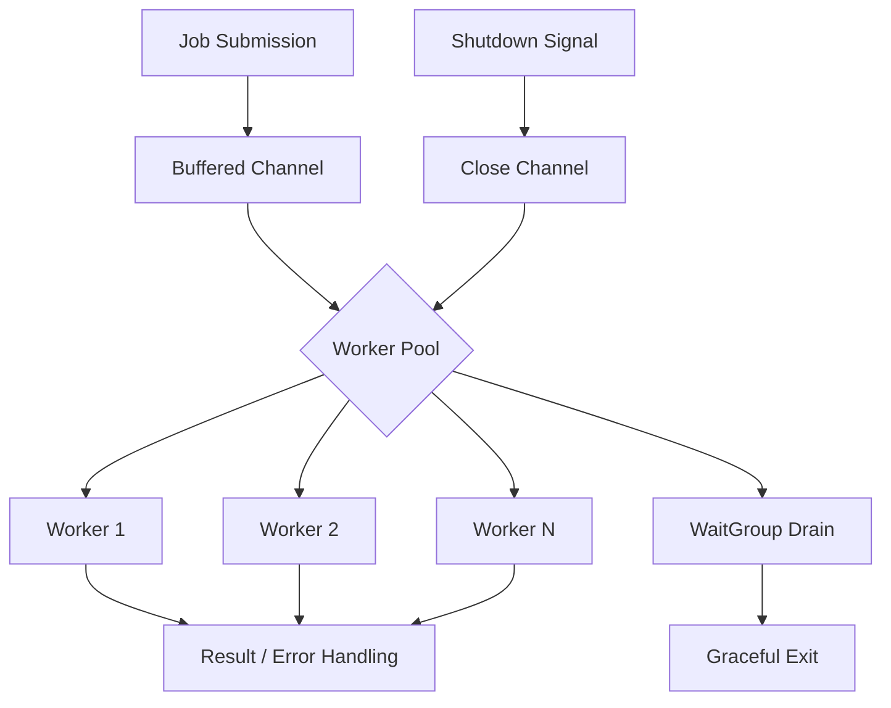

# How to build a job queue in Go without external dependencies

## Introduction

Every time you add a Redis broker, RabbitMQ cluster, or SQS queue to your stack, you're trading operational simplicity for capability. But what if your workload doesn't need distributed durability? What if you just need reliable in-process task scheduling with backpressure, retries, and graceful shutdown?

Go's concurrency primitives — goroutines, channels, and `sync` primitives — are enough to build a production-grade job queue that fits in a single binary. No external process, no network hop, no vendor lock-in. This article walks through the architecture, a complete implementation, and the hard-won lessons from running these patterns in real services.

## Why This Matters

The appeal is straightforward: zero deployment overhead. You eliminate an entire failure domain — the message broker — and its associated monitoring, scaling, and credential rotation. For sidecar-style workers, CLI tools, or internal batch processors, an embedded queue reduces blast radius.

But the real win is observability. When your queue lives inside the process, you get direct access to metrics: queue depth, worker utilization, processing latency histograms — all without exporting to Prometheus via an intermediary. You also avoid the "queue full" scenarios that cascade into backpressure failures across microservices.

That said, this approach has limits. It doesn't survive process restarts, and it doesn't scale horizontally without coordination. Know where the boundaries are before you commit.

## How It Works

The core mechanism is a dispatcher that fans out work to a fixed pool of worker goroutines via a buffered channel. Jobs are submitted through an interface, queued in memory, and processed concurrently. A context gate controls shutdown, and a wait group ensures all in-flight work completes before the process exits.



**Step-by-step flow:**

1. A caller submits a job implementing the `Job` interface.
2. The dispatcher pushes it onto a buffered channel, applying backpressure when full.
3. Worker goroutines pull from the channel, execute the job, and report results via a callback or error channel.
4. On shutdown, the channel is closed, workers finish current tasks, and the `sync.WaitGroup` blocks until all are drained.
5. Errors are surfaced through a configurable handler — logging, metrics, or a dead-letter queue in memory.

## Core Concepts

**Job interface.** Every unit of work implements `Execute(ctx context.Context) error`. This keeps the queue generic and testable.

**Worker pool.** A fixed set of goroutines reading from a shared channel. The pool size is usually bounded by CPU cores or I/O concurrency limits.

**Buffered channel.** Acts as the in-memory queue. Size determines how much backlog you can absorb before callers block.

**Context propagation.** Each job receives a context for cancellation and deadlines. On shutdown, a cancel function signals all workers to abort.

**Error handling strategy.** Jobs can fail silently, retry in-place, or move to a dead-letter slice for later inspection.

**Graceful shutdown.** Closing the channel stops new submissions; `WaitGroup` ensures in-flight jobs finish.

## Examples & Code Walkthrough

Here's a complete, runnable implementation with a realistic domain model: an email delivery worker that handles retries and dead-lettering.

```go
package main

import (
	"context"
	"errors"
	"fmt"
	"sync"
	"time"
)

// Job defines the contract every queued task must satisfy.
type Job interface {
	// ID returns a stable identifier for deduplication and logging.
	ID() string
	// Execute runs the work. Context cancellation signals shutdown.
	Execute(ctx context.Context) error
}

// EmailJob is a concrete domain model: send a transactional email.
type EmailJob struct {
	IDValue    string
	Recipient  string
	Subject    string
	Body       string
	RetryCount int
	MaxRetries int
}

func (e *EmailJob) ID() string { return e.IDValue }

func (e *EmailJob) Execute(ctx context.Context) error {
	// Simulate I/O with context-aware select.
	select {
	case <-time.After(100 * time.Millisecond):
		// Simulate transient failure for demo purposes.
		if e.RetryCount < 1 {
			e.RetryCount++
			return fmt.Errorf("transient send failure for %s", e.Recipient)
		}
		fmt.Printf("sent email to %s\n", e.Recipient)
		return nil
	case <-ctx.Done():
		return ctx.Err()
	}
}

// Queue holds the in-memory job buffer and worker pool.
type Queue struct {
	jobs       chan Job
	workers    int
	wg         sync.WaitGroup
	ctx        context.Context
	cancel     context.CancelFunc
	dlq        []Job // dead-letter queue
	dlqMu      sync.Mutex
	onError    func(Job, error)
	onComplete func(Job)
}

// NewQueue creates a queue with a given buffer size and worker count.
func NewQueue(workers, bufferSize int) *Queue {
	ctx, cancel := context.WithCancel(context.Background())
	return &Queue{
		jobs:    make(chan Job, bufferSize),
		workers: workers,
		ctx:     ctx,
		cancel:  cancel,
		onError: func(_ Job, err error) { fmt.Printf("job error: %v\n", err) },
	}
}

// SetErrorHandler configures custom error handling (e.g., metrics, alerting).
func (q *Queue) SetErrorHandler(fn func(Job, error)) {
	q.onError = fn
}

// SetCompleteHandler configures post-success callbacks.
func (q *Queue) SetCompleteHandler(fn func(Job)) {
	q.onComplete = fn
}

// Start spins up the worker pool.
func (q *Queue) Start() {
	for i := 0; i < q.workers; i++ {
		q.wg.Add(1)
		go q.worker(i)
	}
}

// Submit enqueues a job. Returns error if queue is full or shutting down.
func (q *Queue) Submit(job Job) error {
	select {
	case <-q.ctx.Done():
		return errors.New("queue is shutting down")
	case q.jobs <- job:
		return nil
	}
}

// worker pulls jobs from the channel and executes them with retry logic.
func (q *Queue) worker(id int) {
	defer q.wg.Done()
	for job := range q.jobs {
		err := job.Execute(q.ctx)
		if err != nil {
			q.onError(job, err)
			// Simple retry: re-enqueue if under max retries.
			if emailJob, ok := job.(*EmailJob); ok && emailJob.RetryCount < emailJob.MaxRetries {
				select {
				case q.jobs <- job:
				default:
					q.moveToDLQ(job)
				}
				continue
			}
			q.moveToDLQ(job)
			continue
		}
		if q.onComplete != nil {
			q.onComplete(job)
		}
	}
}

// moveToDLQ appends a failed job to the in-memory dead-letter queue.
func (q *Queue) moveToDLQ(job Job) {
	q.dlqMu.Lock()
	defer q.dlqMu.Unlock()
	q.dlq = append(q.dlq, job)
	fmt.Printf("moved job %s to DLQ\n", job.ID())
}

// Shutdown closes the channel and waits for workers to drain.
func (q *Queue) Shutdown(timeout time.Duration) {
	q.cancel()      // signal workers to stop accepting new work
	close(q.jobs)   // workers exit range loop when channel closes
	done := make(chan struct{})
	go func() {
		q.wg.Wait()
		close(done)
	}()
	select {
	case <-done:
	case <-time.After(timeout):
		fmt.Println("shutdown timed out, force exit")
	}
}

// DLQ returns a snapshot of failed jobs.
func (q *Queue) DLQ() []Job {
	q.dlqMu.Lock()
	defer q.dlqMu.Unlock()
	out := make([]Job, len(q.dlq))
	copy(out, q.dlq)
	return out
}

func main() {
	q := NewQueue(4, 64)
	q.Start()

	// Submit a batch of email jobs.
	for i := 0; i < 10; i++ {
		j := &EmailJob{
			IDValue:    fmt.Sprintf("email-%d", i),
			Recipient:  fmt.Sprintf("user%d@example.com", i),
			Subject:    "Welcome",
			Body:       "Thanks for signing up.",
			MaxRetries: 3,
		}
		if err := q.Submit(j); err != nil {
			fmt.Printf("submit failed: %v\n", err)
		}
	}

	// Allow processing time, then graceful shutdown.
	time.Sleep(2 * time.Second)
	q.Shutdown(5 * time.Second)

	fmt.Printf("DLQ size: %d\n", len(q.DLQ()))
}
```

**Key commentary:**

- `Submit` uses a `select` on context cancellation so callers don't block forever during shutdown.
- The worker retry logic re-enqueues the same job pointer — fine for in-memory queues, but dangerous if jobs hold mutable state. Clone or deep-copy for production.
- `Shutdown` cancels the context, closes the channel, and waits with a timeout. Never force-kill workers mid-transaction.

## Best Practices

1. **Bound your concurrency.** Unbounded goroutines are the fastest way to OOM your process. Match worker count to `GOMAXPROCS` or I/O limits, not job volume.
2. **Apply backpressure early.** A full buffer should block or reject submits — never silently drop. Callers need to know the system is saturated.
3. **Instrument everything.** Emit queue depth, processing latency, error rate, and DLQ size as Prometheus gauges. You can't debug what you can't measure.
4. **Use structured logging per job.** Include `Job.ID()`, worker ID, and attempt count. When a job fails at 3 a.m., you need traceability without a distributed trace system.
5. **Test shutdown under load.** Simulate a SIGTERM while the queue is full. Verify no goroutine leaks with `go test -race` and `runtime.NumGoroutine()` assertions.

## Common Mistakes & Anti-Patterns

**Mistake 1 — Forgetting context cancellation on retries.**
A job that retries on a closed channel will deadlock. Always pass the queue's context into `Execute` and respect `ctx.Done()`.

```go
// Bad: retry ignores context.
for retries < max {
    err := job.Execute(context.Background()) // leaks on shutdown
}

// Good: pass the queue's cancellable context.
err := job.Execute(q.ctx)
```

**Mistake 2 — Closing the channel from the wrong goroutine.**
Only the dispatcher should close `q.jobs`. Workers reading from a closed channel get zero values and exit the `range` loop. Closing from a worker causes a panic.

**Mistake 3 — No dead-letter handling.**
Failed jobs vanish into the void. At minimum, keep an in-memory DLQ slice with a max size to prevent unbounded growth.

**Mistake 4 — Sharing mutable job state across retries.**
If `EmailJob` updates its own fields during execution, re-enqueueing the same pointer corrupts state. Clone the job before retry:

```go
retryJob := *emailJob // shallow copy; deep-copy slices/maps if needed
q.jobs <- &retryJob
```

## Performance Considerations

**Memory.** Each queued job is a pointer on the heap. A buffer of 10,000 jobs holding 1 KB each consumes ~10 MB plus channel overhead. Monitor `runtime.ReadMemStats` in long-running processes.

**CPU.** Channel send/receive involves mutex acquisition under the hood. At high throughput (>100k jobs/sec), contention on the channel can become a bottleneck. Consider sharding into N channels with a round-robin dispatcher.

**Latency.** In-process queues add sub-microsecond scheduling overhead. The dominant cost is job execution, not queuing. Profile with `pprof` to confirm.

**Scalability ceiling.** A single-process queue is bounded by one machine's CPU and memory. For horizontal scale, you need a shared broker — this pattern is not a replacement for distributed queues at scale.

**Big-O.** Enqueue is O(1) amortized. Dequeue is O(1). Retry re-enqueue is O(1). DLQ append is O(1) amortized.

## Real-World Usage

Companies like Cloudflare use embedded queues in their edge workers for batch log shipping — aggregating millions of events in memory before flushing to Kafka. Netflix's internal tooling leverages similar patterns for CI pipeline orchestration, where jobs are lightweight and process-local coordination is faster than network calls.

Uber's early geofence processing used in-process queues to batch location updates before writing to Cassandra, reducing write amplification. The key insight: when the queue is an implementation detail rather than a service dependency, you eliminate an entire class of network-induced tail latency.

## Frequently Asked Questions (FAQ)

**Q: Is this safe for concurrent submissions?**
A: Yes. Go channels are thread-safe. Multiple goroutines can call `Submit` simultaneously without additional locking.

**Q: What happens if a job panics?**
A: The worker goroutine crashes and the job is lost. Wrap `Execute` in a `defer/recover` inside the worker loop and report the panic as an error.

**Q: How do I persist jobs across restarts?**
A: You can't with a pure in-memory queue. Add a write-ahead log (WAL) to disk, or switch to a durable broker. This pattern trades durability for speed.

**Q: Can I dynamically resize the worker pool?**
A: Yes, but you must coordinate with the `WaitGroup`. Spawning new workers increments the counter; draining excess workers requires a separate signal mechanism.

**Q: What's the maximum queue depth?**
A: Limited by available memory. A 1-million-job buffer at 1 KB each is ~1 GB. Set the buffer based on your P99 memory budget, not theoretical max.

## Conclusion

A dependency-free job queue in Go is a powerful tool for specific workloads: internal batch jobs, sidecar processors, and latency-sensitive paths where you can't afford a network hop. It's not a universal replacement for RabbitMQ or SQS, but it eliminates an entire layer of complexity when used correctly.

The key takeaways: bound your workers, handle shutdown gracefully, never lose failed jobs silently, and measure everything. With those disciplines, a 150-line Go package can do the work of a full message broker — for the right use case.

Build it, test it under load, and know exactly where its boundaries are. That's the engineering trade-off that matters.
