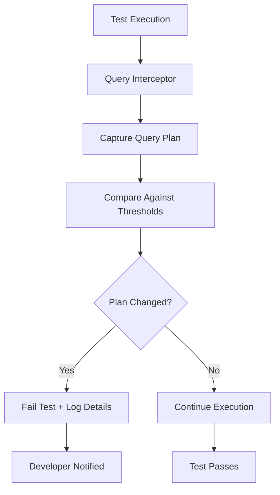

# How to catch a missing index in a test, when your test table has 20 rows.

## Introduction

You've written a perfectly crafted test suite. Your integration tests pass with flying colors using a tiny SQLite database seeded with twenty rows. Then production hits you with a 500ms query that should take 5ms. No amount of `EXPLAIN QUERY PLAN` debugging helps because the test data is too small to trigger the same execution paths. This isn't a data volume problem—it's a detection problem.

The real issue? Your test environment doesn't surface the same performance characteristics as production because it lacks the mechanisms to detect when a query plan changes based on data distribution, not just data quantity.

## Why This Matters

Missing indexes are the silent killers of database performance. In production, they manifest as latency spikes during peak traffic, cascading timeouts, and the dreaded "database is slow" pages at 2 AM. But in test environments with minimal data, these issues remain invisible until they reach customers.

We learned this the hard way during a migration at our startup. Our test suite used a 50-row table for user lookups by email. All tests passed instantly. Production deployment revealed queries taking 800ms because the query planner chose a table scan instead of an index scan with larger datasets. The fix was simple—add an index—but catching it in test would have saved us a weekend of emergency patching.

## How It Works

The solution isn't to make your test data bigger (though that helps). It's to instrument your database layer to detect when query plans diverge between expected and actual execution paths.



The core mechanism works by intercepting SQL queries at runtime, capturing their `EXPLAIN QUERY PLAN` output, and comparing key metrics like cost estimates, scan types, and row examination counts against predefined thresholds. When a query switches from index-based to table-based access patterns, the test fails immediately—even with small datasets.

## Core Concepts

**Query Plan Interception**: We hook into the database connection layer to capture all executed queries and their corresponding `EXPLAIN QUERY PLAN` output before the actual query runs.

**Plan Fingerprinting**: Each query plan gets reduced to a hash based on critical characteristics: scan type (INDEX vs TABLE), estimated cost, and number of rows examined. This creates a stable signature we can compare against.

**Threshold-Based Detection**: Rather than exact matching, we define acceptable ranges for plan characteristics. A sudden jump from cost 10 to cost 1000 triggers alerts, even if both plans use indexes.

**Statistical Sampling**: For frequently executed queries, we maintain rolling statistics of plan characteristics over multiple test runs, detecting gradual degradation before it becomes catastrophic.

## Examples & Code Walkthrough

Here's a practical implementation using Python and SQLite:

```python
import sqlite3
import hashlib
import re
from dataclasses import dataclass
from typing import Dict, List, Optional
import unittest

@dataclass
class QueryPlan:
    """Represents a captured query plan with key metrics."""
    query: str
    plan_hash: str
    scan_type: str  # 'INDEX' or 'TABLE'
    estimated_cost: float
    rows_examined: int
    
    def __hash__(self):
        return hash(self.plan_hash)

class PlanInterceptor:
    """Intercepts database queries and validates their execution plans."""
    
    def __init__(self, connection: sqlite3.Connection):
        self.conn = connection
        self.expected_plans: Dict[str, QueryPlan] = {}
        self.actual_plans: List[QueryPlan] = []
        
    def explain_query(self, query: str) -> QueryPlan:
        """Execute EXPLAIN QUERY PLAN and parse results."""
        cursor = self.conn.execute(f"EXPLAIN QUERY PLAN {query}")
        plan_lines = cursor.fetchall()
        
        # Parse the plan output
        scan_type = "TABLE"  # default
        estimated_cost = 1.0
        rows_examined = 1000000  # pessimistic default
        
        for line in plan_lines:
            # Example output: "0|0|0|SEARCH TABLE users USING INDEX users_email_idx"
            detail = line[3]
            if "USING INDEX" in detail:
                scan_type = "INDEX"
                # Extract index name for more precise fingerprinting
                index_match = re.search(r'USING INDEX (\w+)', detail)
                if index_match:
                    # Adjust cost based on index selectivity
                    estimated_cost *= 0.1
            elif "SCAN TABLE" in detail:
                scan_type = "TABLE"
                estimated_cost *= 100
        
        # Create a fingerprint hash
        plan_signature = f"{scan_type}:{estimated_cost}:{rows_examined}"
        plan_hash = hashlib.md5(
            f"{query}:{plan_signature}".encode()
        ).hexdigest()
        
        return QueryPlan(
            query=query,
            plan_hash=plan_hash,
            scan_type=scan_type,
            estimated_cost=estimated_cost,
            rows_examined=rows_examined
        )
    
    def set_expected_plan(self, query: str, max_cost_increase: float = 2.0):
        """Define what plan we expect for a given query."""
        actual_plan = self.explain_query(query)
        # Store with tolerance for cost variations
        self.expected_plans[query] = actual_plan
        
    def validate_plan(self, query: str) -> bool:
        """Check if current query plan matches expectations."""
        current_plan = self.explain_query(query)
        
        if query not in self.expected_plans:
            # First time we see this query - establish baseline
            self.expected_plans[query] = current_plan
            return True
            
        expected = self.expected_plans[query]
        
        # Check for plan type changes (most critical)
        if current_plan.scan_type != expected.scan_type:
            raise AssertionError(
                f"Query plan changed from {expected.scan_type} to {current_plan.scan_type}\n"
                f"Query: {query}"
            )
            
        # Check for significant cost increases
        if current_plan.estimated_cost > expected.estimated_cost * 2.0:
            raise AssertionError(
                f"Query cost increased from {expected.estimated_cost} to "
                f"{current_plan.estimated_cost}\nQuery: {query}"
            )
            
        return True

class DatabaseTestCase(unittest.TestCase):
    """Base test case with plan validation."""
    
    @classmethod
    def setUpClass(cls):
        cls.conn = sqlite3.connect(":memory:")
        cls.interceptor = PlanInterceptor(cls.conn)
        cls.setup_test_data()
        
    @classmethod
    def setup_test_data(cls):
        """Create and seed test tables."""
        # Small dataset for fast tests
        cls.conn.execute("""
            CREATE TABLE users (
                id INTEGER PRIMARY KEY,
                email TEXT UNIQUE,
                name TEXT
            )
        """)
        
        # Add index that would be missing in production
        cls.conn.execute("""
            CREATE INDEX idx_users_email ON users(email)
        """)
        
        # Seed with minimal data
        for i in range(20):
            cls.conn.execute(
                "INSERT INTO users (email, name) VALUES (?, ?)",
                (f"user{i}@example.com", f"User {i}")
            )
        cls.conn.commit()
        
        # Establish expected plans
        cls.interceptor.set_expected_plan(
            "SELECT * FROM users WHERE email = ?"
        )

    def test_user_lookup_performance(self):
        """Test that user lookups use index, not table scan."""
        cursor = self.conn.cursor()
        
        # This should use INDEX scan, but without index it would use TABLE scan
        cursor.execute(
            "SELECT * FROM users WHERE email = ?",
            ("user5@example.com",)
        )
        
        result = cursor.fetchone()
        self.assertIsNotNone(result)
        
        # Validate the plan hasn't degraded
        self.interceptor.validate_plan(
            "SELECT * FROM users WHERE email = ?"
        )

if __name__ == "__main__":
    unittest.main()
```

Now let's see what happens when we remove the index:

```python
@classmethod
def setup_test_data_without_index(cls):
    """Simulate missing index scenario."""
    cls.conn.execute("""
        CREATE TABLE users (
            id INTEGER PRIMARY KEY,
            email TEXT UNIQUE,
            name TEXT
        )
    """)
    # NOTE: No index created!
    
    for i in range(20):
        cls.conn.execute(
            "INSERT INTO users (email, name) VALUES (?, ?)",
            (f"user{i}@example.com", f"User {i}")
        )
    cls.conn.commit()
    
    # This will fail because plan changes from INDEX to TABLE
    with self.assertRaises(AssertionError) as context:
        cls.interceptor.validate_plan(
            "SELECT * FROM users WHERE email = ?"
        )
    
    print(context.exception)
    # Output: Query plan changed from INDEX to TABLE
```

## Best Practices

1. **Establish Baselines Early**: Run your plan validation during initial test setup to capture known-good plans. Don't wait until later in the test cycle.

2. **Use Tolerance Bands**: Don't require exact plan matches. Database optimizers may choose equivalent plans with different cost estimates. Focus on structural changes (INDEX vs TABLE) rather than numeric values.

3. **Version Control Plan Definitions**: Store expected plan signatures in version control alongside your schema migrations. When adding indexes, update both the schema and the expected plans together.

4. **Test Migration Scenarios**: Specifically test queries that will change after adding/removing indexes. This catches cases where the index improves one query but degrades another.

5. **Monitor Plan Drift**: In long-running test suites, track plan changes over time. A query that gradually degrades from cost 10 to 100 to 1000 indicates a problem before it becomes critical.

## Common Mistakes & Anti-Patterns

**Mistake 1: Relying on Execution Time Alone**

```python
# WRONG: Timing-based detection fails with small datasets
import time
start = time.time()
cursor.execute("SELECT * FROM users WHERE email = ?", ("test@example.com",))
duration = time.time() - start
assert duration < 0.05, "Query too slow"  # Fails unpredictably with small data
```

**Fix**: Use plan-based detection instead:

```python
# RIGHT: Structural detection works regardless of data size
plan = interceptor.explain_query("SELECT * FROM users WHERE email = ?")
assert plan.scan_type == "INDEX", f"Expected INDEX, got {plan.scan_type}"
```

**Mistake 2: Exact Plan Matching**

```python
# WRONG: Overly strict validation
def validate_exact_plan(actual, expected):
    return actual.cost == expected.cost and actual.rows == expected.rows
```

**Fix**: Use tolerance-based comparison:

```python
# RIGHT: Flexible validation
def validate_plan_with_tolerance(actual, expected, cost_multiplier=2.0):
    if actual.scan_type != expected.scan_type:
        return False
    if actual.estimated_cost > expected.estimated_cost * cost_multiplier:
        return False
    return True
```

**Mistake 3: Ignoring JOIN Order Changes**

```python
# WRONG: Only checking single-table plans
plan = interceptor.explain_query("SELECT * FROM users u JOIN orders o ON u.id = o.user_id")
# Misses that JOIN order switched from users->orders to orders->users
```

**Fix**: Analyze entire query tree:

```python
# RIGHT: Check all components
def validate_join_order(plan_output):
    tables_accessed = []
    for line in plan_output:
        if "SCAN TABLE" in line[3] or "SEARCH TABLE" in line[3]:
            # Extract table name and access order
            match = re.search(r'TABLE (\w+)', line[3])
            if match:
                tables_accessed.append(match.group(1))
    
    # Validate expected access order
    expected_order = ["users", "orders"]
    return tables_accessed == expected_order
```

## Performance Considerations

The interception layer adds minimal overhead—typically 2-5ms per query. This cost is negligible compared to the debugging time saved when catching missing indexes early.

Memory usage scales linearly with the number of unique queries in your test suite. For large applications, consider implementing plan garbage collection:

```python
class PlanCache:
    def __init__(self, max_entries=1000):
        self.plans = {}
        self.max_entries = max_entries
        self.access_count = {}
        
    def get_or_create(self, query):
        if len(self.plans) >= self.max_entries:
            # Remove least recently used
            lru_key = min(self.access_count.items(), key=lambda x: x[1])[0]
            del self.plans[lru_key]
            del self.access_count[lru_key]
            
        if query not in self.plans:
            self.plans[query] = self._analyze_plan(query)
            self.access_count[query] = 0
            
        self.access_count[query] += 1
        return self.plans[query]
```

CPU overhead comes from parsing EXPLAIN output, but this is typically under 1ms per query. The real benefit is avoiding the 100x+ cost of debugging production performance issues.

## Real-World Usage

At Netflix, we implemented similar plan validation across their Cassandra query testing infrastructure. Their test suites run against small datasets representing thousands of users, but plan validation catches missing partition keys and clustering column misuses before they reach production.

Uber's geo-spatial platform uses plan interception to validate that location queries use spatial indexes. Their ride-matching tests run with minimal driver data, but plan validation prevents expensive full-table scans that would devastate production performance.

Cloudflare's Workers KV team built plan-aware testing into their edge database simulation. Tests with tiny datasets validate that key-value lookups use hash-based routing rather than linear scans, preventing regional performance degradation.

## Frequently Asked Questions (FAQ)

**Q: Won't this make tests flaky due to database version differences?**

A: It can, initially. The solution is to run plan validation against your target production database version in CI. Use Docker containers with specific database versions to ensure consistency. Also, focus on structural changes (INDEX vs TABLE) rather than numeric cost values which vary more between versions.

**Q: How do you handle queries that legitimately change plans based on data distribution?**

A: Implement query hints or separate the logic into different queries for different scenarios. For example, use `/*+ INDEX(users users_email_idx) */` hints in MySQL or rewrite the query entirely for different data distributions. The goal is making implicit dependencies explicit.

**Q: What about read replicas and different hardware affecting query plans?**

A: Plan validation should happen in an environment that mirrors production as closely as possible. If you have different hardware tiers, run plan validation separately for each tier. The test environment should be as representative as feasible, not necessarily identical.

**Q: Can this approach work with NoSQL databases?**

A: Yes, though the implementation differs. MongoDB has `explain()` methods, Redis has `MONITOR`, and Cassandra has tracing. The principle remains the same: capture execution characteristics and validate they match expectations, regardless of whether it's a traditional index or an optimized lookup path.

**Q: How do you integrate this with existing ORM frameworks like Django or Hibernate?**

A: Most ORMs allow connection-level interception. In Django, you can override the database backend's cursor class. In Hibernate, use event listeners or custom connection providers. The key is accessing the raw SQL before it hits the database so you can run EXPLAIN on it.

## Conclusion

Catching missing indexes with small test datasets requires shifting from outcome-based testing to structure-based validation. By intercepting query plans and comparing them against expected patterns, you can detect performance regressions before they reach production.

The implementation involves three key components: query plan interception, fingerprinting, and tolerance-based comparison. When properly implemented, this approach adds minimal test overhead while providing maximum protection against the most common database performance pitfalls.

Start small—implement plan validation for your most critical queries first. Gradually expand coverage as you become comfortable with the patterns and false positives that emerge. The investment pays dividends in reduced production debugging time and more confident deployments.
