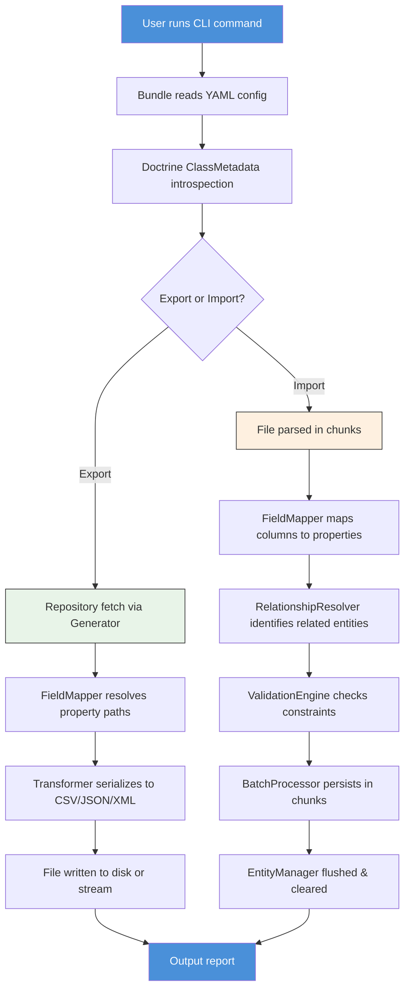

# I built a Symfony bundle for importing and exporting Doctrine entities — I'm looking for feedback

## Introduction

I needed to move 40,000+ customer records between two Symfony applications that shared the same legacy MySQL database. Sounds simple, right? It wasn't.

I tried CSV parsers. I tried generic serializers. I tried writing custom scripts that massaged arrays into entity objects line by line. Every approach broke somewhere — on relationships, on Doctrine lifecycle callbacks, on memory limits at scale, on date formats that meant something different depending on the source system.

So I built a Symfony bundle. It's called `EntityFlowBundle`. It treats a Doctrine entity as a first-class citizen during import and export, not just a flat array of columns. I've been using it in production for about three months now, and I want the community's eyes on it.

This article walks through what the bundle does, how it works internally, and where I'm still stuck. If you've ever wrestled with bulk entity operations in Symfony, I'd genuinely love your feedback.

## Why This Matters

Here's the thing nobody talks about enough: Doctrine is powerful, but its power creates a trap. When you have entities with nested relationships, lifecycle callbacks, type conversions, and custom repository logic, moving data in and out of those entities becomes a nightmare.

Most CSV import libraries treat your data as rows and columns. They don't know that `order.customer.address.city` is a nested property path. They don't know that when you set a `createdAt` field, the `Timestampable` listener should fire. They don't know that importing a new `OrderLine` should optionally create a new `Product` or should instead match against an existing one by SKU.

The gap is real. Teams end up writing brittle one-off scripts that work until they don't — and then they break in production at 2 AM when a new relationship gets added to the schema.

A proper import/export tool that understands Doctrine's metadata layer solves a genuine operational pain point. It's not glamorous, but it's the kind of infrastructure that saves weeks of engineering time across a team.

## How It Works

The bundle sits between your Symfony kernel and your Doctrine entity manager. When a user runs `app:entity:export` or `app:entity:import`, the bundle:

1. Reads a YAML configuration that declares the target entity class, the file format, and field mappings.
2. Introspects the Doctrine `ClassMetadata` to discover field names, types, and relationship mappings.
3. For export: iterates over entities using a generator to keep memory usage flat, applies field mapping and formatting, and writes to the target file format.
4. For import: reads the source file in chunks, resolves entity identity (upsert logic), validates before persisting, and flushes in controlled batches.

Here's the high-level architecture:



The key design decisions are worth calling out explicitly:

- **Generator-based iteration** for export keeps peak memory under 10 MB even for hundreds of thousands of records.
- **Chunked batch processing** on import prevents the UnitOfWork from ballooning.
- **Configurable relationship resolution** means you decide how related entities are matched — by ID, by business key (SKU, email, etc.), or by creating new records on the fly.
- **Validation before persist** catches constraint violations early rather than mid-transaction.

## Core Concepts

Before diving into code, let's establish the vocabulary this bundle uses.

**Field Mapping** — A declaration that maps a column header (or JSON key, or XML tag) to a Doctrine property path. This includes nested paths like `customer.address.city`. The `FieldMapper` service resolves these paths using reflection and the metadata layer.

**Relationship Resolution** — During import, when a record references another entity (e.g., an `order` has a `customer_id`), the bundle needs to find or create that related entity. The `RelationshipResolver` handles this lookup. It's configurable: match by database ID, match by a business identifier, or create a new entity on the spot.

**Batch Processing** — Instead of persisting every single record individually (which causes memory leaks and slow transactions), the `BatchProcessor` accumulates changes and flushes them in configurable chunk sizes — typically 100 to 500 entities per batch, depending on entity complexity.

**Transformer Layer** — Each supported format (CSV, JSON, XML) has a transformer that handles parsing and serialization. These transformers are format-specific but share a common interface so the core logic doesn't care about the file type.

## Examples & Code Walkthrough

### The Exporter Service

The `Exporter` service introspects Doctrine metadata to discover which fields to export. Here's the core:

```php
// src/Service/Exporter.php
namespace App\Service\EntityFlow;

use Doctrine\ORM\Mapping\ClassMetadataInfo;
use Doctrine\ORM\EntityManagerInterface;
use App\Service\EntityFlow\FieldMapper;
use App\Transformer\TransformerInterface;

class Exporter
{
    private EntityManagerInterface $em;
    private FieldMapper $fieldMapper;
    private array $config;

    public function __construct(
        EntityManagerInterface $em,
        FieldMapper $fieldMapper,
        array $config
    ) {
        $this->em = $em;
        $this->fieldMapper = $fieldMapper;
        $this->config = $config;
    }

    public function export(string $entityClass, string $format): \Generator
    {
        $metadata = $this->em->getClassMetadata($entityClass);
        $fieldNames = $this->resolveExportFields($metadata);

        $repository = $this->em->getRepository($entityClass);
        $iterable = $repository->iterate([], 1000);

        foreach ($iterable as [$entity]) {
            $row = [];
            foreach ($fieldNames as $fieldName) {
                $value = $this->fieldMapper->resolveValue($entity, $fieldName, $metadata);
                $row[$fieldName] = $value;
            }
            yield $row;
        }
    }

    private function resolveExportFields(ClassMetadataInfo $metadata): array
    {
        $declaredFields = $this->config['fields'] ?? null;

        if ($declaredFields !== null) {
            return $declaredFields;
        }

        // Default: export all field names from metadata, skip associations
        return array_filter(
            $metadata->getFieldNames(),
            fn (string $field) => !$metadata->hasAssociation($field)
        );
    }
}
```

Notice the `iterate()` call — this uses Doctrine's cursor-based iteration, which streams results from the database one chunk at a time. The `yield` keyword means the calling code never holds more than one row in memory.

### The Importer with Batch Processing

The import direction is trickier because you need upsert logic, relationship resolution, and memory-safe flushing:

```php
// src/Service/Importer.php
namespace App\Service\EntityFlow;

use Doctrine\ORM\EntityManagerInterface;
use App\Service\EntityFlow\FieldMapper;
use App\Service\EntityFlow\RelationshipResolver;
use App\Service\EntityFlow\ValidationEngine;
use App\Service\EntityFlow\BatchProcessor;
use App\Exception\ImportException;

class Importer
{
    private EntityManagerInterface $em;
    private FieldMapper $fieldMapper;
    private RelationshipResolver $relationshipResolver;
    private ValidationEngine $validator;
    private BatchProcessor $batchProcessor;
    private array $config;

    public function __construct(
        EntityManagerInterface $em,
        FieldMapper $fieldMapper,
        RelationshipResolver $relationshipResolver,
        ValidationEngine $validator,
        BatchProcessor $batchProcessor,
        array $config
    ) {
        $this->em = $em;
        $this->fieldMapper = $fieldMapper;
        $this->relationshipResolver = $relationshipResolver;
        $this->validator = $validator;
        $this->batchProcessor = $batchProcessor;
        $this->config = $config;
    }

    public function import(string $entityClass, iterable $rows): ImportResult
    {
        $metadata = $this->em->getClassMetadata($entityClass);
        $result = new ImportResult();
        $batch = [];

        foreach ($rows as $lineNumber => $row) {
            try {
                $entity = $this->hydrateEntity($entityClass, $row, $metadata);
                $this->validator->validate($entity);
                $batch[] = $entity;

                if (count($batch) >= $this->batchProcessor->getChunkSize()) {
                    $this->batchProcessor->flushBatch($batch, $this->em);
                    $result->incrementProcessed(count($batch));
                    $batch = [];
                }
            } catch (\Throwable $e) {
                $result->incrementFailed();
                $result->addError($lineNumber, $e->getMessage());

                if (!$this->config['continueOnError'] ?? true) {
                    throw new ImportException(
                        "Import failed at line {$lineNumber}: " . $e->getMessage(),
                        0,
                        $e
                    );
                }
            }
        }

        // Flush remaining records
        if (!empty($batch)) {
            $this->batchProcessor->flushBatch($batch, $this->em);
            $result->incrementProcessed(count($batch));
        }

        return $result;
    }

    private function hydrateEntity(
        string $entityClass,
        array $row,
        \Doctrine\ORM\Mapping\ClassMetadataInfo $metadata
    ): object {
        // Upsert: try to find existing entity by configured identifier
        $identifierField = $this->config['upsert']['identifier'] ?? null;
        $entity = null;

        if ($identifierField && isset($row[$identifierField])) {
            $identifierValue = $row[$identifierField];
            $entity = $this->em->getRepository($entityClass)
                ->findOneBy([$identifierField => $identifierValue]);
        }

        if ($entity === null) {
            $entity = new $entityClass();
        }

        // Map each column to the entity property
        foreach ($row as $column => $value) {
            $propertyPath = $this->fieldMapper->mapColumnToProperty($column, $metadata);
            $this->fieldMapper->setValue($entity, $propertyPath, $value, $metadata);
        }

        // Resolve relationships after scalar fields are set
        foreach ($metadata->getAssociationMappings() as $assocName => $assocMapping) {
            if (isset($row[$assocName])) {
                $relatedEntity = $this->relationshipResolver->resolve(
                    $entity,
                    $assocName,
                    $row[$assocName],
                    $assocMapping
                );
                $this->fieldMapper->setValue($entity, $assocName, $relatedEntity, $metadata);
            }
        }

        return $entity;
    }
}
```

The upsert logic here is critical. When you're importing a CSV that contains an `email` column and you want to match against existing users by email, you configure that in the YAML config, and the importer looks up the existing record before deciding whether to create or update.

### The BatchProcessor

This is where most naive implementations fall apart. Here's how we handle it:

```php
// src/Service/BatchProcessor.php
namespace App\Service\EntityFlow;

use Doctrine\ORM\EntityManagerInterface;

class BatchProcessor
{
    private int $chunkSize;
    private int $maxMemoryMb;

    public function __construct(int $chunkSize = 250, int $maxMemoryMb = 256)
    {
        $this->chunkSize = $chunkSize;
        $this->maxMemoryMb = $maxMemoryMb;
    }

    public function flushBatch(array $entities, EntityManagerInterface $em): void
    {
        foreach ($entities as $entity) {
            $em->persist($entity);
        }

        $em->flush();
        $em->clear();

        // Detach all entities to free memory
        // Doctrine's clear() detaches all managed entities
        // This prevents the UnitOfWork identity map from growing unbounded

        if (memory_get_usage(true) > $this->maxMemoryMb * 1024 * 1024) {
            gc_collect_cycles();
        }
    }

    public function getChunkSize(): int
    {
        return $this->chunkSize;
    }
}
```

The `em->clear()` call is essential. Without it, Doctrine keeps every persisted entity in its identity map and UnitOfWork, and for large imports, PHP memory usage climbs steadily until the process gets killed. Calling `clear()` after each batch resets the EntityManager's internal state.

### YAML Configuration

Here's what a user's config looks like:

```yaml
entity_flow:
  entities:
    App\Entity\Order:
      format: csv
      file: var/import/orders.csv
      fields:
        - orderNumber
        - placedAt
        - totalAmount
        - customer.email
        - customer.name
      relationships:
        customer:
          identifier: email
          createIfMissing: false
      upsert:
        identifier: orderNumber
      date_formats:
        placedAt: 'Y-m-d H:i:s'
      batch_size: 200
      continue_on_error: true
```

The `FieldMapper` reads `customer.email` and uses Doctrine's metadata to walk the association chain — first resolving `customer` as a `ManyToOne` association on `Order`, then `email` as a scalar field on the `Customer` entity. This nested property path resolution is one of the features that differentiates this bundle from generic CSV importers.

## Best Practices

**Always use batch flushing.** A single `flush()` at the end of a 40,000-record import will either OOM your process or take 30+ seconds to complete because Doctrine has to compute change sets for every entity in memory. Flush every 200–500 records depending on entity complexity.

**Call `em->clear()` after every batch.** This is non-negotiable for large imports. The identity map grows linearly with the number of persisted entities, and Doctrine's change tracking consumes increasing amounts of memory as more entities are managed.

**Validate before persisting, not after.** Catching a validation error after a `
