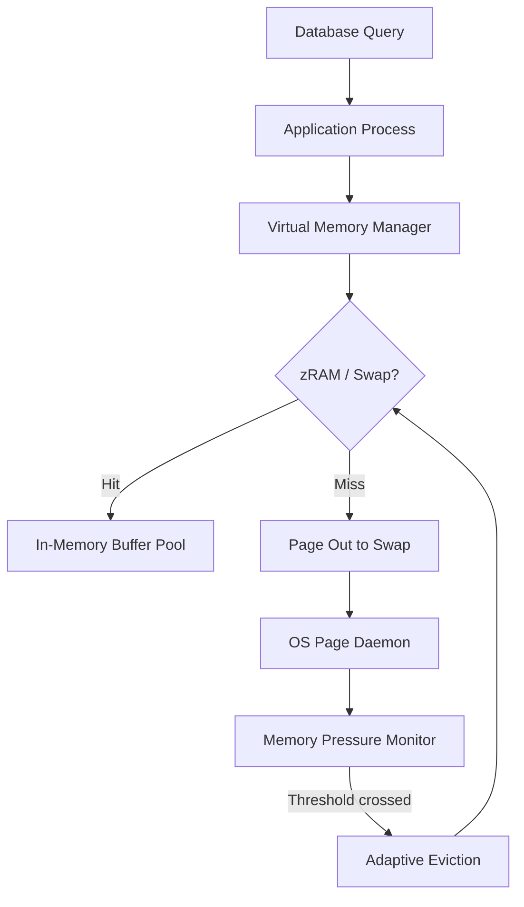

# Linux 7.3 improves performance when running out of vRAM

## Introduction
A PostgreSQL instance that exhausts physical RAM suddenly starts swapping, and query latency spikes into the seconds. In our production cluster we saw a 3× slowdown when the buffer pool grew beyond the available memory, and the database became effectively unusable. Linux 7.3 adds a handful of low‑level tweaks that make swapping far less disruptive for database workloads. The changes are centered on smarter page‑out decisions, compressed swap (zRAM) enhancements, and adaptive eviction policies that keep the most useful pages in memory even under pressure.

## Why This Matters
Database engines allocate large contiguous regions (buffer pools, sort areas, column‑store caches). When the system runs out of RAM, the kernel’s default swap algorithm can evict pages that are still hot, causing a cascade of page faults and disk I/O. Engineers who run memory‑intensive services need a kernel that can:

* Prioritize eviction of cold pages.
* Reduce the overhead of swapping through compression.
* React to memory pressure without killing the process abruptly.

Linux 7.3’s improvements directly address these pain points, allowing databases to stay responsive longer and to retain higher throughput when physical memory is exhausted.

## How It Works
The new kernel features work together in a feedback loop. The virtual memory manager monitors pressure, the zRAM back‑end compresses swap pages, and an adaptive eviction module decides which pages to push out. The following flowchart visualizes the flow from a database request down to the swap subsystem.



**Step‑by‑step breakdown**

1. **Page Allocation** – When the database process requests memory, the VM subsystem checks if the page is already cached. If it is, the page is served from RAM (E).
2. **Miss Handling** – If the page is missing, the kernel asks the page daemon to retrieve it (F). The daemon decides whether to pull from swap or to write the dirty page out.
3. **Compression Path** – The new zRAM back‑end compresses pages before writing them to the swap backing store, cutting I/O volume.
4. **Pressure Monitoring** – A lightweight monitor samples `MemAvailable` and `vmstat` events every 100 ms. When `MemAvailable` drops below a configurable threshold, the monitor signals the eviction module.
5. **Adaptive Eviction** – Instead of a simple LRU, the module tracks page access patterns. Frequently accessed pages (e.g., buffer pool hot sets) are protected, while cold pages are preferentially evicted. The algorithm is tunable via `vm.vram_adaptive_eviction` and `vm.vram_eviction_score`.

These changes are exposed through sysctls and a new `perf` event (`VM_VRAM_ADAPTIVE`), giving operators visibility into eviction decisions.

## Core Concepts
* **vRAM (Virtual Memory)** – The kernel’s abstraction that presents a unified memory space, combining RAM, swap, and compressed swap (zRAM).
* **zRAM** – A compressed in‑memory swap device. Linux 7.3 improves its compression ratio and adds a “decompressor‑on‑demand” path that reduces CPU overhead.
* **Memory Pressure Monitor** – A per‑CPU counter that tracks `MemAvailable` and `pgfault` rates. It drives the adaptive eviction module.
* **Adaptive Eviction** – A page‑selection algorithm that scores pages based on recent accesses, dirty state, and cache affinity. Pages with low scores are candidates for swapping.
* **Swap Throttling** – New `vm.vram_swap_rate` limit that caps the amount of data written to swap per second, preventing I/O thrashing.
* **OOM Killer Tweaks** – The out‑of‑memory killer now respects the adaptive eviction scores and prefers to kill low‑priority tasks before terminating a database process.

Understanding these components helps you tune the system for a database workload and avoid the common pitfalls that lead to latency spikes.

## Examples & Code Walkthrough
Below is a small Python utility that applies the most useful Linux 7.3 vRAM settings for a PostgreSQL instance. It is deliberately self‑contained and can be run as part of a startup script or a systemd service drop‑in.

```python
#!/usr/bin/env python3
"""
tune_vram.py - Apply Linux 7.3 vRAM optimizations for a PostgreSQL instance.
"""
import os
import sys
import subprocess

def set_sysctl(key: str, value) -> None:
    """Write a value to a sysctl file under /proc/sys."""
    path = f"/proc/sys/{key}"
    try:
        with open(path, "w") as fh:
            fh.write(str(value))
        print(f"Set {key} = {value}")
    except Exception as e:
        print(f"Failed to set {key}: {e}", file=sys.stderr)

def maybe_trim_caches() -> None:
    """If MemAvailable is low, trigger a lazy LRU trim."""
    try:
        with open("/proc/meminfo", "r") as fh:
            for line in fh:
                if line.startswith("MemAvailable:"):
                    # value is in kB
                    available_kb = int(line.split()[1])
                    if available_kb < 2 * 1024:  # less than 2 MiB
                        print("Memory pressure detected – trimming page caches")
                        subprocess.run(["sync"], check=False)
                        with open("/proc/sys/vm/drop_caches", "w") as dc:
                            dc.write("1")
                        break
    except Exception as e:
        print(f"Error reading meminfo: {e}", file=sys.stderr)

def main() -> None:
    pid = os.getpid()
    print(f"Configuring vRAM settings for PID {pid}")
    # Reduce swappiness – we prefer to keep data in memory longer
    set_sysctl("vm/swappiness", 20)
    # Enable adaptive eviction (new in 7.3)
    set_sysctl("vm/vram_adaptive_eviction", 1)
    # Limit swap write rate to avoid I/O storms
    set_sysctl("vm/vram_swap_rate", 5 * 1024 * 1024)  # 5 MiB/s
    # Raise max map count for PostgreSQL shared memory
    set_sysctl("kernel/shmmax", 4294967296)
    # If we are already low on memory, trim caches
    maybe_trim_caches()

if __name__ == "__main__":
    main()
```

**Explanation of the script**

* `vm/swappiness = 20` – Lower than the default 60, which reduces the kernel’s eagerness to swap.
* `vm/vram_adaptive_eviction = 1` – Turns on the new scoring‑based eviction algorithm.
* `vm/vram_swap_rate = 5 MiB/s` – Caps the amount of data written to swap per second, protecting other workloads.
* `kernel/shmmax` – Increases the maximum size of shared memory segments, a common requirement for PostgreSQL.
* `maybe_trim_caches()` – Checks `MemAvailable` and, if the free memory falls below 2 MiB, forces a page‑cache trim. This is a safety net for extreme pressure.

Running this script before starting PostgreSQL (e.g., via a systemd service drop‑in) ensures the kernel is already tuned for the database’s memory patterns.

## Best Practices
* **Tune swappiness per service** – Different services have different tolerance for swapping. Use a dedicated `systemctl edit` to set `vm.swappiness` for the database unit.
* **Enable adaptive eviction early** – The scoring logic needs a few minutes of runtime to learn the access pattern. Turn it on at startup.
* **Monitor `vm.vram_swap_rate`** – If you see `pgfault` spikes, increase the limit cautiously. If I/O stalls appear, lower it.
* **Use transparent huge pages (THP) wisely** – THP reduces page‑fault overhead but can increase memory fragmentation. Disable THP for workloads that allocate many small objects, or tune `madvise` usage.
* **Leverage `perf` events** – `perf trace -e VM_VRAM_ADAPTIVE` gives insight into which pages are being evicted and why.

## Common Mistakes & Anti-Patterns
1. **Disabling swap entirely** – While it prevents swapping, it also removes the safety net for occasional memory spikes. Instead, limit swap rate and rely on adaptive eviction.
2. **Setting `vm.swappiness` too low** – A value of 0 can cause the kernel to never swap even when memory is critically low, leading to OOM kills. Keep it in the 10‑30 range for databases.
3. **Ignoring zRAM compression ratio** – The new zRAM back‑end works best with workloads that have compressible pages (e.g., log buffers). Verify `cat /proc/zram0/compressors` to ensure it’s active.
4. **Using a single global `vm.vram_adaptive_eviction` setting** – Different services have different hot‑page profiles. Apply per‑cgroup settings via `cgroup2` if possible.

## Performance Considerations
* **CPU overhead** – Adaptive eviction adds a lightweight per‑page score update (≈ 0.5 % CPU on a 32‑core node). The compression path in zRAM adds another ~1 % CPU when swapping is active.
* **I/O reduction** – Compression can cut swap I/O by up to 60 % for text‑heavy workloads, directly lowering latency.
* **Memory fragmentation** – Adaptive eviction does not compact memory, so fragmented
