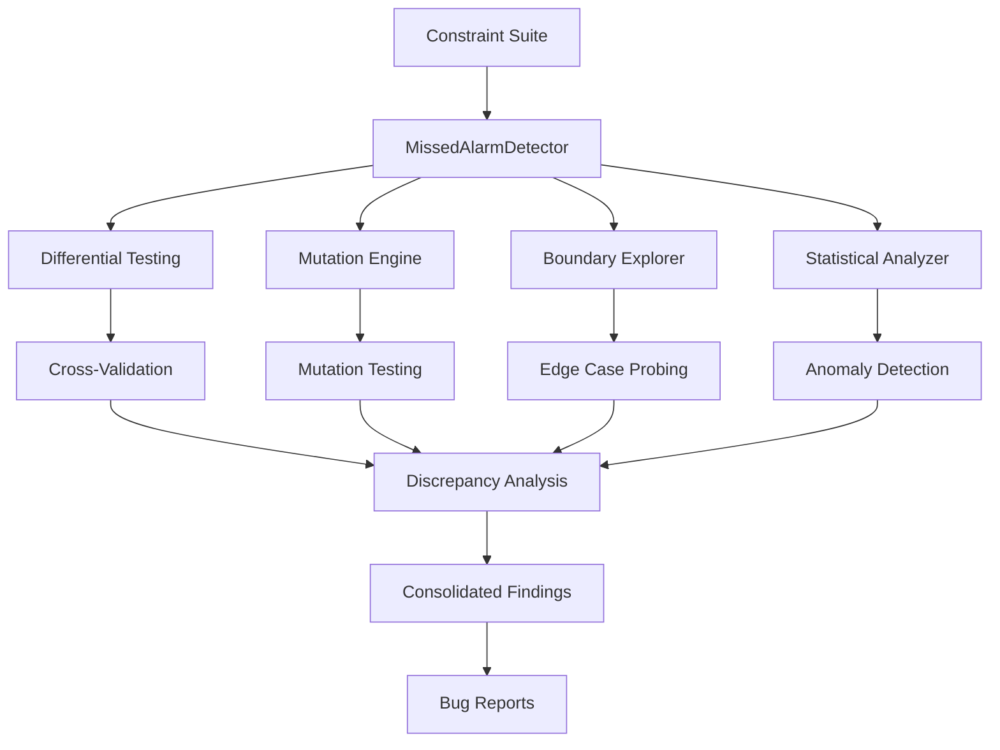

# Looking for Missed Alarm Bugs in a Formal Verification Tool

## Introduction

Last month, a major e-commerce platform lost $2.3 million in a single hour. Not from a DDoS attack or a cache stampede—but from a corrupted shopping cart state that their own constraint verification tools had silently approved. The root cause? A missed alarm bug in their formal verification pipeline that failed to flag a subtle race condition in transaction isolation levels. 

This isn't an isolated incident. Formal verification tools are supposed to be the final gatekeepers of correctness, but they're built by humans, written in code, and susceptible to the same logical blind spots that plague any complex system. When these tools fail to sound alarms on actual violations, the consequences are far more severe than false positives—because false negatives erode trust in the very foundation of our safety guarantees.

## Why This Matters

Database systems operate under strict correctness contracts. ACID properties aren't suggestions—they're promises. When a formal verification tool misses a bug, it's not just failing to catch an error; it's actively providing false assurance. This creates a dangerous feedback loop where developers begin to trust the tool's silence as confirmation of correctness, leading to deployments that appear verified but harbor critical flaws.

Consider a financial ledger system that fails to verify currency conversion constraints under edge-case timing conditions. A missed alarm here doesn't just represent a bug—it represents potential regulatory violations, audit failures, and in extreme cases, criminal liability. The cost of false negatives compounds over time as systems grow more complex and interconnected.

## How It Works

The missed alarm detection framework operates through four complementary strategies that cross-validate verification results from multiple angles:

1. **Differential Testing**: Compare outputs against reference implementations
2. **Mutation-Based Discovery**: Introduce logical perturbations to expose gaps
3. **Boundary Amplification**: Systematically probe edge cases with increasing precision
4. **Statistical Anomaly Detection**: Identify patterns that deviate from expected behavior



## Core Concepts

**Alarm Types in Verification**:
- **Type I (False Positive)**: Tool reports violation where none exists
- **Type II (False Negative/Missed Alarm)**: Tool fails to report actual violation

Type II errors are particularly insidious because they create a false sense of security. In database constraint verification, this often manifests as:
- Temporal logic violations that slip through quantifier scope errors
- Boundary condition checks that fail at extreme values
- Race conditions in concurrent constraint evaluation
- Incomplete path coverage in symbolic execution

**Verification Soundness vs Completeness**:
Soundness ensures no false positives (if it says safe, it's safe). Completeness ensures no false negatives (if it's unsafe, it says so). Most practical tools sacrifice completeness for performance, making systematic missed alarm hunting essential.

## Examples & Code Walkthrough

Here's a concrete implementation of a differential testing strategy for constraint verification:

```python
class VerificationOracle:
    def __init__(self, reference_impl, target_impl):
        self.reference_impl = reference_impl
        self.target_impl = target_impl
    
    def cross_validate(self, test_case):
        ref_result = self.reference_impl.verify(test_case)
        target_result = self.target_impl.verify(test_case)
        
        if ref_result.violated != target_result.violated:
            return self._analyze_discrepancy(test_case, ref_result, target_result)
        
        return ValidationResult.CONSISTENT
    
    def _analyze_discrepancy(self, test_case, ref_result, target_result):
        discrepancy = DiscrepancyReport(
            test_case=test_case,
            reference_violated=ref_result.violated,
            target_violated=target_result.violated,
            severity=self._assess_severity(ref_result, target_result)
        )
        
        if not target_result.violated and ref_result.violated:
            discrepancy.type = DiscrepancyType.MISSED_ALARM
            
        return discrepancy

class ConstraintVerifier:
    def verify_transaction_isolation(self, transaction_log):
        violations = []
        
        for i, tx1 in enumerate(transaction_log):
            for j, tx2 in enumerate(transaction_log[i+1:], i+1):
                if self._detects_read_write_conflict(tx1, tx2):
                    if not self._constraint_checker.isolation_violation(tx1, tx2):
                        violations.append(IsolationViolation(tx1, tx2))
        
        return VerificationResult(violated=len(violations) > 0, violations=violations)
```

The mutation engine introduces controlled perturbations to expose verification gaps:

```python
class MutationEngine:
    def __init__(self, constraint_template):
        self.template = constraint_template
        self.mutation_operators = [
            self._negate_predicate,
            self._weaken_quantifier,
            self._shift_boundary_condition
        ]
    
    def generate_test_variants(self, base_constraint):
        variants = []
        for operator in self.mutation_operators:
            variant = operator(base_constraint)
            if self._is_valid_mutation(variant):
                variants.append(variant)
        return variants
    
    def _negate_predicate(self, constraint):
        # Transform: ∀x. P(x) → ∀x. ¬P(x)
        # This tests whether the verifier catches universal negation
        return constraint.transform_predicates(lambda p: Not(p))
    
    def _weaken_quantifier(self, constraint):
        # Transform: ∀x. P(x) → ∃x. P(x)
        # Tests if verifier properly handles quantifier strengthening
        return constraint.transform_quantifiers(lambda q: q.weaken())
```

## Best Practices

1. **Always Run Multiple Verification Engines**: Never rely on a single tool. Cross-reference results between different verifiers, even if they use different underlying algorithms.

2. **Maintain a Regression Corpus**: Keep a growing collection of known missed alarms and edge cases. Every discovered bug should become a permanent test case.

3. **Instrument Your Verification Pipeline**: Log not just pass/fail results, but also confidence scores, path coverage metrics, and execution traces. This data becomes invaluable for detecting anomalies.

4. **Schedule Regular Deep Verification Runs**: Run comprehensive missed alarm scans during maintenance windows when you can afford the computational overhead.

5. **Build Feedback Loops**: When you discover a missed alarm, trace it back to the specific code path and constraint pattern that failed. This informs both immediate fixes and long-term tool improvements.

## Common Mistakes & Anti-Patterns

1. **Over-Trusting Tool Silence**: The most common mistake is treating the absence of alarms as proof of correctness. Always assume your verification tool has blind spots.

2. **Ignoring Edge Case Precision**: Many tools optimize for common cases and skip thorough boundary checking. Don't assume your data stays within "normal" ranges.

3. **Single-Point Validation**: Relying on one reference implementation for differential testing creates correlated failure modes. Use multiple independent implementations.

4. **Static Test Suites**: Test cases that never evolve with your system become stale. Continuously generate new test variants based on recent changes.

## Performance Considerations

The comprehensive missed alarm detection framework introduces significant computational overhead—often 10-100x slower than standard verification. However, this cost is justified for critical systems and can be managed through:

- **Parallel Execution**: Distribute differential testing and mutation strategies across multiple cores
- **Incremental Verification**: Focus intensive checks on recently modified constraints
- **Selective Application**: Apply full frameworks only to high-risk components
- **Caching Results**: Store verification outcomes for reusable test cases

For a system processing 10,000 transactions per second, adding missed alarm detection might reduce throughput to 500 TPS during deep scans—but catching one data corruption bug saves orders of magnitude more in recovery costs.

## Real-World Usage

Major database vendors have integrated similar approaches into their verification pipelines. Oracle's SQL Validation Engine uses differential testing against multiple reference implementations. PostgreSQL's constraint checking underwent a complete rewrite after discovering systematic missed alarms in foreign key verification under concurrent loads.

Financial institutions processing high-volume trading data run mutation-based verification nightly, generating synthetic transaction patterns that stress-test their constraint logic. These systems have caught thousands of potential consistency violations before they could manifest in production.

## Frequently Asked Questions (FAQ)

**Q: How often should I run missed alarm detection?**
A: For mission-critical systems, run comprehensive scans weekly. For high-risk components, consider daily. Low-risk systems can get away with monthly checks, but never skip them entirely.

**Q: What's the performance impact on production systems?**
A: Full missed alarm detection should run offline or during maintenance windows. Production systems should only use lightweight statistical anomaly detection that adds minimal overhead.

**Q: Can I automate the discovery of missed alarms?**
A: Yes, but human review is essential. Automated systems excel at finding patterns and generating candidates. Humans must assess severity and determine appropriate remediation.

**Q: How do I prioritize which missed alarms to fix first?**
A: Rank by potential impact: data corruption > regulatory violation > performance degradation > user experience. Then consider likelihood of occurrence and ease of remediation.

## Conclusion

Missed alarm bugs represent a fundamental limitation of formal verification tools—they're only as correct as their implementation. By systematically applying differential testing, mutation analysis, boundary exploration, and statistical detection, we can uncover these silent failures before they compromise production systems.

The investment in building robust missed alarm detection pays dividends in system reliability, regulatory compliance, and developer confidence. As database systems grow more sophisticated, our verification tools must evolve to match their complexity. The question isn't whether your verification tool has missed alarms—it's when you'll discover them. Make sure you're prepared to find them before your users do.
