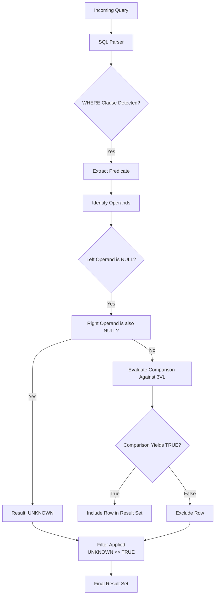

# NULL in SQL: Why = NULL Finds Nothing and What to Write Instead

## Introduction

During a recent migration of our promotional dashboard to handle millions of campaign records, a critical reporting query silently failed. The team spent four hours tracing a dead end before realizing the culprit was a single comparison against NULL. The mistake wasn't subtle—our developers had been blindsided by the fundamental behavior of SQL's three-valued logic. When a query attempts to match a column to NULL using the equals sign, the result set remains empty. Understanding why this happens and what to write instead isn't merely an academic exercise; it is essential infrastructure for any system that processes uncertain or missing data.

## Why This Matters

Production databases routinely contain partially known records. An order may exist, but the payment method is unknown. A user may have clicked through multiple channels, leaving the primary attribution source unset. Financial systems track revenue where some transactions lack merchant identifiers. If an application treats `= NULL` as equivalent to `IS NULL`, it will either return zero rows or corrupt business metrics. This discrepancy manifests as broken SLAs, inaccurate revenue reports, and costly debugging sessions. Engineers who master this nuance build more resilient pipelines and trustworthy analytics products.

## How It Works

The following sequence diagram illustrates how a WHERE clause involving NULL is processed by the query optimizer. The flow starts with the parser identifying the predicate, moves through the evaluation stage where SQL applies Three-Valued Logic (3VL), and concludes with row inclusion or exclusion based on boolean outcomes.



**Explanation of the flow:**

- **Parser & Predicate Extraction**: The parser recognizes the equality operator within the WHERE clause and builds an abstract representation of the condition.
- **Operand Inspection**: Before comparison, the engine checks whether the left-hand operand is itself NULL. In SQL semantics, a literal NULL compared to anything yields **UNKNOWN**, never TRUE or FALSE.
- **Three-Valued Logic Evaluation**: When the right operand exists and is not NULL, SQL computes the comparison. Because one side is UNKNOWN, the outcome is UNKNOWN—not TRUE nor FALSE.
- **Boolean Filtering**: The WHERE clause retains only rows where the predicate evaluates to TRUE. Since UNKNOWN is excluded, any row where both sides compare equal to NULL passes the filter as UNKNOWN, causing those rows to be dropped entirely during execution.
- **Materialization**: Only rows passing the filter reach the final result set. Thus, `WHERE column = NULL` inherently selects zero rows.

## Core Concepts

SQL distinguishes between two distinct states: **FALSE** represents an intentionally absent or known negative value (e.g., `0`, `'false'`), while **UNKNOWN** represents an indeterminate or missing value. This design stems from Codd’s foundational relational algebra, which required a formal distinction between falsehood and ignorance.

### Truth Table for Equality with NULL

| Left | Right | Predicate (`left = right`) |
|------|-------|----------------------------|
| NULL | NULL  | UNKNOWN                   |
| NULL | value | UNKNOWN                   |
| value | NULL  | UNKNOWN                   |
| value | value | TRUE                      |

Because SQL cannot treat NULL as a placeholder for zero or false, `value = NULL` cannot succeed. The comparator must return UNKNOWN, and the WHERE clause filters it out. This behavior propagates through join predicates, aggregate functions, and window definitions, creating ripple effects across entire query plans.

## Examples & Code Walkthrough

Consider a `CampaignAnalytics` table that tracks daily performance. The `attribution_source` column captures which channel drove the traffic—`organic`, `social`, `direct`, or `none`. Sometimes, due to upstream API failures, this column arrives empty. Below are three ways this can surface silent bugs and how to fix them.

### The Incorrect Pattern

```sql
-- WRONG: Attempts to find rows where the source is NULL
SELECT campaign_id, 
       SUM(revenue) AS total_rev,
       COUNT(*) AS impressions
FROM campaign_analytics
WHERE attribution_source = NULL
GROUP BY campaign_id;
```

This statement executes against every row in the table but yields zero results. Every comparison inside the WHERE clause resolves to UNKNOWN, so none pass the filter.

### The Correct Approach: `IS NULL`

```sql
-- CORRECT: Uses the standard predicate for null checking
SELECT campaign_id, 
       SUM(revenue) AS total_rev,
       COUNT(*) AS impressions
FROM campaign_analytics
WHERE attribution_source IS NULL
GROUP BY campaign_id;
```

Here, the `IS NULL` operator follows SQL’s canonical rule. The predicate evaluates to TRUE exactly when the column contains a true null value, returning the intended aggregated statistics for unattributed campaigns.

### Handling Unknowns Explicitly

Sometimes you want to capture both truly missing data and known-negative values. You can combine predicates:

```sql
-- Captures rows where attribution_source is either literally NULL
-- OR explicitly marked as 'unknown'
SELECT campaign_id, 
       SUM(revenue) AS total_rev
FROM campaign_analytics
WHERE attribution_source IS NULL
   OR attribution_source = 'unknown'
GROUP BY campaign_id;
```

### Safe String Coalescing with `COALESCE`

If `attribution_source` might contain whitespace-only strings that should be treated as missing, use `COALESCE` for sanitization before the check:

```sql
SELECT 
    campaign_id,
    COALESCE(attribution_source, 'untracked') AS src,
    SUM(revenue) AS total_rev
FROM campaign_analytics
WHERE src IS NULL
GROUP BY campaign_id;
```

### Conditional String Cleaning with `NULLIF`

When joining on a derived value that could become empty, `NULLIF` protects the join from failing:

```sql
SELECT 
    a.campaign_id,
    b.channel,
    LENGTH(NULLIF(trim(b.channel), '')) AS effective_length
FROM campaigns a
LEFT JOIN attribution_points b
    ON a.id = b.campaign_id
    AND NULLIF(trimming(b.channel, ' '), '') != ''
ORDER BY effective_length DESC;
```

### Partition Pruning via Partial Indexes

On very large tables, filtering heavily on the presence of NULLs can be optimized with partial indexes:

```sql
CREATE INDEX CONCURRENTLY idx_campaign_unattributed
ON campaign_analytics (revenue, impressions)
WHERE attribution_source IS NULL;
```

This index only stores rows where the attribution source is missing, allowing the query planner to seek exclusively into this subset without scanning the main index tree. Without such optimization, the query still performs a full scan unless the engine employs sophisticated skip-linking techniques.

## Best Practices

1. **Always prefer `IS NULL` / `IS NOT NULL`** for any comparison with a potentially unknown column. Never use `= NULL` or `!= NULL` in production code.
2. **Avoid implicit type casting** in conditions that involve NULLs. Explicitly cast operands when necessary, and let the engine apply 3VL correctly.
3. **Understand partial index semantics**. When designing indexes for read-heavy workloads, consider whether the vast majority of your data falls into one branch of the NULL decision tree.
4. **Test merge operations carefully**. Joining tables on nullable foreign keys often requires `IS NULL` on the left table when bringing back child rows, especially in star-schemas where parent records may lack children.
5. **Document the meaning of NULL** in your data dictionary. A shared contract ensures that downstream consumers understand that a gap in data is not an error but a semantic state requiring specific handling.

## Common Mistakes & Anti-Patterns

- **The Universal `=` Trap**: Writing `WHERE created_at = NULL` returns zero rows. This is a classic newcomer oversight and should trigger immediate code review.
- **Aggregation Surprises**: `SELECT COUNT(*) FROM events WHERE event_type IS NULL` returns 0, even though some records exist with that field explicitly cleared. Conversely, `SUM(amount) WHERE amount IS NULL` excludes nulls from the sum (as they contribute nothing anyway), which is often the desired behavior.
- **`NULLIF` Misuse**: Applying `NULLIF(a,b)` without understanding that it effectively replaces both arguments with NULL can silently drop rows from a join if not applied correctly.
- **Implicit Casting Assumptions**: Some ORMs or older drivers may coerce NULL to a string or integer depending on configuration, leading to unpredictable query behavior.

## Performance Considerations

The presence of NULLs impacts both CPU and I/O. Modern query planners employ several optimizations:

- **Index Utilization**: Standard B-Tree indexes sort by range, placing NULL values at the start of each leaf page. Queries starting with `WHERE col IS NULL` can sometimes use a "fast path" that skips index lookup entirely, landing directly on the heap slice containing only NULL entries. However, this assumes the index is partitioned optimally.
- **Memory Pressure**: Evaluating 3VL adds a constant overhead per row. In massive parallel scans (e.g., Spark or distributed PostgreSQL), materializing intermediate sets unnecessarily due to NULL propagation can increase shuffling costs.
- **Join Ordering**: When joining two tables on a nullable key, the optimizer must decide whether to perform a hash join or a nested loop. If one table has high cardinality and the other low, the NULL distribution can skew the choice, forcing a full table scan regardless of predicates elsewhere.

## Real-World Usage

Major data platforms bake these patterns into their infrastructure. Spotify, for instance, relies on a cache layer where session telemetry frequently lacks device identifiers. Their ingestion pipeline uses `IS NULL` to route untracked sessions to a separate recovery job rather than discarding them. Similarly, payment gateways treat `default_card` flags using `IS NULL` to determine whether to fall back to manual verification flows. These decisions prevent cascading failures and keep billing reconciliation intact under noisy data conditions.

## Frequently Asked Questions

**Q: Does `COALESCE(col, col)` serve the same purpose as `IS NULL`?**  
A: No. `COALESCE(col, col)` simply returns `col` unchanged—it does not change the semantic meaning of NULL. To detect NULLs, you must use `IS NULL` or `IS NOT NULL`.

**Q: What is the difference between `NULLIF(a,b)` and `CASE WHEN a=b THEN NULL END`?**  
A: Both produce a NULL when `a` equals `b`. The former is syntactic sugar that works efficiently across many dialects; the latter offers portability guarantees. Choose based on your target SQL engine version.

**Q: Can I replace `= NULL` with `NOT LIKE '%'` or similar tricks?**  
A: Absolutely
