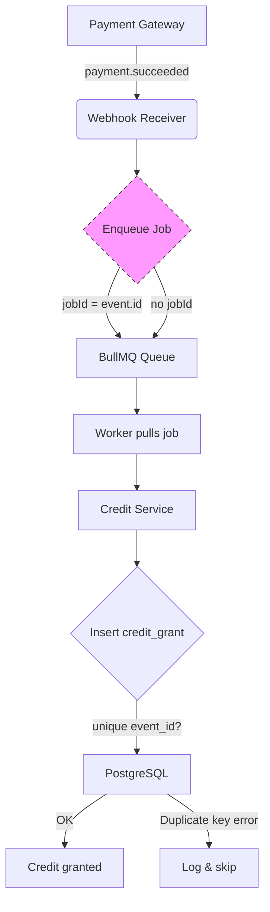

# One Payment Event, Two Credit Grants: A TypeScript Webhook Bug

## Introduction
A single payment webhook arrived from our gateway, but the accounting system showed two credit grants for the same user. The duplicate led to a short‑term imbalance in our ledger and triggered a fraud alert. Digging into the logs revealed two identical rows in the `credit_grants` table, each carrying the same `event_id`. The bug was not a flaky network retry; it was a missing idempotency guard that let the same event be processed twice.

## Why This Matters
Webhook‑driven pipelines are the backbone of modern payment integrations. When a webhook is delivered more than once—whether because the gateway retries, a worker crashes, or a queue re‑queues a job—your system must guarantee that side effects happen exactly once. Financial systems cannot tolerate double credits; they erode trust, invite regulatory scrutiny, and require costly reconciliation. Demonstrating how a simple missing unique constraint and absent job‑level deduplication can break that guarantee helps teams harden similar pipelines before they go live.

## How It Works
Our payment flow consists of four loosely coupled pieces:

1. **Webhook Receiver** – an Express endpoint that accepts `payment.succeeded` events.
2. **Job Queue** – BullMQ backed by Redis; each job represents one event to be processed.
3. **Credit Service** – a NestJS service that inserts a row into `credit_grants`.
4. **PostgreSQL** – stores the grant record and an audit log.

When the receiver enqueues a job without using the incoming event’s identifier as the job ID, BullMQ treats each delivery as a distinct job. If the gateway sends the same webhook twice (common during network hiccups), two jobs are created, both reach the credit service, and two rows are inserted.

The mermaid diagram below shows the happy path and the duplicate‑processing path.



*When the receiver supplies `jobId: event.id` (left branch), BullMQ deduplicates automatically; the second delivery finds an existing job and ignores it. Without that key (right branch), both deliveries create separate jobs, leading to two inserts.*

## Core Concepts
- **Idempotency Key** – a stable identifier (here the payment gateway’s `event.id`) that lets a system recognize repeated attempts as the same logical operation.
- **Job‑Level Deduplication** – BullMQ uses the `jobId` field to prevent duplicate jobs from sitting in the queue simultaneously.
- **Database Constraint as Safety Net** – a unique index on `event_id` guarantees that even if the application logic fails, the DB will reject a second insert with a distinct error.
- **Transactional Outbox** – an advanced pattern where the event record and the queue message are written in the same transaction, ensuring that a job is enqueued only if the event is persisted.

## Examples & Code Walkthrough
Below is a refactored version of the webhook receiver, the credit service, and the migration that adds the missing constraint. All snippets include defensive error handling and explanatory comments.

### 1. Webhook Receiver (Express + BullMQ)
```typescript
import express, { Request, Response } from 'express';
import { Queue } from 'bullmq';
import { PaymentEvent } from './types';

const app = express();
app.use(express.json()); // parse JSON bodies

// Queue name matches the worker defined elsewhere
const eventQueue = new Queue<PaymentEvent>('process-event', {
  connection: { host: process.env.REDIS_HOST ?? 'localhost', port: 6379 },
});

app.post('/webhook', async (req: Request, res: Response) => {
  try {
    const event: PaymentEvent = req.body;

    // Basic shape validation – fail fast if the payload is malformed
    if (!event?.id || !event?.userId || typeof event?.amount !== 'number') {
      return res.status(400).json({ error: 'Invalid payload' });
    }

    // Use the gateway‑provided event ID as the BullMQ job ID.
    // If a job with this ID already exists (waiting, active, or completed),
    // BullMQ will not create a duplicate.
    await eventQueue.add('process-event', event, {
      jobId: event.id,
      // Optional: remove jobs after they succeed to keep the queue tidy
      removeOnComplete: true,
      removeOnFail: { age: 24 * 3600 }, // keep failed jobs for a day for inspection
    });

    // Respond quickly so the gateway knows we received it.
    res.status(200).send('OK');
  } catch (err) {
    // Log the error for ops but still return 2xx to avoid gateway retries
    // on transient processing failures; the job itself will be retried by BullMQ.
    console.error('Webhook processing failed:', err);
    res.status(200).send('OK'); // we acknowledge receipt; the job handles retries
  }
});

export default app;
```

### 2. Credit Service (NestJS‑style repository)
```typescript
import { Injectable, InternalServerErrorException } from '@nestjs/common';
import { InjectRepository } from '@nestjs/typeorm';
import { Repository } from 'typeorm';
import { CreditGrant } from './credit-grant.entity';

@Injectable()
export class CreditService {
  constructor(
    @InjectRepository(CreditGrant)
    private readonly creditRepo: Repository<CreditGrant>,
  ) {}

  /**
   * Inserts a credit grant. The method expects the caller to have already
   * validated that the eventId is unique (via the DB constraint or an
   * application‑level check). On a unique‑violation we throw a domain‑specific
   * error that the worker can treat as a successful no‑op.
   */
  async grantCredits(
    eventId: string,
    userId: number,
    amount: number,
  ): Promise<void> {
    try {
      await this.creditRepo.insert({ eventId, userId, amount });
    } catch (err) {
      // Postgres error code 23505 = unique_violation
      if (err.code === '23505') {
        // Treat as idempotent success – the grant already exists.
        return;
      }
      // Unexpected error – bubble up so the job can be retried or sent to DLQ.
      throw new InternalServerErrorException(
        `Failed to grant credits for event ${eventId}: ${err.message}`,
      );
    }
  }
}
```

### 3. Migration – Adding the Unique Constraint
```sql
-- Only run this once; it will fail if duplicate event_id values already exist.
ALTER TABLE credit_grants
ADD CONSTRAINT uq_credit_grants_event_id UNIQUE (event_id);
```

If you suspect existing duplicates, first clean them up:
```sql
DELETE FROM credit_grants cg
USING (
  SELECT MIN(id) as keep_id, event_id
  FROM credit_grants
  GROUP BY event_id
  HAVING COUNT(*) > 1
) dup
WHERE cg.event_id = dup.event_id
  AND cg.id <> dup.keep_id;
```

## Best Practices
- **Always derive the job ID from a stable, immutable field** supplied by the external system (e.g., Stripe’s `evt_*`, PayPal’s webhook ID). Never rely on timestamps or random values.
- **Pair application‑level deduplication with a DB unique constraint**. The constraint catches race conditions that slip past the queue (for example, two workers pulling the same job due to a visibility timeout misconfiguration).
- **Make the webhook handler idempotent at the HTTP level**: respond with `200 OK` as soon as you have persisted the event to a durable store (or enqueued the job). This prevents the gateway from retrying while you’re still processing.
- **Log both the incoming event ID and the outcome** (grant created, duplicate ignored, error). Structured logs make it trivial to spot patterns of duplicate deliveries.
- **Use a dead‑letter queue (DLQ)** for jobs that repeatedly fail due to constraint violations or validation errors, so operators can inspect them without clogging the main queue.

## Common Mistakes & Anti‑Patterns
| # | Mistake | Why It’s Harmful | Fix |
|---|---------|------------------|-----|
| 1 | **Enqueuing jobs without a jobId** (as in the original snippet) | Allows duplicate jobs to sit in the queue; each leads to a separate DB insert. | Pass `jobId: event.id` when calling `queue.add`. |
| 2 | **Missing unique index on `event_id`** | Even with a jobId, a worker crash after processing but before acknowledging can cause the job to be retried, leading to a second insert if the app logic doesn’t check for existence. | Add `ALTER TABLE … ADD CONSTRAINT uq_credit_grants_event_id UNIQUE (event_id);` |
| 3 | **Relying solely on application checks** (e.g., `SELECT … WHERE event_id = ?` then insert) without a transaction | Between the SELECT and INSERT, another worker could pass the check and insert first, causing a race‑condition duplicate. | Perform the insert inside a transaction and rely on the unique constraint to throw on conflict; catch the error and treat it as idempotent success. |
| 4 | **Acknowledging the webhook before persisting the event** | If the process crashes after sending `200` but before enqueuing the job, the gateway will not retry, and the event is lost. | Persist the event (or at least enqueue the job) *before* returning the HTTP 200. |

## Performance Considerations
- **Queue overhead**: Adding a job with a specific `jobId` incurs a constant‑time lookup in Redis to check for existing jobs. The cost is O(1) and negligible compared to the network round‑trip to the payment gateway.
- **Database write path**: The insert with a unique index adds a modest B‑tree maintenance cost (O(log N) where N is the number of rows). For credit‑grant tables that grow linearly with paying users, this cost is acceptable; if you anticipate tens of millions of grants per month, consider partitioning the table by `event_id` hash or by date to keep index size manageable.
- **Error handling**: Catching the unique‑violation error and treating it as a success avoids unnecessary retries, reducing wasted CPU cycles. However, ensure you log the event at `debug` level so you can audit how often idempotency kicks in.
- **Throughput**: A typical BullMQ worker can process hundreds of jobs per second on a modest VM; the limiting factor is usually the DB write latency. If you hit a ceiling, batch inserts (using a temporary table and `INSERT … SELECT`) can improve throughput while still respecting the unique constraint via `ON CONFLICT DO NOT EXISTS`.

## Real-World Usage
- **Stripe** recommends using the `idempotency-key` header on API calls and storing the received `event.id` in a deduplication table before executing business logic. Their official libraries (Node, Go) include helpers that automatically ignore duplicate webhooks based on that header.
- **Shopify**’s webhook infrastructure includes an `X-Shopify-Topic` and `X-Shopify-Webhook-Id` header; many of their SDKs provide built‑in middleware that persists the header value to Redis and skips processing if the same ID appears again.
- **Uber’s internal payment platform** leverages a transactional outbox pattern: each payment attempt writes a row to an `payment_events` table within the same transaction that updates the rider’s wallet. A separate poller reads new rows and enqueues jobs, guaranteeing that a job is created only if the event is durably stored.

These patterns converge on the same principle: make the *first* durable receipt of the event the point of no return, and guard every subsequent step with either a deduplication key or a database constraint.

## Frequently Asked Questions (FAQ)
**Q: What if the payment gateway sends the same webhook with a different `event_id`?**  
A: That would indicate a bug in the gateway; treat it as a distinct event. Your system should still be safe because each `event_id` will be unique, and the unique constraint will prevent duplicate grants for the same logical payment only if the IDs truly repeat.

**Q: Should I delete processed jobs from the queue to save space?**  
A: BullMQ’s `removeOnComplete` and `removeOnFail` options handle this automatically. Keeping a short window of completed jobs (e.g., one hour) aids debugging without significant storage impact.

**Q: Can I use a UUID v4 as the job ID instead of the gateway’s event ID?**  
A: Only if you generate the UUID *before* the first delivery and persist it alongside the event. If you generate it inside the webhook handler, a retry will produce a new UUID, breaking idempotency. Stick to identifiers supplied by the external source.

**Q: How do I monitor for duplicate webhook arrivals?**  
A: Increment a counter metric (e.g., `webhook.duplicate`) each time you detect a jobId collision in BullMQ or catch a unique‑violation error in the credit service. Alert when the rate exceeds a threshold (say >0.1% of total webhooks).

**Q: Is the transactional outbox pattern worth the extra complexity?**  
A: For high‑volume financial systems where a lost webhook could mean missing revenue, yes. It eliminates the race between persisting the event and enqueuing the job. For lower‑traffic apps, a reliable queue with proper jobId deduplication and a DB unique constraint is usually sufficient.

## Conclusion
Duplicate credit grants are a avoidable yet costly failure mode that stems from two common oversights: missing idempotency keys at the queue level and the absence of a unique database constraint. By anchoring each webhook to the identifier supplied by the payment gateway, using that identifier as the BullMQ job ID, and reinforcing the assumption with a PostgreSQL unique constraint, you turn a flaky, retry‑prone pipeline into a deterministic, exactly‑once processing path.

Apply these guards early in the design phase, verify them with load‑tested failure simulations (gateway retries, worker crashes), and instrument both the queue and the DB to surface anomalies quickly. The result is a ledger that stays accurate, auditors that stay satisfied, and engineers who can sleep knowing that a single payment event will never translate into two unexpected credits.
