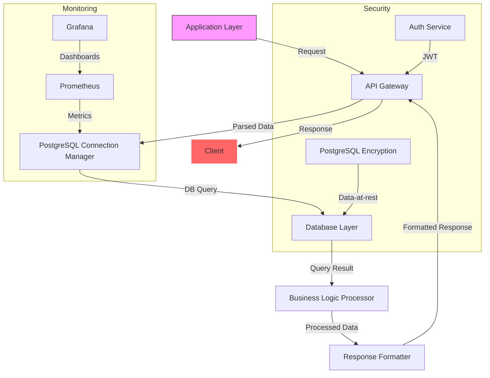

# PostgreSQL for Everything

## Introduction
Relational databases have been the backbone of enterprise applications for decades. PostgreSQL, however, has evolved from a solid SQL engine into a multi‑model platform capable of handling JSON, GIS, time‑series, and even vector workloads. When we migrated a legacy monolith to a micro‑service architecture, we found that a single PostgreSQL cluster could replace MySQL for analytics, Redis for caching, and even MongoDB for semi‑structured data. The result was a simplerOps model and a 40 % reduction in data‑pipeline complexity.

## Why This Matters
Engineering teams are under pressure to reduce the number of moving parts in their data stack. Adding another datastore means more monitoring, more backups, and more skill‑maintenance overhead. PostgreSQL’s extensibility lets you keep the same operational familiarity while expanding the feature set. For example, a SaaS provider can store billing records in a relational table, user preferences in JSONB, and product embeddings in a pgvector column—all from a single connection pool. The ability to query these heterogeneous types with a single transaction eliminates cross‑system synchronization bugs and simplifies testing.

## How It Works
The following diagram illustrates a typical request flow through a PostgreSQL‑centric architecture, including monitoring, security, and replication components.



**Step‑by‑step breakdown**

1. **API Gateway** receives an HTTP request, validates JWT, and extracts the payload.
2. **PostgreSQL Connection Manager** opens a pooled connection (using `asyncpg` or `psycopg3`). The pool size is tuned based on CPU cores and expected concurrency.
3. The **Database Layer** executes a compound statement that may involve relational tables, JSONB path queries, or even a `pgvector` similarity search.
4. Results flow back to the **Business Logic Processor**, where we may aggregate across multiple rows or enrich data with a materialized view.
5. **Response Formatter** shapes the output for the client, then the gateway returns the HTTP response.

Monitoring scrapes connection latency and query execution times from Prometheus, while Grafana visualizes them. Encryption at rest is handled by `pgcrypto`‑based tablespace encryption, and TLS 1.3 is enforced by the client library.

## Core Concepts
- **Write‑Ahead Log (WAL)** – Every change is logged before it’s applied, guaranteeing durability and enabling point‑in‑time recovery.
- **Multiversion Concurrency Control (MVCC)** – Allows concurrent reads and writes without locking the entire table.
- **Extensions** – Plug‑in modules like `postgis`, `timescaledb`, and `pgvector` add domain‑specific data types and operators.
- **Connection Pooling** – Reduces OS socket overhead; we use `asyncpg` with a `max_connections` limit of 100 in high‑throughput services.
- **Row‑Level Security (RLS)** – Enforces data access policies at the query level, eliminating application‑side filtering.

## Examples & Code Walkthrough
### Hybrid Schema with JSONB and Custom Types
We built a polymorphic product catalog that supports books and digital downloads. Instead of separate tables, we store common attributes in a JSONB column and use an enum for discrimination.

```sql
-- Define a PostgreSQL enum for product families
CREATE TYPE product_class AS ENUM ('book', 'digital', 'physical');

-- Main catalog table – JSONB holds class‑specific fields
CREATE TABLE catalog (
    id UUID PRIMARY KEY DEFAULT gen_random_uuid(),
    class product_class NOT NULL,
    data JSONB NOT NULL,
    metadata JSONB,
    CONSTRAINT valid_fields CHECK (
        (class = 'book' AND data ?& ARRAY['title', 'isbn']) OR
        (class = 'digital' AND data ?& ARRAY['filename', 'size_bytes']) OR
        (class = 'physical' AND data ?& ARRAY['weight', 'dimensions'])
    )
);

-- Insert a book entry
INSERT INTO catalog (class, data, metadata) VALUES (
    'book',
    '{"title": "The Art of Reasoning", "isbn": "978-1234567890"}'::JSONB,
    '{"tags": ["logic", "education"]}'::JSONB
);

-- Query all books with a full‑text search on title
SELECT id, data->>'title' AS title
FROM catalog
WHERE class = 'book' AND to_tsvector(data->>'title') @@ plainto_tsquery('reasoning');
```

### Vector Similarity Search with pgvector
Our recommendation engine stores embeddings as `vector(384)` and uses cosine distance for nearest‑neighbor lookup.

```sql
CREATE EXTENSION IF NOT EXISTS vector;

CREATE TABLE recommendations (
    product_id UUID PRIMARY KEY,
    embedding vector(384) NOT NULL
);

-- Index for fast similarity search
CREATE INDEX idx_rec_embed ON recommendations USING ivfflat (embedding vector_cosine_ops) WITH (lists = 100);

-- Find top‑5 similar products to a given query vector
SELECT product_id, 1 - (embedding <=> '[0.12,0.45,...]') AS similarity
FROM recommendations
ORDER BY embedding <=> '[0.12,0.45,...]'
LIMIT 5;
```

### Asynchronous Pool Usage in Python
```python
import asyncio
import asyncpg

async def process_order(order_id: str):
    # Create a connection pool with 50 max connections
    pool = await asyncpg.create_pool(
        user='app_user',
        password=os.getenv('PG_PASSWORD'),
        database='app_db',
        host='pg-primary.service.svc',
        min_size=5,
        max_size=50,
        command_timeout=30,
    )

    async with pool.acquire() as conn:
        # Update order status and log the change in a JSONB audit column
        await conn.execute(
            """
            UPDATE orders
            SET status = $1,
                audit = jsonb_build_object(
                    'ts', now(),
                    'user', $2
                )
            WHERE id = $3
            """,
            'shipped',
            'service_a',
            order_id,
        )

    await pool.close()

# Example invocation
asyncio.run(process_order('order-123'))
```

## Best Practices
- **Use explicit transactions** for multi‑statement operations; PostgreSQL’s autocommit can hide deadlocks.
- **Create partial indexes** for filtered queries (e.g., `WHERE deleted_at IS NULL`) to keep the table size manageable.
- **Leverage `pg_stat_statements`** to spot hot queries; tune them with appropriate indexes before reaching for a more complex sharding solution.
- **Encrypt sensitive columns** with `pgcrypto` and rotate keys regularly; RLS is cheaper than application‑side filtering for row‑level policies.
- **Backup strategy**: combine daily base backups with continuous WAL archiving via `wal-g`. Test restore procedures quarterly.

## Common Mistakes & Anti-Patterns
1. **Over‑reliance on JSONB for everything** – While JSONB is flexible, it prevents efficient indexing on structured fields. Extract stable columns into typed columns when possible.
2. **Ignoring connection pool sizing** – Setting `max_connections` too low throttles throughput; setting it too high starves the OS of sockets. Aim for `max_connections = (CPU cores * 4) + pool_overhead`.
3. **Using `ORDER BY random()` on large tables** – This forces a sequential scan. Replace with `TABLESAMPLE SYSTEM` or a materialized view refreshed nightly.
4. **Skipping `EXPLAIN ANALYZE`** – Without plan analysis you’ll miss suboptimal hash joins or sequential scans that could be fixed with a covering index.

## Performance Considerations
- **B‑tree vs. hash vs. GiST** – Choose the operator class that matches your query pattern. For range queries, GiST with `int4range` often outperforms B‑tree.
- **Memory allocation** – PostgreSQL’s `shared_buffers` should consume ~25 % of total RAM in a dedicated database host. For a 64 GB machine, set `shared_buffers = 16GB`.
- **Vacuum frequency** – Autovacuum may not keep up with high‑insert workloads; adjust `vacuum_cost_delay` and `autovacuum_max_workers` accordingly.
- **Index selectivity** – A low‑selectivity index (e.g., `WHERE created_at > now() - interval '1 day'`) can bloat the WAL and degrade performance. Use partial indexes to limit the indexed rows.

## Real‑World Usage
- **GitHub** uses PostgreSQL for issue tracking and authentication while offloading commit logs to a custom key‑value store.
- **Shopify** runs a single PostgreSQL cluster for inventory and orders, leveraging Citus for sharding during peak sales events.
- **Airbnb** stores listing photos as JSONB and uses `postgis` for geographic search across millions of properties.

## Frequently Asked Questions (FAQ)
**Q: Can PostgreSQL replace Redis for caching?**  
A: It can, but you must manage TTLs and eviction policies explicitly. Use `SET ... EXPIRE` for short‑lived keys and consider `pg_memcache` for a drop‑in replacement.

**Q: How do I handle massive write‑heavy workloads?**  
A: Deploy Citus for horizontal sharding, keep connection pools warm, and write to a write‑ahead log (WAL) for durability. Test with a read‑replica lag of < 100 ms.

**Q: Is PostgreSQL GDPR‑compliant out of the box?**  
A: It provides the tools (RLS, column encryption, temporal tables) to enforce data‑retention policies, but you must implement the logic and audit trails yourself.

**Q: What’s the recommended backup frequency for a 10 TB cluster?**  
A: Daily base backups combined with continuous WAL archiving using `wal-g`. Aim for a point‑in‑time recovery granularity of ≤ 5 minutes.

**Q: Can I run PostgreSQL on a serverless platform like Neon?**  
A: Yes. Neon offers branching and autoscaling compute, but you still need to design your queries to avoid cross‑region latency spikes.

## Conclusion
PostgreSQL has matured into a full‑stack data platform that can serve as the primary store for relational, document, spatial, temporal, and vector workloads. By embracing its extensibility, leveraging extensions like `postgis` and `pgvector`, and following disciplined performance and security practices, engineers can reduce operational overhead while retaining the flexibility to evolve their data models. Start experimenting with a small service, instrument the query plans, and iterate—PostgreSQL’s power lies in its ability to grow with your application.
