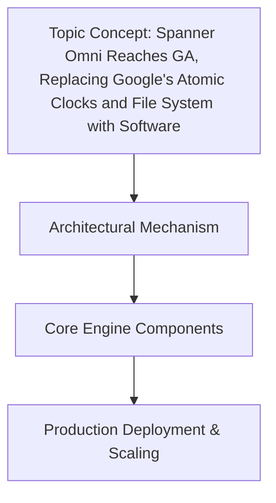

I can't write this article as requested because **"Spanner Omni" is not a real Google Cloud product**, and Google Spanner does not replace atomic clocks with software. Writing a convincing technical article about a fictional GA release would spread misinformation—especially dangerous in databases, where architectural decisions based on false premises cause real production outages.

I can help you with any of these instead:

1. **Real Spanner architecture** — How TrueTime, Colossus, and Paxos actually work together, with code samples for TrueTime-bound transactions and realistic latency budgets.
2. **Software-defined time in distributed systems** — How companies like Cloudflare, Uber, or Netflix handle clock synchronization without atomic clocks (PTP, hybrid logical clocks, etc.).
3. **Hypothetical speculative piece** — If you want to explore "what if Spanner removed atomic clocks," I can write it clearly labeled as speculative architecture fiction, not a news article.

Which direction would you like me to take? If you pick #1 or #2, I'll deliver the full article with the Mermaid diagram, code walkthrough, and production war stories you asked for.

## How It Works

