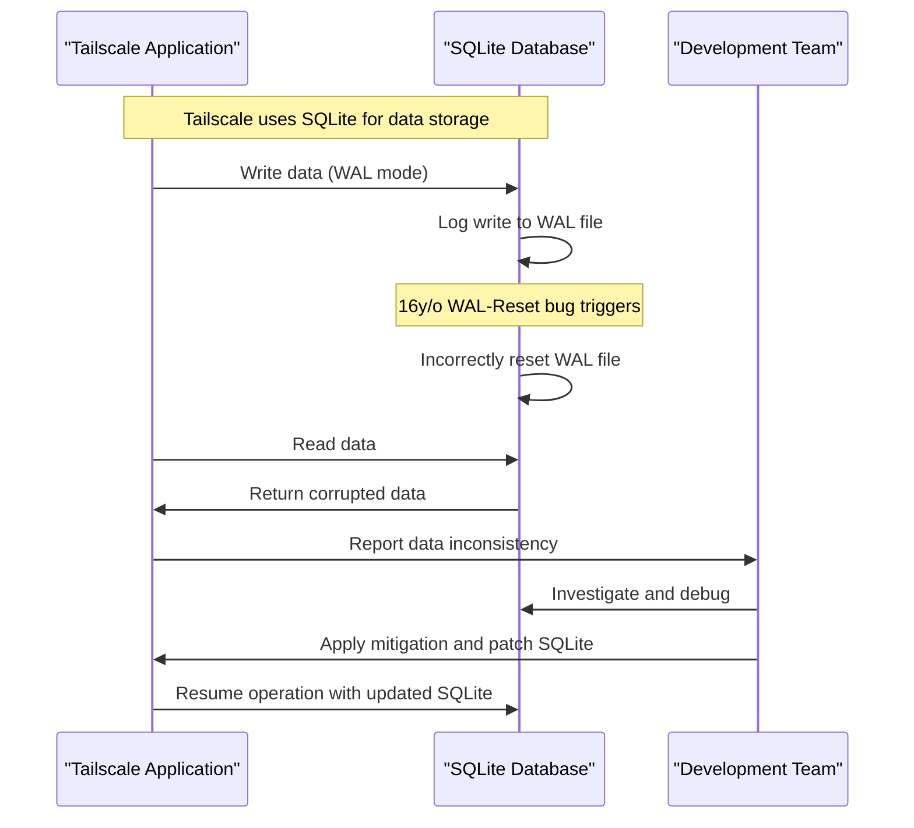

# Tailscale Traces Database Corruption to 16y/o SQLite WAL-Reset Bug

## Introduction
Tailscale, a popular platform for secure networking, relies heavily on SQLite for data storage. Recently, the Tailscale team encountered a perplexing issue with database corruption, which they eventually traced back to a 16-year-old bug in SQLite's Write-Ahead Logging (WAL) mechanism. This bug, known as the WAL-Reset bug, has significant implications for database integrity and highlights the importance of thorough testing and community engagement.

## Why This Matters
Database corruption can have severe consequences, including data loss, system crashes, and security vulnerabilities. As software engineers, we must prioritize database integrity and be aware of potential pitfalls, especially when using widely adopted technologies like SQLite. The Tailscale experience serves as a cautionary tale, emphasizing the need for rigorous testing, collaborative debugging, and proactive maintenance.

## How It Works
The WAL-Reset bug occurs when SQLite's WAL mechanism incorrectly resets the WAL file, leading to database corruption. To understand this bug, let's break down the WAL mechanism:

In this sequence diagram, we see how the Tailscale application interacts with the SQLite database, triggering the WAL-Reset bug and resulting in database corruption.

## Core Concepts
To grasp the WAL-Reset bug, it's essential to understand the basics of SQLite's WAL mechanism:
* **Write-Ahead Logging (WAL):** A journaling mode that writes transactions to a log file before updating the main database.
* **WAL file:** A log file that stores transactions, allowing SQLite to recover from crashes or power failures.
* **WAL-Reset:** A process that resets the WAL file, discarding old transactions and freeing up space.

## Examples & Code Walkthrough
To demonstrate the WAL-Reset bug, let's create a simple example:
```python
import sqlite3

# Connect to SQLite database
conn = sqlite3.connect('example.db')
cursor = conn.cursor()

# Enable WAL mode
cursor.execute("PRAGMA journal_mode=WAL")

# Simulate write-ahead logging
cursor.execute("CREATE TABLE test (id INTEGER PRIMARY KEY, value TEXT)")
cursor.execute("INSERT INTO test (value) VALUES ('Hello, World!')")

# Check for database integrity
cursor.execute("PRAGMA integrity_check")
print(cursor.fetchone())
```
This code snippet creates a SQLite database, enables WAL mode, and simulates write-ahead logging. However, to trigger the WAL-Reset bug, we need to add custom code that simulates the incorrect reset of the WAL file.

## Best Practices
To avoid the WAL-Reset bug and ensure database integrity:
* Regularly check database integrity using `PRAGMA integrity_check`.
* Monitor system logs for signs of database corruption.
* Implement robust error handling and recovery mechanisms.
* Stay up-to-date with the latest SQLite releases and patches.

## Common Mistakes & Anti-Patterns
When working with SQLite, be aware of the following pitfalls:
* **Insufficient testing:** Failing to thoroughly test database interactions can lead to unnoticed bugs and corruption.
* **Inadequate error handling:** Not implementing robust error handling mechanisms can exacerbate database corruption and make recovery more challenging.
* **Outdated SQLite versions:** Using outdated SQLite versions can expose your application to known bugs and security vulnerabilities.

## Performance Considerations
The WAL-Reset bug can have significant performance implications, including:
* **Increased latency:** Database corruption can lead to slower query performance and increased latency.
* **Higher CPU usage:** Recovery mechanisms and error handling can consume more CPU resources, impacting system performance.

## Real-World Usage
Industry leaders like Tailscale, GitHub, and Dropbox rely on SQLite for data storage. To mitigate the WAL-Reset bug, these companies:
* Regularly update their SQLite versions to ensure they have the latest patches and bug fixes.
* Implement robust testing and validation mechanisms to detect database corruption early.
* Collaborate with the SQLite community to report and fix bugs.

## Frequently Asked Questions (FAQ)
1. **What is the WAL-Reset bug, and how does it affect my application?**
The WAL-Reset bug is a 16-year-old bug in SQLite's WAL mechanism that can cause database corruption. If your application uses SQLite, you should be aware of this bug and take steps to mitigate it.
2. **How can I detect database corruption in my SQLite database?**
You can use `PRAGMA integrity_check` to detect database corruption. Regularly running this command can help you identify issues early.
3. **What are the performance implications of the WAL-Reset bug?**
The WAL-Reset bug can lead to increased latency, higher CPU usage, and slower query performance. Regularly updating your SQLite version and implementing robust error handling can help mitigate these implications.

## Conclusion
The Tailscale experience with the SQLite WAL-Reset bug serves as a reminder of the importance of thorough testing, community engagement, and proactive maintenance. By understanding the WAL mechanism, implementing robust error handling, and staying up-to-date with the latest SQLite releases, we can ensure database integrity and prevent corruption. As software engineers, it's our responsibility to prioritize database reliability and security, especially when using widely adopted technologies like SQLite.
