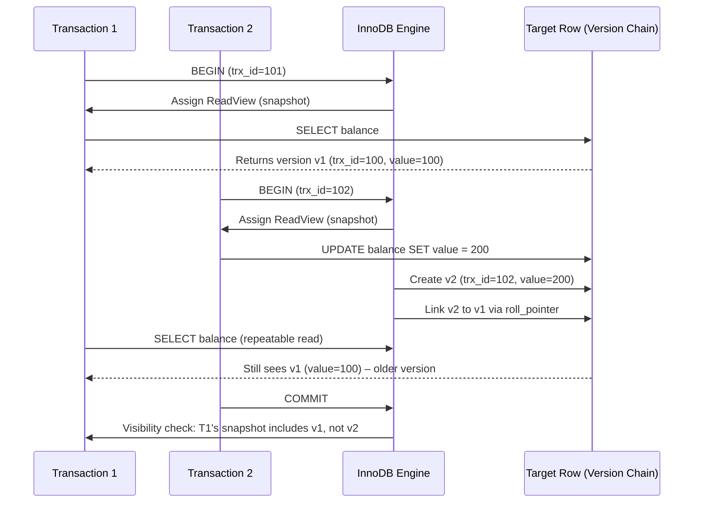

# Two Transactions, One Row: What Does MySQL Actually Let You See ?

## Introduction
Two developers start a transaction, each reads the same row, and the result differs depending on when they commit. This isn’t a race condition or a bug; it’s the core behavior of MySQL’s InnoDB storage engine. In this article we dissect exactly what MySQL shows each transaction, why it behaves that way, and how to design systems that anticipate these outcomes.

## Why This Matters
When a production service experiences inconsistent financial totals, stale user profiles, or phantom counts, the root cause is often misunderstood visibility. Understanding the mechanics of MVCC (Multi‑Version Concurrency Control) lets architects set realistic isolation levels, avoid costly retries, and debug transaction anomalies faster.

## How It Works
MySQL InnoDB uses a version chain stored in the undo log to keep multiple row versions alive until they are no longer needed. Each transaction receives a snapshot (a read view) that determines which version of a row is visible. The diagram below traces a concrete scenario with two concurrent transactions.



In this flow, T1’s snapshot captures the row as of its start. T2 creates a newer version (v2) while T1 is still active. Because T1’s snapshot predates T2’s commit, it never sees v2; it continues to read v1. When T2 commits, the engine marks v2 as committed, but T1’s view remains unchanged until its transaction ends.

## Core Concepts
- **Transaction ID (trx_id)**: Every transaction receives a monotonically increasing identifier. InnoDB records this ID in the undo log and in row version headers.
- **Read View**: Built when a transaction starts, it captures the set of trx_ids that are **committed** at the snapshot moment. Rows are visible if their creator’s trx_id is in the view or if they are marked as committed before the snapshot.
- **Version Chain**: Each row stores a pointer (`roll_pointer`) to the previous version. The chain enables rollback and snapshot construction.
- **Isolation Levels in InnoDB**:
  - **READ COMMITTED**: Snapshot is created per statement; each statement re‑evaluates visibility against the current committed state.
  - **REPEATABLE READ** (default): Snapshot is created once per transaction, guaranteeing consistent reads for the transaction’s lifetime.
- **Lock Types**: Shared (S) and exclusive (X) locks protect writes. In REPEATABLE READ, gap and next‑key locks prevent phantom rows but do not block readers.

## Examples & Code Walkthrough
Below is a minimal, reproducible example using Python and the `mysql-connector-python` driver. It demonstrates how two concurrent transactions see different values under REPEATABLE READ.

```python
import threading
import time
import mysql.connector

# Connection pool (simplified)
cnx = mysql.connector.connect(
    host='localhost',
    user='root',
    password='password',
    database='testdb',
    autocommit=False
)

def txn_one():
    cur = cnx.cursor()
    cur.execute("START TRANSACTION REPEATABLE READ")
    cur.execute("SELECT balance FROM accounts WHERE id = 1")
    balance = cur.fetchone()[0]
    print(f"[T1] Initial balance: {balance}")
    time.sleep(2)               # Simulate work
    cur.execute("COMMIT")
    cur.close()

def txn_two():
    cur = cnx.cursor()
    cur.execute("START TRANSACTION REPEATABLE READ")
    cur.execute("SELECT balance FROM accounts WHERE id = 1")
    balance = cur.fetchone()[0]
    print(f"[T2] Reads balance: {balance}")
    # Update the row after a short delay
    cur.execute("UPDATE accounts SET balance = 200 WHERE id = 1")
    time.sleep(1)               # Give T1 a chance to read again
    cur.execute("COMMIT")
    cur.close()

# Ensure the table exists
cur = cnx.cursor()
cur.execute("CREATE TABLE IF NOT EXISTS accounts (id INT PRIMARY KEY, balance INT)")
cur.execute("INSERT INTO accounts (id, balance) VALUES (1, 100) ON DUPLICATE KEY UPDATE balance = balance")
cur.close()

# Run the transactions in separate threads
t1 = threading.Thread(target=txn_one)
t2 = threading.Thread(target=txn_two)

t1.start()
t2.start()
t1.join()
t2.join()
cnx.close()
```

**Explanation of Output**  
- T1 starts first and reads the initial balance (100).  
- T2 starts, reads the same value (100), then updates the row to 200.  
- T1 reads again after T2’s commit (still within the same transaction), and sees 100 because its snapshot predates T2’s commit.  
- The printed values confirm the visibility rule illustrated in the sequence diagram.

### Real‑World Equivalent (Financial Ledger)

```sql
-- Table representing a ledger entry
CREATE TABLE ledger (
    entry_id BIGINT AUTO_INCREMENT PRIMARY KEY,
    account_id BIGINT NOT NULL,
    amount   DECIMAL(15,2) NOT NULL,
    trx_id   BIGINT NOT NULL,
    ts       TIMESTAMP DEFAULT CURRENT_TIMESTAMP,
    INDEX idx_account_trx (account_id, trx_id)
) ENGINE=InnoDB;
```

In a high‑throughput billing system, two concurrent transactions updating the same `account_id` can produce divergent sums if isolation is mismanaged. Using `REPEATABLE READ` ensures each billing batch sees a consistent total, while `READ COMMITTED` may cause temporary mismatches that require application‑level reconciliation.

## Best Practices
1. **Prefer REPEATABLE READ for business‑critical reads** – it eliminates non‑repeatable reads without the overhead of per‑statement snapshots.
2. **Keep transactions short** – long‑running transactions increase the size of the undo log and raise the chance of lock contention.
3. **Use explicit `SELECT ... FOR UPDATE` only when necessary** – it introduces exclusive locks that block readers and can cause deadlocks.
4. **Monitor undo log usage** – `SHOW ENGINE INNODB STATUS` and `performance_schema.data_locks` reveal whether you are exhausting undo space, which leads to “snapshot too old” errors.
5. **Design idempotent operations** – retries are inevitable; make them safe to execute multiple times (e.g., using version columns or `INSERT ... ON DUPLICATE KEY UPDATE`).

## Common Mistakes & Anti-Patterns
| Mistake | Why It Fails | Fix |
|---------|--------------|-----|
| Assuming `READ COMMITTED` guarantees the latest committed value within the same transaction. | Snapshot is per statement, not per transaction; you can read a newer version after a prior read in the same transaction. | Use `REPEATABLE READ` for consistent reads, or re‑read after a commit if you truly need the latest state. |
| Relying on gap locks to prevent phantom rows without understanding next‑key locking. | Gap locks protect ranges, but next‑key locks also lock the next record, potentially causing unnecessary blocking. | Evaluate workload: if phantoms are rare, consider `READ COMMITTED` to reduce lock scope. |
| Ignoring undo log size and letting it grow unchecked. | Undo retention (`innodb_undo_tablespaces`, `undo_log_truncate`) may purge needed versions, causing “cannot serialize access due to undo log” errors. | Size undo tablespaces appropriately, tune `undo_log_truncate` based on workload, and regularly purge old undo data. |
| Mixing `AUTOCOMMIT=1` with long‑running explicit transactions. | Implicit commits break the atomicity of your logical transaction, leading to partial updates visible to other sessions. | Disable autocommit for multi‑step operations or wrap them in `START TRANSACTION … COMMIT`. |

## Performance Considerations
- **Undo Log Overhead**: Each row update creates a new version; excessive updates inflate undo size and memory pressure.
- **Read View Construction**: Snapshot creation is cheap, but large transactions that touch many tables increase the size of the read view and may cause longer visibility checks.
- **Lock Contention**: Exclusive locks on the same row version cause serialization; use row‑level locking (`SELECT ... FOR UPDATE`) sparingly.
- **CPU Cost of Version Chain Traversal**: For heavily updated rows, MySQL must walk back through multiple versions to find a visible one. Indexing the primary key helps keep the chain short.

## Real-World Usage
- **Uber** uses REPEATABLE READ for ride‑matching calculations to avoid non‑repeatable reads while a driver’s status changes.
- **Netflix** employs READ COMMITTED for analytics pipelines where occasional staleness is acceptable, reducing lock contention on massive tables.
- **Cloudflare** implements idempotent request handling combined with version columns to guarantee exactly‑once semantics despite MySQL’s visibility rules.

## Frequently Asked Questions (FAQ)

**Q1: Can I force MySQL to show the newest version of a row inside the same transaction?**  
A: Yes. Switch the isolation level to `READ COMMITTED` or issue `SELECT ... FOR UPDATE` to re‑evaluate visibility after a write. However, this breaks the repeatable‑read guarantee.

**Q2: What happens if a transaction aborts before committing?**  
A: InnoDB rolls back all changes, discarding the versions it created. The undo log entries are removed, freeing space. No other transaction sees the aborted modifications.

**Q3: How does `innodb_flush_log_at_trx_commit` affect visibility?**  
A: It controls durability vs. performance. With `=1`, the log is flushed to disk on every commit, ensuring that committed rows are immediately visible to other transactions. Lower values improve throughput but may delay visibility.

**Q4: Why do I sometimes see “History list length” warnings?**  
A: It indicates that long‑running transactions keep old versions alive, preventing garbage collection of undo data. Reduce transaction duration or increase undo tablespace size.

**Q5: Is there a way to see which version a row will use for a given transaction?**  
A: Use `SHOW ENGINE INNODB STATUS` and look at the “TRANSACTIONS” section; it lists visible and hidden versions. For deeper inspection, examine the undo log directly via `ibd2sdi` or third‑party tools.

## Conclusion
MySQL’s visibility model is deterministic: each transaction sees a consistent snapshot defined at its start, and row versions are chosen based on that snapshot’s committed‑transaction set. Understanding the interplay of transaction IDs, undo logs, and isolation levels transforms a puzzling “different results” symptom into a predictable, manageable behavior. Apply the best practices above, keep transactions short, and monitor undo usage to harness MySQL’s concurrency primitives confidently.
