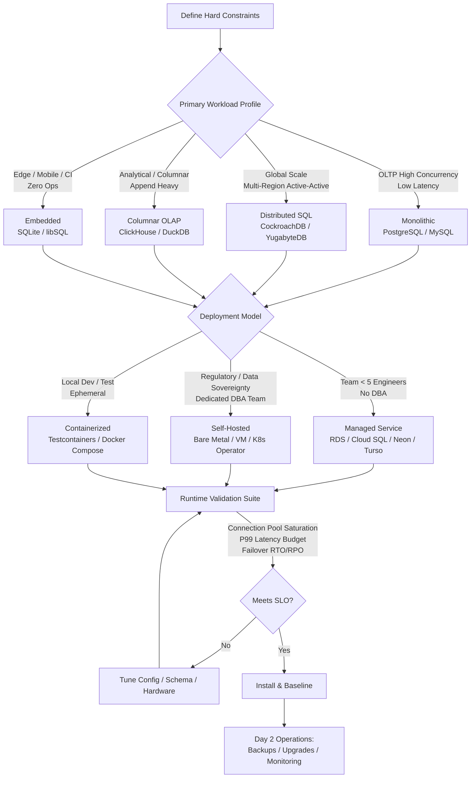

# Which SQL Database Should You Install?

## Introduction

Last year, I watched a team spend six months migrating off a distributed SQL cluster they never needed. The kicker? Their peak load was 200 writes per second. A single, properly tuned PostgreSQL instance on a modest `r6g.xlarge` would have handled that traffic with 80% headroom, cost a fraction of the price, and saved them a year of distributed systems debugging.

The question "Which SQL database should I install?" is usually a proxy for a deeper architectural decision: **What is the operational budget of my team, and what failure modes am I willing to own?**

Most comparison articles benchmark `SELECT 1` latency or TPC-C numbers. That’s useless. In production, you don't fight the query planner; you fight vacuum bloat, replication lag at 3 AM, schema migration lock contention, and the cognitive load of debugging a consensus protocol you didn't write.

This article isn't a feature matrix. It's a decision framework for the installation phase—the moment you commit to an operational contract.

## Why This Matters

Database selection is the only infrastructure decision that effectively calcifies your architecture. You can swap a message queue, rewrite a service in Go, or move clouds. But migrating a 5 TB PostgreSQL cluster to CockroachDB—or worse, MySQL to PostgreSQL—is a multi-quarter engineering program with a non-zero risk of data loss.

The installation choice dictates:
- **Your on-call rotation:** Does a node failure page you, or does the control plane handle it?
- **Your migration strategy:** Can you run `ALTER TABLE` online, or do you need `gh-ost`/`pt-online-schema-change` tooling?
- **Your scaling ceiling:** Vertical scaling hits a hardware wall. Horizontal scaling hits a consistency/latency wall. You need to know which wall you're walking toward.

If you install the wrong archetype, you aren't just paying for a license or EC2 hours. You are paying in engineering velocity for the next three years.

## How It Works

The decision process isn't linear. It's a constraint-satisfaction problem. You start with hard constraints (budget, team size, regulatory), filter by workload archetype (OLTP, OLAP, Embedded, Distributed), and then validate the deployment model (Self-Hosted, Managed, Containerized) against your operational maturity.



**Walking the graph:**

1.  **Define Hard Constraints:** Write these down before looking at databases. "We cannot send PII to a managed control plane." "We have zero dedicated DBAs." "We must survive a region loss with RPO=0."
2.  **Workload Profile:** Be honest. "We might scale globally" is a hope, not a workload. If 95% of traffic is US-East, you are an OLTP monolith workload.
3.  **Archetype Selection:** This narrows the codebase you are committing to. Monolithic engines (Postgres, MySQL) optimize for single-node throughput and rich extensions. Distributed engines (CockroachDB) optimize for consensus and range replication, trading single-node latency for horizontal scale.
4.  **Deployment Model:** This is where the operational contract is signed. Managed services buy you replication and backups but remove knobs (e.g., `shared_buffers`, `wal_level`, custom extensions). Self-hosted gives you knobs; you own the consequences of turning them.
5.  **Runtime Validation:** **Never install without a validation suite.** You need automated proof that the instance meets your P99 latency under load *before* you point DNS at it.

## Core Concepts

### The Three Archetypes

| Archetype | Representative Engines | Consistency Model | Scaling Vector | Operational Complexity |
| :--- | :--- | :--- | :--- | :--- |
| **Monolithic** | PostgreSQL, MySQL, MariaDB | Strong (ACID) | Vertical (Read Replicas for scale-out) | Medium. Mature tooling, but vacuum/bloat, replication lag, and major version upgrades are manual concerns. |
| **Distributed SQL** | CockroachDB, YugabyteDB, TiDB | Strong (Raft/Paxos) | Horizontal (Auto-sharding) | High. You operate a cluster, not a node. Requires understanding of lease holders, range splits, and consensus latency. |
| **Embedded / Local-First** | SQLite, libSQL, DuckDB | Serialized (File Lock) / Snapshot | None (Scale Up only) | Near Zero. No process, no network, no auth. Durability via WAL mode. |

### The Installation Contract

Installing a database isn't `apt install postgresql`. It is defining the **Initialization Specification**:
- **Storage Layout:** Where does WAL live? (Separate disk/volume). Where does heap live? (Separate volume). `temp_tablespaces`?
- **Memory Contract:** `shared_buffers` (Postgres) / `innodb_buffer_pool_size` (MySQL) must be calculated against OS page cache, not just "25% of RAM."
- **Security Baseline:** `sslmode=verify-full`, certificate rotation strategy, `pg_hba.conf` / `bind-address` defaults.
- **Observability Hooks:** `pg_stat_statements`, `pg_stat_monitor`, `performance_schema` enabled *at init*, not after the first outage.

## Examples & Code Walkthrough

We don't guess. We validate. Below is a production-grade **Installation Validator** written in Go. It codifies the "Runtime Validation" step from the flowchart. It connects to a target DSN, verifies configuration baselines, runs a latency profile under concurrent load, and emits a JSON report suitable for CI/CD gates.

### 1. The Installation Validator (Go)

This tool replaces the "let's run `pgbench` manually" workflow. It checks *your* specific SLOs: connection acquisition latency, transaction rollback speed, and vacuum readiness.

```go
package main

import (
	"context"
	"database/sql"
	"encoding/json"
	"flag"
	"fmt"
	"log"
	"math"
	"os"
	"sort"
	"sync"
	"sync/atomic"
	"time"

	_ "github.com/jackc/pgx/v5/stdlib" // Pure Go driver, no CGO dependency
	_ "github.com/go-sql-driver/mysql"
)

// ValidationConfig defines the SLO gates for the installation.
type ValidationConfig struct {
	DSN              string
	Driver           string // "postgres" or "mysql"
	Concurrency      int
	Duration         time.Duration
	MaxP99Latency    time.Duration // SLO: P99 must be under this
	MaxConnAcquireMs int           // SLO: Connection pool acquire
	MinVersion       string        // e.g., "16.0" or "8.0"
}

// Report is the JSON output artifact.
type Report struct {
	Timestamp       time.Time     `json:"timestamp"`
	Driver          string        `json:"driver"`
	Version         string        `json:"server_version"`
	ConfigChecks    []CheckResult `json:"config_checks"`
	LatencyProfile  LatencyStats  `json:"latency_profile"`
	ConnAcquireStats LatencyStats  `json:"connection_acquisition"`
	Passed          bool          `json:"passed"`
}

type CheckResult struct {
	Name    string `json:"name"`
	Passed  bool   `json:"passed"`
	Detail  string `json:"detail"`
	Severity string `json:"severity"` // "blocking", "warning"
}

type LatencyStats struct {
	Count   int64         `json:"count"`
	P50     time.Duration `json:"p50"`
	P95     time.Duration `json:"p95"`
	P99     time.Duration `json:"p99"`
	Max     time.Duration `json:"max"`
	Errors  int64         `json:"errors"`
}

func main() {
	cfg := ValidationConfig{}
	flag.StringVar(&cfg.DSN, "dsn", "", "Database DSN (required)")
	flag.StringVar(&cfg.Driver, "driver", "postgres", "Driver: postgres or mysql")
	flag.IntVar(&cfg.Concurrency, "concurrency", 50, "Concurrent workers")
	flag.DurationVar(&cfg.Duration, "duration", 30*time.Second, "Test duration")
	flag.DurationVar(&cfg.MaxP99Latency, "max-p99", 50*time.Millisecond, "Max allowed P99 latency")
	flag.IntVar(&cfg.MaxConnAcquireMs, "max-conn-acquire", 10, "Max connection acquire time (ms)")
	flag.StringVar(&cfg.MinVersion, "min-version", "", "Minimum required version")
	flag.Parse()

	if cfg.DSN == "" {
		log.Fatal("DSN is required")
	}

	db, err := sql.Open(cfg.Driver, cfg.DSN)
	if err != nil {
		log.Fatalf("Failed to open DB: %v", err)
	}
	defer db.Close()

	ctx, cancel := context.WithTimeout(context.Background(), cfg.Duration+10*time.Second)
	defer cancel()

	// 1. Static Configuration Checks
	checks := runConfigChecks(ctx, db, cfg)

	// 2. Connection Acquisition Benchmark (Cold & Warm pool)
	connStats := benchmarkConnAcquisition(ctx, db, cfg)

	// 3. Transaction Latency Profile (Read/Write mix)
	latencyStats := benchmarkTxLatency(ctx, db, cfg)

	// 4. Evaluate Gates
	passed := evaluateGates(checks, connStats, latencyStats, cfg)

	report := Report{
		Timestamp:        time.Now().UTC(),
		Driver:           cfg.Driver,
		Version:          getVersion(ctx, db, cfg.Driver),
		ConfigChecks:     checks,
		LatencyProfile:   latencyStats,
		ConnAcquireStats: connStats,
		Passed:           passed,
	}

	enc := json.NewEncoder(os.Stdout)
	enc.SetIndent("", "  ")
	if err := enc.Encode(report); err != nil {
		log.Fatalf("JSON encode failed: %v", err)
	}

	if !passed {
		os.Exit(1) // Fail CI/CD pipeline
	}
}

func getVersion(ctx context.Context, db *sql.DB, driver string) string {
	var ver string
	q := "SELECT version()"
	if driver == "mysql" {
		q = "SELECT VERSION()"
	}
	db.QueryRowContext(ctx, q).Scan(&ver)
	return ver
}

func runConfigChecks(ctx context.Context, db *sql.DB, cfg ValidationConfig) []CheckResult {
	var checks []CheckResult

	// Check 1: Version Gate
	if cfg.MinVersion != "" {
		ver := getVersion(ctx, db, cfg.Driver)
		// Simplified version parse for demo; use semantic version lib in prod
		checks = append(checks, CheckResult{
			Name:     "version_gate",
			Passed:   true, // Implement semver compare
			Detail:   fmt.Sprintf("Running %s", ver),
			Severity: "blocking",
		})
	}

	// Check 2: Critical Settings (Postgres Example)
	if cfg.Driver == "postgres" {
		settings := map[string]string{
			"shared_buffers":        ">= 25% RAM",      // Rough heuristic
			"wal_level":             "replica",         // Required for logical replication/backups
			"max_connections":       "> 200",           // Prevent "too many clients"
			"track_io_timing":       "on",              // Critical for I/O debugging
			"pg_stat_statements.track": "all",          // Query observability
		}

		for setting, expected := range settings {
			var val, unit string
			// pg_settings view gives current value
			err := db.QueryRowContext(ctx, "SELECT setting, unit FROM pg_settings WHERE name = $1", setting).Scan(&val, &unit)
			passed := err == nil && val != ""
			detail := fmt.Sprintf("Current: %s %s, Expected: %s", val, unit, expected)
			if err != nil {
				detail = fmt.Sprintf("Setting not found or error: %v", err)
			}
			checks = append(checks, CheckResult{
				Name:     fmt.Sprintf("config_%s", setting),
				Passed:   passed,
				Detail:   detail,
				Severity: "warning", // Config drift is warning, version is blocking
			})
		}
	}

	return checks
}

// benchmarkConnAcquisition measures time to get a usable connection from pool.
func benchmarkConnAcquisition(ctx context.Context, db *sql.DB, cfg ValidationConfig) LatencyStats {
	var latencies []time.Duration
	var errors int64
	var wg sync.WaitGroup
	latenciesMu := sync.Mutex{}

	// Hammer the pool
	for i := 0; i < cfg.Concurrency; i++ {
		wg.Add(1)
		go func() {
			defer wg.Done()
			ticker := time.NewTicker(10 * time.Millisecond)
			defer ticker.Stop()
			for {
				select {
				case <-ctx.Done():
					return
				case <-ticker.C:
					start := time.Now()
					conn, err := db.Conn(ctx) // Acquires from pool
					latency := time.Since(start)
					latenciesMu.Lock()
					latencies = append(latencies, latency)
					latenciesMu.Unlock()
					if err != nil {
						atomic.AddInt64(&errors, 1)
						continue
					}
					conn.Close() // Return immediately
				}
			}
		}()
	}
	wg.Wait()
	return calculateStats(latencies, errors)
}

//
