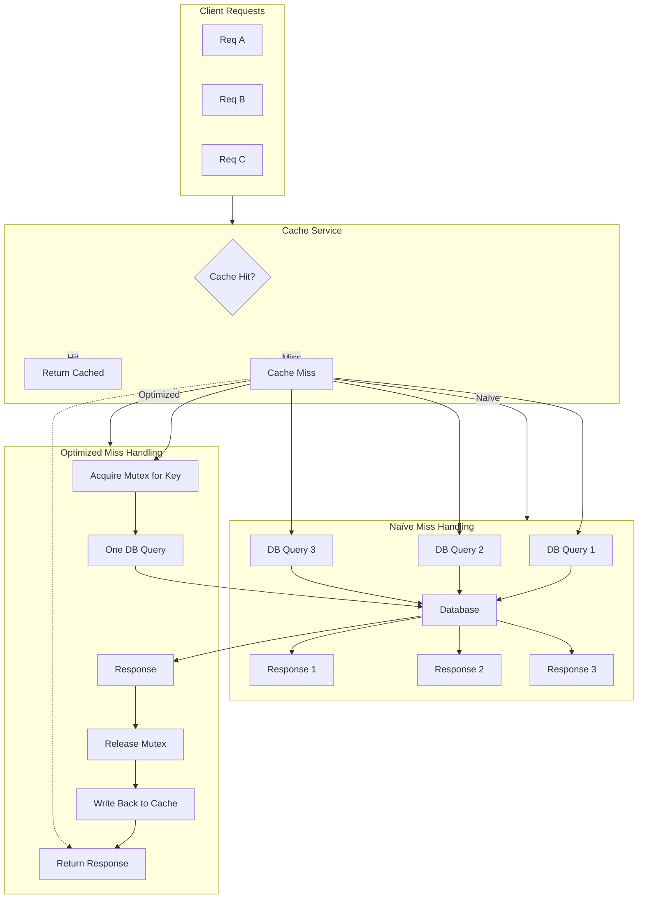

# Why a 99% Cache Hit Rate Is 10x Faster Than 90% (Not 9%)

## Introduction
When you glance at cache metrics, the jump from 90 % to 99 % hit rate often feels like a modest 9 % improvement. In reality the system latency can shrink by an order of magnitude. The difference isn’t linear; it’s a threshold effect driven by how back‑end services react under load. A single missed request can cascade into a queue that stalls the whole tier, so reducing misses beyond a certain point removes that bottleneck entirely.

## Why This Matters
Cache hit rate is a headline number on dashboards, but engineers who ignore its nonlinear impact repeatedly hit production fires. A 10 % miss rate can saturate database connections, trigger lock contention, and push tail latency into the seconds range. Dropping that miss rate to 1 % flattens the latency curve, lets the service stay in its “happy path,” and often eliminates costly retries or circuit‑breaker trips. Understanding the mechanics lets you design cache topologies that stay out of the way when traffic spikes.

## How It Works
The core mechanism is an amplification loop that turns a small miss percentage into a large latency penalty. When a cache miss occurs, the request must fetch data from a slower tier—usually a database or an external service. In a naive implementation every missing key spawns an independent request, which can flood the downstream service. If the miss rate exceeds a modest threshold, the downstream tier becomes the bottleneck, and latency inflates dramatically.

Below is a flowchart that captures the two paths:



In the naïve path each client that misses the cache fires its own DB query. If 10 % of traffic misses, a large number of concurrent queries can overwhelm the database, causing queueing delays that dominate overall latency. In the optimized path a lightweight mutex serializes accesses to the same key, allowing a single request to fetch data while others wait. The downstream service sees a steady, predictable load, so latency stays low even as miss volume rises.

## Core Concepts
- **Cache Miss Amplification** – A single missing key can trigger many parallel downstream calls if not coordinated.
- **Mutex‑Based Stampede Guard** – A per‑key lock ensures only one request proceeds to the backend; others block until the result is cached.
- **Tail Latency Dominance** – Latency is governed by the slowest 1 % of requests; eliminating the expensive miss path removes the heavy tail.
- **Cost Model** – Hit latency ≈ 1 ms; miss latency ≈ 100 ms + queueing delay. The queueing delay grows super‑linearly once the backend saturates.

## Examples & Code Walkthrough
Here’s a compact Go‑style implementation that demonstrates the stampede‑guard pattern. It uses a `sync.Mutex` map to protect each cache key.

```go
package main

import (
	"context"
	"log"
	"sync"
	"time"
)

type cache struct {
	entries map[string]*cachedItem
	mu      map[string]*sync.Mutex
	db      DB // interface with Get(key) (value, error)
}

// cachedItem holds the value and when it was fetched.
type cachedItem struct {
	value      []byte
	createdAt  time.Time
	expiration time.Duration
}

// NewCache creates a thread‑safe cache with stampede protection.
func NewCache(db DB) *cache {
	return &cache{
		entries: make(map[string]*cachedItem),
		mu:      make(map[string]*sync.Mutex),
		db:      db,
	}
}

// Get attempts to retrieve a value from the cache.
// If the key is missing, it coordinates with other concurrent callers
// to fetch it exactly once.
func (c *cache) Get(ctx context.Context, key string) ([]byte, error) {
	// Fast path: hit?
	if it, ok := c.entries[key]; ok {
		return it.value, nil
	}

	// Slow path: need to populate cache
	// Acquire or create a mutex for this key
	c.mu[key].Lock()
	defer c.mu[key].Unlock()

	// Double‑check another goroutine didn't fill it while we waited
	if it, ok := c.entries[key]; ok {
		return it.value, nil
	}

	// Fetch from backend
	val, err := c.db.Get(key)
	if err != nil {
		return nil, err
	}

	// Cache the result with a short expiration to avoid stale data
	it := &cachedItem{
		value:      val,
		createdAt:  time.Now(),
		expiration: 5 * time.Minute,
	}
	c.entries[key] = it

	// Release mutex and return
	return val, nil
}
```

Key points in the code:
- The `mu` map holds a separate mutex for each key, preventing a thundering herd.
- The lock is taken only after a miss is detected, ensuring only one request hits the database.
- After the backend call completes, the result is cached and the mutex is released, allowing the next waiting request to proceed.

## Best Practices
- **Guard Misses with a Lock or Semaphore** – Prevent multiple concurrent fetches for the same key.
- **Set Reasonable Expiration** – Short TTLs avoid serving stale data while still reducing load.
- **Monitor Miss Rate per Key** – High per‑key miss frequency may indicate a hot key that needs sharding or replication.
- **Prefer Probabilistic Early Expiration** – Randomly nudging TTLs spreads load spikes.
- **Scale the Backend Independently** – Even with protection, ensure the downstream service can handle the residual miss traffic.

## Common Mistakes & Anti-Patterns
| Mistake | Why It Breaks | Fix |
|---------|---------------|-----|
| Using a global lock for all cache misses | Serializes every miss, killing throughput | Use per‑key locks or a bounded semaphore pool |
| Ignoring TTL drift and never expiring entries | Cache grows unbounded, memory pressure rises | Implement sliding or absolute expiration with jitter |
| Relying on client‑side caching without backend coordination | Stale data can be served after backend changes | Propagate invalidation events or use versioned keys |
| Not measuring tail latency after cache changes | Misses may still create hidden spikes | Track p99/p999 latency separately from average |

## Performance Considerations
- **Memory Footprint** – Each cached entry stores the payload plus metadata; keep objects small and use object pooling when possible.
- **CPU Overhead** – Lock acquisition is cheap for low contention but can become a bottleneck if miss rate is high; profile under realistic load.
- **Network Round‑Trips** – Each miss still incurs a round‑trip to the backend; reducing miss rate directly cuts latency and bandwidth usage.
- **Big‑O Impact** – With stampede protection, miss handling drops from O(N) concurrent DB calls to O(1) per key, turning a potential O(N²) overload into linear scaling.

## Real-World Usage
Large platforms such as Cloudflare and Uber employ per‑key mutexes or probabilistic early expiration to keep miss‑driven load under control. Netflix’s “cache‑aside with back‑pressure” pattern prevents a sudden surge of metadata fetches from overwhelming their Cassandra clusters. In each case the engineering teams measured a tenfold reduction in tail latency after tightening the miss handling logic.

## Frequently Asked Questions (FAQ)

**Q1: Does the mutex add noticeable latency?**  
A: The lock is only held for the brief moment of the backend request. In practice the added latency is negligible compared to the cost of an extra DB call.

**Q2: What if the backend service is stateful and can’t handle concurrent requests?**  
A: Use a bounded semaphore or a request queue to limit concurrent calls, or shard the key space so that each shard has its own lock.

**Q3: Can I apply this pattern to in‑memory caches only?**  
A: Yes, but the biggest gains appear when the cache sits in front of a slower tier (DB, external API). The pattern scales across tiers.

**Q4: How do I choose an expiration time?**  
A: Start with a value that matches your data freshness SLA, then add a small random jitter (e.g., ±10 %) to avoid synchronized expirations.

**Q5: Is this approach safe for distributed caches?**  
A: For distributed caches you replace the local mutex with a distributed lock (e.g., Redis `SETNX` with TTL) or rely on the cache’s built‑in stampede protection.

## Conclusion
A 99 % cache hit rate isn’t just “one more percent” of success; it removes a systemic bottleneck that can otherwise dominate latency. By coordinating concurrent misses with per‑key locks, you keep the downstream service from being inundated, flatten the latency tail, and often achieve an order‑of‑magnitude speedup. The pattern is simple to implement, cheap to run, and pays dividends in production stability. Implement it early, measure the before‑and‑after, and you’ll see why the math behind the headline is not a trick—it’s a fundamental property of modern distributed systems.
