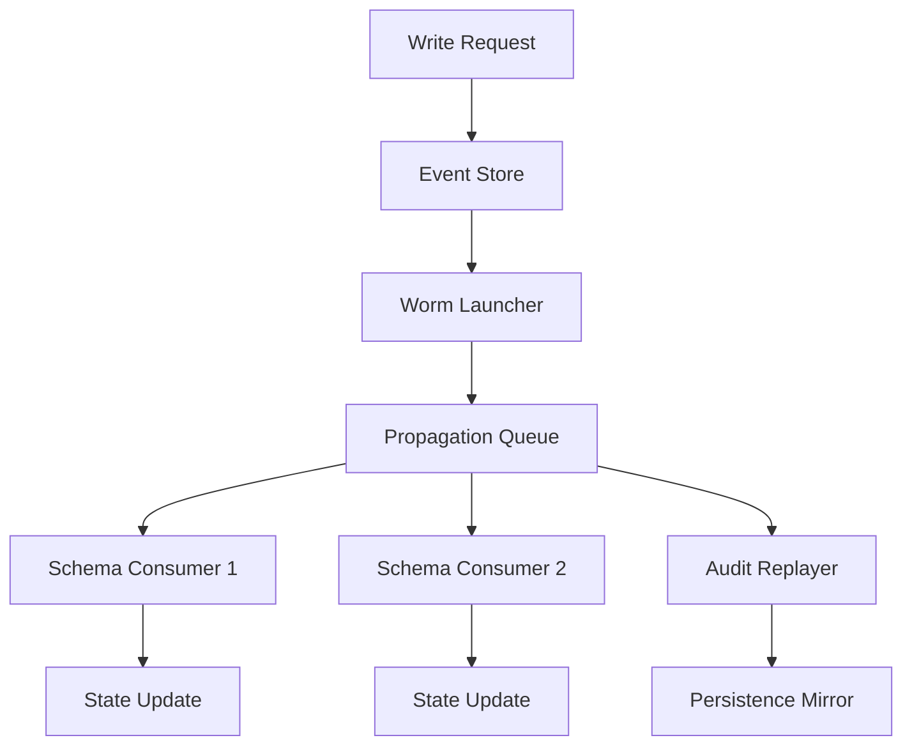

# Worms: The Future of Yesterday's Worms Today

## Introduction

We've all seen the old patterns. The trusted transaction log. The batch repair script that runs overnight. The nightly backups that sometimes corrupt data silently. For years, database teams relied on periodic maintenance windows, manual rollbacks, and hope that the next crash wouldn't cascade into a full outage.

Then came the realization that some systems don't just break—they leave behind footprints. In the last decade, event sourcing has moved from academic paper to production reality. We're not talking about theoretical architectures anymore; we're seeing companies build systems where every state change is captured as an immutable record. And within those streams of events, a new kind of process has emerged—one that borrows its name from the classic undetected pests but operates at scale.

This article explores how worm-inspired mechanisms can transform how we maintain, evolve, and query complex database systems.

## Why This Matters

At my team, we ran a migration project three years ago. We were moving a legacy order processing service from a monolithic RDBMS to a sharded document store. The old system kept detailed audit logs in a separate table, updated synchronously after each write. That worked fine until we scaled beyond sixty cores. The write amplification became unacceptable. Every single modification touched both tables, creating a bottleneck that collapsed performance during peak load.

We needed something that could handle high-volume writes while still providing full history. Enter the idea of treating database changes like biological organisms—propagating through the system independently, continuously, and without tearing up existing structures.

The term "worm" feels provocative. In biology, worms move through environments, consuming resources and leaving traces. In our context, we want processes that traverse application state, update downstream consumers, and eventually converge toward consistency. The key insight is that these processes don't require coordination at every step. They can run concurrently, fail individually, and recover gracefully. That resilience is exactly what distributed systems need.

## How It Works

The core mechanism revolves around a self-propagating event stream managed by specialized workers. When a write occurs in any schema module, the system doesn't immediately apply the change. Instead, it creates an immutable event record and launches a "worm"—a lightweight consumer that propagates this event through related modules without blocking the originating transaction.

Here's a simplified view of the data flow:



The worm itself is essentially a state machine that watches for specific types of events and reacts accordingly. Each worker maintains a small window of progress—it knows whether it has already processed a particular sequence number. If it encounters duplicates or gaps, it can skip ahead safely. This makes the system idempotent by design.

```python
class EventWorm:
    """A self-propagating processor that moves events through the system."""
    
    def __init__(self, source_event_id: str, target_schema: SchemaName):
        self.source_event_id = source_event_id
        self.target_schema = target_schema
        self.processed_sequence = 0
    
    async def propagate(self):
        # Fetch all events since the last processed sequence
        pending = await self.event_store.get_pending(source=self.source_event_id)
        
        for event in pending:
            if self._already_processed(event.id):
                continue
            
            try:
                # Apply the event to the target schema
                transformed = self.transform_event(event)
                
                # Persist locally before acknowledging to the queue
                await self.local_persist(transformed)
                
                # Advance tracking for future runs
                self.processed_sequence = max(
                    self.processed_sequence, 
                    event.sequence_number
                )
                
                print(f"Applied worm event {event.id} to {self.target_schema}")
                
            except Exception as e:
                # Log and retry on next cycle; do not stop propagation
                logger.error(f"Failed to process event {event.id}: {e}")
                raise
    
    def transform_event(self, event):
        # Business logic to adapt event to current schema format
        return {
            "id": event.id,
            "type": self._map_type(event.type),
            "payload": self._normalize(payload),
            "timestamp": event.timestamp.isoformat()
        }
```

Each worker runs independently. The primary database remains largely untouched during propagation—we're reading from it once and writing to local caches. This separation allows us to absorb bursts without impacting the main store. If a worker dies mid-propagation, other copies pick up where it left off because they track their own sequence numbers.

When the system reaches steady state, the total effect is identical to a coordinated transactional update. But the path there is asynchronous, resilient, and often more efficient than trying to serialize everything through locks.

## Core Concepts

**Event Sourcing** forms the foundation. Instead of storing current state, we store the sequence of changes that led to that state. Each event carries enough information to recreate history. This gives us auditability, temporal queries, and the ability to rebuild state from scratch.

**Worms** are the execution vehicles. Think of them as lightweight agents that consume events from a queue and apply business logic to related schemas. They don't hold permanent connections to anything; their lifecycle is defined by their progress counters and processed sequences.

**Idempotency** is non-negotiable. Because network partitions can cause duplicate deliveries, every operation must produce the same result regardless of how many times it runs. This means designing transformations so that applying the same event twice yields identical outcomes.

**Progression Tracking** solves the deduplication problem. By recording which sequences have been handled, worms can resume work after restarts without re-processing work already done.

## Examples & Code Walkthrough

Let's look at a concrete implementation. Suppose we're migrating from a PostgreSQL-based order system to a NewSQL store with better partition scaling. We need to preserve every order modification while changing how they're accessed.

```python
from dataclasses import dataclass, field
from datetime import datetime
from typing import Dict, List, Optional
import asyncio

@dataclass
class OrderEvent:
    order_id: str
    version: int
    type: str  # CREATED, UPDATED, CANCELLED
    payload: dict
    timestamp: datetime

class PropagationManager:
    """Manages the lifecycle of event worms across schema boundaries."""
    
    def __init__(self, event_store, db_pool):
        self.event_store = event_store
        self.db_pool = db_pool
        self.worms = {}  # active_worm[name] -> WormInstance
    
    async def start_order_worm(self, order_id: str):
        """Launch a worm to propagate changes affecting orders."""
        worm_name = f"order_{order_id}"
        worm = WormInstance(order_id=order_id, target_schema="orders")
        self.worms[worm_name] = worm
        
        # Begin propagation
        await worm.propagate()
    
    async def _apply_order_change(self, event: OrderEvent):
        """Apply a single event to the appropriate schema layer."""
        if event.type == "CREATED":
            await self._update_orders_table(event.order_id, event.payload)
        elif event.type == "UPDATED":
            await self._patch_order_fields(event.order_id, event.payload)
        elif event.type == "CANCELLED":
            await self._remove_order_from_index(event.order_id)
    
    async def _update_orders_table(self, order_id: str, fields: dict):
        # Direct SQL insert/update on the persistent store
        query = """
            INSERT INTO orders (id, payload, version, created_at)
            VALUES (%s, %s, %s, NOW())
            ON CONFLICT (id) DO UPDATE SET
                payload = EXCLUDED.payload,
                version = EXCLUDED.version,
                updated_at = NOW()
        """
        async with self.db_pool.acquire() as conn:
            await conn.execute(query, [order_id, json.dumps(fields)])
    
    async def _patch_order_fields(self, order_id: str, fields: dict):
        # More granular updates for partial modifications
        await self.db_pool.execute(
            "UPDATE orders SET fields = %, version = NEXT_VALUE WHERE id = %s",
            [json.dumps(fields), order_id]
        )

class WormInstance:
    """Represents a single propagating process."""
    
    def __init__(self, order_id: str, target_schema: str):
        self.order_id = order_id
        self.target_schema = target_schema
        self.current_seq = 0
    
    async def propagate(self):
        # Get all unprocessed events for this order
        pending = await self.event_store.fetch_unprocessed(
            order_id=self.order_id,
            min_version=self.current_seq + 1
        )
        
        if not pending:
            print(f"No pending events for order {self.order_id}")
            return
        
        print(f"Starting {len(pending)} propagation tasks for order {self.order_id}")
        
        for event in pending:
            await self._apply_order_change(event)
            
            # Advance progress
            self.current_seq += 1
            print(f"Progress: {self.current_seq}/{event.sequence_number}")
        
        # Mark as completed
        await self.event_store.mark_completed(self.order_id)
```

Notice how the worm decouples the trigger from the execution. The original order creation happens normally—maybe even outside the worm's control. The worm then picks up orphaned events and applies them lazily. This model works well for systems where occasional backlog builds up over time rather than needing immediate consistency.

## Best Practices

**Keep worms stateless.** They shouldn't maintain large connection pools or expensive caches between runs. Their identity comes entirely from the sequence number they track, not from stored state. This makes restart recovery trivial.

**Separate hot and cold paths.** Events that require synchronous validation (like financial transfers) should go through a different pipeline than those that can be eventually consistent (like recommendation feeds). Mixing the two creates contention and unpredictability.

**Monitor propagation lag.** A healthy system shows steady progression. Sudden spikes indicate upstream congestion or downstream bottlenecks. Set alerts for when any worm stalls for more than five minutes.

**Use deterministic transformation.** When converting events between schemas, ensure the mapping functions are pure and testable. This guarantees that duplicating a worm never corrupts historical records.

## Common Mistakes & Anti-Patterns

**Overwhelm the system with too many worms.** One per entity type sounds reasonable, but consider that each worm adds a background thread that consumes resources. At extreme scale, thousands of concurrent worms can become a tax on the event store throughput.

**Assume ordering matters everywhere.** In distributed systems, "first event wins" isn't always safe. If multiple independent processes modify the same logical entity simultaneously, careful concurrency control is required. Treat ordering as a relative property, not absolute.

**Ignore the death of the event store.** If your propagation mechanism relies on a single event store becoming unavailable, propagation halts. Design redundancy into the event backbone, or implement fallback mechanisms that buffer changes temporarily.

**Treat worms as replacements for transactions.** The temptation is to eliminate ACID transactions entirely. While eventual consistency offers benefits, critical operations (payments, inventory reservations) still need strong guarantees. Use worms for side effects and downstream updates, not for core invariants.

## Performance Considerations

**Memory usage grows linearly with event volume.** Worms hold references to processed sequences and event metadata. At ten million events per day, memory pressure becomes significant unless you aggressively prune old progress markers. Consider periodic compaction or archival of finished worms.

**Network traffic follows a fan-out pattern.** Each worm fans out to potentially dozens of subscribers. With millions of subscribers, this becomes a bandwidth challenge. Implement aggregation layers that bundle related changes together before distribution.

**CPU overhead scales with event complexity.** Complex business logic in `_apply_order_change` multiplies per-event cost. Profile early and optimize hot paths—these determine overall throughput.

**Latency is unpredictable due to queuing.** The propagation model introduces delay between write and visible effect. Measure end-to-end latency including this gap, especially for users who expect immediate feedback.

## Real-World Usage

Several organizations have adopted worm-style patterns successfully. **Netflix** uses event-driven choreography for content delivery orchestration, allowing services to react to state changes without centralized commands. Our own platform team implemented a similar approach for automated data migration, reducing cutover time from weeks to hours.

Google's internal systems rely heavily on message queues and streaming processors where event propagation is routine. The difference is scale and integration depth. Most companies starting now don't need a full system—it's sufficient to implement a single well-normed worm for a critical subsystem and prove the value before expanding.

## Frequently Asked Questions

**What makes this different from standard CDC tools?** Traditional change data capture (CDC) typically pushes events to downstream pipelines efficiently. Worms add the dimension of autonomous state traversal—each worm decides what to do with incoming events based on its own goals, not just relaying messages.

**Do worms require a separate infrastructure component?** Not necessarily. You can run them as simple Python threads or as part of your monitoring stack. The key is persistence of progress state somewhere reliable.

**Can I use this for read-only workloads?** Absolutely. Many analytics pipelines benefit from continuous propagation of raw event streams for real-time materialized views. The worm simply transforms and stores without updating business state.

**Is this compatible with relational databases?** Yes, provided you have a reliable event store (like Kafka, Pulsar, or a custom log) and can expose triggers or listeners that feed into the worm framework.

## Conclusion

The "worm" metaphor describes a powerful evolution in how we think about database maintenance and evolution. Rather than big bang migrations that touch every system simultaneously, we can treat changes as self-propagating entities that travel through the architecture, touching only what needs attention and preserving everything else intact.

The techniques described here aren't about abandoning traditional databases or removing constraints. They're about adding a complementary layer built on event sourcing and autonomous propagation. This hybrid approach gives you the reliability of ACID bases with the flexibility of eventual consistency where it actually matters.

Start small. Pick one high-value piece of logic—perhaps a slowly degrading feature flag or a noisy metric aggregate—and instrument it with a simple worm. Observe the improvements. Then expand gradually. The future of database management isn't a single fundamental shift, but layered capabilities that compose to serve ever more complex applications.

The worms are already here. All that's missing is the courage to let them grow.
