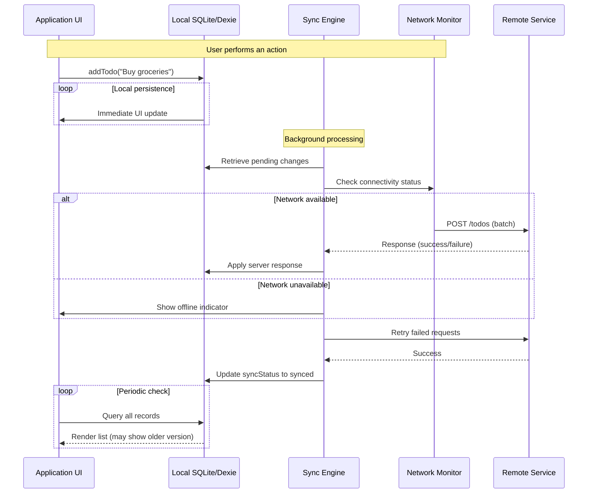

# Your App Shouldn't Need the Internet to Do Its Job

## Introduction

Modern applications are designed around the assumption that every request will travel through a reliable, high-bandwidth connection. This mindset has led to architectures where local data lives only until it reaches a remote server. When connectivity drops—whether due to cellular signal loss, airplane mode, or simply being miles away from any tower—the experience degrades from usable to broken. Users abandon carts, field technicians face frozen dashboards, and edge devices become useless after a brief network blip.

An offline-first approach flips this relationship. By making the local database the primary source of truth, the application remains responsive regardless of external connectivity. Writes happen immediately on the device, and changes are queued for synchronization once a network path opens. This pattern preserves responsiveness while keeping data coherent across sessions. The result is a more resilient product that respects users' time and environments rather than demanding their constant presence online.

## Why This Matters

From a business standpoint, requiring persistent internet access reduces conversion rates. Every abandoned cart, forgotten form submission, or incomplete workflow stems from a momentary connectivity hiccup turned into a permanent failure because the backend never received the input. In logistics and field services, this translates directly into missed deliveries and lost revenue.

Technically, the cost of poor offline support manifests as latency spikes during reconnection attempts, inconsistent states between client and server, and complex reconciliation pipelines that grow harder to maintain as feature sets expand. Teams spend considerable effort building ad-hoc retry mechanisms, conflict-handling schemas, and fallback strategies that often end up being brittle. An intentional offline-first design eliminates most of these pain points upfront, allowing developers to focus on core domain logic instead of firefighting network-related edge cases.

## How It Works

The architecture centers on three layers: the local persistence layer, a change capture subsystem, and a background synchronization engine. Each component plays a distinct role in guaranteeing that the application continues to operate correctly even when the network is unavailable.

```
Client → [UI] ←→ [Local DB] ──► [Sync Engine] ──► [Network Monitor]
         │                                    ▲
         └──────────────[Live Query]─────────┘
```

The flow begins with the UI issuing read and write operations against the local database. Before persisting any change, the system captures it in an intermediate state flag so users see instant feedback. When connectivity becomes available again, the sync engine processes queued changes in batches, sending them to the remote service and applying server responses back. If a conflict arises between local edits and server modifications, a predefined policy resolves the discrepancy automatically.

The critical insight is that the local database must always reflect the authoritative state of the application. The remote service acts as a source of truth for final validation and long-term storage, but it should never dictate what appears to the user. By treating the local store as immutable until successfully synced, we avoid race conditions and ensure consistency.

Below is a sequence diagram that illustrates the interaction between these components.



This diagram captures the essential lifecycle. The UI remains responsive because all reads and writes target the local store. The SyncEngine runs independently, polling for changes and enqueuing them whenever the network comes back online. The NetworkMonitor abstracts transport details, allowing the system to adapt to different protocols and network types without changing business logic.

## Core Concepts

### Local Source of Truth

Every operation must begin in the device-side database. Reads return the current snapshot from local storage, providing instantaneous feedback. Writes are committed to the index immediately, then flagged for eventual transmission. This guarantees that the UI never reflects stale data, whether or not the server acknowledges the write yet.

### Deterministic Sync

Changes are represented as atomic events rather than mutable objects stored in memory. Each event carries metadata such as timestamps, unique identifiers, and vector clocks that enable accurate conflict detection. When multiple clients edit the same resource concurrently, the scheduler relies on deterministic ordering rather than relying on eventual consistency heuristics. This makes debugging easier and ensures reproducible outcomes across deployment instances.

### Network-Aware Orchestration

The synchronization layer does not blindly push data whenever possible. Instead, it evaluates the current network condition before invoking the remote endpoint. During periods of intermittent connectivity, the system may defer non-critical updates or queue them locally until a stable link returns. This prevents overwhelming a flaky connection with small payloads and reduces battery consumption on mobile devices.

### Conflict Resolution Policy

Conflicts arise when two clients modify the same record before either receives an updated view from the server. The application must define which version wins. Common strategies include last-write-wins based on timestamps, operational transformation, or application-specific merging logic. For many teams, a hybrid approach works well: recent edits from the server override local ones unless explicit user intervention suggests otherwise. The policy itself should be configurable per entity type to match business semantics.

### Graceful Degradation

Even when fully functional, the system should announce its limitations transparently. A subtle yet important practice is displaying a visible indicator next to stale data, such as a small warning icon or a tooltip reading "Offline mode active." Users understand this notification better than hidden logs or silent failures. Trust is maintained when people know the app cannot do everything perfectly, only reliably enough to continue.

## Examples & Code Walkthrough

The following implementation uses TypeScript and Dexie.js to demonstrate a production-ready offline-first structure. Dexie provides an SQLite layer backed by IndexedDB, making it ideal for Progressive Web Apps and desktop environments alike.

### Bootstrapping the Database

```ts
import Dexie from 'dexie';

// Define the Todo entity model
interface Todo {
  id: string;
  title: string;
  completed: boolean;
  updatedAt: number; // Unix timestamp
  syncStatus: 'pending' | 'synced' | 'conflict';
}

// Initialize the database with version control for migration safety
class TodoDB extends Dexie {
  todos!: Dexie.Table<Todo, number>;

  constructor() {
    super('AppData');
    this.version(1).stores({
      todos: '++id, title, completed, updatedAt, syncStatus',
      _schemaVersion: '1', // Helps detect schema migrations
    });

    // Ensure syncStatus column exists even if schema changes occur
    this.stats('_schemaVersion');
  }
}

export const db = new TodoDB();
```

The schema defines four columns plus a reserved `_schemaVersion` column that tracks structural changes. Versioning allows future migrations without breaking existing installations. The `++id` prefix guarantees unique row IDs even if the table is recreated, which proves useful when developers accidentally delete and recreate tables during troubleshooting.

### Optimistic UI Writes

User actions trigger immediate persistence:

```ts
import { db } from './TodoDB';

/**
 * Adds a new todo item to the local store.
 * The operation is optimistic: the UI updates instantly, and the
 * write is asynchronous until the sync engine confirms success.
 */
async function addTodo(title: string): Promise<void> {
  try {
    const now = Date.now();
    const newTodo: Todo = {
      id: crypto.randomUUID(),
      title,
      completed: false,
      updatedAt: now,
      syncStatus: 'pending',
    };

    // Insert succeeds locally; no await required.
    await db.todos.add(newTodo);

    console.log(`Todo "${title}" added to local store`);
  } catch (err) {
    // Handle race conditions or partial writes
    console.error('Failed to add todo:', err);
  }
}
```

Because the operation uses native Promises, calling functions elsewhere in the codebase can proceed without waiting. The UI thread remains unblocked, preserving perceived performance.

### Capture Changes for Synchronization

To synchronize, the engine continuously scans for entries whose `syncStatus` equals `'pending'` and forwards them. Using Dexie's `liveQuery` pattern yields reactive streams without polling:

```ts
import { liveQuery, Observable } from 'dexie';

/**
 * Starts a background listener that queues any todo marked for
 * eventual sync. The subscription pauses when the browser loses
 * connection, resuming automatically upon reconnection.
 */
function startChangeListener(syncEngine: SyncEngine): void {
  liveQuery(
    () => db.todos.where('syncStatus').equals('pending')
  )
    .subscribe(async (pending) => {
      if (!pending.length) return;

      // Enqueue each pending document for the sync engine.
      // The engine will batch them according to its own strategy.
      for (const doc of pending) {
        try {
          syncEngine.enqueue(doc, { syncStatus: 'pending' });
        } catch (err) {
          // Log errors but keep iterating over other documents.
          console.warn('Failed to enqueue todo', err);
        }
      }

      // Optionally pause further listeners until the next cycle.
      // This prevents redundant submissions if the network window
      // closes before processing completes.
      setTimeout(() => {
        startChangeListener(syncEngine);
      }, 2000);
    });
}
```

Note that `syncEngine.enqueue` accepts both the document reference and initial metadata. The engine handles deduplication internally, so duplicate submissions from rapid client interactions are absorbed gracefully.

### Network Awareness and Thin Orchestration

The network monitor abstracts the difference between Wi‑Fi, LTE, and offline states. It exposes a simple callback that the sync engine consumes:

```ts
interface ConnectionState {
  connected: boolean;
  [key]: string;
}

/**
 * Detects connectivity changes and triggers sync processing accordingly.
 * This method could also expose telemetry for analytics purposes.
 */
function handleNetworkChange(state: ConnectionState): void {
  if (state.connected && !db.todos.find(t => t.syncStatus === 'pending')) {
    // Network restored; flush queued changes.
    processPendingChanges();
  } else if (!state.connected && db.todos.find(t => t.syncStatus === 'pending')) {
    // Still offline; warn the user if necessary.
    ui.showOfflineWarning();
  }
}
```

By isolating network concerns behind this lightweight handler, the rest of the system remains agnostic to transport protocols. The sync engine knows nothing about HTTP status codes except those returned from the remote service.

### Conflict Resolution Placeholder

When the server responds to a batch of changed items, a conflict detector compares timestamps and applies a rule:

```ts
function resolveConflicts(serverResponse: any[]): void {
  // serverResponse contains processed changes from the backend.
  // We compare each incoming document's updatedAt with the stored version.
  for (const serverDoc of serverResponse) {
    const local = db.todos.get(serverDoc.id)!;

    if (local.syncStatus !== 'synced') {
      // Server won the round — discard local changes.
      local.syncStatus = 'synced';
      local.update(); // Reflect server state
    } else {
      // Both sides have edits; apply application-specific merge.
      // Example: prefer newer timestamp.
      if (serverDoc.updatedAt > local.updatedAt) {
        local.syncStatus = 'synced';
        local.update();
      }
    }
  }
}
```

In a larger system, you would replace this placeholder with sophisticated merging algorithms or manual review workflows depending on business requirements.

## Best Practices

1. **Version your schema** – Include a `_schemaVersion` column and migrate incrementally. This gives you a safety net when refactoring data structures without breaking running applications.

2. **Batch writes** – Instead of enqueuing one change at a time, accumulate them in a buffer and send a single transaction when the buffer reaches a threshold or a timer expires. This amortizes network costs and reduces the risk of hitting rate limits.

3. **Make sync idempotent** – Design your commands so that sending them multiple times produces the same outcome. If the server already knows about a given ID, return a success status rather than creating duplicates.

4. **Encrypt sensitive fields** – If personal health information, financial data, or location metadata resides in the local DB, encrypt it at rest. Use a key derived from the device identity so that a compromised machine cannot leak user data.

5. **Test offline explicitly** – Add integration tests that simulate network loss, partial failures, and delayed receipt. Tools like Cypress or Playwright can drive browsers into simulated offline states to verify behavior.

6. **Log audit trails** – Record which client generated a change and when. This helps diagnose conflicts after the fact and supports compliance requirements such as GDPR or HIPAA.

## Common Mistakes & Anti-Patterns

| Mistake | Description | Fix |
|---------|-------------|-----|
| **Over‑reliance on optimistic UI** | Assuming every write will succeed means users see nothing when they actually fail (e.g., permission denied, quota exceeded). | Always treat writes as potentially failing. Show error toast notifications and persist fallbacks in a local recovery queue. |
| **Ignoring conflict semantics** | Using last‑write‑wins without considering business rules can silently overwrite legitimate user intent. | Define explicit conflict handlers per entity type; involve users in ambiguous merges when automatic resolution isn’t sufficient. |
| **Syncing too frequently** | Aggressive polling or triggering a sync on every keystroke can saturate bandwidth and drain battery. | Queue changes and flush periodically (e.g., every minute) unless a lower‑priority change arrives. |
| **Storing large payloads in the DB** | Keeping gigabyte‑scale documents in the local store defeats the purpose of locality and complicates indexing. | Keep the local DB lean; offload heavy artifacts to cloud storage referenced by URLs in the document. |
| **Not cleaning up sync metadata** | Leaving rows stuck in `'conflict'`
