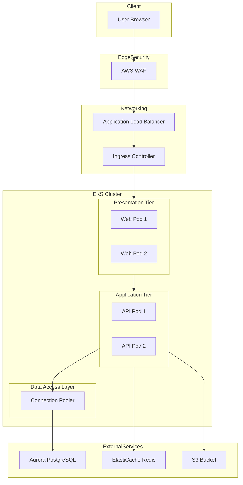

# 3 Tier Application On EKS

## Introduction

Building a three-tier application—frontend, backend, and database—on Amazon Elastic Kubernetes Service (EKS) sounds like a textbook exercise until you hit the real-world constraints of networking, scaling, and state management. The classic model doesn't translate directly to containerized microservices. You end up wrestling with pod-to-pod communication, service discovery, persistent storage, and ingress routing. This isn't just about deploying containers; it's about architecting a resilient, observable system that scales without breaking.

## Why This Matters

If you're running anything beyond a hobby project, the decisions you make in structuring your tiers on EKS have cascading effects. Poorly configured ingress can lead to downtime during deployments. Misconfigured stateful sets can cause data loss. Ignoring resource limits turns your cluster into a noisy neighbor. In production, these aren't theoretical concerns—they’re on-call alerts at 3 AM. A well-architected 3-tier setup on EKS gives you the foundation to scale horizontally, isolate failures, and manage traffic with precision.

## How It Works

At its core, a 3-tier application on EKS maps each logical tier to Kubernetes primitives. The presentation tier (frontend) is served by pods exposed via an Ingress controller. The application tier (backend APIs) runs as Deployments with internal Services. The data tier (database) can be an external managed service like Amazon RDS or an in-cluster StatefulSet for smaller workloads. Traffic flows from the client through the Ingress, hits the frontend Service, which routes to the backend Service, and finally reaches the database or cache layer.

Here's how the components interact:



Traffic enters through AWS WAF for DDoS protection, then hits the ALB, which forwards to the NGINX Ingress Controller. The controller routes requests to the correct Service based on path rules. Frontend pods handle static assets and client-side routing, while backend pods process business logic. The backend communicates with RDS for persistence and ElastiCache for session caching. S3 stores media files, keeping them out of the database.

## Core Concepts

### Tier Mapping

Each tier in the traditional architecture maps to a specific Kubernetes construct:

*   **Presentation Tier**: Served by Deployments or DaemonSets, exposed via Services and routed through an Ingress resource.
*   **Application Tier**: Backend APIs running as Deployments with ClusterIP Services. Communication is typically over HTTP/gRPC.
*   **Data Tier**: Managed services like RDS or self-hosted databases using StatefulSets with PersistentVolumeClaims.

### Service Discovery

Services provide stable endpoints for pods. A `Service` abstracts away the ephemeral nature of pods, load-balancing traffic across healthy replicas. For inter-service communication, DNS-based discovery (`api-service.namespace.svc.cluster.local`) is used.

### Ingress Routing

The Ingress resource defines HTTP(S) routing rules. Combined with an Ingress controller (like NGINX or ALB), it manages TLS termination, path-based routing, and can integrate with AWS Load Balancer Controller for direct ALB provisioning.

### Stateful vs Stateless

Frontend and application tiers are stateless and scale horizontally. The data tier is inherently stateful, requiring persistent storage and careful handling of backups and failover strategies.

## Examples & Code Walkthrough

Let's look at a practical implementation for the backend API tier.

### Backend Deployment Manifest

This manifest deploys a secure, scalable API service with resource constraints and observability hooks.

```yaml
apiVersion: apps/v1
kind: Deployment
metadata:
  name: api-gateway
  labels:
    app.kubernetes.io/name: api-gateway
    app.kubernetes.io/tier: backend
spec:
  replicas: 3
  strategy:
    rollingUpdate:
      maxSurge: 1
      maxUnavailable: 0
  selector:
    matchLabels:
      app: api-gateway
  template:
    metadata:
      labels:
        app: api-gateway
      annotations:
        prometheus.io/scrape: "true"
        prometheus.io/port: "8080"
    spec:
      securityContext:
        runAsNonRoot: true
        runAsUser: 1000
        fsGroup: 2000
        seccompProfile:
          type: RuntimeDefault
      containers:
      - name: api
        image: public.ecr.aws/myorg/api-gateway:v1.2.0
        ports:
        - containerPort: 8080
          name: http
        resources:
          requests:
            cpu: "200m"
            memory: "256Mi"
          limits:
            cpu: "500m"
            memory: "512Mi"
        envFrom:
        - secretRef:
            name: api-secrets
        - configMapRef:
            name: api-config
        livenessProbe:
          httpGet:
            path: /healthz
            port: 8080
          initialDelaySeconds: 30
          periodSeconds: 10
        readinessProbe:
          httpGet:
            path: /ready
            port: 8080
          initialDelaySeconds: 5
          periodSeconds: 5
```

Key points:
*   `securityContext`: Enforces non-root execution and uses a read-only root filesystem by default.
*   `resources`: Prevents resource starvation and enables accurate autoscaling.
*   `probes`: Ensures traffic only goes to healthy pods.
*   `rollingUpdate`: Guarantees zero-downtime deployments.

### Internal Service Configuration

The backend service should never be publicly accessible. It uses a `ClusterIP` to keep traffic internal.

```yaml
apiVersion: v1
kind: Service
metadata:
  name: api-service
  labels:
    app: api-gateway
spec:
  type: ClusterIP
  selector:
    app: api-gateway
  ports:
  - protocol: TCP
    port: 80
    targetPort: 8080
  sessionAffinity: None
  externalTrafficPolicy: Local
```

### Ingress Resource

This routes external traffic to the frontend service, with TLS termination handled by the Ingress controller.

```yaml
apiVersion: networking.k8s.io/v1
kind: Ingress
metadata:
  name: app-ingress
  annotations:
    kubernetes.io/ingress.class: nginx
    cert-manager.io/cluster-issuer: letsencrypt-prod
    nginx.ingress.kubernetes.io/ssl-redirect: "true"
spec:
  tls:
  - hosts:
    - app.example.com
    secretName: app-tls-secret
  rules:
  - host: app.example.com
    http:
      paths:
      - path: /
        pathType: Prefix
        backend:
          service:
            name: web-service
            port:
              number: 80
```

## Best Practices

1.  **Use Namespaces Liberally**: Isolate environments (`dev`, `staging`, `prod`) and teams into separate namespaces.
2.  **Implement Resource Quotas**: Prevent any single team or namespace from consuming all cluster resources.
3.  **Leverage Horizontal Pod Autoscaler (HPA)**: Automatically scale based on CPU/memory or custom metrics.
4.  **Enforce Network Policies**: Control pod-to-pod traffic to minimize lateral movement in case of compromise.
5.  **Centralize Logging and Monitoring**: Use tools like Prometheus, Grafana, and Loki for unified observability.

## Common Mistakes & Anti-Patterns

### 1. Running Containers as Root

Running as root is a major security risk. Always set `runAsNonRoot: true` and define a `runAsUser`.

**Fix:**
```yaml
securityContext:
  runAsNonRoot: true
  runAsUser: 1000
```

### 2. No Resource Limits

Without limits, a misbehaving pod can starve others. Always specify requests and limits.

**Fix:**
```yaml
resources:
  requests:
    cpu: "100m"
    memory: "128Mi"
  limits:
    cpu: "250m"
    memory: "256Mi"
```

### 3. Exposing Internal Services

Using `LoadBalancer` for internal services exposes them unnecessarily. Use `ClusterIP`.

**Fix:**
```yaml
type: ClusterIP
```

### 4. Ignoring Health Checks

Missing liveness/readiness probes leads to traffic being sent to unhealthy pods.

**Fix:**
```yaml
livenessProbe:
  httpGet:
    path: /healthz
    port: 8080
```

## Performance Considerations

*   **CPU Overhead**: Kubernetes adds minimal overhead, but excessive sidecars or init containers can impact performance.
*   **Memory Usage**: Pod overhead, kubelet, and monitoring agents consume memory. Plan accordingly.
*   **Network Latency**: Pod-to-pod latency within a node is negligible. Cross-AZ traffic incurs cloud provider charges and slight latency increases.
*   **Autoscaling Limits**: HPA reacts to metrics with a delay. For critical workloads, consider predictive or custom autoscaling solutions.

## Real-World Usage

Companies like Netflix and Uber have built highly available, scalable platforms on Kubernetes, often leveraging similar 3-tier architectures. They use advanced features like service meshes (Istio) for fine-grained traffic control, custom schedulers for specialized workloads, and chaos engineering to validate resilience. While their setups are more complex, the foundational principles of tier separation, observability, and automated scaling remain the same.

## Frequently Asked Questions (FAQ)

**Q: Can I run my database inside EKS?**
A: Yes, using StatefulSets with PersistentVolumes. However, for production, managed services like Amazon RDS are strongly recommended for durability and operational simplicity.

**Q: How do I handle secrets in EKS?**
A: Use AWS Secrets Manager or HashiCorp Vault integrated with Kubernetes via External Secrets Operator. Never store secrets in plain text.

**Q: What's the difference between Ingress and Service?**
A: A `Service` provides a stable endpoint for pods within the cluster. An `Ingress` manages external access to services, typically HTTP/S, and relies on an Ingress controller.

**Q: How does scaling work for the data tier?**
A: Scaling the data tier is complex. For databases, vertical scaling or read replicas are common. For caches like Redis, clustering or sharding is used.

## Conclusion

Deploying a 3-tier application on EKS requires more than just containerizing your apps. It demands a deep understanding of Kubernetes primitives, networking, and cloud-native security. By mapping each tier correctly, enforcing best practices, and avoiding common pitfalls, you can build a robust, scalable architecture. Start simple, measure constantly, and iterate. The goal isn't perfection on day one—it's a system that grows with your needs and survives the inevitable production challenges.
