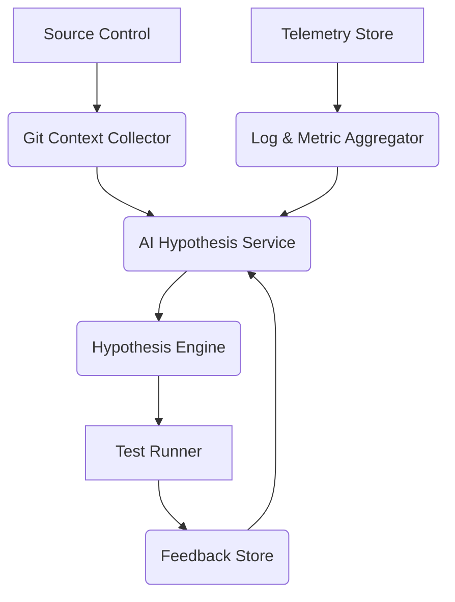

# AI Didn't Replace My DevOps Workflow. It Shortened the Path to a Hypothesis.

## Introduction

Last month, a CI pipeline at my company started failing intermittently. No clear error messages, no obvious code changes—just a flaky job that seemed to fail randomly every few runs. For days, I manually combed through logs, checked git diffs, and ran tests in isolation. Weeks passed before I had a solid hypothesis. Then I tried something different: I fed all the context—logs, diffs, metrics—into an AI model and asked it to suggest root causes. Within minutes, it surfaced three plausible explanations. One was correct. The fix took another hour.

That moment changed how I think about AI in DevOps. It didn’t replace my workflow—it shortened the path to a hypothesis.

## Why This Matters

DevOps engineers spend a huge chunk of their time not fixing issues, but *finding them*. That means sifting through logs, correlating metrics, and trying to reconstruct what went wrong from fragmented signals. These tasks are inherently exploratory. They require creativity, domain knowledge, and intuition.

AI doesn’t eliminate that exploration. But it can accelerate it—by generating candidate hypotheses faster than a human could type them out. In high-pressure environments like production outages or flaky pipelines, shaving hours off diagnosis time isn’t just convenient—it’s critical.

## How It Works

The core idea is simple: take telemetry and context from your system, pass it to an AI service, and ask for structured hypotheses. The AI doesn’t execute anything—it suggests what might be wrong. Engineers still validate, test, and decide.

Here’s a simplified view of the architecture:



1. **Git Context Collector**: Captures recent commits, diffs, and branches.
2. **Log & Metric Aggregator**: Pulls relevant logs, error rates, and performance metrics.
3. **AI Hypothesis Service**: Sends context to an LLM with a prompt asking for root-cause hypotheses.
4. **Hypothesis Engine**: Parses AI output and ranks hypotheses by confidence.
5. **Test Runner**: Executes targeted tests or checks based on top hypotheses.
6. **Feedback Store**: Records which hypotheses were valid, feeding back into future prompts.

Each component is modular, observable, and secure. You can plug in any telemetry backend, swap LLMs, or run tests in containers—all without disrupting the core pipeline.

## Core Concepts

- **Prompt-Driven Inference**: Instead of hardcoding rules, we craft prompts that guide the model to reason about DevOps scenarios.
- **Candidate Hypotheses**: The AI generates multiple plausible explanations—not one answer. Engineers pick and test.
- **Loop-Back Learning**: Validation results are stored and reused to refine future prompts or fine-tune models.
- **Idempotency & Observability**: Every step logs inputs/outputs, making it easy to audit and debug the AI’s behavior.

## Examples & Code Walkthrough

Let’s walk through a minimal implementation.

### Collecting Telemetry & Context

```python
# custom_telemetry.py
import subprocess
import os
from datetime import datetime

def collect_git_context():
    commit = subprocess.check_output(["git", "rev-parse", "HEAD"], text=True).strip()
    diff = subprocess.check_output(["git", "diff", "HEAD~1", "HEAD"], text=True)
    branch = subprocess.check_output(["git", "rev-parse", "--abbrev-ref", "HEAD"], text=True).strip()
    timestamp = datetime.utcnow().isoformat()

    return {
        "commit": commit,
        "diff": diff,
        "branch": branch,
        "timestamp": timestamp
    }

def collect_metrics():
    # Simulate fetching metrics from Prometheus or similar
    return {
        "cpu_usage": 82.3,
        "memory_usage": 76.1,
        "error_rate": 0.15,
        "latency_p95": 420
    }
```

### Querying the AI Service

```python
# ai_hypothesis_client.py
import os
import requests

def query_ai(context_payload):
    endpoint = os.getenv("AZURE_OPENAI_ENDPOINT")
    api_key = os.getenv("AZURE_OPENAI_KEY")

    headers = {
        "Content-Type": "application/json",
        "api-key": api_key
    }

    prompt = (
        "Given the following git diff and recent CI logs, propose 3 possible "
        "root-cause hypotheses. Return a JSON array with fields: "
        "\"hypothesis\", \"confidence\", \"affected_component\".\n"
        f"---\n{context_payload}\n---"
    )

    payload = {
        "messages": [{"role": "user", "content": prompt}]
    }

    response = requests.post(endpoint, headers=headers, json=payload)
    response.raise_for_status()

    raw_response = response.json()["choices"][0]["message"]["content"]
    return raw_response
```

### Running Tests Based on Hypotheses

```python
# hypothesis_engine.py
import json
from custom_telemetry import collect_git_context, collect_metrics
from ai_hypothesis_client import query_ai

def generate_hypotheses():
    git_context = collect_git_context()
    metrics = collect_metrics()

    context_str = json.dumps({
        "git": git_context,
        "metrics": metrics
    })

    ai_output = query_ai(context_str)
    hypotheses = json.loads(ai_output)

    ranked = sorted(hypotheses, key=lambda x: x["confidence"], reverse=True)
    return ranked

def run_validation(hypotheses):
    for h in hypotheses[:2]:  # top 2
        print(f"Testing: {h['hypothesis']}")
        # Placeholder for actual test execution
        result = simulate_test_run(h["affected_component"])
        record_feedback(h, result)

def simulate_test_run(component):
    # Replace with real test logic
    return {"passed": True, "duration_ms": 120}

def record_feedback(hypothesis, result):
    print(f"Feedback recorded: {result}")
    # Store in Redis or DB for loop-back learning
```

This setup is lightweight, extensible, and integrates cleanly into existing CI pipelines.

## Best Practices

- **Keep prompts concise**: Include only necessary context. Too much noise dilutes the signal.
- **Validate every hypothesis**: Never trust AI blindly. Always test.
- **Log everything**: Store prompts, responses, and outcomes for auditing and improvement.
- **Secure access**: Use managed identities or service principals for AI APIs.
- **Iterate on prompts**: Treat prompt engineering like code—version it, review it, refine it.

## Common Mistakes & Anti-Patterns

1. **Treating AI output as truth**: AI hallucinates. Always validate.
2. **Overloading prompts**: Dumping entire logs or diffs confuses the model.
3. **Ignoring feedback loops**: Without tracking what works, the system stagnates.
4. **Hardcoding assumptions**: Prompts should adapt to different failure types, not assume one pattern.

## Performance Considerations

- **Latency**: LLM calls add seconds to diagnosis. Cache common patterns.
- **Cost**: Frequent calls to paid AI services can rack up bills. Batch requests where possible.
- **Throughput**: Parallelize independent test runs after hypothesis generation.
- **Memory**: Keep telemetry payloads small. Stream logs instead of buffering.

## Real-World Usage

Companies like Microsoft, Shopify, and Netflix have begun experimenting with AI-assisted incident response. Internally, they use similar setups—feeding telemetry to LLMs and validating hypotheses via automated tests. While none have open-sourced full implementations yet, early reports show significant reductions in mean time to resolution (MTTR).

## Frequently Asked Questions (FAQ)

**Q: Does this replace SREs or DevOps engineers?**  
No. It augments their ability to diagnose issues quickly. Final decisions remain human.

**Q: Which LLM works best for this use case?**  
GPT-4, Claude 2, and Llama 2 70B all perform well. Choose based on cost, compliance, and availability.

**Q: Can I run this locally?**  
Yes. Tools like Ollama or LM Studio let you host smaller models on-prem for privacy-sensitive use cases.

**Q: How do I prevent prompt injection attacks?**  
Sanitize inputs, restrict external data sources, and log all interactions for anomaly detection.

**Q: What kind of ROI can I expect?**  
Early adopters report 30–60% faster triage times. Hard dollar savings depend on team size and incident frequency.

## Conclusion

AI isn’t here to take over DevOps workflows. It’s here to make them smarter. By turning raw context into candidate hypotheses, we free up engineers to focus on solving problems—not searching for them. The future of DevOps isn’t automated pipelines—it’s augmented ones.
