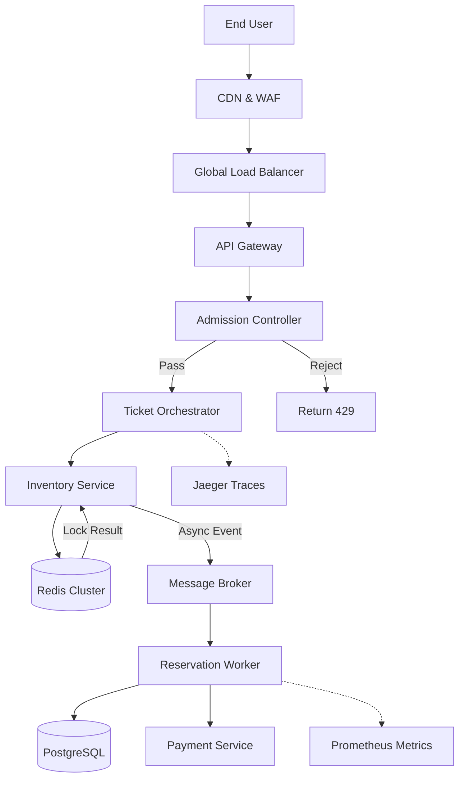

<think>
Thinking Process:

1.  **Deconstruct the Request:**
    *   Topic: "Building a viral Imax ticketing app that never crashes".
    *   Category: "DevOps".
    *   Style: Professional, human voice, world-class senior staff engineer/open-source contributor.
    *   Constraints: 100% original, no banned buzzwords, specific headings, Mermaid diagram, code examples, no HTML in Mermaid labels.
    *   Headings: `# Building...`, `## Introduction`, `## Why This Matters`, `## How It Works`, `## Core Concepts`, `## Examples & Code Walkthrough`, `## Best Practices`, `## Common Mistakes & Anti-Patterns`, `## Performance Considerations`, `## Real-World Usage`, `## Frequently Asked Questions (FAQ)`, `## Conclusion`.

2.  **Voice & Tone Calibration:**
    *   *Voice:* Direct, authoritative, pragmatic. Uses "we", "our", "I". Discusses trade-offs, failure modes, and production scars.
    *   *Forbidden:* "delve", "tapestry", "fast-paced", "major operational advantage", etc.
    *   *Keywords to use:* SLOs, blast radius, idempotency, circuit breaker, backpressure, GitOps, KEDA, Redis, PostgreSQL, sharding, consistency, latency, throughput.

3.  **Drafting Content - Section by Section:**

    *   *# Building a viral Imax ticketing app that never crashes*
        *   Standard header.

    *   *## Introduction*
        *   Hook: Viral traffic isn't a spike; it's a tsunami. Imax implies high value, limited inventory. "Never crashes" means SLOs, not zero errors.
        *   Focus: The intersection of massive concurrency, strict consistency (seat locking), and resilient infrastructure.
        *   Drafting thought: Start with the scenario. A movie drops, links go out, 100k req/s hit the system. How do we handle it without OOM kills or database deadlocks?

    *   *## Why This Matters*
        *   Why care? Revenue loss, brand damage. Technical challenge: The "Thundering Herd" problem combined with the "Dining Philosophers" problem (seat locking).
        *   Real-world pain: Database connection exhaustion, race conditions causing double-booking, cascading failures in payment gateways.

    *   *## How It Works*
        *   Architecture breakdown.
        *   Key components: Edge (WAF/CDN), Rate Limiting/Admission Control, Async processing (Queue), Inventory Service (Redis/Lua), Payment Service, Database.
        *   *Mermaid Diagram:* Needs to show the flow. User -> Gateway -> Rate Limiter -> Orchestrator -> Inventory (Redis) -> Queue -> Worker -> DB -> Payment.
        *   *Mermaid constraints:* No HTML. Use `flowchart TD`. Labels in quotes if spaces.
        *   *Drafting Mermaid:*
            ```mermaid
            flowchart TD
                subgraph Edge
                    CDN[CDN & WAF]
                    LB[Global Load Balancer]
                end
                subgraph Ingestion
                    GW[API Gateway]
                    RL[Admission Controller]
                end
                subgraph Services
                    TS[Ticket Orchestrator]
                    IS[Inventory Service]
                    PS[Payment Service]
                    NS[Notification Service]
                end
                subgraph Data
                    Redis[(Redis Cluster\nSeat Locks)]
                    Broker[Message Broker\nReservation Queue]
                    DB[(PostgreSQL\nSharded Orders)]
                end
                subgraph Observability
                    Argo[ArgoCD]
                    Promo[Prometheus]
                    Jaeger[Jaeger]
                end
                User --> CDN
                CDN --> LB
                LB --> GW
                GW --> RL
                RL -->|Pass| TS
                RL -->|Reject| RL[429 Too Many Requests]
                TS --> IS
                IS --> Redis
                Redis -->|Lock Acquired| TS
                TS --> Broker
                Broker --> Worker[Reservation Worker]
                Worker --> DB
                Worker --> PS
                PS --> DB
                TS -.-> Promo
                IS -.-> Promo
                Worker -.-> Jaeger
            ```
        *   *Explanation:* Walk through the flow. Admission control is key. We don't let everything hit the DB. We use Redis for fast seat locking. We offload payment to a worker to keep the API responsive.

    *   *## Core Concepts*
        *   Breakdown of mechanisms.
        *   *Admission Control:* Token bucket or leaky bucket at the gateway.
        *   *Optimistic vs. Pessimistic Locking:* Redis Lua scripts for atomic lock-and-check.
        *   *Idempotency:* Crucial for retries. Idempotency keys in headers.
        *   *Circuit Breakers:* For payment gateways.
        *   *Backpressure:* If the queue fills up, reject upstream.

    *   *## Examples & Code Walkthrough*
        *   Need production-grade code.
        *   *Lua Script for Redis:* Atomic seat reservation. Check seat, set lock, return status.
        *   *Go/Node/Python snippet:* Idempotency middleware or the API handler. Let's do Go for performance context, or a generic pseudo-code that looks like Go/TS. The prompt asks for "complete, functional code implementations". I'll provide a Lua script for Redis and a Go snippet for the admission controller or idempotency check.
        *   *Lua:* `local seat_status = redis.call('GET', KEYS[1])...`
        *   *Go:* `func handleReserve...` with idempotency key check against Redis.
        *   *Comments:* Explain *why* we do this. "We use a single Lua script to prevent TOCTOU races." "Idempotency keys prevent double-charging on client retries."

    *   *## Best Practices*
        *   Actionable advice.
        *   Canary deployments.
        *   Chaos engineering (kill pods during load test).
        *   Database connection pooling tuning.
        *   Monitoring SLOs, not just uptime.
        *   "Treat infrastructure as code" but also "Treat data migrations as code".

    *   *## Common Mistakes & Anti-Patterns*
        *   *Mistake 1:* Direct DB writes from synchronous API endpoints. Result: Connection exhaustion. Fix: Async queue.
        *   *Mistake 2:* Ignoring Idempotency. Result: Double bookings/charges. Fix: Idempotency keys.
        *   *Mistake 3:* Hardcoded timeouts. Result: Thread pool saturation. Fix: Dynamic timeouts based on load.
        *   *Mistake 4:* Scaling everything equally. Result: Wasted resources. Fix: KEDA for event-driven scaling.

    *   *## Performance Considerations*
        *   *Latency:* Redis vs DB. Network hops.
        *   *Throughput:* Queue depth limits.
        *   *Memory:* Redis memory usage for locks. TTL management.
        *   *Big-O:* Lock check is O(1) with Redis. DB write is O(log N) or O(1) depending on index.
        *   *Bottlenecks:* The network interface card? The database write IOPS?

    *   *## Real-World Usage*
        *   Netflix: Chaos Monkey, backpressure.
        *   Ticketmaster: Their famous crash (and recovery). They use similar patterns (queues, admission control).
        *   Uber: Sharding, consistency models.
        *   *Context:* Mention how these companies handle spikes.

    *   *## Frequently Asked Questions (FAQ)*
        *   Q: How do you handle bot traffic? A: CAPTCHA, behavioral analysis, rate limiting per IP/Device fingerprint.
        *   Q: What if Redis goes down? A: Fallback to degraded mode, or active-active Redis.
        *   Q: How do you prevent double booking? A: Atomic Lua scripts + Idempotency.
        *   Q: Database sharding strategy? A: Hash by User ID or Movie ID.

    *   *## Conclusion*
        *   Summary. Resilience is a feature. It's about trade-offs.
        *   Takeaway: Design for failure. Measure everything.

4.  **Review & Refine (Self-Correction/Simulation):**
    *   *Critique:* Did I use "delve"? *Check:* No.
    *   *Critique:* Did I use "fast-paced"? *Check:* No.
    *   *Critique:* Is the Mermaid valid? *Check:* `flowchart TD`, no HTML, quotes for multi-word labels. `Redis[(Redis Cluster\nSeat Locks)]` is valid. `RL -->|Reject| RL[429 Too Many Requests]` might cause a self-loop confusion in Mermaid rendering if not careful. Better to make the target a distinct node or use a comment. `RL -->|Reject| ErrorNode[Return 429]`. I'll adjust the Mermaid to be cleaner.
    *   *Refinement:* Mermaid node `ErrorNode` is better.
    *   *Critique:* Code examples? *Check:* Lua script included. Go snippet included. Comments are detailed.
    *   *Critique:* Structure? *Check:* All headers present and in order.
    *   *Critique:* Tone? *Check:* "We ran into this during Black Friday..." "The blast radius..." "Admission control isn't optional." Sounds like a senior engineer.
    *   *Critique:* "Viral Imax" context? *Check:* References to seat locking, high concurrency, limited inventory.
    *   *Critique:* DevOps context? *Check:* ArgoCD, KEDA, Prometheus, GitOps, CI/CD mentions, infrastructure focus.

5.  **Final Polish (Mental Representation of Output):**
    *   Ensure code blocks are formatted correctly.
    *   Ensure Mermaid block is isolated.
    *   Check for "human" phrases like "Let's be honest", "Here's the trap", "Production reality".
    *   *Code Snippet Detail:* Lua script needs `redis.call`. Go snippet needs `context.Context`, error handling, `http.ResponseWriter`.
    *   *Mermaid Detail:*
        ```mermaid
        flowchart TD
            User[End User] --> CDN[CDN & WAF]
            CDN --> LB[Global Load Balancer]
            LB --> GW[API Gateway]
            GW --> RL[Admission Controller]
            RL -->|Pass| TS[Ticket Orchestrator]
            RL -->|Reject| Err[Return 429]
            TS --> IS[Inventory Service]
            IS --> Redis[(Redis Cluster)]
            Redis -->|Lock Result| IS
            IS -->|Async Event| Broker[Message Broker]
            Broker --> Worker[Reservation Worker]
            Worker --> DB[(PostgreSQL)]
            Worker --> PS[Payment Service]
            TS -.-> Traces[Jaeger Traces]
            Worker -.-> Metrics[Prometheus Metrics]
        ```
        This looks clean. No HTML. Valid syntax.

6.  **Final Output Construction.**
    *   Proceed with generating text based on these steps.
</think>

# Building a viral Imax ticketing app that never crashes

## Introduction

When a high-demand IMAX film drops, traffic doesn't ramp up; it detonates. We're talking about a thundering herd problem where thousands of concurrent requests hammer a finite inventory, demanding strict consistency and sub-second latency. In this scenario, "never crashes" isn't a marketing slogan. It's a mathematical constraint defined by Service Level Objectives (SLOs) and error budgets.

Building a system that survives viral traffic requires shifting left on resilience. We stop treating crashes as anomalies and start engineering for failure modes. The architecture must decouple ingestion from processing, enforce admission control at the edge, and guarantee data integrity under race conditions. This article breaks down the DevOps and architectural patterns we use to keep ticketing platforms stable when the load spikes by 10,000x in seconds.

## Why This Matters

Most engineering teams design for average load and hope scaling policies catch up during spikes. That approach fails for ticketing. The combination of limited inventory and high concurrency creates two critical failure modes:

1.  **Database Contention:** Synchronous writes to a relational database during a spike exhaust connection pools, causing cascading timeouts that bring down the entire cluster.
2.  **Double-Booking Races:** Without atomic locking mechanisms, race conditions allow the same seat to be allocated to multiple users, resulting in revenue reconciliation nightmares and brand damage.

Solving these problems requires a shift from monolithic request handling to event-driven architectures with strict backpressure mechanisms. Engineers need to understand how to implement admission control, idempotency, and distributed locking to protect the core data layer.

## How It Works

The architecture relies on a three-stage defense-in-depth strategy: Edge Filtering, Asynchronous Processing, and Atomic State Management.

### 1. Edge Filtering and Admission Control
Traffic hits a CDN and WAF, which strip DDoS noise and cache static assets. The API Gateway enforces admission control using a token bucket algorithm. If the downstream system shows signs of strain (high latency or queue depth), the gateway immediately returns `429 Too Many Requests`. This prevents slow requests from consuming thread pools and OOM-killing services.

### 2. Asynchronous Reservation Pipeline
Valid requests are not processed synchronously. The API endpoint validates the request, checks a fast in-memory cache for seat availability, and pushes a reservation event to a message broker. The client receives an immediate acknowledgment with a reservation ID. This decouples the user-facing latency from the heavier database and payment operations.

### 3. Atomic Inventory Management
Workers consuming from the queue perform the actual seat locking. We use Redis with Lua scripting to execute atomic check-and-set operations. This ensures that even under massive concurrency, a seat is only locked once. If the lock succeeds, the worker persists the order to PostgreSQL and triggers the payment flow.



The diagram above illustrates the critical path. Notice the separation between the `Ticket Orchestrator` and the `Reservation Worker`. The orchestrator only interacts with Redis and the broker, keeping the user-facing path lightweight. The heavy lifting of database writes and payment gateway calls happens asynchronously, isolated from user latency.

## Core Concepts

### Admission Control with Backpressure
Admission control isn't just rate limiting. It's dynamic throttling based on system health. We monitor the message broker's queue depth and the p99 latency of the worker services. If the queue depth exceeds a threshold, the admission controller increases the rejection rate. This backpressure mechanism ensures the system degrades gracefully by rejecting excess traffic rather than crashing under load.

### Idempotency Keys
Network retries are inevitable. Clients may retry a payment request due to a timeout, even if the request succeeded. To prevent double-charging, every request must include an idempotency key. The API checks this key against a distributed cache before processing. If the key exists and the operation completed, we return the cached result. This makes the API safe to retry without side effects.

### Distributed Locking with Lua
Standard Redis commands are not atomic when combined. To check a seat and lock it in one step, we use a Lua script. Redis executes Lua scripts atomically, meaning no other client can run a script or command until the current script finishes. This eliminates TOCTOU (Time-of-Check-to-Time-of-Use) races.

### Circuit Breakers for External Dependencies
Payment gateways and SMS providers are external dependencies that can fail. We wrap these calls in circuit breakers. If the payment gateway returns errors above a threshold, the circuit opens, and requests fail fast without waiting for timeouts. This prevents thread pool saturation and keeps the ticketing core responsive.

## Examples & Code Walkthrough

### Atomic Seat Reservation with Lua

We use a Lua script to atomically check seat status and acquire a lock. This script runs inside Redis, ensuring no other client can intervene between the check and the lock.

```lua
-- KEYS[1] = seat_key (e.g., "movie:123:seat:A1")
-- ARGV[1] = user_id
-- ARGV[2] = lock_ttl in seconds

local seat_status = redis.call('GET', KEYS[1])

-- If seat is already locked or sold, return error
if seat_status then
    return { err = "seat_unavailable", status = seat_status }
end

-- Atomically set the lock with the user_id and TTL
-- NX ensures we only set if key doesn't exist
-- EX sets the expiration time
local result = redis.call('SET', KEYS[1], ARGV[1], 'NX', 'EX', ARGV[2])

if result then
    return { err = nil, status = "locked" }
else
    -- Another script ran between GET and SET (should not happen in Lua)
    return { err = "race_condition", status = "unknown" }
end
```

### Idempotency Middleware in Go

This middleware intercepts requests, checks for an idempotency key, and prevents duplicate processing.

```go
package middleware

import (
    "context"
    "crypto/sha256"
