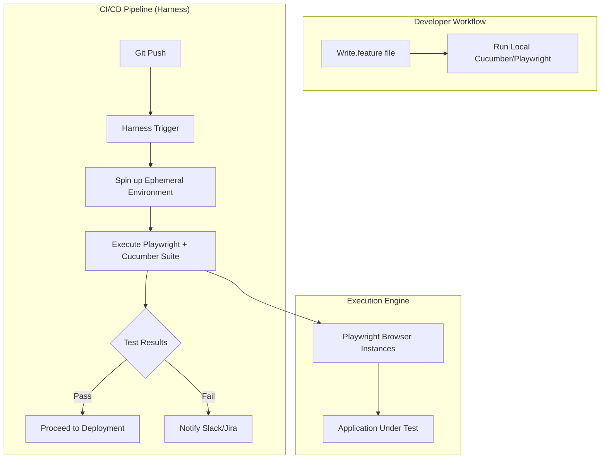

# End-to-End Setup Guide: Integrating Playwright + Cucumber with Harness CI

## Introduction

Testing complex user journeys in a modern distributed system is a headache. You have microservices spinning up, transient database states, and asynchronous event buses. Standard unit tests won't catch the moment a frontend component fails to render a specific state after a background job completes. You need End-to-End (E2E) tests that mimic human behavior. 

While Playwright is the industry standard for browser automation, writing tests in pure TypeScript can become unmanageable as your suite grows. You end up with massive, repetitive test files that non-engineers—like Product Managers or QA Engineers—can't read. This is where Cucumber comes in. By applying Behavior-Driven Development (BDD), we can write human-readable scenarios that map directly to technical execution. Finally, we need to run this at scale. Harness CI provides the orchestration layer to ensure these tests run on every PR without slowing down the deployment pipeline.

## Why This Matters

The gap between "the code works" and "the feature works" is where most production outages live. 

If you rely solely on integration tests, you miss the nuances of browser-side state management. If you rely solely on Playwright scripts, your test suite becomes a "black box" that only developers can maintain. By combining Playwright's speed and reliability with Cucumber's expressive syntax, you create a "Living Documentation" system. When a test fails in a Harness CI pipeline, the error message isn't just a stack trace; it's a failed business requirement. This clarity reduces the Mean Time to Repair (MTTR) significantly.

## How It Works

The integration follows a layered architecture. The Gherkin feature files define the "What," the Cucumber step definitions handle the "How," and Playwright handles the "Execution." Harness CI acts as the orchestrator, spinning up ephemeral containers to run these tests in parallel.



1.  **Gherkin Layer:** A human-readable `.feature` file defines the scenario.
2.  **Glue Layer:** Cucumber maps the text steps to specific TypeScript functions.
3.  **Automation Layer:** Playwright interacts with the DOM, handling waits, retries, and network interception.
4.  **Orchestration Layer:** Harness CI manages the lifecycle, environment variables, and reporting artifacts.

## Core Concepts

*   **Gherkin:** The domain-specific language (DSL) used to write scenarios (Given/When/Then).
*   **Step Definitions:** The bridge between the natural language and the programmatic implementation.
*   **World Object:** A pattern in Cucumber used to share state between steps (e.g., storing a `userSessionToken` after login).
*   **Ephemeral Environments:** Short-lived infrastructure (often via Kubernetes) created by Harness specifically for the duration of the test suite.
*   **Headless Execution:** Running browsers without a GUI, which is essential for CI efficiency.

## Examples & Code Walkthrough

Let's build a scenario for a high-throughput payment processing flow.

### 1. The Feature File (`features/payment.feature`)
```gherkin
Feature: Secure Payment Processing
  As a premium user
  I want to pay via credit card
  So that I can access my subscription benefits immediately

  Scenario: Successful checkout with valid credentials
    Given I am logged into the "Premium" account
    And I have a valid "Visa" credit card in my wallet
    When I complete the checkout for a "Monthly Subscription"
    Then the transaction should be marked as "COMPLETED"
    And my subscription status should update to "ACTIVE"
```

### 2. The Step Definitions (`steps/payment_steps.ts`)
We'll use a `World` pattern to keep our state clean.

```typescript
import { Given, When, Then, Before, After } from '@cucumber/cucumber';
import { expect } from '@playwright/test';
import { PaymentPage } from '../pages/payment.page';

// The 'context' object acts as our shared state
export class TestContext {
  public paymentPage!: PaymentPage;
  public userToken?: string;
}

let context: TestContext;

Before(async function (this.context) {
  context = new TestContext();
  // Initialization logic here
});

Given('I am logged into the {string} account', async function (accountType: string) {
  await context.paymentPage.navigateTo();
  await context.paymentPage.login(accountType);
});

Given('I have a valid {string} credit card in my wallet', async function (cardType: string) {
  // Logic to ensure the backend has this card pre-loaded for the test user
  await context.paymentPage.ensureCardExists(cardType);
});

When('I complete the checkout for a {string}', async function (plan: string) {
  await context.paymentPage.selectPlan(plan);
  await context.paymentPage.submitPayment();
});

Then('the transaction should be marked as {string}', async function (status: string) {
  const transactionStatus = await context.paymentPage.getLatestTransactionStatus();
  expect(transactionStatus).toBe(status);
});

Then('my subscription status should update to {string}', async function (expectedStatus: string) {
  const currentStatus = await context.paymentPage.getSubscriptionStatus();
  expect(currentStatus).toBe(expectedStatus);
});
```

### 3. Harness CI Configuration (`harness-config.yaml`)
This is a conceptual snippet of how you'd define the execution step in a Harness pipeline.

```yaml
pipeline:
  name: E2E_Regression_Suite
  steps:
    - step:
        name: Run_Playwright_Cucumber
        type: Run
        spec:
          image: mcr.microsoft.com/playwright:v1.40.0-jammy
          command: |
            npm install
            npx cucumber-js features/**/*.feature --format json:reports/cucumber_report.json
          args: ""
        env:
          BASE_URL: "https://staging.myapp.com"
          API_KEY: <secrets.api_key>
```

## Best Practices

*   **Atomic Scenarios:** Each scenario should be independent. If Scenario A fails, Scenario B should still be able to run. Never rely on the side effects of a previous test.
*   **Avoid UI-Only Testing:** Use API calls in your `Given` steps to set up the state (e.g., create a user via POST request) and use the UI only for the actual interaction being tested. This saves massive amounts of time.
*   **Use Page Object Models (POM):** Never hardcode selectors (`button#submit-01`) inside your step definitions. Wrap them in Page Objects so that if the UI changes, you only update one file.
*   **Parallelization at the CI Level:** Use Harness to split your feature files across multiple containers. Running 500 tests sequentially is a waste of engineering time.

## Common Mistakes & Anti-Patterns

1.  **The "Sleep" Sin:** Using `await page.waitForTimeout(5000)` is a cardinal sin. It makes tests slow and flaky. Always use Playwright's auto-waiting or specific web-first assertions (`expect(locator).toBeVisible()`).
2.  **Over-reliance on End-to-End for Logic:** If you are testing if `2 + 2 = 4`, use a unit test. E2E tests are for verifying the "glue" between components, not the math inside them.
3.  **Brittle Selectors:** Avoid using deeply nested XPaths like `/html/body/div[2]/div[1]/button`. Use `data-testid` attributes specifically for testing. They are decoupled from CSS styling and much more resilient.

## Performance Considerations

E2E tests are computationally expensive. 

*   **Complexity:** The complexity of a test suite is $O(n \times m)$, where $n$ is the number of scenarios and $m$ is the average latency of the system under test.
*   **Memory Overhead:** Each Playwright browser instance consumes significant RAM (roughly 200MB-500MB per tab). When running in parallel on Harness, ensure your runner instances have sufficient memory to prevent OOM (Out of Memory) kills.
*   **Network Latency:** Running tests against a remote staging environment introduces network jitter. Always implement a retry logic for flaky network requests, but limit it to 2 retries to avoid masking real bugs.

## Real-World Usage

At large-scale SaaS companies, this pattern is used to gate deployments. A "Smoke Suite" (the most critical 5% of scenarios) runs on every commit. A "Full Regression Suite" (all scenarios) runs nightly or before a production release. Harness CI manages these different tiers via conditional execution logic, ensuring that the developer gets feedback in 5 minutes, while the heavy lifting happens in the background.

## Frequently Asked Questions (FAQ)

**Q: Why use Cucumber if Playwright is already so good?**  
A: Playwright is about *how* to click; Cucumber is about *what* the business requirement is. Cucumber bridges the gap between technical implementation and business requirements.

**Q: How do I handle database state in CI?**  
A: The best way is to use "API Seeding." Use a `Before` hook to call an internal API that resets the database or injects a specific user into the DB, ensuring a deterministic starting point.

**Q: Is Playwright faster than Cypress?**  
A: In most modern benchmarks, Playwright's ability to handle multiple browser contexts and its superior execution model makes it faster and more reliable for complex, multi-tab workflows.

## Conclusion

Integrating Playwright, Cucumber, and Harness CI creates a robust, readable, and scalable testing framework. You move away from "scripts that might fail" toward "executable specifications" that provide genuine confidence in your deployment pipeline. Focus on writing atomic, API-driven scenarios, and leverage the orchestration power of Harness to keep your feedback loops tight.
