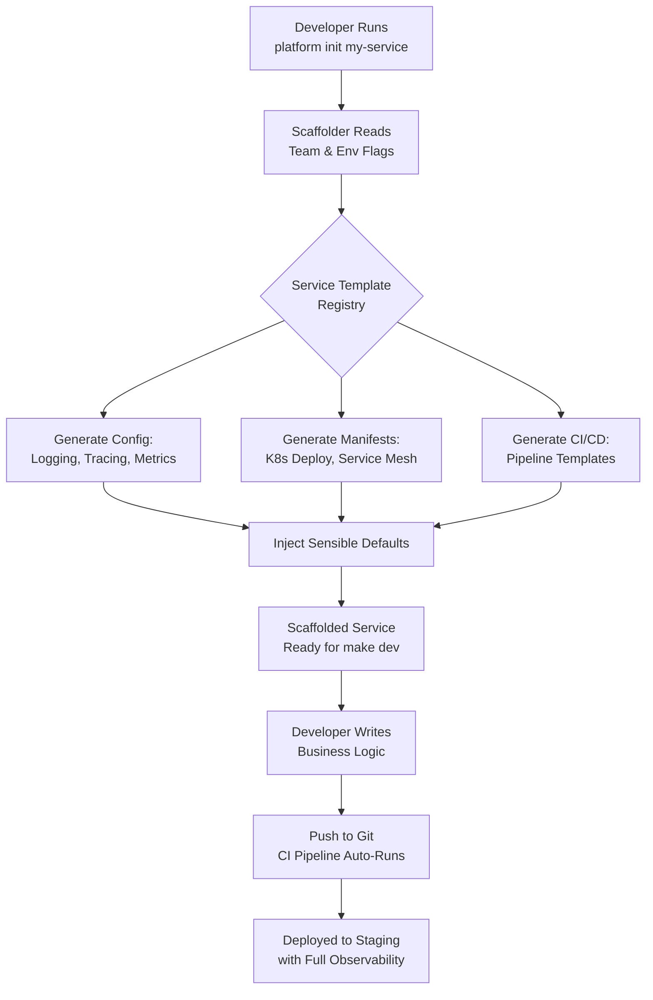

# Golden Paths Aren't About Standardization. They're About Reducing Developer Decisions.

## Introduction

A mid-level developer at a 200-person company needs to stand up a new microservice. They open the internal wiki. They find fourteen different ways to do it. They pick one. They get it wrong. They file a ticket. They wait. They pick another approach. It works, but nobody else can maintain it.

This isn't a standardization problem. It's a decision-fatigue problem.

We've been telling ourselves that DevOps failures stem from "lack of standardization" — that if we just enforce stricter conventions, everything clicks. But the real enemy isn't the absence of rules. It's the sheer number of decisions a developer has to make before writing a single line of application logic.

Golden paths fix that. Not by mandating behavior. By making the right thing the easy thing.

## Why This Matters

Here's what nobody talks about in platform engineering circles: cognitive load is a silent tax on velocity. Every time a developer has to choose a logging library, a tracing framework, a deployment strategy, a health-check pattern, or a configuration format — they burn mental energy that should go toward solving business problems.

We see this play out in production constantly. Teams that are given "freedom" to pick their own stack end up with a graveyard of tribal knowledge. One team uses YAML for config, another uses TOML, a third hardcodes everything in environment variables. Nobody wins. The platform team spends all their time answering "how do I deploy?" questions instead of building observability pipelines.

The illusion is that more options equal more freedom. In practice, they equal more mistakes, slower onboarding, and a platform nobody trusts. Golden paths collapse that option space intentionally. They say: "we've already made the hard choices. You can deviate if you need to. But the default path is the happy path, and it works."

## How It Works

A golden path is an opinionated scaffold — a pre-built template that includes everything a service needs to run in production. It bakes in logging format, tracing headers, health endpoints, metrics ports, error handling patterns, and deployment manifests. The developer doesn't configure any of it. They inherit it.

Think of it like Rails' "convention over configuration," but applied to platform engineering. The platform team makes the architectural decisions once. Every team that spins up a service gets the same battle-tested foundation.



The flow above shows the lifecycle. A developer runs a single command. The scaffolder reads their team and environment flags, pulls the right template from a registry, generates all the boilerplate — and the developer starts writing application code immediately. The CI pipeline that gets generated already includes structured logging, distributed tracing, and Prometheus metrics scraping. None of that required a decision from the developer.

The escape hatch matters too. If a team genuinely needs a different runtime or a custom tracing exporter, they can override it. But the default works. And defaults are what get used.

## Core Concepts

**Decision surface reduction.** This is the core principle. A golden path shrinks the number of meaningful choices a developer faces from dozens to one or two. You still get autonomy over your business logic. You lose the cognitive overhead of platform-level decisions that were already solved.

**Opinionated defaults.** Every golden path has opinions. What logging format do we use? JSON structured, always. What port does the health endpoint live on? 8081. What tracing library? OpenTelemetry with the vendor-specific exporter already wired in. These aren't arbitrary — they're the result of postmortems, incident reviews, and years of production pain.

**The scaffold, not the cage.** The best golden paths feel invisible. Developers don't notice the guardrails because they never hit the edge cases that guardrails prevent. The scaffold gives you a working service out of the box. Deviation is a conscious act, not a default behavior.

**Configuration-as-code replaces tribal knowledge.** When the golden path generates a `Makefile`, a `Dockerfile`, and a `k8s-deploy.yaml` from a single command, there's nothing to wiki-document. The source of truth is the scaffolder's template repository. When the platform team updates the template, every new service inherits the improvement. No migration needed.

**Escape hatches with guardrails.** You can opt out of the default tracing exporter? Sure. But the scaffolder will warn you and document exactly what you lose — no more metrics in Datadog, no distributed trace correlation. The escape hatch isn't hidden. It's just not the default.

## Examples & Code Walkthrough

### The Golden Path Scaffolder

This is the CLI tool developers run to bootstrap a new service. It's written in Go and lives as an internal binary, published to the company artifact registry.

```go
// cmd/platform/init.go
package main

import (
	"flag"
	"fmt"
	"os"
	"path/filepath"

	"github.com/acme/platform-scaffold/v2/generators"
)

func main() {
	if len(os.Args) < 2 {
		fmt.Println("Usage: platform init <service-name> [--team=<team>] [--env=staging|prod]")
		os.Exit(1)
	}

	serviceName := os.Args[1]
	team := flag.String("team", "platform-core", "Owning team for RBAC and alert routing")
	env := flag.String("env", "staging", "Target deployment environment")
	flag.Parse()

	// The golden path: we already decided these for you.
	// You can override them later. That's the point — not the default.
	cfg := generators.ServiceConfig{
		Name:            serviceName,
		Team:            *team,
		Environment:     *env,
		Runtime:         "go1.22",
		LogFormat:       generators.JSONStructured,
		Tracing:         true,
		TracingProvider: generators.OtelJaeger,
		MetricsPort:     9090,
		HealthPort:      8081,
		CircuitBreaker:  true,
		RateLimit:       generators.RateLimitConfig{
			Enabled:      true,
			RequestsPer:  100,
			BurstAllowed: 20,
		},
	}

	if err := generators.ScaffoldService(cfg); err != nil {
		fmt.Fprintf(os.Stderr, "Scaffold failed: %v\n", err)
		os.Exit(1)
	}

	fmt.Printf("Service %q scaffolded for team %q in %s environment.\n", serviceName, *team, *env)
	fmt.Println("Next step: cd", filepath.Join(serviceName, "src"), "&& make dev")
}
```

Notice what's *not* in the flags list. There's no `--log-format`, no `--tracing-provider`, no `--metrics-port`. Those decisions are made for the developer. If a team genuinely needs a different tracer, they modify the generated config after scaffolding. But they don't have to think about it upfront.

### The Generated Service Skeleton

Here's what the scaffolder produces. This is the `main.go` that ends up in the developer's repo — they didn't write most of it, and they shouldn't have to.

```go
// src/main.go — generated by platform-scaffold v2.4.0
// DO NOT EDIT THIS FILE DIRECTLY. Re-run `platform scaffold` to regenerate.
// Override behavior via config/overrides.yaml instead.

package main

import (
	"context"
	"log/slog"
	"net/http"
	"os"
	"os/signal"
	"syscall"
	"time"

	"github.com/acme/platform-runtime/health"
	"github.com/acme/platform-runtime/metrics"
	"github.com/acme/platform-runtime/tracing"
	"github.com/acme/platform-runtime/circuitbreaker"
	"go.opentelemetry.io/otel"
)

func main() {
	logger := slog.New(slog.NewJSONHandler(os.Stdout, &slog.HandlerOptions{
		Level: slog.LevelInfo,
	}))

	ctx, shutdown := tracing.Init(context.Background(), tracing.Config{
		ServiceName: "payment-processor",
		Sampler:     tracing.AlwaysSample,
		Exporter:    tracing.NewJaegerExporter("jaeger.acme.internal:4317"),
	})
	defer shutdown(ctx)

	otel.SetLogger(logger)

	// Health and metrics endpoints on dedicated ports.
	// This avoids port collisions and lets the SRE team
	// scrape metrics without routing through the app proxy.
	go func() {
		mux := http.NewServeMux()
		mux.Handle("/healthz", health.Handler(logger))
		mux.Handle("/metrics", metrics.Handler())
		logger.Info("metrics/health listener starting", "addr", ":9090")
		if err := http.ListenAndServe(":9090", mux); err != nil {
			logger.Error("metrics server failed", "err", err)
		}
	}()

	// Circuit breaker wrapping the downstream payment gateway.
	cb := circuitbreaker.New(circuitbreaker.Config{
		Name:              "payment-gateway",
		MaxConsecutiveFailures: 5,
		ResetTimeout:      30 * time.Second,
		Logger:            logger,
	})

	srv := &http.Server{
		Addr:         ":8080",
		Handler:      buildRouter(cb, logger),
		ReadTimeout:  5 * time.Second,
		WriteTimeout: 10 * time.Second,
		IdleTimeout:  120 * time.Second,
	}

	go func() {
		logger.Info("service listening", "addr", srv.Addr)
		if err := srv.ListenAndServe(); err != nil && err != http.ErrServerClosed {
			logger.Error("server failed", "err", err)
		}
	}()

	quit := make(chan os.Signal, 1)
	signal.Notify(quit, syscall.SIGINT, syscall.SIGTERM)
	<-quit

	logger.Info("shutting down gracefully")
	ctx, cancel := context.WithTimeout(ctx, 15*time.Second)
	defer cancel()
	if err := srv.Shutdown(ctx); err != nil {
		logger.Error("shutdown error", "err", err)
	}
}
```

The developer writes their handler logic inside `buildRouter`. Everything else — tracing, health checks, metrics, circuit breaking, graceful shutdown — is already wired. And it's all consistent across every service in the company.

### The Overrides File

When a team needs to deviate, they don't edit generated code. They use an overrides file that the scaffolder merges at generation time.

```yaml
# config/overrides.yaml
tracing:
  exporter: "otel/opencensus"  # switched from Jaeger to OpenCensus for legacy compat
  sampler: "parentbased_traceidratio"
  sample_rate: 0.1

circuit_breaker:
  max_consecutive_failures: 3   # lower threshold for this service

rate_limit:
  enabled: false                # this service doesn't need rate limiting yet
```

This is the escape hatch. It's explicit, version-controlled, and reviewable. The developer made a conscious choice to deviate, and the rationale lives right next to the config.

## Best Practices

**Start with the pain, not the platform.** Don't build a golden path because it's trendy. Build it because your on-call rotation is drowning in "how do I deploy service X?" tickets. Identify the top three decisions that cause the most production incidents and scaffold those away first.

**Make the default path the happy path.** If a developer has to read documentation to use the golden path correctly, you've already lost. The scaffolded service should deploy to staging with `make dev` and require zero additional configuration for the common case.

**Version your templates like APIs.** The scaffolder's templates are an internal API consumed by developers. They should have semantic versioning, changelogs, and deprecation periods. When you change the default tracing exporter, give teams a migration window.

**Keep the scaffroller itself simple.** If `platform init` requires a 40-line configuration file, you've just moved the decision burden from service setup to scaffold setup. The CLI should work with flags and sensible defaults out of the box.

**Measure adoption, not compliance.** Don't track whether teams *follow* the golden path. Track whether they *use* it. If adoption is low, the path is too hard or too opinionated. Iterate until developers reach for it without thinking.

## Common Mistakes & Anti-Patterns

**1. Building a golden path that requires its own documentation.** If developers need a 20-page wiki to understand how to use the golden path, it's not a path — it's a labyrinth. The scaffolder should produce working code with inline comments that explain *why*, not *how*.

**2. Confusing golden paths with enforced standards.** A golden path that punishes deviation creates resentment. If a team can't swap out the rate limiter without opening a platform team ticket, the path has become a cage. The escape hatch must be genuinely accessible.

**3. One-size-fits-all templates.** A payment service and a static asset service have different needs. The scaffolder should support profile-based generation — `platform init --profile=high-throughput` vs. `platform init --profile=static-assets`. Not every service needs circuit breakers or rate limiting.

**4. Never updating the templates.** A golden path that hasn't been touched in eighteen months rots. When the team upgrades from Go 1.21 to Go 1.22 and the scaffold still generates `go.mod` with the old version, developers lose trust. The platform team must treat template maintenance as first-class work.

## Performance Considerations

**Scaffolder execution time.** The `platform init` command should complete in under two seconds. If template generation involves downloading dependencies or running external commands, cache aggressively. A slow scaffolder gets ignored — developers will just `mkdir` and start hacking.

**Generated binary size.** The scaffolded `main.go` imports the platform runtime library. If that library pulls in unnecessary dependencies, every service inherits the bloat. Use build tags or interface-based imports so that only the features a service actually uses get compiled in.

**Memory overhead of runtime primitives.** The health, metrics, and tracing packages initialized in the generated `main.go` consume memory. In a high-density container environment, those primitives matter. The platform team should benchmark the generated service with a minimal handler and publish the baseline: "a scaffolded service with no business logic uses ~12MB RSS and adds <1ms p99 latency."

**Network overhead of tracing.** Every generated service ships with OpenTelemetry exporters configured. In a high-throughput system — say, a payment queue processing 50,000 events per second — the tracing payload can become non-trivial. The default sampler should be `parentbased_traceidratio` at 0
