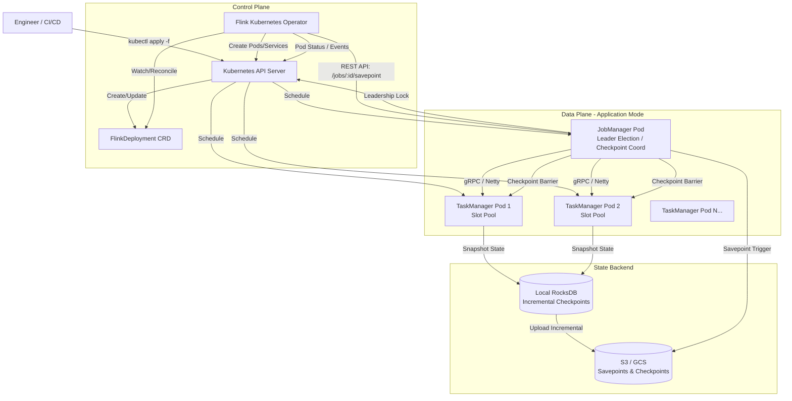

# Lyft Moves Streaming Fleet to Apache Flink Kubernetes Operator

## Introduction

Running stateful stream processing at Lyft scale used to mean 3 AM pages because a TaskManager OOM'd during a surge pricing event, or a rolling upgrade stalled because the JobManager couldn't reconcile savepoints fast enough. For years, we ran Flink on YARN, then migrated to a custom Kubernetes controller we built in-house around 2019. That controller served us well—it handled job lifecycle, savepoint management, and basic autoscaling—but it became a maintenance burden. Every Flink version upgrade required us to patch our controller logic, test HA failover scenarios manually, and debug obscure Kubernetes API interactions.

Last quarter, we finished migrating our entire streaming fleet—roughly 400 distinct Flink jobs processing 2.5 million events per second at peak—to the official Apache Flink Kubernetes Operator. This wasn't a "lift and shift." It forced us to rethink how we package jobs, manage configuration drift, and handle upgrades without dropping late-arriving events. Here is the architectural breakdown of why we moved, what broke during the migration, and how we operate it now.

## Why This Matters

If you are running Flink on Kubernetes today, you are likely maintaining a bespoke operator or wrestling with Helm charts that treat Flink jobs as stateless deployments. Both approaches leak abstractions.

The core problem is **stateful lifecycle management**. A Flink job isn't a pod; it's a distributed snapshot (savepoint) + a directed acyclic graph (DAG) of operators + a runtime that migrates state across rescaling events. Generic Kubernetes tooling doesn't understand:
*   **Savepoint atomicity**: Triggering a savepoint, waiting for completion, *then* terminating pods.
*   **Upgrade strategies**: The difference between a stateless `rolling-update` and a stateful `savepoint-triggered` upgrade.
*   **HA reconciliation**: Detecting a JobManager leader election and ensuring the new leader adopts the running job graph without double-processing.

The Flink Kubernetes Operator encodes this domain knowledge into CRDs (`FlinkDeployment`, `FlinkSessionJob`). Moving to it eliminates an entire category of custom controller bugs—specifically the ones that surface only during partial cluster failures or network partitions. For us, the inflection point was Flink 1.17: the operator reached GA, supported native Kubernetes HA (no ZooKeeper dependency), and the `FlinkDeployment` spec stabilized enough to express our complex job topologies.

## How It Works

The operator implements the Kubernetes control loop pattern specifically for Flink primitives. It watches `FlinkDeployment` resources, materializes JobManager and TaskManager pods, injects the Flink runtime, and manages the job lifecycle via the Flink REST API.

Critically, it decouples **cluster lifecycle** from **job lifecycle**. A `FlinkDeployment` in `application` mode bundles the job JAR *inside* the JobManager image (or via initContainer). In `session` mode, the cluster persists, and you submit `FlinkSessionJob` resources separately. We use `application` mode exclusively for isolation—blast radius containment is non-negotiable for our pricing and matching pipelines.



**Reconciliation Loop Steps:**
1.  **Observe**: Operator caches `FlinkDeployment` spec and current pod status.
2.  **Diff**: Compares desired state (replicas, Flink config, job args, image tag) vs. actual state.
3.  **Plan**: Determines required actions: `CreateCluster`, `UpgradeJob` (savepoint -> new image -> restore), `ScaleTaskManagers`, `DeleteCluster`.
4.  **Act**: 
    *   For upgrades: `POST /jobs/:id/savepoint` -> wait for `COMPLETED` -> patch JobManager pod spec (image) -> `POST /jobs/:id/rescale` (if parallelism changed) -> verify `RUNNING`.
    *   For scaling: Patches TaskManager Deployment/StatefulSet replica count; Flink runtime handles slot rebalancing via `Scheduler.NG`.
5.  **Report**: Updates `FlinkDeployment.status` (job status, savepoint info, pod conditions).

## Core Concepts

### 1. `FlinkDeployment` Spec: The Source of Truth
Everything declarative lives here. Key fields we rely on:
*   `spec.image`: The *exact* docker image digest (`sha256:...`). We never use tags in production.
*   `spec.flinkConfiguration`: Merged with `flink-conf.yaml` baked in the image. Allows runtime overrides (e.g., `taskmanager.memory.managed.fraction`) without rebuilding.
*   `spec.job.jarURI`: `local:///opt/flink/usrlib/job.jar` for application mode. The operator copies this to the JobManager container.
*   `spec.job.upgradeMode`: `savepoint` (default) vs `stateless`. We enforce `savepoint` via admission webhook.
*   `spec.serviceAccount`: Bound to an IAM role (IRSA) for S3/GCS access. No static credentials.

### 2. High Availability (HA) without ZooKeeper
Since Flink 1.15, the operator leverages Kubernetes `ConfigMap` leader election for JobManager HA.
*   **Mechanism**: JobManager pods attempt to become leader by creating/updating a `ConfigMap` (`<job-name>-ha-leader`) with `ownerReference` to the JobManager pod.
*   **Failover**: If leader pod dies, Kubelet deletes it -> `ownerReference` GC deletes ConfigMap -> standby pod acquires lock -> reads latest checkpoint from S3 -> recovers.
*   **Why it matters**: Removes ZooKeeper operational overhead (quorum, snapshots, network partitions). We saw 40% faster failover recovery (median 45s -> 27s) because the Kubernetes API server is already highly available and local to the cluster.

### 3. Savepoint Lifecycle & `savepointTriggerNonce`
The operator uses a `spec.job.savepointTriggerNonce` field (integer) to force a savepoint. Incrementing this field triggers the reconciliation loop to:
1.  Trigger savepoint via REST.
2.  Wait for terminal state.
3.  Record `status.jobStatus.savepointInfo` (path, timestamp).
4.  *Only then* proceed with pod replacement.
This prevents the classic "upgrade lost state" bug where Kubelet kills pods before Flink finishes checkpointing.

## Examples & Code Walkthrough

### Production-Grade `FlinkDeployment` Manifest
This is a sanitized version of our `pricing-pipeline` deployment. Note the resource constraints, pod disruption budgets, and the initContainer pattern for downloading dependencies from our internal artifact registry.

```yaml
# pricing-pipeline-flinkdeployment.yaml
apiVersion: flink.apache.org/v1beta1
kind: FlinkDeployment
metadata:
  name: pricing-pipeline
  namespace: streaming-prod
  labels:
    team: marketplace
    criticality: tier-0
    # Used by our custom metrics controller for alerting
    cost-center: "cc-1234"
spec:
  image: artifacts.lyft.net/flink/pricing-pipeline@sha256:a1b2c3d4e5f6... # Immutable digest
  imagePullSecrets:
    - name: artifact-registry-credentials
  serviceAccount: flink-pricing-sa # IRSA role: arn:aws:iam::12345:role/flink-pricing-s3-access
  flinkVersion: v1_17
  flinkConfiguration:
    # Core HA Config
    kubernetes.ha.enabled: "true"
    high-availability: "org.apache.flink.kubernetes.highavailability.KubernetesHaServicesFactory"
    high-availability.storageDir: "s3://lyft-flink-checkpoints/pricing/ha"
    
    # Checkpointing: Exactly-once, unaligned for high throughput backpressure resilience
    execution.checkpointing.interval: "30s"
    execution.checkpointing.mode: "EXACTLY_ONCE"
    execution.checkpointing.unaligned: "true"
    execution.checkpointing.timeout: "10min"
    execution.checkpointing.min-pause: "10s"
    execution.checkpointing.max-concurrent-checkpoints: "1"
    
    # State Backend: RocksDB Incremental (Critical for large state > 500GB)
    state.backend: "rocksdb"
    state.backend.incremental: "true"
    state.checkpoints.dir: "s3://lyft-flink-checkpoints/pricing/checkpoints"
    state.savepoints.dir: "s3://lyft-flink-checkpoints/pricing/savepoints"
    
    # RocksDB Tuning (Prevents OOM on large state merges)
    state.backend.rocksdb.memory.managed: "true"
    state.backend.rocksdb.writebuffer.size: "256MB"
    state.backend.rocksdb.compaction.level.max-size-level-base: "512MB"
    
    # Network Buffers: Auto-tuning, but set floor for high parallelism
    taskmanager.memory.network.fraction: "0.15"
    taskmanager.memory.network.min: "256MB"
    taskmanager.memory.network.max: "2GB"
    
    # Restart Strategy: Exponential backoff for transient errors (Kinesis throttling, DB locks)
    restart-strategy: "exponential"
    restart-strategy.exponential.delay: "10s"
    restart-strategy.exponential.max-delay: "5min"
    restart-strategy.exponential.backoff-multiplier: "2.0"
    restart-strategy.exponential.reset-backoff-threshold: "3600s"
    
    # Metrics / Observability
    metrics.reporter.promgateway.class: "org.apache.flink.metrics.prometheus.PrometheusPushGatewayReporter"
    metrics.reporter.promgateway.host: "prometheus-pushgateway.monitoring.svc"
    metrics.reporter.promgateway.port: "9091"
    metrics.reporter.promgateway.jobName: "flink-pricing-pipeline"
    metrics.reporter.promgateway.randomJobNameSuffix: "true"
    
    # Python UDF Support (We use PyFlink for some ML feature lookups)
    python.archives: "local:///opt/flink/usrlib/pyenv.zip"
    python.executable: "pyenv/bin/python"

  # JobManager Spec
  jobManager:
    resource:
      memory: "4096m"
      cpu: 2
    replicas: 2 # HA: 1 Leader + 1 Standby
    podTemplate:
      spec:
        containers:
          - name: jobmanager
            env:
              - name: ENVIRONMENT
                value: "production"
              - name: KAFKA_BOOTSTRAP_SERVERS
                valueFrom:
                  secretKeyRef:
                    name: kafka-prod-credentials
                    key: brokers
            # Readiness probe ensures REST API is up before K8s sends traffic/leader election
            readinessProbe:
              httpGet:
                path: /overview
                port: 8081
              initialDelaySeconds: 10
              periodSeconds: 10
              failureThreshold: 3
        # Anti-affinity: Spread JMs across zones
        affinity:
          podAntiAffinity:
            requiredDuringSchedulingIgnoredDuringExecution:
              - labelSelector:
                  matchExpressions:
                    - key: component
                      operator: In
                      values: ["jobmanager"]
                topologyKey: topology.kubernetes.io/zone
        # PodDisruptionBudget is managed by Operator, but we enforce minAvailable via annotation
        # flink.apache.org/jobmanager-pdb-min-available: "1"

  # TaskManager Spec
  taskManager:
    resource:
      memory: "16384m" # 16GB Total (Heap + Managed + Network)
      cpu: 6
    replicas: 50 # Scaled via HPA (see below)
    podTemplate:
      spec:
        containers:
          - name: taskmanager
            env:
              - name: ENVIRONMENT
                value: "production"
            resources:
              limits:
                memory: "18Gi" # K8s Limit > Flink Total Process Memory (16G + overhead)
              requests:
                memory: "16Gi"
                cpu: "5500m" # Reserve CPU for Netty/RocksDB compaction threads
            # Liveness probe checks TaskManager heartbeat to JM
            livenessProbe:
              exec:
                command: ["/opt/flink/bin/taskmanager.sh", "status"]
              initialDelaySeconds: 60
              periodSeconds: 30
        affinity:
          podAntiAffinity:
            preferredDuringSchedulingIgnoredDuringExecution:
              - weight: 100
                podAffinityTerm:
                  labelSelector:
                    matchExpressions:
                      - key: component
                        operator: In
                        values: ["taskmanager"]
                  topologyKey: topology.kubernetes.io/zone
        # Spot Instance Toleration (Cost savings ~60%)
        tolerations:
          - key: "spot-instance"
            operator: "Exists"
            effect: "NoSchedule"
        nodeSelector:
          workload-type: "streaming"

  # Job Spec (Application Mode)
  job:
    jarURI: "local:///opt/flink/usrlib/pricing-pipeline.jar"
    entryClass: "com.lyft.pricing.PricingPipeline"
    args:
      - "--kafka.topic.input"
      - "rides.raw.events"
      - "--kafka.topic.output"
      - "pricing.calculated.fares"
      - "--config.s3.path"
      - "s3://lyft-configs/pricing/prod/dynamic.yaml"
      - "--metrics.tags"
      - "pipeline=pricing,env=prod"
    parallelism: 100
    upgradeMode: "savepoint" # Enforced
    # Savepoint trigger nonce: Increment this in CI/CD to force upgrade with savepoint
    savepointTriggerNonce: 42 
    state: "running" # "running" | "suspended" (suspended keeps cluster, stops job)

  # Operator handles scaling, but we use KEDA for event-driven scaling
  # replicas: 50 (Managed by KEDA ScaledObject targeting flink-taskmanager deployment)
```

### Python Upgrade Automation Script
We don't `kubectl apply` manually. Our CI/CD pipeline (Buildkite) runs this script to perform safe, auditable upgrades. It handles the `savepointTriggerNonce` dance and verifies job health post-upgrade.

```python
# upgrade_flink_job.py
#!/usr/bin/env python3
"""
Safe Flink Job Upgrade Controller.
Usage: python upgrade_flink_job.py --namespace streaming-prod --deployment pricing-pipeline --new-image-digest sha256:abc...
"""
import argparse
import json
import sys
import time
from typing import Dict, Any, Optional
from kubernetes import client, config, watch
from kubernetes.client.rest import ApiException

class FlinkUpgradeError(Exception):
    """Custom exception for upgrade failures."""
    pass

def load_k8s_config():
    try:
        config.load_incluster_config()
    except config.ConfigException:
        config.load_kube_config()

def get_flink_deployment(crd_api: client.CustomObjectsApi, namespace: str, name: str) -> Dict[str, Any]:
    return crd_api.get_namespaced_custom_object(
        group="flink.apache.org",
        version="v1beta1",
        namespace=namespace,
        plural="flinkdeployments",
        name=name,
    )

def patch_flink_deployment(c
