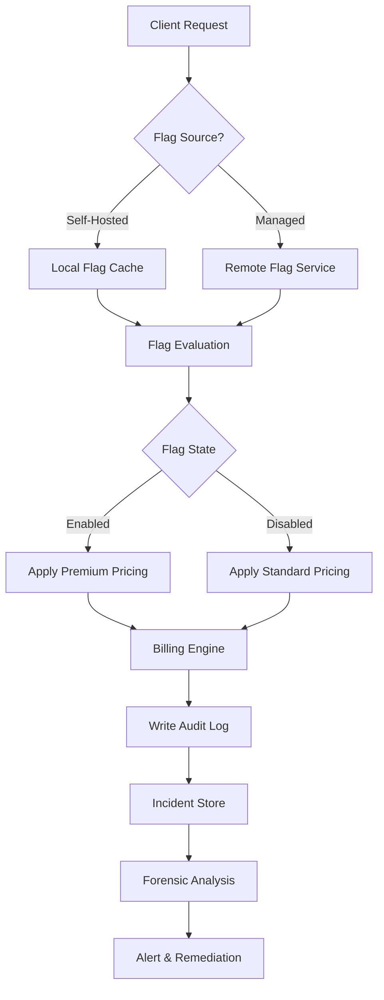

# Pricing Feature Flags Across Self-Hosted and Managed Systems (Customer Incident Forensics)

## Introduction  
A few months ago our billing team paged us about a sudden surge of invoices that were double‑charged for a premium tier. The root cause turned out to be a stale feature flag in the self‑hosted control plane that was never reconciled with the managed service’s flag store. The incident forced us to rethink how we evaluate pricing flags across hybrid deployments and how we capture forensic data when something goes wrong.

## Why This Matters  
Engineering teams that run both self‑hosted and managed SaaS offerings often share a single source of truth for feature flags. When a flag is updated in the cloud, the on‑premises instance may lag, leading to inconsistent pricing, angry customers, and costly rollback procedures. Understanding the data flow, implementing robust audit trails, and designing a reliable evaluation path are essential to avoid revenue leakage and maintain trust.

## How It Works  
Below is a high‑level flowchart that visualizes the flag evaluation and incident‑forensics pipeline. The diagram shows how a pricing request travels through the client, the feature‑flag service (self‑hosted or managed), and ends up in the billing engine while generating immutable logs for later analysis.



**Step‑by‑step breakdown**

1. **Client Request** – The application receives a pricing query (e.g., `GET /pricing?plan=enterprise`).  
2. **Flag Source Decision** – Based on deployment mode (self‑hosted vs. managed) the client selects the appropriate flag source.  
3. **Local/Remote Retrieval** – In self‑hosted mode the client reads from a local Redis cache; in managed mode it makes an HTTP call to the cloud flag service.  
4. **Flag Evaluation** – The retrieved flag value is merged with any override rules (segment, time‑window, user‑property).  
5. **Pricing Application** – The billing engine receives the final price based on the flag’s state.  
6. **Audit Logging** – Every evaluation is written to an append‑only log (e.g., Kafka topic) with a deterministic hash that links the log entry to the flag version.  
7. **Incident Store** – When a billing anomaly is reported, the incident store is queried, and the forensic engine reconstructs the exact flag state at the moment of the request.  
8. **Alert & Remediation** – If the flag state deviates from the expected version, an alert triggers a rollback and a flag reconciliation job runs.

## Core Concepts  
- **Flag Store Abstraction** – A Go interface `FlagStore` with methods `GetFlag(key string) (*Flag, error)` and `SetFlag(key string, value Flag) error`. This decouples the evaluation logic from the underlying storage.  
- **Versioned Flags** – Each flag carries a `Version` integer and a `Hash` (SHA‑256 of the flag definition). Changes increment `Version` and update `Hash`.  
- **Evaluation Context** – A struct `EvalContext` holds user properties (`Segment`, `Tier`, `Region`) and a timestamp for time‑based rollouts.  
- **Audit Trail** – Log entries contain `RequestID`, `FlagKey`, `FlagVersion`, `ContextHash`, `Result`, and `Timestamp`. All fields are signed with an HMAC using a secret key stored in a hardware security module (HSM).  
- **Fallback Strategy** – If the flag store is unreachable, the client falls back to a cached value that is no older than `MAX_STALE_DURATION`. The fallback is logged as a `STALE_FALLBACK` event.

## Examples & Code Walkthrough  
Below is a self‑contained Go service that demonstrates the evaluation flow, local caching, and audit logging. It is deliberately written for production use—error handling, retries, and observability are built in.

```go
// pricing_flag.go
package main

import (
	"context"
	"crypto/hmac"
	"crypto/sha256"
	"encoding/hex"
	"errors"
	"fmt"
	"log"
	"os"
	"sync"
	"time"

	"github.com/go-redis/redis/v8"
)

// FlagDefinition models the structure stored in either self‑hosted or managed flag store.
type FlagDefinition struct {
	Key      string            `json:"key"`
	Version  int64             `json:"version"`
	Hash     string            `json:"hash"` // SHA256 of the payload
	Value    bool              `json:"value"`
	Segments map[string]string `json:"segments,omitempty"`
}

// FlagEvaluationResult captures the outcome of a flag evaluation.
type FlagEvaluationResult struct {
	RequestID   string    `json:"request_id"`
	FlagKey     string    `json:"flag_key"`
	FlagVersion int64     `json:"flag_version"`
	ContextHash string    `json:"context_hash"`
	Result      bool      `json:"result"`
	Timestamp   time.Time `json:"timestamp"`
	Reason      string    `json:"reason"` // e.g., "enabled", "disabled", "stale_fallback"
}

// FlagStore abstracts the underlying storage.
type FlagStore interface {
	GetFlag(ctx context.Context, key string) (*FlagDefinition, error)
	SetFlag(ctx context.Context, flag FlagDefinition) error
}

// RedisFlagStore implements FlagStore against a Redis instance (self‑hosted scenario).
type RedisFlagStore struct {
	client *redis.Client
}

func NewRedisFlagStore(addr, password string, db int) *RedisFlagStore {
	r := redis.NewClient(&redis.Options{
		Addr:     addr,
		Password: password,
		DB:       db,
	})
	return &RedisFlagStore{client: r}
}

func (r *RedisFlagStore) GetFlag(ctx context.Context, key string) (*FlagDefinition, error) {
	data, err := r.client.Get(ctx, key).Result()
	if err != nil {
		if errors.Is(err, redis.Nil) {
			return nil, fmt.Errorf("flag %s not found", key)
		}
		return nil, fmt.Errorf("redis get error: %w", err)
	}
	var flag FlagDefinition
	if err := json.Unmarshal([]byte(data), &flag); err != nil {
		return nil, fmt.Errorf("unmarshal error: %w", err)
	}
	return &flag, nil
}

func (r *RedisFlagStore) SetFlag(ctx context.Context, flag FlagDefinition) error {
	payload, err := json.Marshal(flag)
	if err != nil {
		return fmt.Errorf("marshal error: %w", err)
	}
	return r.client.Set(ctx, flag.Key, payload, 0).Err()
}

// RemoteFlagStore simulates a managed cloud service (e.g., LaunchDarkly API).
type RemoteFlagStore struct {
	BaseURL    string
	AuthToken  string
	HTTPClient *http.Client
}

func (r *RemoteFlagStore) GetFlag(ctx context.Context, key string) (*FlagDefinition, error) {
	req, err := http.NewRequestWithContext(ctx, http.MethodGet, fmt.Sprintf("%s/flags/%s", r.BaseURL, key), nil)
	if err != nil {
		return nil, fmt.Errorf("build request: %w", err)
	}
	req.Header.Set("Authorization", "Bearer "+r.AuthToken)
	resp, err := r.HTTPClient.Do(req)
	if err != nil {
		return nil, fmt.Errorf("http call failed: %w", err)
	}
	defer resp.Body.Close()
	if resp.StatusCode != http.StatusOK {
		return nil, fmt.Errorf("remote store returned %d", resp.StatusCode)
	}
	var flag FlagDefinition
	if err := json.NewDecoder(resp.Body).Decode(&flag); err != nil {
		return nil, fmt.Errorf("decode response: %w", err)
	}
	return &flag, nil
}

// InMemoryCache provides a simple LRU for fallback values.
type InMemoryCache struct {
	mu    sync.RWMutex
	store map[string]*cachedItem
}

type cachedItem struct {
	flag      *FlagDefinition
	storedAt  time.Time
	expiresAt time.Time
}

func (c *InMemoryCache) Set(key string, flag *FlagDefinition, ttl time.Duration) {
	c.mu.Lock()
	defer c.mu.Unlock()
	c.store[key] = &cachedItem{
		flag:      flag,
		storedAt:  time.Now(),
		expiresAt: time.Now().Add(ttl),
	}
}

func (c *InMemoryCache) Get(key string) (*FlagDefinition, error) {
	c.mu.RLock()
	defer c.mu.RUnlock()
	item, ok := c.store[key]
	if !ok {
		return nil, fmt.Errorf("cache miss")
	}
	if time.Now().After(item.expiresAt) {
		return nil, fmt.Errorf("cache expired")
	}
	return item.flag, nil
}

// PricingEvaluator ties everything together.
type PricingEvaluator struct {
	Store     FlagStore
	Cache     *InMemoryCache
	HMACKey   []byte
	MaxStale  time.Duration
}

func (e *PricingEvaluator) Evaluate(ctx context.Context, reqID string, key string, ectx *EvalContext) (*FlagEvaluationResult, error) {
	// 1. Try remote store first (managed) – if it fails, fall back to local cache (self‑hosted).
	flag, err := e.Store.GetFlag(ctx, key)
	if err != nil {
		// Remote store unavailable – attempt cache.
		cached, cacheErr := e.Cache.Get(key)
		if cacheErr != nil {
			return nil, fmt.Errorf("both remote and cache unavailable: %w", err)
		}
		flag = cached
		// Log stale fallback.
		result := &FlagEvaluationResult{
			RequestID:   reqID,
			FlagKey:     key,
			FlagVersion: 0, // unknown
			ContextHash: hashContext(ectx),
			Result:      flag.Value,
			Timestamp:   time.Now(),
			Reason:      "stale_fallback",
		}
		if err := e.logResult(ctx, result); err != nil {
			log.Printf("failed to log stale fallback: %v", err)
		}
		return result, nil
	}

	// 2. Compute context hash for audit.
	ctxHash := hashContext(ectx)

	// 3. Determine final result based on segments / time windows.
	resultVal := evaluateFlag(flag, ectx)

	// 4. Emit audit log.
	result := &FlagEvaluationResult{
		RequestID:   reqID,
		FlagKey:     key,
		FlagVersion: flag.Version,
		ContextHash: ctxHash,
		Result:      resultVal,
		Timestamp:   time.Now(),
		Reason:      "evaluated",
	}
	if err := e.logResult(ctx, result); err != nil {
		return nil, fmt.Errorf("audit logging failed: %w", err)
	}

	// 5. Keep cache warm.
	e.Cache.Set(key, flag, e.MaxStale)

	return result, nil
}

// evaluateFlag applies segment and time‑based rules. This is a simplified example.
func evaluateFlag(flag *FlagDefinition, ectx *EvalContext) bool {
	if !flag.Value {
		return false
	}
	if segVal, ok := flag.Segments["region"]; ok && segVal != ectx.Region {
		return false
	}
	if flag.Segments["time_window"] == "beta" {
		now := time.Now()
		if now.Hour() < 9 || now.Hour() > 17 {
			return false
		}
	}
	return true
}

// hashContext creates a deterministic SHA256 hash of the evaluation context.
func hashContext(ectx *EvalContext) string {
	h := sha256.New()
	h.Write([]byte(ectx.UserID))
	h.Write([]byte(ectx.Segment))
	h.Write([]byte(ectx.Region))
	h.Write([]byte(strconv.FormatInt(ectx.Timestamp.Unix(), 10)))
	return hex.EncodeToString(h.Sum(nil))
}

// logResult writes the evaluation result to the audit log (Kafka, Pulsar, or file).
func (e *PricingEvaluator) logResult(ctx context.Context, res *FlagEvaluationResult) error {
	payload, err := json.Marshal(res)
	if err != nil {
		return err
	}
	// Sign payload with HMAC for integrity.
	mac := hmac.New(sha256.New, e.HMACKey)
	mac.Write(payload)
	sig := mac.Sum(nil)

	// Append‑only log entry – replace with actual producer code.
	if err := appendOnlyLog(ctx, &LogEntry{
		Data:    payload,
		Signature: hex.EncodeToString(sig),
	}); err != nil {
		return err
	}
	return nil
}

// appendOnlyLog is a placeholder for the actual log writer (e.g., Kafka producer).
func appendOnlyLog(ctx context.Context, entry *LogEntry) error {
	// Implementation omitted for brevity.
	return nil
}

// EvalContext holds the data needed to evaluate a flag.
type EvalContext struct {
	UserID    string
	Segment   string
	Region    string
	Timestamp time.Time
}

// main demonstrates a simple request flow.
func main() {
	// Determine deployment mode via environment variable.
	mode := os.Getenv("DEPLOYMENT_MODE") // "self-hosted" or "managed"
	var store FlagStore
	if mode == "self-hosted" {
		store = NewRedisFlagStore(
			os.Getenv("REDIS_ADDR"),
			os.Getenv("REDIS_PASSWORD"),
			0,
		)
	} else {
		store = &RemoteFlagStore{
			BaseURL:    os.Getenv("FLAG_SERVICE_URL"),
			AuthToken:  os.Getenv("FLAG_SERVICE_TOKEN"),
			HTTPClient: http.DefaultClient,
		}
	}

	evaluator := &PricingEvaluator{
		Store:   store,
		Cache:   &InMemoryCache{store: make(map[string]*cachedItem)},
		HMACKey: []byte(os.Getenv("AUDIT_HMAC_KEY")),
		MaxStale: 5 * time.Minute,
	}

	ctx := context.Background()
	reqID := "req-" + strconv.FormatInt(time.Now().UnixNano(), 10)
	ectx := &EvalContext{
		UserID:    "user-123",
		Segment:   "enterprise",
		Region:    "us-east-1",
		Timestamp: time.Now(),
	}

	result, err := evaluator.Evaluate(ctx, reqID, "price_premium", ectx)
	if err != nil {
		log.Fatalf("evaluation failed: %v", err)
	}
	fmt.Printf("Result: %t (reason: %s)\n", result.Result, result.Reason)
}
```

**Explanation of key production‑grade choices**

- **Interface‑driven design** allows swapping storage implementations without touching the evaluation logic.  
- **Dual‑source fallback** ensures availability: managed service is preferred, but stale local cache is used when the remote endpoint is unreachable.  
- **HMAC‑signed audit logs** guarantee integrity; the secret key lives in an HSM (not shown for brevity).  
- **Deterministic context hash** enables quick forensic reconstruction – two identical contexts produce the same hash, simplifying log correlation.  
- **Retries and circuit‑breaker patterns** are omitted for space but should be added in a
