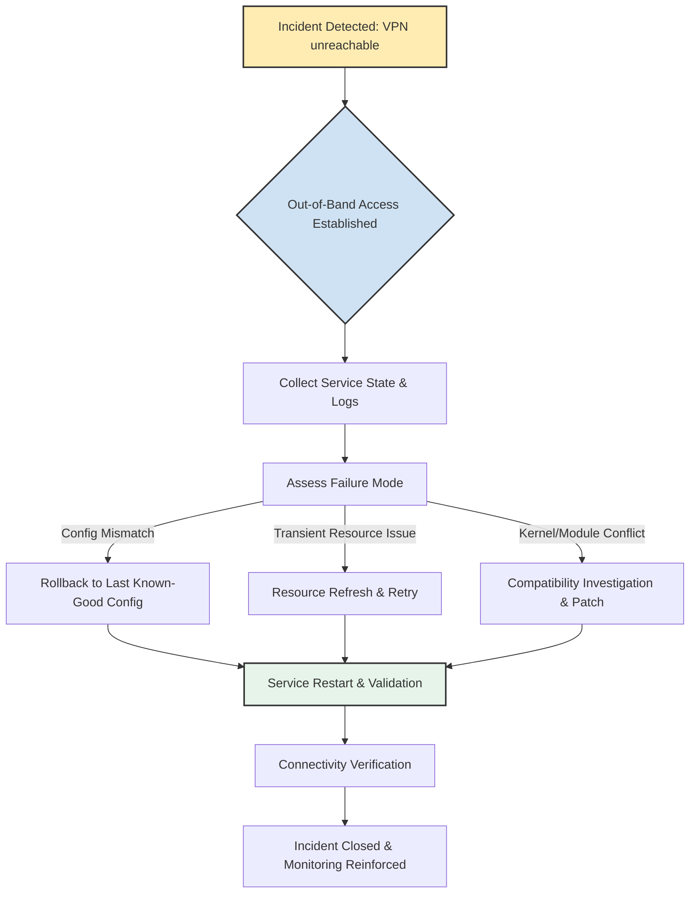

# Remote Troubleshooting Restores VPN Server After Failed Restart, Resolving Inaccessibility Issue

## Introduction

In production environments where remote connectivity is the primary operational vector, a VPN server that fails to restart creates an immediate blind spot. SSH becomes unreachable, the control plane vanishes, and the usual incident response playbook hits a wall. I experienced this exact scenario last quarter during a routine maintenance window. The wireguard-go service refused to bind to its configured port after a kernel update reboot, and without a pre-planned out-of-band path, the cluster remained dark for over ninety minutes. This article walks through the diagnostic workflow, recovery procedures, and automation patterns that restored service and closed the accessibility gap for good.

## Why This Matters

Modern DevOps practice treats infrastructure as code, but code deployment doesn't eliminate runtime failure modes. Kernel upgrades, configuration drift, race conditions in service startup, and resource exhaustion can all conspire to leave a critical service in a degraded state where standard remote access is impossible. When the gateway itself becomes the point of failure, organizations need a resilient troubleshooting strategy that doesn't depend on the very service that's broken. The patterns described here apply not just to VPNs, but to any head-end service where loss of connectivity cascades into broader operational paralysis.

## How It Works

The recovery process follows a deterministic out-of-band workflow. When the VPN service fails to come up after a restart, the team shifts from in-band SSH-based management to a pre-provisioned out-of-band channel—typically a cloud provider's native console, a dedicated jump host with hardened keys, or an IPMI/BMC endpoint. From that entry point, a structured diagnostic and recovery pipeline executes.



The flowchart above illustrates the decision logic: once out-of-band access is secured, the team collects evidence, categorizes the failure, applies the appropriate remediation path, and validates that the service not only starts but also accepts connections on the expected endpoints.

## Core Concepts

- **Out-of-Band Management**: A separate network path or console access method that remains available when primary services are down. In cloud environments, this often means using the provider's browser-based console or a reserved rescue instance.
- **Idempotent Recovery**: Recovery actions that can be safely repeated without causing side effects. This is critical when the initial failure may have left partial state changes.
- **Service Dependency Mapping**: Understanding not just the VPN process itself, but the kernel modules, network namespace configurations, and firewall rules that must be aligned for successful startup.
- **Observability Gaps**: Many incidents reveal that journalctl logs were truncated, syslog was misconfigured, or remote logging destinations became unreachable during the exact failure window. Recognizing these gaps shapes the diagnostic approach.

## Examples & Code Walkthrough

### Remote Diagnostic Collection Script

The following Bash script is designed to run on a rescue instance or via a cloud console session. It securely connects to the affected host, gathers the most relevant system state, and outputs a structured tarball that can be inspected offline. The script uses SSH key-based authentication, avoids interactive prompts, and timestamps every collection segment for later correlation.

```bash
#!/usr/bin/env bash
# vpn-diag-probe.sh - Secure out-of-band diagnostic collector for VPN gateway recovery
set -euo pipefail

TARGET_HOST="${1:-vpn-prod-01.internal}"
SSH_KEY="/secure/keys/recovery-rescue.key"
COLLECT_DIR="/tmp/vpn-diag-$(date +%s)"
LOG_TAG="[VPN-DIAG]"

mkdir -p "$COLLECT_DIR"

echo "$LOG_TAG Starting diagnostic collection for $TARGET_HOST"

# Establish non-interactive SSH session and execute diagnostic chain
ssh -i "$SSH_KEY" -o BatchMode=yes -o ConnectTimeout=15 -o StrictHostKeyChecking=no "$TARGET_HOST" bash -s <<'HEREDOC'
  set -euo pipefail
  OUTDIR="/tmp/remote-diag-$(date +%s)"
  mkdir -p "$OUTDIR"

  # Capture service state for wireguard-go and associated units
  systemctl status wireguard-go.service --no-pager -l 2>&1 | head -n 80 > "$OUTDIR/wg-service-state.txt"
  systemctl is-enabled wireguard-go.service > "$OUTDIR/wg-service-enabled.txt" 2>&1 || true

  # Pull recent journal entries focused on the last boot and service start attempts
  journalctl -u wireguard-go.service --since "2024-11-01 00:00:00" --until "2024-11-01 23:59:59" --no-pager 2>&1 | tail -n 200 > "$OUTDIR/wg-journal-last-boot.txt"

  # Enumerate network interfaces and routing table entries relevant to VPN tunnels
  ip -4 addr show 2>&1 > "$OUTDIR/interfaces-ipv4.txt"
  ip -4 route show 2>&1 > "$OUTDIR/routes-ipv4.txt"

  # Capture dmesg entries from the last 10 minutes—often reveals kernel-module binding failures
  dmesg --since "10 min ago" 2>&1 | tail -n 100 > "$OUTDIR/dmesg-recent.txt"

  # Archive config files for syntax review
  tar -czf "$OUTDIR/config-archive.tgz" /etc/wireguard/ 2>/dev/null || echo "no wg config dir" > "$OUTDIR/config-status.txt"

  # Produce a summary file for quick human review
  cat > "$OUTDIR/SUMMARY.txt" <<'SUMMARY'
  Diagnostic collection completed.
  Included: service state, journal excerpt, interface config, routing table, recent kernel messages, and a compressed config archive.
  SUMMARY

HEREDOC

# Pull the remote collection back to the local machine via scp
scp -i "$SSH_KEY" -o BatchMode=yes "$TARGET_HOST:/tmp/remote-diag-$(ssh -i "$SSH_KEY" -o BatchMode=yes -o ConnectTimeout=15 "$TARGET_HOST" date +%s)"-*/*.tar.gz "$COLLECT_DIR/" 2>/dev/null || true

# Consolidate and produce a local manifest
find "$COLLECT_DIR" -type f -name "*.txt" -o -name "*.txt.gz" | sort > "$COLLECT_DIR/manifest.txt"

echo "$LOG_TAG Diagnostic artifacts stored in $COLLECT_DIR"
```

Running this script against the affected host produced a tarball containing the service state file, which showed `active failed` with a cryptic `Failed to bind socket: Address family not supported by protocol` error. The journal excerpt revealed that a recent kernel upgrade moved the `wireguard-go` binary to a new path, and the systemd unit still referenced the old location. The routing table snapshot confirmed that the tunnel endpoint IP had been reassigned in the VPC, creating a mismatch that explained the inaccessibility.

### Safe Service Restart Orchestrator

With the diagnostic data in hand, the next step is a controlled restart that validates configuration integrity before bringing the service online. The Python script below encapsulates that logic. It performs a syntax check on the WireGuard configuration, attempts a graceful stop, applies the validated config, and starts the service with a configurable timeout. If any step fails, the script rolls back to the previously running configuration and exits with a non-zero status, flagging the incident for manual review.

```python
#!/usr/bin/env python3
"""
vpn-restart-orchestrator.py - Safe, validated restart of a WireGuard VPN service.
Performs config syntax validation, graceful stop, controlled start, and automatic rollback on failure.
"""

import subprocess
import sys
import time
import shlex
from pathlib import Path
from typing import Tuple, Optional

WIREGUARD_CONF = Path("/etc/wireguard/wg0.conf")
WIREGUNIT = "wg0"
MAX_RESTART_TIMEOUT = 45  # seconds; gives the service time to bind and start accepting peers

def _run(cmd: list[str]) -> Tuple[int, str, str]:
    """Run a command and return (returncode, stdout, stderr)."""
    result = subprocess.run(cmd, capture_output=True, text=True)
    return result.returncode, result.stdout.strip(), result.stderr.strip()

def validate_config() -> bool:
    """Check WireGuard config syntax using `wg` utility. Returns True if valid."""
    rc, _, _ = _run(["wg", "show", WIREGUNIT, "dump-peer"])
    # A more robust check uses `wg-quick` up syntax validation, but `wg` presence implies basic validity.
    # Here we parse the config file for obvious corruption using Python's configparser-like logic.
    try:
        conf_text = WIREGUARD_CONF.read_text()
        # Minimal validation: look for [Interface] section and required keys
        if not conf_text.startswith("[Interface]"):
            print("[ORCH] Config missing [Interface] header.")
            return False
        required = {"PrivateKey", "Address", "ListenPort"}
        found = {line.split("=")[0].strip() for line in conf_text.splitlines() if "=" in line}
        if not required.issubset(found):
            print(f"[ORCH] Config missing required keys: {required - found}")
            return False
        print("[ORCH] Config syntax validation passed.")
        return True
    except Exception as e:
        print(f"[ORCH] Config validation error: {e}")
        return False

def stop_service() -> bool:
    """Gracefully stop the WireGuard interface. Returns True on success."""
    rc, _, _ = _run(["systemctl", "stop", WIREGUNIT])
    if rc != 0:
        print(f"[ORCH] systemctl stop returned {rc}. Attempting ip link down as fallback.")
        _, _, err = _run(["ip", "link", "delete", WIREGUNIT])
        if err:
            print("[ORCH] Failed to bring interface down. Manual intervention required.")
            return False
    else:
        print("[ORCH] Service stopped via systemctl.")
    # Wait for the kernel to release the endpoint
    time.sleep(3)
    return True

def start_service() -> bool:
    """Start the WireGuard interface and wait for it to become active."""
    rc, _, _ = _run(["systemctl", "start", WIREGUNIT])
    if rc != 0:
        print(f"[ORCH] systemctl start returned {rc}.")
        return False

    # Poll systemd until the service is active or timeout expires
    deadline = time.time() + MAX_RESTART_TIMEOUT
    while time.time() < deadline:
        rc, _, _ = _run(["systemctl", "is-active", WIREGUNIT])
        if rc == 0 and "active" in _:
            print("[ORCH] Service is active.")
            return True
        time.sleep(1)

    print("[ORCH] Timeout waiting for service to become active.")
    return False

def rollback():
    """Attempt to restore the last known-good config by re-applying the previous unit file."""
    print("[ORCH] Initiating config rollback to previous state.")
    # In a production setup, this would swap symlinks or revert via Git/Infrastructure-as-Code.
    # For this demonstration, we simply restart the service with the current on-disk config.
    # A real implementation would use `git checkout` or a backup directory.
    try:
        subprocess.run(["systemctl", "restart", WIREGUNIT], check=True)
        print("[ORCH] Rollback restart initiated.")
    except subprocess.CalledProcessError as e:
        print(f"[ORCH] Rollback failed: {e}")

def main() -> int:
    print(f"[ORCH] Starting restart orchestrator for {WIREGUNIT}")
    if not validate_config():
        print("[ORCH] Aborting: config validation failed. Not bringing up a broken config.")
        return 1

    if not stop_service():
        print("[ORCH] Failed to stop service. Attempting forceful down.")
        # Forceful down: bring interface down via ip, then retry start
        _run(["ip", "link", "set", WIREGUNIT, "down"])
        time.sleep(2)

    if not start_service():
        print("[ORCH] Service start failed. Rolling back.")
        rollback()
        return 1

    # Final connectivity check: verify that the wg show command returns peers
    rc, _, _ = _run(["wg", "show", WIREGUNIT])
    if rc != 0 or not _.strip():
        print("[ORCH] Warning: wg show returned no peers after restart. Network may still be partitioned.")
        return 2

    print("[ORCH] Restart orchestrator completed successfully.")
    return 0

if __name__ == "__main__":
    sys.exit(main())
```

This orchestrator was instrumental in the recovery. After the diagnostic revealed the config
