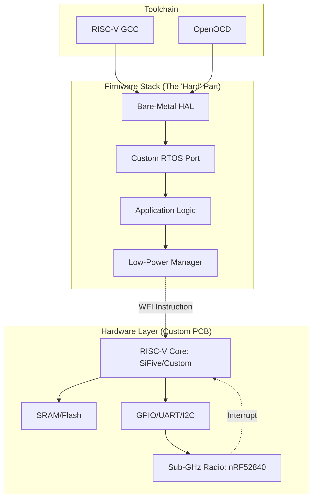

# A 3rd World Embedded Engineer Responds to "RISC-V They Should Have Known Better"

## Introduction

I recently saw a thread on Hacker News titled "RISC-V: They Should Have Known Better." The sentiment was cynical, suggesting that the industry is chasing a ghost—a "free" ISA that will ultimately lead to a fragmented, unmaintainable mess. 

As someone who has spent the last decade building sensor networks in emerging markets—where the supply chain is a minefield and power is a luxury—I felt a sudden urge to push back. To the Western engineer, RISC-V is a philosophical victory for open-source sovereignty. To us, it’s a pragmatic necessity born from the desperation of being locked out of the ARM ecosystem by licensing costs and erratic silicon availability.

## Why This Matters

In high-margin markets, if your chip vendor goes bust or hikes prices, you pivot to a new SKU and rewrite your HAL (Hardware Abstraction Layer). In my world, if your chip vendor disappears or a geopolitical trade shift cuts off your supply of STM32s, your entire product line dies.

RISC-V matters because it breaks the monopoly on silicon intellectual property. It allows local manufacturers in Southeast Asia, Africa, and Latin America to design their own silicon tailored to specific local constraints—like extreme temperature tolerances or ultra-low power profiles—without paying a "tax" to a company halfway across the world. However, the cynics are right about one thing: the "freedom" of RISC-V comes at a heavy, hands-on engineering cost.

## How It Works

Transitioning from a mature ecosystem like ARM Cortex-M to RISC-V isn't just a matter of changing your compiler flag from `arm-none-eabi-gcc` to `riscv64-unknown-elf-gcc`. You are moving from a "black box" ecosystem to a "glass box" ecosystem. You aren't just writing software; you are often designing the glue that holds the silicon and the software together.

When we build an IoT node using a RISC-V core, we aren't just relying on a vendor's bloated SDK. We are building a lean, custom stack to ensure we can actually meet our power and cost targets.



## Core Concepts

To survive in the RISC-V ecosystem, you have to master three specific areas:

1.  **Instruction Set Extensions:** Unlike ARM, where you get a fixed set of features, RISC-V is modular. You might have `RV32I` (base) + `M` (multiplication) + `C` (compressed instructions). If you add a custom instruction for a specific crypto-algorithm, you've technically deviated from the standard, creating a "forked" ecosystem.
2.  **The Toolchain Gap:** You will spend 40% of your time fighting your debugger. Many RISC-V cores lack the mature, integrated debugging support found in professional ST or Nordic tools. You'll be using OpenOCD and GDB, often writing your own scripts to make them behave.
3.  **Peripheral Abstraction:** In a "standard" ecosystem, you get a massive library of functions. In RISC-V, you often get a datasheet and a prayer. You have to write your own drivers for the UART, the SPI, and the DMA controllers from scratch.

## Examples & Code Walkthrough

Let's look at a real-world scenario. We are building a battery-powered moisture sensor. We cannot afford a 100ms sleep cycle; we need to drop to sub-microamp levels. Because we can't rely on a vendor's "Low Power Mode" (which is often poorly implemented), we implement a manual power manager using the RISC-V `wfi` (Wait For Interrupt) instruction.

Here is a minimal, bare-metal implementation of a sleep-aware task manager.

```c
/* 
 * sleep_manager.h
 * A minimal power management abstraction for custom RISC-V hardware.
 */

#include <stdint.h>
#include <stdbool.h>

typedef enum {
    POWER_MODE_RUN,
    POWER_MODE_SLEEP,
    POWER_MODE_DEEP_SLEEP
} power_mode_t;

// Hardware-specific register addresses (Example only)
#define PERIPHERAL_CLOCK_CTRL_REG 0x40001000
#define GPIO_POWER_CTRL_REG       0x40001004

void power_manager_init(void);
void power_manager_enter(power_mode_t mode);
void power_manager_exit(void);

/* 
 * sleep_manager.c
 */

// Inline assembly for the RISC-V WFI instruction
static inline void riscv_wfi(void) {
    __asm volatile ("wfi");
}

void power_manager_enter(power_mode_t mode) {
    switch (mode) {
        case POWER_MODE_SLEEP:
            // Disable non-essential peripherals (e.g., UART)
            *(volatile uint32_t*)PERIPHERAL_CLOCK_CTRL_REG &= ~(1 << 0); 
            break;
            
        case POWER_MODE_DEEP_SLEEP:
            // Shut down almost everything, leaving only the RTC/Timer active
            *(volatile uint32_t*)GPIO_POWER_CTRL_REG &= ~(0xFFFFFFFF);
            break;
            
        default:
            break;
    }
    
    // Execute the Wait For Interrupt instruction to halt the CPU
    riscv_wfi();
    
    // --- CPU WAKES UP HERE AFTER INTERRUPT ---
    
    // Re-enable peripherals
    *(volatile uint32_t*)PERIPHERAL_CLOCK_CTRL_REG |= (1 << 0);
}

// A simple task runner that manages power between sensor readings
void sensor_task_loop(void) {
    while (1) {
        // 1. Perform sensor reading (high power)
        read_soil_moisture();
        
        // 2. Transmit data (high power)
        transmit_radio_packet();
        
        // 3. Go to sleep to save battery (low power)
        // This is where the magic happens.
        power_manager_enter(POWER_MODE_SLEEP);
    }
}
```

## Best Practices

*   **Write your own HAL:** Do not rely on vendor-provided HALs if you plan to scale. They are often written for a specific chip revision and break when the silicon manufacturer changes a transistor layout to save costs.
*   **Stick to Standard Extensions:** Unless you have a PhD in computer architecture, avoid adding custom instructions. The moment you add a custom instruction, your code is no longer portable to other RISC-V chips.
*   **Automate Everything:** Since the toolchain is fragmented, your `Makefile` or `CMakeLists.txt` must be bulletproof. Use Docker containers to freeze your toolchain version so your build doesn't break six months from now when a new GCC version is released.

## Common Mistakes & Anti-Patterns

*   **The "Everything is an Interrupt" Trap:** In RISC-V, if you don't manage your interrupt controller (CLINT/PLIC) correctly, a stray interrupt can wake your CPU from sleep constantly, draining your battery in hours instead of years.
*   **Over-reliance on Vendor Blobs:** Many RISC-V vendors provide "easy-to-use" libraries that are actually just wrappers around messy, unoptimized code. If you are in a resource-constrained environment, bypass them.
*   **Ignoring the Memory Map:** RISC-V memory mapping can be non-standard across different implementations. Always verify your linker script (`.ld`) against the actual hardware manual.

## Performance Considerations

When evaluating RISC-V for production, you must look at **Code Density**. 

Standard 32-bit instructions are great for performance but terrible for flash usage. If you are using a cheap chip with only 64KB of flash, you *must* use the "C" (Compressed) instruction extension. This allows 16-bit encodings for common instructions, significantly reducing the binary footprint. However, this adds complexity to your assembler and can occasionally impact pipeline efficiency if not handled by the hardware properly.

## Real-World Usage

We see RISC-V being used heavily in the "edge" of the internet. Companies like Western Digital and various Chinese semiconductor giants are using RISC-V for storage controllers and specialized AI accelerators. In these roles, the ability to strip the ISA down to the bare essentials—removing everything except what is needed for bit-shuffling and math—is what makes the hardware economically viable at scale.

## Frequently Asked Questions (FAQ)

**Q: Is RISC-V actually cheaper than ARM?**
A: The ISA is free, but the engineering hours required to build a custom stack are high. It's cheaper only at high volumes where the royalty savings outweigh the R&D costs.

**Q: Can I use standard RTOSs like FreeRTOS on RISC-V?**
A: Yes, but check the port maturity. Some ports are just "placeholders" and lack proper context switching for advanced features.

**Q: How do I debug a RISC-V chip without a professional debugger?**
A: You don't. In production, you need a proper JTAG/SWD interface. If you are in a low-budget environment, invest in a high-quality OpenOCD-compatible probe.

## Conclusion

RISC-V is not a magic wand. It won't fix a bad hardware design or a poor software architecture. For a 3rd-world engineer, it is a tool of liberation—a way to build systems that are not beholden to the whims of a single vendor's roadmap. It requires more work, more custom code, and more sleepless nights debugging a linker script, but the payoff is total control over your own silicon destiny.
