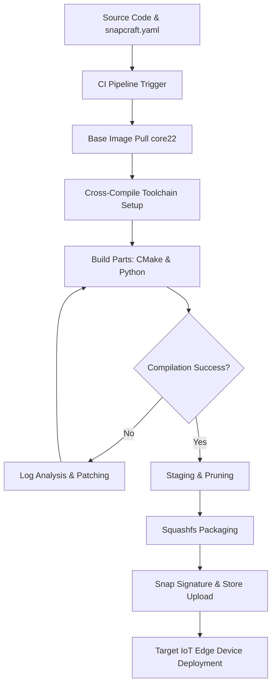

# Fixing a Snapcraft Build that had been Broken for Two Years

## Introduction
When we inherited the repository for the edge sensor gateway, the build pipeline had been dead for exactly two years. The CI system threw generic compilation errors, and the production fleet was stuck on a legacy binary riddled with unpatched vulnerabilities. In the world of IoT and embedded systems, a broken build is not just a developer inconvenience; it is a critical operational bottleneck that blocks security patches and new feature rollouts. Reviving a dormant snapcraft build requires peeling back layers of dependency rot, aligning outdated build bases with modern cross-compilation toolchains, and architecting a robust CI/CD pipeline that actually tests on the target architecture. This is the technical blueprint of how we brought that build back to life.

## Why This Matters
For software architects and engineers working on the edge, reproducibility is non-negotiable. Snapcraft provides a robust, transactional packaging format designed to bring atomic updates and strict confinement to resource-constrained devices. However, if the build pipeline is broken, the entire over-the-air (OTA) update mechanism grinds to a halt. Understanding how to diagnose, repair, and sustain these cross-compiled snapcraft builds is vital for maintaining secure, highly available IoT fleets. It prevents vendor lock-in, ensures that custom kernel modules and hardware drivers can be packaged cleanly, and keeps long-lived field devices running on modern security profiles.

## How It Works
Reviving a dormant build is an exercise in systematic dependency reconciliation. The core issue with long-dormant builds is that they rely on deprecated base images (like `core18` or early `core20` builds) and custom build scripts that assumed a specific host toolchain layout. To revive the build, we must map the entire dependency graph, migrate the base to a supported version (such as `core22`), and configure the environment to correctly cross-compile for the target architecture (e.g., ARM64).

The visual diagram below outlines the revived build pipeline, mapping the flow from source code to a validated, signed snap package ready for deployment on the edge device:

The pipeline starts with a trigger on the repository. Snapcraft pulls the specified base image (e.g., `core22`) to ensure a clean, reproducible build environment. It then sets up the cross-compilation toolchain, mapping host instructions to target ARM64 binaries. The build stage compiles the C++ core and Python wrappers. If compilation fails, we enter a diagnostic loop to analyze logs, patch the source or build flags, and rebuild. On success, the artifacts are staged, pruned of unnecessary symbols to save space, packaged into a compressed Squashfs image, signed, and uploaded to the secure repository for OTA delivery to the physical edge devices.

## Core Concepts
To successfully maintain a snapcraft build for embedded targets
