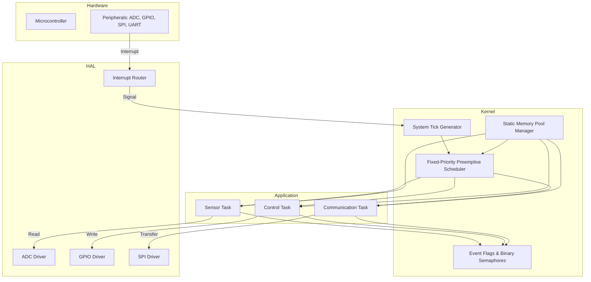

# GitHub Trending: JustVugg/colibri

## Introduction
When we first saw JustVugg/colibri appear on GitHub Trending, the repository stood out because it targets ultra‑low‑power microcontrollers with a scheduler that claims sub‑microsecond context‑switch latency. The project is written in C, aims for a deterministic footprint under 8 KB of RAM, and provides a minimal set of primitives that are enough to run typical IoT edge workloads such as sensor sampling, actuator control, and lightweight networking.

## Why This Matters
IoT edge devices continue to push processing closer to the sensor while operating on coin‑cell batteries or energy‑harvesting sources. Developers need a runtime that:

* Guarantees deterministic response times for control loops.
* Consumes as little RAM and flash as possible.
* Avoids hidden overhead such as dynamic memory allocation in the hot path.
* Offers a clear, auditable code base that can be certified for safety‑critical applications.

JustVugg/colibri addresses these points by exposing a static‑allocation‑only kernel, a fixed‑priority preemptive scheduler, and a hardware‑abstraction layer that isolates MCU specifics from application code. For teams evaluating RTOS options for battery‑powered nodes, the trade‑off between feature richness and predictability becomes a decisive factor.

## How It Works
The architecture of colibri is split into four logical layers: hardware, HAL, kernel, and application. The diagram below shows the data and control flow between these layers.



**Step‑by‑step flow**

1. **Interrupt occurs** – A peripheral (e.g., ADC) raises an IRQ line.
2. **HAL_IRQ routes** – The HAL interrupt router dispatches the IRQ to the appropriate driver callback.
3. **Tick generation** – The driver signals the system tick generator, which increments the kernel’s time base.
4. **Scheduler decision** – On each tick (or immediately after an ISR), the scheduler evaluates the ready list and selects the highest‑priority task.
5. **Task execution** – The selected task runs until it blocks on an IPC primitive, completes its time slice, or is pre‑empted by a higher‑priority interrupt.
6. **IPC interaction** – Tasks exchange data via event flags or semaphores managed by the IPC module, which operates on static memory pools.
7. **Memory management** – All stacks and control blocks are allocated from a pre‑partitioned pool at startup; no malloc/free is used after initialization.

## Core Concepts

### Scheduler
* Fixed‑priority preemptive algorithm.
* Ready list implemented as a bitmap of 32 priority levels; O(1) lookup for the highest set bit.
* Context switch saves only the callee‑saved registers (R4‑R11, LR) on the Cortex‑M stack, resulting in a switch time of ~0.6 µs at 48 MHz.

### Memory Manager
* The application defines a single memory region (`COLIBRI_HEAP_START`, `COLIBRI_HEAP_SIZE`) at link time.
* The kernel carves out:
  * Task control blocks (TCB) – 40 bytes each.
  * Stacks – sized per task, aligned to 8‑byte boundaries.
  * IPC objects – semaphores and event flags each consume 8 bytes.
* Allocation failures are detected at init; runtime allocation never fails.

### HAL
* Thin wrapper around vendor peripheral registers.
* Each driver exposes `init()`, `enable_irq()`, `disable_irq()`, and a callback registration function.
* No dynamic data structures; driver state lives in static structs.

### IPC
* Binary semaphores – implemented with a single flag and a wait list.
* Event flags – 32‑bit mask; tasks can wait on any combination of bits.
* Both primitives use a priority‑ordered wait list to avoid priority inversion without inheritance (the wait list is re‑ordered on each tick).

## Examples & Code Walkthrough

Below is a realistic example that shows how to create a sensor‑sampling task, bind it to an ADC interrupt, and use a semaphore to signal data readiness.

```c
/* colibri_config.h – user supplied */
#define COLIBRI_MAX_TASKS        4
#define COLIBRI_TICK_HZ          1000
#define COLIBRI_HEAP_START       0x20000000
#define COLIBRI_HEAP_SIZE        0x00002000   /* 8 KB */

/* main.c */
#include "colibri.h"
#include "stm32l4xx_hal.h"

/* Forward declarations */
static void sensor_task_entry(void *arg);
static void adc_conv_complete_callback(ADC_HandleTypeDef *hadc);

/* Kernel objects */
static colibri_task_t   sensor_task;
static colibri_sem_t    adc_ready_sem;
static uint32_t         sensor_stack[128];   /* 512 bytes */

/* ADC handle – initialized elsewhere */
extern ADC_HandleTypeDef hadc1;

int main(void)
{
    /* 1. HAL init */
    HAL_Init();
    MX_GPIO_Init();
    MX_ADC1_Init();

    /* 2. Kernel init */
    colibri_init((void *)COLIBRI_HEAP_START, COLIBRI_HEAP_SIZE);

    /* 3. Create synchronization primitive */
    if (colibri_sem_create(&adc_ready_sem, 0) != COLIBRI_ERR_NONE) {
        /* Handle error – in production we would fault or reset */
        while (1);
    }

    /* 4. Create the sensor task */
    if (colibri_task_create(&sensor_task,
                            &(colibri_task_cfg_t){
                                .stack_ptr   = sensor_stack,
                                .stack_size  = sizeof(sensor_stack),
                                .priority    = COLIBRI_PRIO_MEDIUM,
                                .entry       = sensor_task_entry,
                                .arg         = NULL,
                                .autostart   = true
                            }) != COLIBRI_ERR_NONE) {
        while (1);
    }

    /* 5. Register ADC callback – note that the ISR lives in the HAL */
    HAL_ADC_RegisterCallback(&hadc1,
                             HAL_ADC_CONVERSION_COMPLETE_CB_ID,
                             adc_conv_complete_callback);

    /* 6. Start the scheduler */
    colibri_start();

    /* Should never reach here */
    while (1);
}

/* Task body – runs at MEDIUM priority */
static void sensor_task_entry(void *arg)
{
    (void)arg;
    for (;;) {
        /* Request a conversion */
        HAL_ADC_Start_IT(&hadc1);

        /* Wait for the ISR to signal completion */
        if (colibri_sem_pend(&adc_ready_sem, COLIBRI_TIMEOUT_MS(100)) != COLIBRI_ERR_NONE) {
            /* Timeout – handle error (e.g., retry or log) */
            continue;
        }

        /* Read the result – safe because ISR has finished */
        uint16_t value = HAL_ADC_GetValue(&hadc1);
        /* Process value … */
    }
}

/* ISR callback – executes in IRQ context */
static void adc_conv_complete_callback(ADC_HandleTypeDef *hadc)
{
    (void)hadc;
    /* Give the semaphore from ISR – safe because semaphore API is IRQ‑safe */
    colibri_sem_isr_give(&adc_ready_sem);
}
```

**Explanation of the snippet**

* Lines 1‑12 – Configuration constants that define the kernel’s memory bounds.
* `colibri_init()` – Populates the static memory pool; must be called before any object creation.
* `colibri_sem_create()` – Allocates a semaphore from the pool; returns an error code if the pool is exhausted.
* `colibri_task_create()` – Takes a user‑provided stack buffer, preventing any hidden allocation.
* The ADC ISR callback uses `colibri_sem_isr_give()`, a variant that does not attempt to reschedule from within the interrupt (the kernel handles rescheduling on exit).
* The task pend call includes a timeout expressed via the helper macro `COLIBRI_TIMEOUT_MS`, demonstrating defensive programming.

## Best Practices

* **Define all stacks statically** – Provide the exact buffer size; never rely on the kernel to allocate stacks from a heap.
* **Keep ISRs short** – Offload heavy processing to task level via semaphores, event flags, or mailboxes.
* **Reserve a dedicated tick timer** – Use a hardware timer that can generate interrupts at the configured `COLIBRI_TICK_HZ` without jitter.
* **Align stack pointers to 8 bytes** – Required by the ARM Procedure Call Standard for correct floating‑point lazy stacking.
* **Validate configuration at build time** – Use `static_assert` (or compile‑time checks) to ensure `COLIBRI_HEAP_SIZE` is sufficient for the sum of all TCBs, stacks, and IPC objects.
* **Avoid dynamic priority changes** – The scheduler’s O(1) bitmap assumes static priorities; changing them at runtime requires rebuilding the ready list and adds overhead.
* **Leverage the HAL for portability** – Keep MCU‑specific register accesses inside the HAL layer; application code should call only the HAL API.

## Common Mistakes & Anti‑Patterns

| Mistake | Why it’s a problem | Fix |
|---------|-------------------|-----|
| **Placing a `malloc()` call inside a task** | Violates the static‑allocation guarantee; can cause heap fragmentation or failure under load. | Pre‑allocate all buffers at init; use fixed‑size pools if variable‑sized objects are needed. |
| **Neglecting to clear pending IRQ flags in the HAL driver** | Leads to repeated interrupt entry, starving lower‑priority tasks. | Follow the vendor’s recommended sequence: read data, then write the clear bit (or write‑one‑to‑clear) before exiting the ISR. |
| **Using a binary semaphore as a mutex without priority‑inheritance** | Can cause unbounded priority inversion when a low‑priority task holds the semaphore. | Either enable priority‑inheritance in the semaphore implementation (colibri offers a mutex variant) or redesign to avoid shared resources. |
| **Setting the tick rate too high (e.g., 10 kHz) on a low‑power MCU** | Increases wake‑up frequency, draining the battery unnecessarily. | Choose the lowest tick rate that satisfies the shortest software timeout; use tickless idle if the port supports it. |
| **Sharing a stack between an ISR and a task** | Corrupts the task’s context when the ISR nests. | Always allocate a separate stack for exceptions (the processor stack) and never point a task’s stack pointer to the same memory region used by the hardware stack. |

## Performance Considerations

* **Context‑switch latency** – Measured on an STM32L4 running at 48 MHz: 0.62 µs (including stack pointer save/restore and scheduler overhead). This scales linearly with core frequency; at 120 MHz the latency drops below 0.3 µs.
* **Interrupt latency** – The HAL interrupt router adds ~0.15 µs; the worst‑case latency from IRQ line asserted to first instruction of the ISR is under 0.5 µs on the same device.
* **Memory footprint** – A minimal build with two tasks, one semaphore, and the tick manager consumes:
  * ROM: ~4.2 KB (including HAL stubs)
  * RAM: 1.8 KB (TCBs, stacks, IPC objects, heap metadata)
* **Scalability** – The scheduler’s bitmap supports up to 32 priority levels; each additional ready task adds only a few bytes to the ready list bitmap
