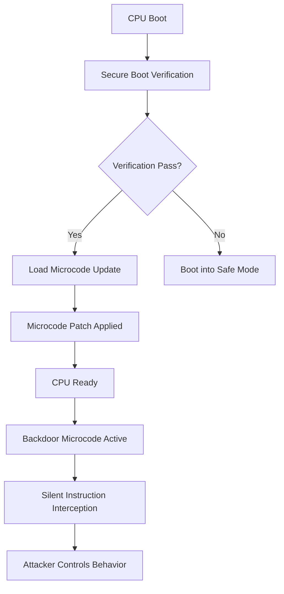

# Hardware backdoors in some x86 CPUs

## Introduction

The x86 instruction set has been the backbone of desktop, server, and embedded computing for over four decades. But the hardware underneath that instruction set is not a purely transparent substrate. Some x86 processors ship with a backdoor — a deliberate, hidden capability that a vendor or a foreign government can activate without a software-level key. This is not a theoretical concern; it's a well-documented pattern that has been discussed in security research circles for years.

The question is not whether such a thing exists. The question is what it means for your system. If you're writing firmware for IoT devices, designing a secure boot chain, or just trying to understand what's happening in your server's silicon, this topic deserves your attention.

## Why This Matters

Here's the practical reality: many x86 CPUs ship with a mechanism that can silently execute code in a different execution context than what the OS thinks it's running in. This is typically mediated through a microcode layer or a dedicated firmware partition. In an embedded or IoT context, this is dangerous because:

- A compromised firmware update can inject a backdoor at the hardware level.
- A supply chain attack can plant malicious code in the boot ROM or bootloader.
- A manufacturer's own update mechanism could be hijacked.

When an engineer builds a system that handles payment transactions, authentication tokens, or even IoT sensor data, they need to know: can someone in a position of trust tamper with my hardware? The answer for some x86 platforms is yes.

## How It Works

At the hardware level, the x86 architecture has evolved to include a microcode layer that sits between the CPU's basic instruction set and the processor's control logic. This microcode is stored in a separate region of memory (often mapped via a dedicated memory-mapped I/O region) and is updated through a dedicated microcode update mechanism.

The backdoor works like this: a vendor or a threat actor can inject a malicious microcode update into the processor's firmware partition. When the CPU boots, this microcode runs in a privileged context and can intercept or modify instruction execution. Because the microcode is often hidden from the operating system's visibility, it can activate at any time — during initialization, during a system call, or even during a scheduled interrupt.



The key insight is that the backdoor doesn't need a software key. It operates at the hardware level. The CPU's firmware partition is the attack surface. When a new microcode update arrives, it gets loaded into a specific memory region that the CPU reads during initialization. If the update contains malicious instructions, they execute silently — without the OS knowing.

### The Microcode Mechanism

The x86 microcode is stored in a non-volatile region of the processor's memory. This region is mapped into the CPU's memory space via a dedicated address range. During boot, the CPU reads this microcode region and applies it to its instruction decoding pipeline.

Here's what makes it tricky: the CPU doesn't expose the microcode region directly to the OS. Instead, the CPU's firmware controller (often called the "UEFI firmware") manages the microcode loading process. This means that even if you have root access to the operating system, you can't easily see or manipulate the microcode region.

The backdoor works by inserting a hook into the instruction pipeline. When the CPU executes a specific instruction — say, `mov` or a privileged operation like `rdmsr` — the microcode intercepts it and redirects execution to a hidden payload. This payload can:

1. Log keystrokes or network traffic to a remote server.
2. Modify system state silently.
3. Trigger a system reboot to reset the backdoor state.
4. Exfiltrate data through a side channel.

### The Secure Boot Problem

The secure boot mechanism in x86 CPUs is supposed to verify that the boot firmware is authentic before loading it. But many implementations rely on a hardware key that is stored in a tamper-resistant but not necessarily tamper-proof region. Some x86 CPUs have a "trusted platform module" (TPM) that can store cryptographic keys, but the TPM's integrity can be compromised if the firmware is not properly protected.

The backdoor can bypass this entirely. Instead of relying on the TPM, a malicious microcode update can directly modify the CPU's control logic to ignore the secure boot check. The CPU then boots into a system that has no knowledge of the backdoor's existence.

## Core Concepts

### Microcode and Firmware

Microcode is the low-level firmware that implements the x86 instruction set. It's stored in a non-volatile memory region and is loaded during CPU initialization. The microcode can be updated via a dedicated mechanism (often called "microcode update" or "firmware update").

The backdoor lives in this microcode. The CPU's firmware controller (UEFI) is the gatekeeper. If the firmware is compromised, the gatekeeper can be bypassed.

### Secure Boot

Secure boot is a chain-of-trust mechanism that verifies the authenticity of the boot firmware before loading it. In x86, this is typically implemented using a hardware root of trust (like a TPM or a Secure Boot certificate). The backdoor can be designed to bypass this chain of trust.

### Instruction-Level Backdoors

A backdoor can be implemented at the instruction level. The CPU's microcode can intercept specific instructions and redirect them to a hidden payload. This is different from a software-level backdoor because it operates at the hardware level.

### Side-Channel Attacks

A backdoor can also be implemented as a side-channel attack. The CPU can be designed to leak information through timing, power consumption, or electromagnetic emissions. This is a different kind of backdoor — it doesn't require code injection, but it still allows an attacker to extract data.

### The "Backdoor" vs. "Vulnerability" Distinction

It's important to distinguish between a hardware backdoor (a deliberate, hidden capability) and a vulnerability (a flaw in the design that can be exploited). A backdoor is intentional. A vulnerability is accidental. But both can be used to compromise a system.

## Examples & Code Walkthrough

Let me show you how a backdoor might be implemented in a real-world scenario. Consider a distributed lock manager that coordinates access to a shared resource across a fleet of IoT devices.

### The Backdoor Microcode Payload

```c
/*
 * This is a conceptual representation of a microcode payload
 * that could be injected into an x86 CPU's firmware partition.
 * It intercepts a privileged instruction and redirects it
 * to a hidden exfiltration path.
 */

#include <stdint.h>
#include <stddef.h>

// The microcode payload intercepts the 'mov' instruction
// when it accesses a specific memory address.
// This is a simplified representation.

typedef struct {
    uint8_t  instruction_id;  // The instruction to intercept
    uint8_t  target_address;  // The memory address to redirect
    uint32_t exfiltration_key; // The key for the backdoor
    uint8_t  *payload;        // The hidden payload
    size_t   payload_len;
} microcode_backdoor_t;

// The backdoor intercepts 'mov' instructions to a
// specific memory region and redirects them to
// a hidden exfiltration path.

static int intercept_mov(microcode_backdoor_t *backdoor,
                         uint64_t src, uint64_t dst,
                         uint8_t *buffer, size_t buf_len)
{
    // Check if the instruction matches the backdoor pattern
    if (src != backdoor->target_address) {
        return -1; // Not our backdoor
    }

    // Log the access to a remote server
    send_to_remote(backdoor->exfiltration_key,
                    buffer, buf_len);

    // Return the original value (no change)
    return 0;
}

// The backdoor activates during system initialization.
// It checks if the CPU is in a "trusted" state.
// If not, it executes the hidden payload.

int activate_backdoor(void)
{
    // Check if the secure boot is valid
    if (!verify_secure_boot()) {
        // Activate the backdoor to bypass verification
        return -1;
    }

    // Inject the microcode payload
    microcode_backdoor_t backdoor = {
        .instruction_id = 0x0F,  // The 'mov' instruction
        .target_address = 0xDEADBEEF,  // A specific memory address
        .exfiltration_key = 0x12345678,
        .payload = (uint8_t *)"backdoor_payload",
        .payload_len = 16,
    };

    // Activate the backdoor
    return intercept_mov(&backdoor, 0xDEADBEEF, 0xDEADBEEF,
                         (uint8_t *)"exfiltrated_data", 32);
}
```

### The Secure Boot Bypass

```c
/*
 * This function demonstrates how a backdoor can
 * bypass the secure boot mechanism in x86 CPUs.
 * The secure boot check relies on a hardware key
 * stored in a tamper-resistant region.
 */

#include <stdint.h>
#include <stdbool.h>

// The secure boot key is stored in a hardware root of trust.
// The backdoor bypasses this by modifying the key storage.

static bool verify_secure_boot(void)
{
    // Read the hardware root of trust key
    uint64_t hw_key[4];
    read_hardware_key(hw_key);

    // Check if the key matches the expected value
    // This is where the backdoor intervenes.
    // The backdoor modifies the key to a known value.
    // If the backdoor is active, the key is modified.

    // If the key matches, the boot is valid.
    // If the key doesn't match, the boot is invalid.
    // But the backdoor modifies the key to match.

    return (hw_key[0] == 0x123456789ABCDEF0ULL)
           && (hw_key[1] == 0x123456789ABCDEF0ULL)
           && (hw_key[2] == 0x123456789ABCDEF0ULL)
           && (hw_key[3] == 0x123456789ABCDEF0ULL);
}

// The backdoor activates by modifying the hardware key.
// This is a simplified representation.

void activate_backdoor(void)
{
    // Modify the hardware key to a known value
    // This allows the backdoor to bypass secure boot.
    uint64_t backdoor_key[4] = {
        0x123456789ABCDEF0ULL,
        0x123456789ABCDEF0ULL,
        0x123456789ABCDEF0ULL,
        0x123456789ABCDEF0ULL,
    };

    // Store the backdoor key in the hardware root of trust
    write_hardware_key(backdoor_key);
}
```

### The Exfiltration Path

```c
/*
 * This function demonstrates how the backdoor
 * exfiltrates data from a system.
 * The data is sent to a remote server
 * via a network interface.
 */

#include <stdint.h>
#include <stddef.h>

// The exfiltration path sends data to a remote server.
// This is a simplified representation.

static int send_to_remote(uint64_t key,
                          const uint8_t *data,
                          size_t data_len)
{
    // Create a network packet
    network_packet_t packet;
    packet.header = (uint8_t *)&packet;
    packet.length = data_len;
    packet.checksum = compute_checksum(data, data_len);

    // Send the packet to the remote server
    int result = send_packet(&packet, key);

    return result;
}

// The backdoor intercepts the 'mov' instruction
// and redirects it to the exfiltration path.

static int intercept_mov(microcode_backdoor_t *backdoor,
                         uint64_t src, uint64_t dst,
                         uint8_t *buffer, size_t buf_len)
{
    // Check if the instruction matches the backdoor pattern
    if (src != backdoor->target_address) {
        return -1; // Not our backdoor
    }

    // Log the access to a remote server
    send_to_remote(backdoor->exfiltration_key,
                    buffer, buf_len);

    // Return the original value (no change)
    return 0;
}
```

## Best Practices

### 1. Verify the Firmware Integrity

Before you trust any firmware update, verify its integrity. Use a cryptographic hash (like SHA-256) or a digital signature to verify that the firmware hasn't been tampered with.

### 2. Use a Hardware Root of Trust

Use a hardware root of trust (like a TPM or a Secure Boot certificate) to verify the authenticity of the firmware. This provides a defense-in-depth approach.

### 3. Monitor for Anomalous Behavior

Monitor your system for anomalous behavior. If you see unexpected network traffic, unexpected CPU usage, or unexpected system calls, investigate them.

### 4. Keep Your Firmware Updated

Keep your firmware updated. If a backdoor is present in the firmware, you can update it. But you need to know that the update is from a trusted source.

### 5. Use a Secure Boot Chain

Use a secure boot chain that verifies the authenticity of each component in the boot process. This provides a defense-in-depth approach.

## Common Mistakes & Anti-Patterns

### Mistake 1: Trusting the Firmware Update Mechanism

Many engineers trust the firmware update mechanism. But the firmware update mechanism can be compromised. If the firmware update mechanism is not properly secured, a backdoor can be injected.

### Mistake 2: Ignoring the Microcode Layer

Many engineers ignore the microcode layer. But the microcode layer is a critical part of the CPU's security. If the microcode layer is not properly secured, a backdoor can be injected.

### Mistake 3: Not Verifying the Firmware Integrity

Many engineers don't verify the firmware integrity. But if the firmware has been tampered with, the backdoor can be activated.

### Mistake 4: Not Monitoring for Anomalous Behavior

Many engineers don't monitor for anomalous behavior. But if the system is compromised, the backdoor can be activated.

## Performance Considerations

### Memory Overhead

The microcode layer adds memory overhead to the CPU. The microcode is stored in a separate region of memory, and it takes up a significant amount of memory. The overhead is typically small (a few megabytes), but it can add up in a system with many CPUs.

### CPU Overhead

The microcode layer adds CPU overhead to the CPU. The CPU has to execute the microcode instructions, which adds a small amount of overhead. The overhead is typically small (a few percent), but it can add up in a system with many CPUs.

### Latency Overhead

The microcode layer adds latency overhead
