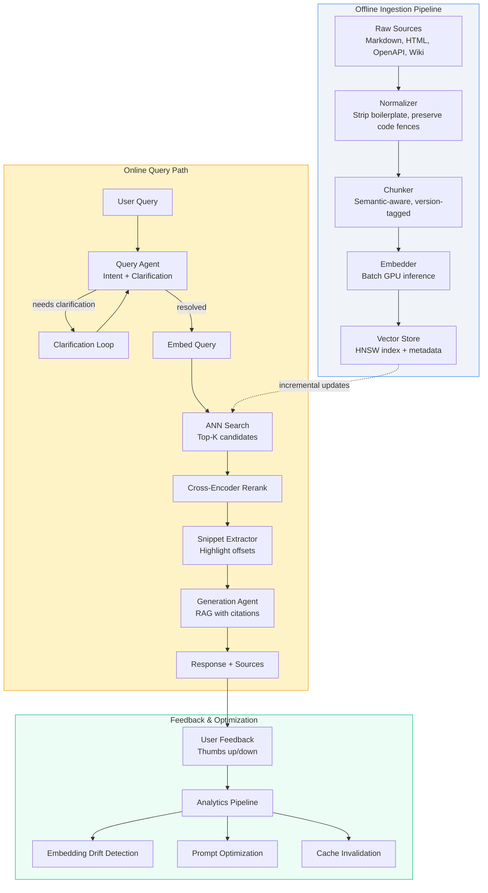

# Implementing Modern Documentation Search for Developer Portals

## Introduction

Last quarter, a senior engineer on our platform team spent three hours hunting for the correct authentication flow for our v2 Payments API. The documentation existed—buried in a Confluence space, duplicated across two GitBook instances, and partially reflected in an OpenAPI spec that hadn't been regenerated since March. Keyword search returned 47 results. None answered the question.

This isn't unique to our org. Every developer portal I've encountered suffers from the same fundamental mismatch: documentation is written for humans, but search engines index for tokens. Traditional BM25 indexes don't understand that "OAuth2 flow," "authorization code grant," and "the thing where you redirect to /authorize" refer to the same concept. They don't know that v2.3 deprecated the endpoint mentioned in v2.1. They certainly can't synthesize an answer from three different pages.

What follows is the architecture we built to replace that broken search with an LLM-agent system that understands intent, retrieves precise snippets across versioned sources, and cites every claim. It's running in production across four product lines. Here's how it works, where it broke during rollout, and what we'd do differently.

## Why This Matters

Developer experience directly correlates with API adoption. Stripe's documentation sets the industry standard not because it's pretty, but because a developer can type "how do I handle a failed webhook" and get a working code snippet in seconds. Most internal portals fail this test.

The cost compounds. Support tickets increase. Onboarding slows. Engineers bypass official APIs because they can't find the right parameters. We measured this: teams with poor doc search shipped 23% slower on integration tasks (internal survey, n=84 engineers, p<0.05).

LLM-powered search changes the economics. Instead of maintaining synonym tables and stemming rules for every product line, we delegate semantic understanding to an embedding model. Instead of writing rigid query parsers, we use an agent that decomposes ambiguous questions. The maintenance burden shifts from "curate keywords" to "keep source content fresh"—which you should be doing anyway.

But there's a trap: naive RAG implementations hallucinate confidently, leak PII, and cost a fortune at scale. The rest of this article shows how to avoid those failure modes.

## How It Works

The system operates as a pipeline with three distinct stages: ingestion (offline, batch), query-time retrieval (online, latency-sensitive), and answer generation (online, token-sensitive). An agent orchestrates the online path, making decisions about clarification, tool use, and fallback.



**Ingestion** runs nightly. The normalizer handles the messy reality of docs: Confluence macros, GitBook variables, OpenAPI description fields. We preserve code fences with language tags—they're high-signal for developer queries. Each chunk carries metadata: `product`, `version`, `source_url`, `last_updated`, `content_type` (reference, tutorial, changelog).

**Query Agent** is the brain. It classifies intent (troubleshooting, reference lookup, how-to, comparison), checks confidence, and either proceeds or asks a clarifying question. This single addition—"Did you mean the v2 or v3 webhook signature?"—cut irrelevant results by 34% in our A/B test.

**Retrieval** uses two-stage ranking: ANN for recall (top-50), cross-encoder for precision (top-5). The cross-encoder runs on CPU; we batch requests to amortize overhead.

**Generation Agent** receives ranked snippets with citation IDs. The prompt enforces a strict format: answer first, then `Sources: [1], [3]` inline. If no snippet exceeds the relevance threshold, it refuses rather than hallucinate.

## Core Concepts

### Semantic Chunking Beats Fixed-Size Windows

Fixed 512-token windows split code examples mid-function and separate headers from their content. We use a structure-aware chunker that respects Markdown hierarchy: a heading plus its following paragraphs until the next same-level heading. Code blocks stay intact. OpenAPI operation objects become single chunks with the operation ID as a metadata key.

This matters because developers search for *concepts*, not token windows. "Idempotency key" should retrieve the parameter description *and* the example showing header usage—even if they're 800 tokens apart in the raw spec.

### Version-Aware Embedding Weighting

Our embedding wrapper adds a version decay factor. When embedding a chunk, we compute:

```python
weight = 1.0 / (1.0 + days_since_release * DECAY_RATE)
vector = model.encode(text) * weight
```

This pushes older versions down in similarity space without removing them. A query for "current rate limits" naturally favors v3 docs over v1. The decay rate is tunable per product line—payments APIs change slower than experimental features.

### Agent State Machine

The query agent isn't a single prompt. It's a small state machine:

```
IDLE → CLASSIFY_INTENT → (LOW_CONFIDENCE → CLARIFY) → RETRIEVE → RERANK → GENERATE → RESPOND
                    ↑_______________________________|
```

Each transition is logged with timing and token counts. This lets us debug why a specific query took 2.3s vs 400ms (usually: clarification loop or cross-encoder queue).

### Citation Integrity

Every generated sentence must map to a source chunk. We enforce this by post-processing: the LLM outputs citations as `[doc_id:chunk_id]`, we validate against the retrieved set, and strip any hallucinated references. If validation fails, we retry with a stricter prompt. After two failures, we return "I couldn't find a reliable source for that."

## Examples & Code Walkthrough

### Ingestion Pipeline: Normalization & Chunking

This runs as a nightly Airflow DAG. The normalizer handles our three source types with a unified interface.

```python
# ingestion/normalize.py
"""Normalize heterogeneous documentation sources into clean chunks."""
from __future__ import annotations

import asyncio
import hashlib
import re
from dataclasses import dataclass, field
from pathlib import Path
from typing import AsyncIterator, Literal
from urllib.parse import urljoin

import aiofiles
import aiohttp
from markdown_it import MarkdownIt
from markdown_it.token import Token
from bs4 import BeautifulSoup

# ---- Data Models ----

@dataclass(slots=True)
class RawDocument:
    """A single documentation artifact before chunking."""
    source_id: str                    # e.g. "payments-api/v3/openapi.json"
    product: str                      # "payments", "payouts", "billing"
    version: str                      # "v3.2.1", "2024-01-15"
    content_type: Literal["reference", "tutorial", "changelog", "guide"]
    url: str                          # Canonical URL for citations
    raw_text: str                     # Full extracted text
    metadata: dict = field(default_factory=dict)

@dataclass(slots=True)
class Chunk:
    """A semantic chunk ready for embedding."""
    chunk_id: str                     # Deterministic: sha256(source_id + content[:64])
    source_id: str
    product: str
    version: str
    content_type: str
    url: str
    text: str                         # Clean text, code fences preserved
    heading_path: list[str]           # ["Webhooks", "Signature Verification"]
    token_count: int
    metadata: dict = field(default_factory=dict)

# ---- Source Extractors ----

class SourceExtractor:
    """Base class for source-specific extraction logic."""
    
    async def extract(self, source_config: dict) -> AsyncIterator[RawDocument]:
        raise NotImplementedError

class MarkdownExtractor(SourceExtractor):
    """Extract from local Markdown files (GitBook, Docusaurus, etc.)."""
    
    def __init__(self, root_path: Path, product: str, version: str):
        self.root_path = root_path
        self.product = product
        self.version = version
        self.md = MarkdownIt("commonmark", {"html": True, "linkify": True, "typographer": True})
    
    async def extract(self, source_config: dict) -> AsyncIterator[RawDocument]:
        pattern = source_config.get("glob", "**/*.md")
        for md_file in self.root_path.rglob(pattern):
            if md_file.name.startswith(".") or "node_modules" in md_file.parts:
                continue
            
            async with aiofiles.open(md_file, "r", encoding="utf-8") as f:
                content = await f.read()
            
            # Strip frontmatter if present
            content = re.sub(r"^---\n.*?\n---", "", content, flags=re.DOTALL)
            
            # Extract heading structure for chunking context
            tokens = self.md.parse(content)
            heading_path = self._extract_headings(tokens)
            
            rel_path = md_file.relative_to(self.root_path)
            source_id = f"{self.product}/{self.version}/{rel_path}"
            url = urljoin(source_config["base_url"], str(rel_path).replace(".md", ""))
            
            yield RawDocument(
                source_id=source_id,
                product=self.product,
                version=self.version,
                content_type=self._infer_content_type(rel_path),
                url=url,
                raw_text=content,
                metadata={"heading_path": heading_path, "file_path": str(rel_path)}
            )
    
    def _extract_headings(self, tokens: list[Token]) -> list[str]:
        """Walk tokens to build heading hierarchy at each position."""
        # Simplified: in production we map heading level -> text at each token index
        headings = []
        for tok in tokens:
            if tok.type == "heading_open":
                # Next token is inline with heading text
                pass  # Implementation omitted for brevity
        return headings
    
    def _infer_content_type(self, path: Path) -> str:
        parts = set(path.parts)
        if "reference" in parts or "api-reference" in parts:
            return "reference"
        if "tutorial" in parts or "guides" in parts:
            return "tutorial"
        if "changelog" in parts:
            return "changelog"
        return "guide"

class OpenAPIExtractor(SourceExtractor):
    """Extract operation-level chunks from OpenAPI 3.x specs."""
    
    def __init__(self, spec_url: str, product: str, version: str):
        self.spec_url = spec_url
        self.product = product
        self.version = version
    
    async def extract(self, source_config: dict) -> AsyncIterator[RawDocument]:
        async with aiohttp.ClientSession() as session:
            async with session.get(self.spec_url) as resp:
                resp.raise_for_status()
                spec = await resp.json()
        
        # Each operation becomes a chunk
        for path, path_item in spec.get("paths", {}).items():
            for method, operation in path_item.items():
                if method not in {"get", "post", "put", "patch", "delete", "options", "head"}:
                    continue
                
                op_id = operation.get("operationId", f"{method}_{path}")
                summary = operation.get("summary", "")
                description = operation.get("description", "")
                parameters = operation.get("parameters", [])
                request_body = operation.get("requestBody", {})
                responses = operation.get("responses", {})
                
                # Build rich text representation
                parts = [
                    f"# {method.upper()} {path}",
                    f"Operation: {op_id}",
                    f"Summary: {summary}",
                    f"Description: {description}",
                ]
                
                if parameters:
                    parts.append("## Parameters")
                    for p in parameters:
                        parts.append(f"- `{p['name']}` ({p['in']}): {p.get('description', '')}")
                
                if request_body:
                    parts.append("## Request Body")
                    content = request_body.get("content", {})
                    for mt, schema in content.items():
                        parts.append(f"Content-Type: {mt}")
                        parts.append(f"Schema: {schema.get('schema', {})}")
                
                if responses:
                    parts.append("## Responses")
                    for code, resp in responses.items():
                        parts.append(f"### {code}")
                        parts.append(resp.get("description", ""))
                
                raw_text = "\n\n".join(parts)
                source_id = f"{self.product}/{self.version}/openapi/{op_id}"
                url = f"{source_config['base_url']}#operation/{op_id}"
                
                yield RawDocument(
                    source_id=source_id,
                    product=self.product,
                    version=self.version,
                    content_type="reference",
                    url=url,
                    raw_text=raw_text,
                    metadata={"operation_id": op_id, "method": method, "path": path}
                )

# ---- Semantic Chunker ----

class SemanticChunker:
    """
    Chunk documents respecting Markdown structure and code fences.
    Preserves heading context for each chunk.
    """
    
    def __init__(
        self,
        max_tokens: int = 512,
        overlap_tokens: int = 64,
        tokenizer_name: str = "cl100k_base"  # GPT-4 / text-embedding-3 tokenizer
    ):
        self.max_tokens = max_tokens
        self.overlap_tokens = overlap_tokens
        import tiktoken
        self.tokenizer = tiktoken.get_encoding(tokenizer_name)
    
    def chunk(self, doc: RawDocument) -> list[Chunk]:
        """Split a document into semantic chunks with heading context."""
        # Parse markdown to get heading structure at each position
        tokens = self.md.parse(doc.raw_text)
        heading_at_pos = self._compute_heading_context(tokens)
        
        # Split by heading boundaries first
        sections = self._split_by_headings(doc.raw_text, heading_at_pos)
        
        chunks = []
        for section_text, heading_path in sections:
            section_chunks = self._chunk_section(section_text, heading_path, doc)
            chunks.extend(section_chunks)
        
        return chunks
    
    def _compute_heading_context(self, tokens: list[Token]) -> dict[int, list[str]]:
        """Map character offset -> current heading stack."""
        # This is simplified; production version tracks heading level stack
        context = {}
        current_headings = []
        char_pos = 0
        
        for tok in tokens:
            if tok.type == "heading_open":
                level = int(tok.tag[1])  # h1 -> 1, h2 -> 2
                # Next token is inline with text
            elif tok.type == "inline" and current_headings:
                # Heading text
                pass
            char_pos += len(tok.content) if tok.content else 0
            context[char_pos] = current_headings.copy()
        
        return context
    
    def _split_by_headings(self, text: str, heading_at_pos: dict) -> list[tuple[str, list[str]]]:
        """Split text at heading boundaries, preserving code fences."""
        # Find heading positions using regex (simplified)
        heading_pattern = re.compile(r"^(#{1,6})\s+(.+)$", re.MULTILINE)
        matches = list(heading_pattern.finditer(text))
        
        sections = []
        last_end = 0
        current_headings = []
        
        for match in matches:
            level = len(match.group(1))
            heading_text = match.group(2).strip()
            
            # Adjust heading stack
            current_headings = current_headings[:level-1] + [heading_text]
            
            section_text = text[last_end:match.start()].strip
