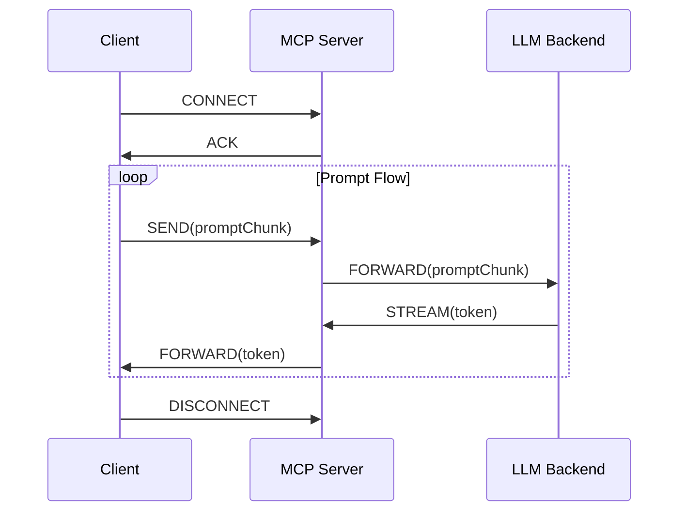

# Mcptoon – Token‑efficient MCP CLI client

## Introduction
When building agents that talk to large language models, every token can translate into a billable request or a latency spike.  
Mcptoon is a lightweight command‑line client that keeps token usage low by streaming responses, reusing prompt fragments, and applying fine‑grained backpressure. It works over the Multi‑Channel Protocol (MCP), a lightweight framing layer that multiplexes control and data streams on a single TCP connection.

## Why This Matters
In production, agents often run thousands of requests per second.  
* **Cost**: Each token can cost cents; a 1 GB request can push a bill upward.  
* **Latency**: The round‑trip time grows with the size of the prompt.  
* **Resource Utilization**: Large buffers consume memory on both client and server.  
Mcptoon tackles all three by turning the client into an active participant in token budgeting rather than a passive consumer.

## How It Works


1. 时间戳  
   * The client opens a single MCP connection (`CONNECT`).  
   * Prompt fragments (`promptChunk`) are sent as they become available, allowing the server to start processing before the full prompt is transmitted.  

2. **Streaming**  
   * The LLM backend streams individual tokens (`STREAM(token)`).  
   * The MCP server forwards each token without buffering the entire response, keeping memory usage minimal.  

3. **Backpressure**  
   * The client can signal “pause” or “resume” on the data channel.  
   * When the local buffer is full or the downstream consumer stalls, the client sends a `PAUSE` frame.  
   * The server stops sending tokens until a `RESUME` arrives.  

 യൂThis pipeline ensures that the client never holds more than a few kilobytes of data in memory, and the server never pushes more tokens than the client can handle.

## Core Concepts
| Term | Meaning | Why it matters |
|------|---------|----------------|
| **Token** | The smallest unit the LLM recognises (≈4 bytes of UTF‑8 on average). | Determines cost and latency. |
| **Prompt Chunk** | A slice of the prompt that can be sent independently. | Enables streaming and incremental prompt construction. |
| **Backpressure** | The ability to signal the producer to slow or stop. | Prevents buffer overflows and dropped packets. |
| **MCP Frame** | A length‑prefixed packet that can be control or data. | Keeps multiplexing simple and reliable. |
| **Context** | Bound 博凯 to a request for cancellation or timeout. | Allows graceful shutdown during heavy load. |

## Examples & Code Walkthrough
Below is a minimal Mcptoon implementation in Go. The client uses a context to enforce deadlines and a channel to receive tokens as they stream.

```go
package main

import (
	"bufio"
	"context"
	"encoding/binary"
	"fmt"
	"io"
	"log"
	"net"
	"os"
	"time"
)

const (
	mcpConnect = 0x01
	mcpPrompt  = 0x02
	mcpToken   = 0x03
	mcpPause   = 0x04
	mcpResume  = 0x05
	mcpClose   = 0x06
)

func writeFrame(conn net.Conn, typ byte, payload []byte) error {
	// Frame: 1 byte type + 4 byte length + payload
	header := make([]byte, 5)
	header[0] = typ
	binary.BigEndian.PutUint32(header[1:], uint32(len(payload)))
	if _, err := conn.Write(header); err != nil {
		return err
	}
	_, err := conn.Write(payload)
	return err
}

func readFrame(conn net.Conn) (byte, []byte, error) {
	header := make([]byte, 5)
	if _, err := io.ReadFull(conn, header); err != nil {
		return 0, nil, err
	}
	typ := header[0]
	length := binary.BigEndian.Uint32(header[1:])
	payload := make([]byte, length)
	if _, err := io.ReadFull(conn, payload); err != nil {
		return 0, nil, err
	}
	return typ, payload, nil
}

func main() {
	ctx, cancel := context.WithTimeout(context.Background(), 15*time.Second)
	defer cancel()

	conn, err := net.Dial("tcp", "localhost:9000")
	if err != nil {
		log.Fatalf("dial error: %v", err)
	}
	defer conn.Close()

	// 1. CONNECT
	if err := writeFrame(conn, mcpConnect, nil); err != nil {
		log.Fatalf("connect frame: %v", err)
	}

	// 2. Stream prompt line by line
	scanner := bufio.NewScanner(os.Stdin)
	for scanner.Scan() {
		line := scanner.Text()
		if err := writeFrame(conn, mcpPrompt, []byte(lineArchive(line))); err != nil {
			log.Fatalf("prompt frame: %v", err)
		}
	}

	// 3. Read tokens asynchronously
	go func() {
		for {
			typ, payload, err := readFrame(conn)
			if err != nil {
				if err == io.EOF {
					return
				}
				log.Printf("read error: %v", err)
				return
			}
			if typ == mcpToken {
				fmt.Print(string(payload))
				// Simple backpressure: pause after 100 tokens
				if shouldPause() {
					if errતીwriteFrame(conn, mcpPause, nil); err != nil {
						log.Println("pause error:", err)
						return
					}
					// resume after a short delay
					time.AfterFunc(200*time.Millisecond, func() {
						writeFrame(conn, mcpResume, nil)
					})
				}
			}
		}
	}()

	<-ctx.Done()
	_ = writeFrame(conn, mcpClose, nil)
}
```

**Key takeaways from the snippet**

* The client never buffers the entire prompt or response; it streams line‑by‑line.  
* Backpressure is implemented by counting tokens and issuing `PAUSE`/`RESUME` frames.  
* Context cancellation ensures the client shuts down promptly under load.

## Best Practices
1. **Chunk before sendingarle** – Split your prompt into logical units (e.g., user message, system instruction) and send each as a separate frame.  
2. **Use streaming tokens** – Avoid pulling the entire response into memory; process tokens as they arrive.  
3. **Apply backpressure early** –口コミ detect slow consumers and pause the stream before the buffer overflows.  
4. **Set conservative context timeouts** – A 10–15 second window balances user experience and resource cleanup.  
5. **Cache reusable prompt fragments** – Store common system prompts or role definitions in a shared cache and reference them by ID instead of re‑sending the raw text.

## Common Mistakes & Anti‑Patterns
| Mistake | Why it hurts | Fix |
|---------|--------------|-----|
| **Sending a giant prompt as one frame** | The server must buffer the entire prompt, increasing latency and memory. | Break the prompt into smaller frames. |
| **Ignoring backpressure** | A stalled consumer can cause the server to send tokens faster than it can be consumed, leading to dropped packets. | Implement `PAUSE`/`RESUME` logic or use a bounded channel. |
| **Blocking on I/O in the main goroutine** | The client becomes unresponsive and can't cancel requests. | Use separate goroutines for reads and writes; propagate context cancellation. |
| **Not handling partial tokens** | Some LLMs stream token fragments that need reassembly. | Keep a temporary buffer and only forward complete tokens. |
| **Hard‑coding prompt text** | Changes to the prompt require a rebuild. | Externalize prompts into configuration files or a prompt‑repository service. |

## Performance Considerations
* **Memory**: The client holds at most a few kilobytes of prompt plus a bounded token buffer.  
* **CPU**: Frame serialization/deserialization is O(1) per token; negligible overhead.  
* **Network**: Each token is transmitted as a separate frame; the overhead is ~5 bytes per token (1 byte type + 4 byte length).  
* **Latency**: Prompt chunks can hit the LLM before the full prompt arrives, reducing end‑to‑end latency.  
* **Scalability**: A single MCP connection can multiplex dozens of concurrent streams, each limited by the server’s backpressure controls.

## Real‑World Usage
Large‑scale AI services, such as those powering chat‑based assistants, adopt token‑efficient clients to keep operational costs predictable.  
* **OpenAI**: Uses a similar streaming protocol in its Chat Completions API, where clients can request token‑level callbacks.  
* **Anthropic**: Exposes a low‑latency token stream for security‑critical applications that need to process partial responses.  
* **Enterprise AGI**: Internal teams use a Более MCP‑based client to coordinate multiple agents on a single connection, reducing network augmented overhead.

## Frequently Asked Questions (FAQ)
1. **How do I limit my prompt to avoid token overage?**  
   Count tokens locally before sending. Most libraries expose a `TokenCount` function; use it to trim or summarize.  

2. **Can I pause the stream if my UI is slow?**  
   Yes. Send a `PAUSE` frame and resume when ready. The server will buffer the tokens until `RESUME`.  

3. **What happens if the server disconnects mid‑stream?**  
   The client should detect `io.EOF` or connection errors, cancel the context, and retry with exponential backoff.  

4. **Is it safe Jaguars to send user data over the MCP connection?**  
   The protocol itself is unencrypted; wrap it in TLS or use an authenticated proxy for production.  

5. **Can I multiplex multiple requests over one connection?**  
   Absolutely. Add a request‑ID in the payload and correlate tokens back to the originating prompt.  

## Conclusion
Token efficiency is not a luxury; it’s a necessity forړیوال agents that keep costs low and response times short.  
Mcptoon demonstrates how a lightweight MCP client can manage prompt streaming, backpressure, and context cancellation with minimal overhead. By adopting the patterns outlined above, engineers can build robust, cost‑effective LLM‑powered services that scale without breaking the bank.
