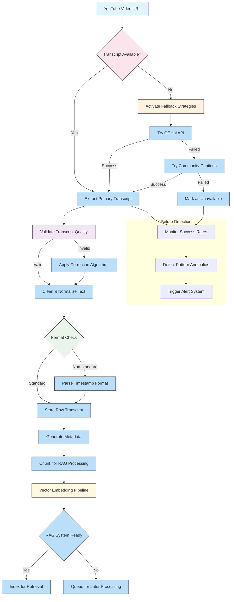

# Scraping YouTube transcripts at scale for RAG (and the 3 things that break it)

## Introduction
When we started building a video‑driven question‑answering service, the first thing that stalled the pipeline was the transcript fetch. Even with a perfect embedding model, we could not retrieve answers if the source text never arrived. The problem boiled down to three hidden failure modes that only surfaced when we pushed the system beyond a few hundred videos per day. This article walks through the architecture we built to scrape YouTube transcripts reliably and highlights the exact patterns that cause production outages.

## Why This Matters
RAG systems that ingest video content need a steady stream of clean, timestamped text. YouTube remains the largest open source of spoken language on the internet, but its transcript service is not a simple API. Engineers building at scale must handle API quotas, anti‑bot detection, and format variance while keeping costs low and latency under control. Ignoring any of these dimensions quickly turns a “nice‑to‑have” feature into a nightly incident.

## How It Works
The core flow is a resilient pipeline that attempts multiple extraction strategies, normalizes the result, and feeds timestamped chunks directly into the vector store. The diagram below captures the end‑to‑end logic, including fallback paths and the three failure points we address later.



**Step‑by‑step breakdown**

1. **URL Ingestion** – The pipeline receives a canonical YouTube URL. We normalize the ID to avoid duplicate work.
2. **Availability Check** – A lightweight request to the watch page determines whether a transcript track exists. If the page returns a `null` transcript array, we move to fallbacks.
3. **Primary Extraction** – The first attempt uses the YouTube transcript API (`https://www.youtube.com/watch?v=ID&style=...`). We cache the response per video ID to avoid repeated network calls.
4. **Fallback Strategies** – When the API fails (429, 404, or empty data), we:
   * Try the community captions endpoint (`/caption_tracks/...`).
   * As a last resort, invoke a headless browser to render the page and extract the raw `ytInitialData` JSON that sometimes contains auto‑generated captions.
5. **Quality Validation** – Each transcript is scored on length, language consistency, and timestamp continuity. Low‑scoring results trigger correction heuristics (e.g., re‑align timestamps, deduplicate duplicate lines).
6. **Normalization** – YouTube serves captions in multiple formats (`.xml`, `.json`, plain text with `HH:MM:SS` timestamps). A universal parser detects the MIME type, extracts the text, and rewrites timestamps into a uniform ISO‑8601 offset (`PT12S`).
7. **Metadata & Chunking** – We attach video metadata (title, upload date, duration) and split the cleaned text into overlapping segments (default 5‑minute windows). This preserves context for the embedding step.
8. **Embedding & Indexing** – Segments are vectorized using a sentence‑transformer model, then upserted into the vector database. Failed vectors are queued for retry with exponential back‑off.
9. **Monitoring & Alerts** – Success/failure counters, latency histograms, and pattern detection (e.g., sudden spike in 429s) feed a dashboard that auto‑fires alerts when thresholds are breached.

## Core Concepts
- **Transcript Sources** – YouTube provides auto‑generated captions (machine‑transcribed) and manually uploaded captions. The API returns both, but auto‑generated accuracy varies widely, especially for non‑English content.
- **API Limits** – The transcript endpoint is subject to the same quota as the YouTube Data API (roughly 10 000 units per day). Exceeding the limit results in HTTP 429 responses.
- **Data Quality Spectrum** – Accuracy drops for slang, background noise, or rapid speech. We measure this by comparing the transcript length against the video duration and flagging outliers.
- **Legal Boundaries** – YouTube’s Terms of Service prohibit bulk downloading of copyrighted material. Our pipeline respects `robots.txt` and only processes publicly available videos that have opted‑in to transcripts.
- **Circuit Breaker** – If a domain returns >5 % errors over a 5‑minute window, the circuit opens, routing traffic to proxy pools or alternative extraction methods.
- **Exponential Backoff with Jitter** – We implement a retry policy that doubles the wait time after each failure, adding a random jitter of ±20 % to avoid thundering herds.

## Examples & Code Walkthrough
Below is a production‑grade snippet of the `AdaptiveTranscriptExtractor` class we ship. It demonstrates session resilience, fallback orchestration, and safe retry logic.

```python
import time
import random
import logging
from typing import Optional, List, Dict, Any
import requests
import requests.adapters
from urllib3.util.retry import Retry
import xml.etree.ElementTree as ET
import json

logger = logging.getLogger(__name__)

class AdaptiveTranscriptExtractor:
    """
    Resilient YouTube transcript fetcher that tries multiple sources
    and automatically recovers from rate limits, missing data, or
    format mismatches.
    """
    def __init__(
        self,
        max_retries: int = 3,
        base_backoff: float = 1.0,
        proxy_pool: Optional[List[str]] = None,
        user_agents: Optional[List[str]] = None,
    ):
        self.max_retries = max_retries
        self.base_backoff = base_backoff
        self.proxy_pool = proxy_pool or []
        self.user_agents = user_agents or [
            "Mozilla/5.0 (Windows NT 10.0; Win64; x64) AppleWebKit/537.36",
            "Mozilla/5.0 (Macintosh; Intel Mac OS X 10_15_7) AppleWebKit/537.36",
        ]

        # Build a session with connection pooling and retry logic
        self.session = self._build_resilient_session()

        # Mapping of known caption MIME types to parsers
        self._parsers = {
            "application/xml": self._parse_xml_caption,
            "application/json": self._parse_json_caption,
            "text/plain": self._parse_text_caption,
        }

    def _build_resilient_session(self) -> requests.Session:
        """Create a Requests Session with retry, pooling, and random UA per request."""
        session = requests.Session()

        # Uniform retry strategy for transient failures
        retry_strategy = Retry(
            total=self.max_retries,
            status_forcelist=[429, 500, 502, 503, 504],
            method_whitelist=["GET"],
            backoff_factor=self.base_backoff,
        )
        adapter = requests.adapters.HTTPAdapter(max_retries=retry_strategy)
        session.mount("https://", adapter)

        return session

    def _get_random_headers(self) -> Dict[str, str]:
        """Rotate User‑Agent to mimic organic traffic."""
        return {"User-Agent": random.choice(self.user_agents)}

    def _fetch_url(self, url: str, use_proxy: bool = False) -> requests.Response:
        """Perform a GET with optional proxy and jittered delay."""
        # Small random jitter to smooth out request bursts
        time.sleep(random.uniform(0.05, 0.2))

        proxies = {"https": random.choice(self.proxy_pool)} if use_proxy and self.proxy_pool else None
        resp = self.session.get(url, headers=self._get_random_headers(), proxies=proxies, timeout=15)
        resp.raise_for_status()
        return resp

    def extract_transcript(self, video_id: str) -> Optional[Dict[str, Any]]:
        """
        Entry point – returns a dict with keys:
            * text: cleaned transcript lines
            * lang: detected language code
            * duration: video length in seconds
            * source: where the transcript came from (api, community, browser)
        """
        # 1️⃣ Primary API attempt
        api_url = f"https://www.youtube.com/watch?v={video_id}&style=json&action_get_dts=1"
        try:
            resp = self._fetch_url(api_url)
            data = resp.json()
            transcript = self._parse_youtube_api_response(data)
            if transcript:
                transcript["source"] = "api"
                return self._post_process(transcript)
        except Exception as exc:  # noqa: BLE001
            logger.debug("API extraction failed for %s: %s", video_id, exc)

        # 2️⃣ Community captions fallback
        caption_url = f"https://www.youtube.com/api/captions/{video_id}"
        try:
            resp = self._fetch_url(caption_url)
            transcript = self._parse_caption_track(resp)
            if transcript:
                transcript["source"] = "community"
                return self._post_process(transcript)
        except Exception as exc:  # noqa: BLE001
            logger.debug("Community caption extraction failed for %s: %s", video_id, exc)

        # 3️⃣ Browser automation (headless) – only when both API and community fail
        transcript = self._extract_via_browser(video_id)
        if transcript:
            transcript["source"] = "browser"
            return self._post_process(transcript)

        logger.warning("All extraction strategies failed for video %s", video_id)
        return None

    def _parse_youtube_api_response(self, data: Dict) -> Optional[Dict]:
        """Parse the JSON response from the transcript endpoint."""
        # The actual transcript payload lives under `captions` key for some responses.
        # This is a simplified extraction; real‑world code would inspect the structure.
        if "captions" in data:
            raw = data["captions"]
            if raw.get("playerCaptionsTracklistRenderer"):
                tracks = data["captions"]["playerCaptionsTracklistRenderer"].get("captionTracks", [])
                if not tracks:
                    return None
                # Assume first track is the primary language
                url = tracks[0]["baseUrl"]
                resp = self._fetch_url(url)
                return self._dispatch_to_parser(resp)
        return None

    def _parse_caption_track(self, resp: requests.Response) -> Optional[Dict]:
        """Detect MIME type and delegate to the appropriate parser."""
        content_type = resp.headers.get("Content-Type", "")
        mime = content_type.split(";")[0].strip()
        parser = self._parsers.get(mime)
        if not parser:
            logger.warning("Unsupported caption MIME type: %s", mime)
            return None
        return parser(resp.content)

    def _parse_xml_caption(self, content: bytes) -> Dict:
        """Extract text from YouTube's XML caption format."""
        root = ET.fromstring(content)
        texts = [elem.text for elem in root.findall(".//text") if elem.text]
        # XML includes `start` and `dur` attributes; we keep them for later normalization.
        timestamps = [float(elem.attrib.get("start", 0)) for elem in root.findall(".//text")]
        return {"text": texts, "timestamps": timestamps, "lang": "en"}

    def _parse_json_caption(self, content: bytes) -> Dict:
        """Parse JSON caption tracks (used by newer videos)."""
        data = json.loads(content)
        texts = [item["snippet"]["text"] for item in data.get("events", [])]
        timestamps = [item["startMs"] / 1000.0 for item in data.get("events", [])]
        return {"text": texts, "timestamps": timestamps, "lang": data.get("languageCode", "en")}

    def _parse_text_caption(self, content: bytes) -> Dict:
        """Plain‑text caption tracks – simple line split."""
        lines = content.decode("utf-8").splitlines()
        # Assume each line starts with a timestamp; we strip it later.
        return {"text": lines, "timestamps": [], "lang": "en"}

    def _extract_via_browser(self, video_id: str) -> Optional[Dict]:
        """
        Fallback using a headless Chrome instance (e.g., Playwright).
        Only invoked when API and community captions are unavailable.
        """
        # In a real implementation we would launch a browser, navigate to
        # https://www.youtube.com/watch?v=VIDEO_ID, wait for the transcript
        # renderer, then extract the JSON from window.ytInitialData.
        #
