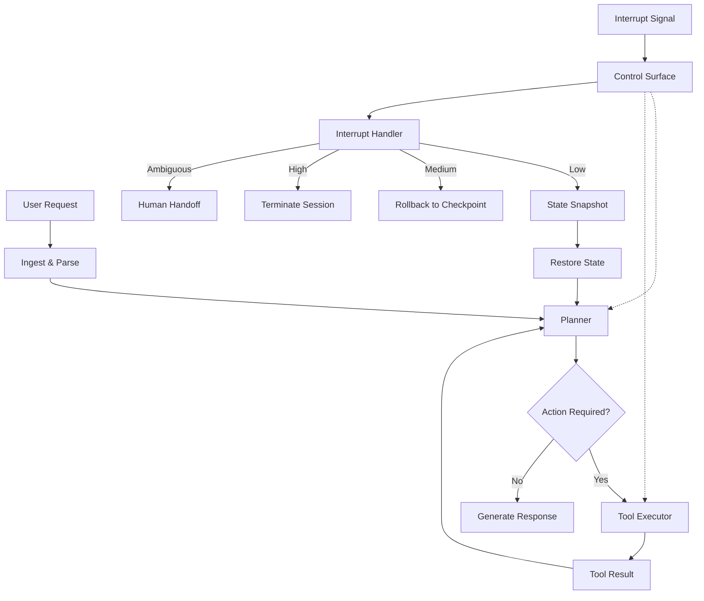

# The off-switch was never a button

## Introduction

We've all been there. You deploy an agent system, it's running fine in staging, and then in production someone yells "kill it." The instinct is to reach for `kill -9`, a REST endpoint that flips a boolean, or a keyboard shortcut in some admin dashboard. But here's the uncomfortable truth: **the off-switch was never a button.**

Agents aren't processes. They have context windows that accumulated over twelve turns of tool calls. They have side effects sitting in databases, emails sent, files written. A hard kill doesn't undo any of that — it just orphans the state and leaves your observability dashboard screaming.

In this article, I'm going to walk through how we architected a control surface for our agent orchestration layer that treats "stopping" as a first-class system concern, not an afterthought. This is what we shipped, what broke in production, and what we'd do differently.

## Why This Matters

The industry has spent enormous energy on making agents more capable — better planning, more tools, longer context windows. But the control plane got an afterthought. Most agent frameworks give you a `stop()` method that sets a flag. That's fine for a toy demo. It falls apart the moment you have:

- **In-flight tool calls** with external side effects (charging a credit card, sending an email)
- **Multi-step workflows** where stopping mid-flight leaves partial state
- **Concurrent agents** sharing resources that need coordinated shutdown
- **Compliance requirements** demanding audit trails of who stopped what and why

We learned this the hard way during a production incident where an agent had already initiated a database migration when someone hit "stop." The process died. The migration was half-applied. Recovery took four hours.

The off-switch isn't a button. It's a control surface with multiple modes, priorities, and recovery paths.

## How It Works

The core idea is simple: separate signal generation from signal handling. The control surface listens for interrupt events — user requests, anomaly detection, deadline exceeded — and routes them to the appropriate handler based on priority and context.

Here's the flow:

1. **The agent runs its planning loop**, checking the control surface at each iteration boundary.
2. **An interrupt fires** — it could be a user clicking "stop,"
