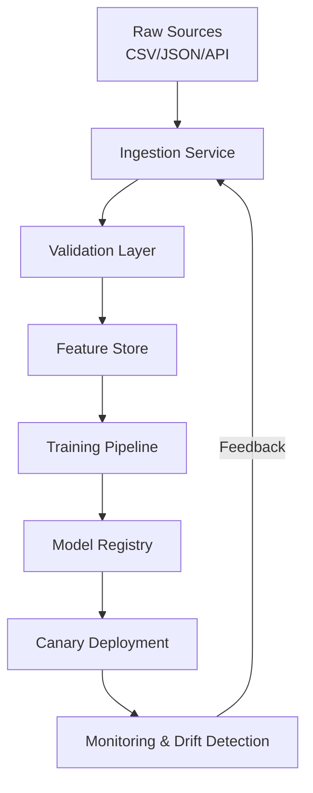

# A Letter from a Machine Learning Engineer

## Introduction

We keep models in production for 18 months now. The first six were painful. The next six were manageable. The last six taught us that ML engineering isn't about algorithms—it's about data contracts, failure modes, and the humility to assume every input will be wrong.

This letter is for the engineer staring at a Jupyter notebook that works on their laptop but falls apart at 3 AM when the upstream vendor changes a date format. We'll walk through a production ML pipeline end-to-end: ingestion, validation, training, deployment, and monitoring. No toy datasets. No accuracy theater. Just the plumbing that keeps models alive.

## Why This Matters

Three forces collided this year. First, open-source transformers made fine-tuning accessible to teams without a single PhD, but the bottleneck shifted from model architecture to data quality. Second, GDPR, CCPA, and the EU AI Act force us to track lineage and justify predictions. Third, MLOps matured past "just add Kubernetes"—we now need automated testing, canary deployments, and observability that rivals our best web services.

If you're shipping models, you're building data infrastructure with extra steps. The failure modes are different, but the stakes are the same: bad data in, silent failures out.

## How It Works

The pipeline follows a strict unidirectional flow with feedback loops for drift correction. Raw data enters through adapters, gets validated against schemas, lands in a feature store, trains a model, and deploys with shadow traffic before full rollout.



The ingestion service normalizes heterogeneous sources into Parquet. Validation rejects schema violations before they poison the feature store. Training runs on versioned datasets so we can reproduce any model artifact. Deployment uses shadow mode to compare new model predictions against the champion without affecting users. Monitoring tracks prediction drift and data quality metrics, triggering retraining when thresholds breach.

## Core Concepts

**Data contracts.** Every source signs a schema contract. When the vendor adds a nullable field, the pipeline rejects it until we update the contract—not silently imputes zeros.

**Feature versioning.** Features live in a store with immutable versions. Training job `v47` uses feature definitions frozen at commit `a3f21b`. No more "it worked last week" mysteries.

**Model lineage.** We track which data slice, hyperparameters, and code version produced each model artifact. When a model degrades, we trace back to the exact training run and dataset hash.

**Drift detection.** We compare incoming feature distributions against training baselines using PSI (Population Stability Index) and KS tests. Drift triggers alerts, not automatic rollback—human judgment still owns the kill switch.

## Examples & Code Walkthrough

Here's the ingestion service we run in production. It handles CSV, JSON, and REST APIs, validates schemas, and writes to Parquet with structlog for observability.

```python
# src/ingest.py
"""
Unified ingestion service for heterogeneous sources.
Validates schemas, handles encoding errors, and writes partitioned Parquet.
"""
import structlog
import pandas as pd
import requests
import pyarrow as pa
import pyarrow.parquet as pq
from pathlib import Path
from typing import Union, Optional
from datetime import datetime

log = structlog.get_logger()

class IngestionError(Exception):
    """Raised when source data violates schema or connectivity fails."""
    pass

def load_csv(path: Path, required_columns: list[str]) -> pd.DataFrame:
    """Load CSV with strict column validation."""
    log.info("loading_csv", path=str(path))
    try:
        df = pd.read_csv(path, parse_dates=["timestamp"], encoding="utf-8")
    except UnicodeDecodeError as e:
        raise IngestionError(f"Encoding error in {path}: {e}") from e
    
    missing = set(required_columns) - set(df.columns)
    if missing:
        raise IngestionError(f"Missing columns {missing} in {path}")
    return df

def load_json(path: Path, required_columns: list[str]) -> pd.DataFrame:
    """Load JSON with orientation detection."""
    log.info("loading_json", path=str(path))
    try:
        df = pd.read_json(path, orient="records")
    except ValueError as e:
        raise IngestionError(f"Invalid JSON in {path}: {e}") from e
    
    missing = set(required_columns) - set(df.columns)
    if missing:
        raise IngestionError(f"Missing columns {missing} in {path}")
    return df

def load_api(endpoint: str, api_key: str, required_columns: list[str]) -> pd.DataFrame:
    """Fetch from REST API with timeout and schema validation."""
    log.info("loading_api", endpoint=endpoint)
    headers = {"Authorization": f"Bearer {api_key}"}
    try:
        resp = requests.get(endpoint, headers=headers, timeout=30)
        resp.raise_for_status()
    except requests.RequestException as e:
        raise IngestionError(f"API request failed: {e}") from e
    
    data = resp.json()
    if not isinstance(data, list):
        raise IngestionError("API response is not a JSON array")
    
    df = pd.DataFrame(data)
    missing = set(required_columns) - set(df.columns)
    if missing:
        raise IngestionError(f"API missing columns {missing}")
    return df

def write_parquet(df: pd.DataFrame, output_path: Path, partition_col: Optional[str] = None):
    """Write DataFrame to partitioned Parquet with schema enforcement."""
    log.info("writing_parquet", path=str(output_path), rows=len(df))
    
    # Enforce nullable types to avoid Arrow conversion errors
    for col in df.select_dtypes(include=["object"]).columns:
        df[col] = df[col].astype("string")
    
    table = pa.Table.from_pandas(df)
    
    if partition_col and partition_col in df.columns:
        pq.write_to_dataset(
            table,
            root_path=str(output_path),
            partition_cols=[partition_col],
            existing_data_behavior="delete_matching"
        )
    else:
        pq.write_table(table, str(output_path))

def ingest(source_path: Union[str, Path], source_type: str, output_path: Path):
    """Main entry point: route to loader and persist."""
    source = Path(source_path)
    required = ["timestamp", "user_id", "feature_a", "feature_b", "label"]
    
    if source_type == "csv":
        df = load_csv(source, required)
    elif source_type == "json":
        df = load_json(source, required)
    elif source_type == "api":
        api_key = os.environ["ML_API_KEY"]
        df = load_api(str(source), api_key, required)
    else:
        raise IngestionError(f"Unknown source type: {source_type}")
    
    # Drop duplicates by primary key to prevent training skew
    df = df.drop_duplicates(subset=["user_id", "timestamp"])
    
    write_parquet(df, output_path, partition_col="date")
    log.info("ingestion_complete", rows=len(df), output=str(output_path))

if __name__ == "__main__":
    import argparse
    parser = argparse.ArgumentParser()
    parser.add_argument("--source", required=True)
    parser.add_argument("--type", choices=["csv", "json", "api"], required=True)
    parser.add_argument("--output", required=True)
    args = parser.parse_args()
    
    ingest(args.source, args.type, Path(args.output))
```

The training script follows a similar defensive pattern. We validate input distributions, catch label leakage, and log metrics to MLflow before registering the model.

```python
# src/train.py
"""
Training pipeline with data validation and model registry.
"""
import mlflow
import pandas as pd
import numpy as np
from sklearn.ensemble import GradientBoostingClassifier
from sklearn.model_selection import train_test_split
from sklearn.metrics import roc_auc_score, classification_report
from scipy.stats import ks_2samp
import pyarrow.parquet as pq

def validate_drift(train_df: pd.DataFrame, val_df: pd.DataFrame, feature_cols: list[str]):
    """Check KS test for each feature; fail if p-value < 0.01."""
    for col in feature_cols:
        stat, pval = ks_2samp(train_df[col], val_df[col])
        if pval < 0.01:
            raise ValueError(f"Drift detected in {col}: p={pval:.4f}")

def train_and_register(data_path: str, experiment_name: str):
    mlflow.set_experiment(experiment_name)
    
    # Read partitioned parquet
    df = pd.read_parquet(data_path)
    features = ["feature_a", "feature_b", "feature_c"]
    
    X = df[features]
    y = df["label"]
    
    X_train, X_val, y_train, y_val = train_test_split(
        X, y, test_size=0.2, stratify=y, random_state=42
    )
    
    validate_drift(X_train, X_val, features)
    
    with mlflow.start_run():
        model = GradientBoostingClassifier(
            n_estimators=500,
            learning_rate=0.05,
            max_depth=6,
            subsample=0.8,
            random_state=42
        )
        model.fit(X_train, y_train)
        
        preds = model.predict_proba(X_val)[:, 1]
        auc = roc_auc_score(y_val, preds)
        
        mlflow.log_metric("auc", auc)
        mlflow.log_params(model.get_params())
        
        # Only register if AUC improves over baseline
        if auc > 0.82:
            mlflow.sklearn.log_model(model, "model")
            mlflow.register_model(
                f"runs:/{mlflow.active_run().info.run_id}/model",
                "churn-predictor"
            )
            print(f"Model registered with AUC={auc:.4f}")
        else:
            print(f"AUC {auc:.4f} below threshold, skipping registration")

if __name__ == "__main__":
    train_and_register("s3://ml-data/features/", "churn-experiment")
```

## Best Practices

**Schema enforcement at the boundary.** Never trust upstream data. Validate the moment it hits your cluster, not after it's already in the feature store.

**Immutable feature versions.** Once a feature definition ships, it's frozen. Changes require a new version and a migration plan.

**Shadow deployments.** Run the new model parallel to production for 48 hours. Compare predictions, not just metrics—check for edge cases the validation set missed.

**Automated rollback.** If prediction latency spikes or drift exceeds threshold, auto-revert to the previous champion. Human approval required for re-deployment.

**Data retention policies.** Raw data expires after 90 days; features after 1 year. Models without lineage get quarantined.

## Common Mistakes & Anti-Patterns

**Mistake 1: Training on future data.** Leakage from time-based features that include post-event information. Fix: always split by time, never randomly, and validate that no feature derives from the label.

**Mistake 2: Ignoring schema evolution.** When the API adds a new field, your pipeline crashes silently or imputes garbage. Fix: strict schema validation with explicit rejection, not implicit filling.

**Mistake 3: No canary stage.** Deploying directly to 100% traffic. Fix: 5% shadow traffic for 24 hours, then 5% live traffic with automatic rollback on error rate > 1%.

**Mistake 4: Hardcoding paths.** `"/data/features/"` breaks on staging. Fix: use environment variables or a config service with fallbacks.

## Performance Considerations

**Memory.** Parquet columnar format reduces memory footprint by 60-80% versus CSV. Use PyArrow directly instead of pandas for reads when dataset exceeds RAM.

**CPU.** Gradient boosting trains fast, but inference latency matters at scale. Batch predictions in chunks of 1024 to amortize overhead.

**Network.** Feature store lookups add 5-15ms per request. Cache hot features in Redis with 5-minute TTL.

**Big-O.** Training is O(n * trees * depth). For 10M rows, consider histogram-based splitting (LightGBM) over exact greedy. Inference is O(trees * depth) per sample—profile with `cProfile` before optimizing prematurely.

## Real-World Usage

Netflix uses
