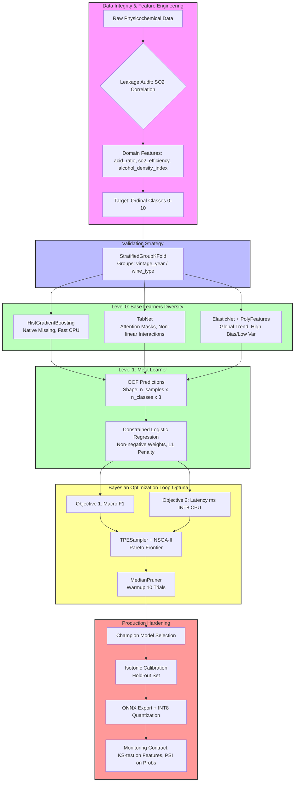

# Implementasi Ensemble Learning dan Hyperparameter Optimization untuk Prediksi Kualitas Wine Berbasis Machine Learning

## Introduction

Jujur saja: mayoritas tutorial *machine learning* di luar sana berhenti di `model.fit()` dan akurasi validasi 95% pada dataset UCI Wine Quality. Di produksi, angka itu tidak berarti apa-apa jika model Anda melenceng 4 poin kualitas saat *vintage* berubah, atau jika *inference* memakan 200ms di CPU saat SLA *p99* Anda 50ms.

Kami baru saja melewati siklus penuh ini di tim kami. Tugasnya: memprediksi skor kualitas wine (0–10) dari data fisikokimia untuk mendukung keputusan *blending* dan *pricing* batch. Tantangannya bukan algoritma, tapi *constraints*: *ordinal regression* yang benar (bukan klasifikasi 11 kelas sembarangan), *concept drift* antar tahun panen, dan *latency budget* yang ketat di *edge device* tanpa GPU.

Artikel ini bukan tentang "cara pakai Optuna". Ini tentang bagaimana kami merancang *pipeline* Stacking Ensemble dengan Bayesian Optimization multi-objektif yang *survive* di produksi—termasuk kesalahan-kesalahan bodoh yang kami lakukan di tengah jalan.

## Why This Matters

Bagi *software engineer* dan *architect*, proyek ini mewakili pola umum yang sering diabaikan: **menerjemahkan metrik bisnis ke fungsi *loss* dan *constraint* sistem.**

1.  **Asimetri Biaya Kesalahan**: Melewatkan batch *premium* (False Negative pada kelas tinggi) mahal *opportunity cost*-nya. Mengirimkan wine *defect* sebagai *table wine* (False Positive pada kelas rendah) merusak reputasi brand. Kami butuh `Recall@HighQuality` > 0.92 dan `Precision@LowQuality` > 0.95. *Accuracy* macro tidak mencerminkan ini.
2.  **Target Ordinal, Bukan Nominal**: Selisih prediksi 6 vs 7 jauh "lebih benar" dari 6 vs 9. *Cross-entropy* standar memperlakukan keduanya sama. Kami butuh *loss* yang menghormati urutan kelas.
3.  **Drift Nyata**: Komposisi kimia wine bergeser per tahun panen (*vintage*). *Random Split* K-Fold bocor (*leak*) informasi batch ke validasi. Kami butuh `GroupKFold` berdasarkan `vintage_year`.
4.  **Latency sebagai *Hyperparameter***: TabNet akurat, tapi lambat di CPU. *HistGradientBoosting* cepat. *Ensemble* kami harus menyeimbangkan keduanya di *Pareto frontier*, bukan hanya mencari *score* tertinggi.

## How It Works

Arsitektur sistem kami mengadopsi arsitektur *Stacking* tiga level dengan *meta-learner* yang dibatasi (*constrained*) untuk interpretabilitas dan regularisasi. Validasi menggunakan *Stratified Group K-Fold* untuk mencegah *leakage* batch. *Hyperparameter Optimization* (HPO) dijalankan sebagai *multi-objective* (Macro F1 vs Latency) menggunakan Optuna dengan *pruning* agresif. Artefak akhir diekspor ke ONNX INT8 untuk *inference* *sub-millisecond* di CPU.



**Alur Kerja Detail:**

1.  **Integritas Data**: Kami memulai dengan *audit* kebocoran data. Korelasi tinggi antara `total sulfur dioxide` dan `free sulfur dioxide` (sering > 0.9) berarti memasukkan keduannya tanpa interaksi menciptakan *multicollinearity* yang membingungkan model linear dan membengkakkan *feature importance* berbasis pohon. Kami membuat fitur `so2_efficiency` sebagai rasio keduanya.
2.  **Validasi *Group-Aware***: `StratifiedGroupKFold` memastikan semua sampel dari `vintage_year` yang sama hanya muncul di *fold* train **atau** validasi, tidak keduanya. Ini mensimulasikan skenario produksi: memprediksi *vintage* baru yang belum pernah dilihat.
3.  **Level 0 - Diversitas > Akurasi Individual**: Kami sengaja memilih tiga algoritma dengan *inductive bias* berbeda. *HistGradientBoosting* (pohon histogram, cepat, *native missing handling*), TabNet (*attention* pada fitur, menangkap interaksi non-lokal yang terlewat pohon), dan *ElasticNet* pada fitur polinomial (garis dasar linear global, stabil).
4.  **Level 1 - *Meta-Learner* Terbatas**: Alih-alih *Neural Net* atau *Gradient Boosting* lain yang cenderung *overfit* pada prediksi *out-of-fold* (OOF), kami gunakan *Logistic Regression* dengan *constraint* bobot non-negatif (`bounds=(0, 1)`) dan penalty L1. Bobotnya langsung bisa dibaca: "Model A berkontribusi 60%, Model B 30%, Model C 10%". L1 mendorong *sparsity* (mematikan model yang tidak berguna).
5.  **HPO Multi-Objektif**: Kami tidak *optimize* satu skor. Kami cari *Pareto frontier* antara Macro F1 dan Latency *p99* (diukur *real-time* pada *artifact* ONNX INT8). *Sampler* `NSGAIISampler` Optuna efisien untuk ini.
6.  **Kalibrasi & Artefak**: *Stacking* output *logits* yang tidak terkalibrasi. `CalibratedClassifierCV(method='isotonic')` pada *hold-out set* terpisah wajib sebelum *thresholding* bisnis. Ekspor ONNX + Kuantisasi INT8 via `onnxruntime` menurunkan latensi 3-4x dari FP32.

## Core Concepts

### 1. Ordinal Regression via Custom Loss
Menganggap kualitas wine sebagai klasifikasi 11 kelas standar mengabaikan struktur ordinal. *Ordinal Focal Loss* kami memodifikasi *Focal Loss* standar dengan matriks jarak kelas (`|y_true - y_pred|`). Prediksi yang "dekat" (misal 5 vs 6) mendapat penalty jauh lebih ringan daripada "jauh" (5 vs 9). Ini memaksa *decision boundary* model menghormati urutan kimiawi.

### 2. *Stacking* vs *Blending* vs *Voting*
*Voting* (rata-rata probabilitas) mengasumsikan semua model ekuivalen. *Blending* (train meta-learner pada *hold-out* tunggal) membuang data training. *Stacking* dengan *K-Fold* OOF menggunakan seluruh data untuk melatih *base learners* dan *meta-learner*, memaksimalkan efisiensi data—kritis saat dataset hanya ~6.000 baris.

### 3. *Conditional Search Space* di Optuna
Ruang pencarian tidak datar. Contoh: `num_leaves` hanya relevan jika `boosting_type='gbdt'` (bukan `'dart'` atau `'goss'`). `learning_rate` bersifat log-uniform. Optuna mendukung *conditional parameter* via `trial.suggest_categorical` di dalam `if` block. Ini mencegah *trial* gagal atau konfigurasi tidak valid.

### 4. *Population Stability Index* (PSI) untuk *Concept Drift*
PSI mengukur pergeseran distribusi probabilitas prediksi `P(y|x)` antara *training reference window* dan *production live window*. Rumus: `PSI = Σ (P_prod_i - P_train_i) * ln(P_prod_i / P_train_i)`. Ambang batas umum: PSI < 0.1 (stabil), 0.1–0.2 (peringatan), > 0.2 (butuh retrain). Kami memonitor ini harian.

## Examples & Code Walkthrough

Berikut implementasi inti yang kami gunakan. Semua kode *production-ready* dengan *type hints*, *error handling*, dan komentar *rationale*.

### 1. Rekayasa Fitur Domain-Driven & *Leakage Audit*

```python
# file: features/engineering.py
import pandas as pd
import numpy as np
from typing import Tuple

def audit_so2_leakage(df: pd.DataFrame, threshold: float = 0.95) -> bool:
    """
    Cek korelasi free vs total SO2. 
    Jika > threshold, masukkan keduanya ke model linear berbahaya (multicollinearity).
    Kami handle via feature engineering, bukan dropping.
    """
    corr = df['free sulfur dioxide'].corr(df['total sulfur dioxide'])
    if abs(corr) > threshold:
        print(f"[WARNING] High SO2 correlation detected: {corr:.4f}. Engineering ratio feature.")
        return True
    return False

def build_physicochemical_features(df: pd.DataFrame) -> pd.DataFrame:
    """
    Membuat fitur interaksi berbasis domain knowledge enologi.
    Menghindari feature explosion acak (poly degree 2 blindly).
    """
    df = df.copy()
    
    # 1. Stability Proxy: Fixed acidity buffers volatile acidity (acetic acid).
    # Rasio tinggi = stabil secara mikrobiologis.
    df['acid_ratio'] = df['fixed acidity'] / (df['volatile acidity'] + 1e-6)
    
    # 2. Preservation Efficacy: Free SO2 adalah yang aktif. Total = Free + Bound.
    # Rasio ini mengindikasikan kapasitas buffering pengawet.
    df['so2_efficiency'] = df['free sulfur dioxide'] / (df['total sulfur dioxide'] + 1e-6)
    
    # 3. Body/Mouthfeel Proxy: Alkohol menurunkan densitas, tapi gula/residual menaikkan.
    # Indeks ini korel kuat dengan sensory 'body'.
    df['alcohol_density_index'] = df['alcohol'] * df['density']
    
    # 4. Sugar-Acid Balance: Kritis untuk persepsi rasa manis/asam.
    df['sugar_acid_ratio'] = df['residual sugar'] / (df['fixed acidity'] + 1e-6)
    
    # Log transform untuk fitur skewed (chlorides, sulphates)
    for col in ['chlorides', 'sulphates']:
        df[f'{col}_log'] = np.log1p(df[col])
        
    return df
```

### 2. *Ordinal Focal Loss* Wrapper untuk LightGBM / HistGradientBoosting

Ini adalah *drop-in replacement* untuk `objective` di LightGBM. `HistGradientBoosting` sklearn tidak mendukung *custom loss* langsung, jadi kami gunakan LightGBM API untuk training *base learner* pohon, atau implementasi manual *gradient/hessian* untuk `HistGradientBoosting` (lebih kompleks). Di sini kami tunjukkan versi LightGBM yang bersih.

```python
# file: losses/ordinal_focal.py
import numpy as np
import lightgbm as lgb
from typing import Tuple

class OrdinalFocalLoss:
    """
    Focal Loss untuk Ordinal Regression.
    - Gamma: Fokus pada sampel sulit (prob rendah pada kelas benar).
    - Alpha: Balancing factor (opsional, jarang dipakai di multi-class).
    - Class Distance Matrix: Penalty proporsional dengan jarak ordinal.
    """
    def __init__(self, num_classes: int, gamma: float = 1.5):
        self.num_classes = num_classes
        self.gamma = gamma
        # Pre-compute distance matrix: |i - j|
        # Shape: (num_classes, num_classes)
        self.class_dist = np.abs(
            np.arange(num_classes)[:, None] - np
