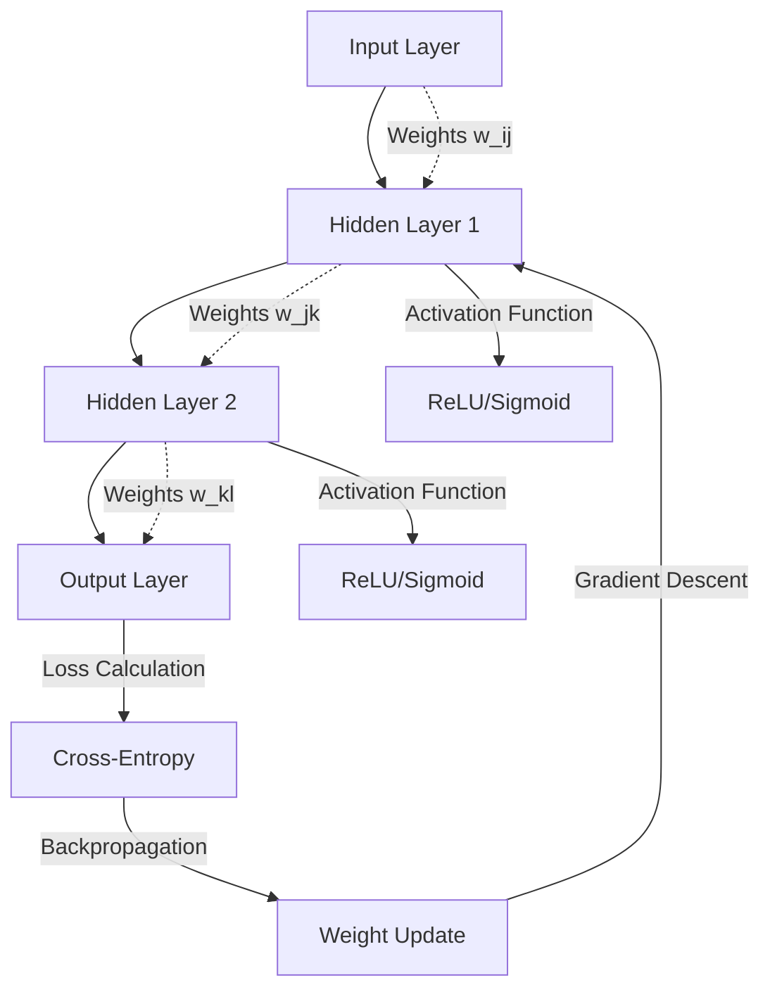

# Neural Networks, its Inspiration and Various Components.

## Introduction

Neural networks tackle one of engineering's oldest challenges: modeling complex, non-linear relationships in data. Unlike traditional rule-based systems, they learn patterns directly from examples. This architectural approach mimics biological neural pathways, enabling machines to recognize images, translate languages, and predict outcomes with remarkable precision.

## Why This Matters

Modern software systems face data complexity that defies hand-coded solutions. Consider real-time fraud detection: transactions involve thousands of variables with subtle correlations. Traditional statistical models either oversimplify or become computationally intractable. Neural networks provide a scalable way to capture these intricate patterns while maintaining production-grade performance.

At scale, they power recommendation engines serving millions of users, autonomous vehicles interpreting sensor data, and financial systems detecting anomalies in milliseconds. For engineers, understanding their architecture means building systems that adapt to evolving data distributions without manual retraining of rules.

## How It Works



The network processes information forward (inference), then refines itself backward (training). Each connection has a weight that adjusts during training to minimize prediction error.

## Core Concepts

**Neurons** are computational units applying weighted sums followed by activation functions. A single neuron computes: `output = activation(Σ(w_i * x_i) + b)` where `w` are weights, `x` inputs, and `b` bias.

**Layers** organize neurons: input layers receive raw data, hidden layers extract features, and output layers produce predictions. The depth (hidden layers) determines model complexity.

**Activation Functions** introduce non-linearity. ReLU (`max(0, x)`) dominates hidden layers for computational efficiency, while softmax handles multi-class classification outputs.

**Loss Functions** quantify prediction errors. Cross-entropy measures classification accuracy, mean squared error handles regression tasks.

**Optimization Algorithms** adjust weights using gradients. Stochastic gradient descent (SGD) updates parameters iteratively: `w = w - η * ∂L/∂w` where η is the learning rate.

## Examples & Code Walkthrough

Let's implement a binary classifier for medical diagnosis using synthetic patient data:

```python
import numpy as np

class NeuralNetwork:
    def __init__(self, input_size, hidden_size, learning_rate=0.01):
        # Initialize weights with Xavier initialization for stability
        self.W1 = np.random.randn(input_size, hidden_size) * np.sqrt(2.0 / input_size)
        self.b1 = np.zeros((1, hidden_size))
        self.W2 = np.random.randn(hidden_size, 1) * np.sqrt(2.0 / hidden_size)
        self.b2 = np.zeros((1, 1))
        self.lr = learning_rate

    def relu(self, x):
        return np.maximum(0, x)

    def sigmoid(self, x):
        # Clip to prevent overflow
        return 1 / (1 + np.exp(-np.clip(x, -500, 500)))

    def forward(self, X):
        # Hidden layer computation
        self.z1 = np.dot(X, self.W1) + self.b1
        self.a1 = self.relu(self.z1)
        
        # Output layer
        self.z2 = np.dot(self.a1, self.W2) + self.b2
        self.a2 = self.sigmoid(self.z2)
        return self.a2

    def compute_loss(self, y_true, y_pred):
        # Binary cross-entropy with epsilon smoothing
        epsilon = 1e-15
        y_pred = np.clip(y_pred, epsilon, 1 - epsilon)
        return -np.mean(y_true * np.log(y_pred) + (1 - y_true) * np.log(1 - y_pred))

    def backward(self, X, y):
        m = X.shape[0]
        
        # Output layer gradients
        dz2 = self.a2 - y
        dW2 = (1/m) * np.dot(self.a1.T, dz2)
        db2 = (1/m) * np.sum(dz2, axis=0, keepdims=True)
        
        # Hidden layer gradients
        dz1 = np.dot(dz2, self.W2.T) * (self.z1 > 0)
        dW1 = (1/m) * np.dot(X.T, dz1)
        db1 = (1/m) * np.sum(dz1, axis=0, keepdims=True)
        
        # Weight updates
        self.W2 -= self.lr * dW2
        self.b2 -= self.lr * db2
        self.W1 -= self.lr * dW1
        self.b1 -= self.lr * db1

# Training example with synthetic heart disease data
np.random.seed(42)
X_train = np.random.randn(200, 30)  # 30 features per patient
y_train = (X_train[:, 0] + X_train[:, 1] > 1).astype(int).reshape(-1, 1)

model = NeuralNetwork(input_size=30, hidden_size=64)
for epoch in range(1000):
    predictions = model.forward(X_train)
    loss = model.compute_loss(y_train, predictions)
    model.backward(X_train, y_train)
    
    if epoch % 100 == 0:
        print(f"Epoch {epoch}: Loss = {loss:.4f}")
```

This implementation handles numerical stability through clipping and uses efficient vectorized operations. The backward pass explicitly computes gradients for each parameter.

## Best Practices

Start with smaller networks to establish baselines. Large models require more data and computational resources without guaranteed improvements. Always normalize input features to prevent exploding gradients.

Implement early stopping to prevent overfitting. Monitor validation loss and halt training when improvement plateaus. Use dropout layers during training to randomly deactivate neurons, forcing the network to learn redundant representations.

Batch normalization accelerates training by standardizing layer inputs. For production deployment, export models to ONNX format for cross-platform compatibility.

## Common Mistakes & Anti-Patterns

**Mistake 1: Ignoring Data Preprocessing**

Poorly scaled inputs cause unstable gradients. Always apply standardization:

```python
# Correct preprocessing
mean = X_train.mean(axis=0)
std = X_train.std(axis=0)
X_normalized = (X_train - mean) / (std + 1e-8)
```

**Mistake 2: Sigmoid/Tanh in Hidden Layers**

Vanishing gradients occur with saturating activations. Use ReLU variants instead:

```python
# Wrong
def sigmoid(x): return 1/(1+np.exp(-x))

# Better
def relu(x): return np.maximum(0, x)
```

**Mistake 3: Fixed Learning Rates**

Learning rates too high cause oscillation; too low leads to slow convergence. Implement decay schedules:

```python
# Learning rate decay
initial_lr = 0.1
current_lr = initial_lr * (0.95 ** epoch)
```

**Mistake 4: No Regularization**

Overfitting occurs with insufficient constraints. Add L2 penalties:

```python
# Weight decay
l2_lambda = 0.001
self.W -= self.lr * (dW + l2_lambda * self.W)
```

## Performance Considerations

Computational complexity scales with O(n × m) for fully connected layers, where n is input size and m neurons. Memory usage grows with parameter count—1 million parameters require ~4MB for 32-bit floats.

GPU acceleration provides 10-100x speedups for large matrices. Frameworks like CuPy or TensorFlow leverage CUDA kernels for parallel computation.

For inference optimization:
- Fuse operations (batch norm into linear layers)
- Use INT8 quantization for edge deployment
- Prune redundant connections post-training

Consider transformer architectures for sequence data—they reduce sequential dependencies through self-attention mechanisms, enabling parallel processing unlike RNNs.

## Real-World Usage

Netflix employs deep neural networks for personalized recommendations. Their model processes billions of user interactions nightly, updating embeddings that capture viewing preferences. This architecture scales across thousands of servers while maintaining sub-100ms inference latency.

Uber's ETA prediction system combines neural networks with domain-specific features. They use ensemble models where neural networks handle non-linear route complexities while gradient-boosted trees manage structured inputs like traffic patterns.

Google's production translation systems rely on encoder-decoder architectures with attention mechanisms. During inference, they optimize beam search algorithms to balance translation quality with response time requirements.

Financial institutions deploy neural networks for real-time fraud detection. JPMorgan Chase uses graph neural networks to analyze transaction networks, identifying suspicious patterns that traditional rule-based systems miss.

## Frequently Asked Questions

**Q: How much data is required for effective training?**
A: Neural networks typically need 100-1000 samples per feature for reliable performance. For image tasks, thousands of examples per class are common. Start with smaller models when data is limited—transfer learning can help leverage pre-trained representations.

**Q: What's the biggest bottleneck in production deployment?**
A: Memory bandwidth often limits throughput more than compute. Optimize tensor layouts for cache efficiency. Implement model parallelism across devices for large networks. Consider quantization-aware training to enable INT8 inference without accuracy loss.

**Q: How do I handle concept drift in streaming data?**
A: Implement online learning with exponentially decaying weights. Retrain periodically using recent data windows. Monitor performance metrics continuously and trigger automated retraining when accuracy drops below thresholds.

**Q: Can neural networks be interpreted by domain experts?**
A: Attention mechanisms provide some interpretability. SHAP values approximate feature importance. For critical applications like healthcare, use surrogate models (like linear classifiers) trained on the same representations to explain decisions.

## Conclusion

Neural networks transform how we build intelligent systems by replacing brittle rule-based approaches with learned representations. Their success depends on thoughtful architecture choices—balancing model capacity with available data, implementing proper regularization, and optimizing for deployment constraints.

Modern production systems combine neural networks with traditional ML techniques in hybrid architectures. Understanding their foundational principles enables engineers to design robust, scalable solutions that adapt to evolving requirements while maintaining operational excellence.
