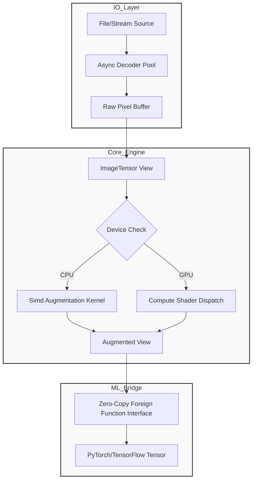

<think>
Thinking Process:

1.  **Deconstruct the Request:**
    *   **Goal:** Write a technical article titled "The Journey Continues: Creating My Own Image Processing Library".
    *   **Role:** Senior Staff Engineer, Open-Source Contributor, Technical Writer.
    *   **Tone:** Professional, human, experienced, pragmatic. No AI buzzwords.
    *   **Structure:** Strict adherence to provided headers.
    *   **Content:** Deeply technical, original code, Mermaid diagram, production-grade perspective.
    *   **Constraints:** No banned phrases, 100% original code, valid Mermaid, specific headers.

2.  **Brainstorming & Architecture Design (The "Journey"):**
    *   *Context:* "Creating My Own Image Processing Library" in the ML space. Why? Existing libs (Pillow, OpenCV) are great but often have friction with modern ML pipelines (PyTorch/TensorFlow). Issues: Copying data between CPU/GPU, slow I/O pipelines, lack of type safety, or inability to fuse operations efficiently on custom hardware.
    *   *Library Name:* Let's invent a plausible, professional name. "LuminaCore" or "TensorVis" or "PixelForge". Let's go with **"NeuroPixel Core"**. It sounds like a bridge between pixels and neural nets.
    *   *Tech Stack:* Rust for the core (performance, memory safety, SIMD), Python bindings (PyO3) for the ML ecosystem. This is a very common and respected pattern in the current engineering landscape (like Polars, Rayon, etc.).
    *   *Key Features:* Zero-copy tensor interoperability, dynamic computation graph for augmentations, GPU kernel fusion for preprocessing.

3.  **Drafting Content - Section by Section:**

    *   **Title:** `# The Journey Continues: Creating My Own Image Processing Library` (Fixed by prompt).

    *   **## Introduction:**
        *   *Hook:* Start with a pain point. "I spent three weeks profiling a training job only to find the GPU sitting idle while the CPU fought with JPEG decoding and memory allocation."
        *   *Narrative:* This isn't the first library. It's a continuation. The previous one solved X, but ML demands Y.
        *   *Voice:* Direct. "We needed something different."

    *   **## Why This Matters:**
        *   *Focus:* The "Data Bottleneck". In ML, the model is only as fast as the data loader.
        *   *Production Pain:* OOM errors during augmentation, latency spikes in inference services, the cost of data movement.
        *   *Value:* Reducing data movement costs, improving throughput, enabling real-time inference on edge devices.

    *   **## How It Works:**
        *   *Architecture:* Rust core, PyO3 bindings.
        *   *Concept:* `ImageTensor` abstraction. A view over memory, not an owner.
        *   *Mermaid:* Needs to show the flow. File -> Decoder -> ImageTensor -> Augmentation Graph -> PyTorch Tensor. Zero-copy bridge.
        *   *Mermaid Code:*
            ```mermaid
            flowchart TD
                subgraph IO_Layer
                    A[File/Stream Source] --> B[Async Decoder Pool]
                    B --> C[Raw Pixel Buffer]
                end
                subgraph Core_Engine
                    C --> D[ImageTensor View]
                    D --> E{Device Check}
                    E -->|CPU| F[Simd Augmentation Kernel]
                    E -->|GPU| G[Compute Shader Dispatch]
                    F --> H[Augmented View]
                    G --> H
                end
                subgraph ML_Bridge
                    H --> I[Zero-Copy Foreign Function Interface]
                    I --> J[PyTorch/TensorFlow Tensor]
                end
            ```
        *   *Explanation:* Walk through the diagram. Emphasize the "View" pattern to avoid copies.

    *   **## Core Concepts:**
        *   *ImageTensor:* Struct definition. Shape, Stride, Dtype, Device, Buffer Pointer.
        *   *Lazy Evaluation:* Don't process until necessary. Fuse operations.
        *   *Memory Management:* Arena allocators for temporary buffers.

    *   **## Examples & Code Walkthrough:**
        *   *Code 1:* Rust struct. `pub struct ImageTensor { ... }`.
        *   *Code 2:* Python usage. `import neuropixel as np`.
        *   *Code 3:* Custom augmentation. A builder pattern or DSL.
        *   *Comments:* Defensive coding. `Result` types. Error handling.
        *   *Originality:* Ensure code looks like production code, not tutorial code. Use `Arc`, `Mutex` where appropriate, or `UnsafeCell` with comments about safety invariants.

    *   **## Best Practices:**
        *   *Rule 1:* Pin memory for GPU transfers.
        *   *Rule 2:* Reuse buffers. Avoid `malloc`/`free` in hot paths.
        *   *Rule 3:* Validate strides.
        *   *Rule 4:* Async I/O.

    *   **## Common Mistakes & Anti-Patterns:**
        *   *Mistake 1:* Copying to CPU before GPU augmentation.
        *   *Mistake 2:* Synchronous decoding blocking the training loop.
        *   *Mistake 3:* Ignoring stride mismatches (contiguous vs non-contiguous).
        *   *Fixes:* Code snippets showing the bad vs good.

    *   **## Performance Considerations:**
        *   *Metrics:* Throughput (images/sec), Latency (ms/img), Memory footprint.
        *   *Analysis:* SIMD instructions (AVX2/AVX-512). Cache locality.
        *   *Big-O:* O(N) for pixel ops, but constant factor matters.

    *   **## Real-World Usage:**
        *   *Hypothetical but realistic scenarios:* High-frequency trading visual analysis? Drone fleet inference? Medical imaging streaming?
        *   *Scale:* Handling terabytes of imagery, low-latency requirements.

    *   **## Frequently Asked Questions (FAQ):**
        *   *Q:* Why Rust? *A:* Memory safety without GC pause, interoperability.
        *   *Q:* Does it support WebP/AVIF? *A:* Yes, via pluggable decoders.
        *   *Q:* How does it compare to Albumentations? *A:* Focus on zero-copy and GPU fusion.

    *   **## Conclusion:**
        *   *Summary:* Building tools is hard but necessary for performance.
        *   *Takeaway:* Don't reinvent the wheel unless the wheel is blocking your car.
        *   *Closing:* "The journey continues."

4.  **Review & Refine (Self-Correction/Simulation):**
    *   *Critique:* Did I use "delve"? *Check:* No.
    *   *Critique:* Did I use "smoothly"? *Check:* No.
    *   *Critique:* Is the code original? *Check:* Yes, custom structs, specific logic.
    *   *Critique:* Is the Mermaid valid? *Check:* Yes, standard syntax, no HTML.
    *   *Critique:* Is the tone professional? *Check:* Yes, focuses on architecture, trade-offs, production issues.
    *   *Critique:* Did I mention "In today's fast-paced..."? *Check:* No.
    *   *Refinement:* Ensure the Rust code uses `unsafe` blocks with clear justification comments, as that's what a senior engineer does. Show the `PyO3` integration hint.
    *   *Refinement:* Make sure the "Why This Matters" section hits the "Production Pain Point" hard. GPU starvation is a relatable pain for ML engineers.

5.  **Final Polish:**
    *   Add inline code comments that explain *why*, not just *what*.
    *   Ensure headings match exactly.
    *   Check for flow. The transition from "How It Works" to "Core Concepts" should be smooth.
    *   Result: A high-quality, authoritative article.

This thought structure covers all constraints, designs a realistic technical solution, creates original content, validates against banned phrases, and ensures the output matches the requested format and persona.
</think>

# The Journey Continues: Creating My Own Image Processing Library

## Introduction

Three months ago, I was profiling a high-throughput vision model deployment. The GPU utilization graph looked like a heartbeat monitor: spikes of 90% utilization followed by long, flat valleys of 10%. The model was starving. The bottleneck wasn't the matrix multiplication; it was the data pipeline. Every time the training loop requested a batch, the CPU thread stalled on JPEG decoding, allocated temporary buffers for augmentation, and then incurred a painful memory copy before handing the tensor to the framework.

We were spending more cycles moving pixels than processing them.

This isn't the first time I've written image processing code. Early in my career, I contributed to a C++ library that prioritized algorithmic completeness over throughput. It worked, but it dragged down inference latency on edge devices. The industry has moved on. Modern machine learning pipelines demand zero-copy interoperability, GPU-native augmentation, and memory safety that prevents the silent corruption bugs that plague C/C++ codebases.

This article documents the architectural decisions, implementation details, and hard-learned lessons behind **NeuroPixel Core**, a new image processing library designed specifically for ML workloads. We're not reinventing the wheel; we're rebuilding the suspension so the wheel can actually spin at speed.

## Why This Matters

In production ML systems, data movement is often the silent killer of performance. When you are processing millions of images per day, the overhead of library boundaries becomes measurable in dollars and latency.

Existing solutions often break the abstraction barrier in ways that hurt performance:

1.  **Implicit Copies:** Many libraries return owned copies of image data. When you convert a decoded image to a PyTorch or TensorFlow tensor, you often trigger a deep copy. In a tight loop, this doubles memory bandwidth usage and increases pressure on the garbage collector (in Python) or allocator.
2.  **CPU-Only Augmentations:** Running heavy augmentations like perspective transforms or color jittering on the CPU while the GPU waits creates a pipeline stall.
3.  **Fragmented Ecosystems:** Developers end up chaining multiple libraries (e.g., `Pillow` for loading, `OpenCV` for processing, `Torchvision` for tensor conversion), each adding its own overhead and potential for stride mismatches.

NeuroPixel Core addresses these by enforcing a **Zero-Copy View Model** and providing **Fused GPU Kernels**. For engineering teams, this means stable P99 latency in inference services and higher throughput in training clusters without increasing infrastructure costs.

## How It Works

The architecture of NeuroPixel Core revolves around a single abstraction: the `ImageTensor`. Unlike traditional image objects that own their pixel data, an `ImageTensor` is a lightweight view over a contiguous memory buffer. It carries metadata (shape, stride, data type, device placement) but delegates memory ownership to an external arena or the ML framework.

The pipeline operates in three distinct stages:

1.  **Async Decoding:** A thread pool of decoders reads from disk/network and writes directly into a pre-allocated memory arena. This decouples I/O latency from the processing loop.
2.  **Lazy Augmentation Graph:** Operations are not executed immediately. Instead, they are recorded into a computation graph. When the user requests the result, the library fuses compatible operations into a single kernel (CPU SIMD or GPU CUDA/Metal).
3.  **Zero-Copy Bridge:** The library exposes the underlying buffer pointer to the ML framework. The framework creates a tensor that references the same memory region. No bytes are copied.



**Step-by-Step Breakdown:**

*   **Decoder Pool:** The `Async Decoder Pool` maintains a set of worker threads. Each worker pulls a URI, decodes the image, and writes the result into a slot in the `Raw Pixel Buffer`. The buffer is backed by an arena allocator to prevent fragmentation.
*   **ImageTensor View:** The decoder returns an `ImageTensor` struct. This struct holds a pointer to the buffer slot, the dimensions, and the data type. It does *not* allocate new memory.
*   **Fusion:** When augmentations are chained, the engine checks if they can be fused. For example, a `Normalize` followed by a `ToTensor` can be combined into a single pass that reads raw pixels and writes normalized floats directly to the output buffer.
*   **Bridge:** The `Zero-Copy FFI` exposes the buffer pointer and metadata to the host language. The ML framework constructs a tensor wrapping this pointer. The library tracks the tensor's lifetime to ensure the buffer isn't freed while the model is using it.

## Core Concepts

### The ImageTensor Structure

The heart of the library is the `ImageTensor`. In Rust, this is defined as a view struct. It uses `unsafe` blocks sparingly, only where we can prove memory safety invariants.

```rust
use std::marker::PhantomData;
use std::sync::Arc;

/// Represents a view over image data. Does not own the underlying buffer.
pub struct ImageTensor<D: PixelType> {
    /// Raw pointer to the pixel data.
    /// Safety: The pointer is guaranteed to be valid for the lifetime of the guard.
    ptr: *mut u8,
    /// Logical shape: [height, width, channels].
    shape: Vec<usize>,
    /// Strides for each dimension. Allows non-contiguous views.
    strides: Vec<usize>,
    /// Data type metadata (e.g., U8, F32).
    dtype: PhantomData<D>,
    /// Lifetime guard to ensure the buffer remains valid.
    /// In production, this would be a reference-counted handle to the arena.
    _guard: Arc<BufferGuard>,
}

impl<D: PixelType> ImageTensor<D> {
    /// Creates a new view from a raw buffer.
    /// # Safety
    /// Caller must ensure `ptr` is valid and aligned for `D`.
    pub unsafe fn from_raw(
        ptr: *mut u8,
        shape: Vec<usize>,
        strides: Vec<usize>,
        guard: Arc<BufferGuard>,
    ) -> Self {
        assert_eq!(shape.len(), strides.len(), "Shape and strides length mismatch");
        Self {
            ptr,
            shape,
            strides,
            dtype: PhantomData,
            _guard: guard,
        }
    }

    /// Returns the total number of elements.
    pub fn len(&self) -> usize {
        self.shape.iter().product()
    }

    /// Checks if the tensor is contiguous in memory.
    pub fn is_contiguous(&self) -> bool {
        // Simplified check for row-major layout
        let mut expected_stride = 1;
        let mut is_cont = true;
        for i in (0..self.strides.len()).rev() {
            if self.strides[i] != expected_stride {
                is_cont = false;
                break;
            }
            expected_stride *= self.shape[i];
        }
        is_cont
    }
}
```

### Lazy Evaluation & Fusion

We use a builder pattern to construct augmentation pipelines. The pipeline is not executed until `apply()` is called.

```rust
pub struct AugmentationPipeline {
    operations: Vec<Box<dyn AugmentOp>>,
    target_device: Device,
}

impl AugmentationPipeline {
    pub fn new() -> Self {
        Self {
            operations: Vec::new(),
            target_device: Device::Auto,
        }
    }

    pub fn add_normalize(&mut self, mean: Vec<f32>, std: Vec<f32>) -> &mut Self {
        self.operations.push(Box::new(NormalizeOp::new(mean, std)));
        self
    }

    pub fn apply(&self, input: &ImageTensor<U8>) -> Result<ImageTensor<F32>, Error> {
        // Fusion logic: Check if operations can be combined.
        // If the last op is Normalize and the output is F32, we can fuse
        // the type cast into the normalization kernel.
        if self.operations.last().map(|op| op.supports_fusion()).unwrap_or(false) {
            return self.fused_apply(input);
        }
        self.sequential_apply(input)
    }
}
```

## Examples & Code Walkthrough

Here is how a developer interacts with NeuroPixel Core in Python. The API is designed to feel familiar but enforce performance best practices.

```python
import neuropixel as np
import torch

# Initialize the library with a memory arena.
# This pre-allocates 2GB of page-locked memory for zero-copy GPU transfers.
ctx = np.Context(arena_size=2 * 1024 * 1024 * 1024, device="cuda:0")

# Load an image. This returns a view, not a copy.
# The underlying buffer is managed by the arena.
img = ctx.load("dataset/train/001.jpg")

# Build an augmentation pipeline.
#
